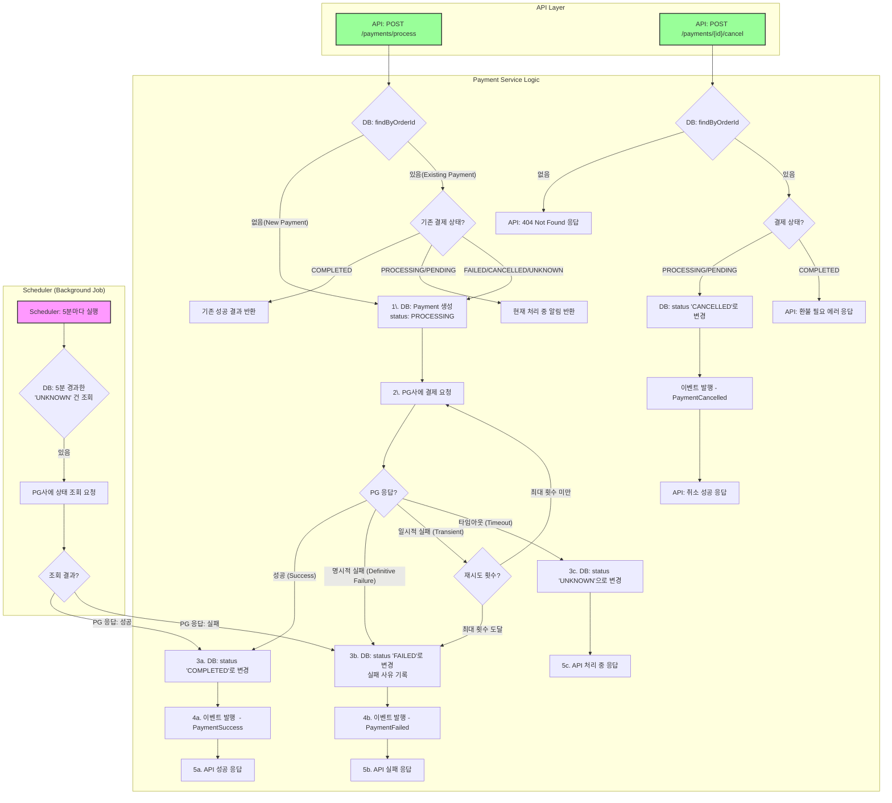
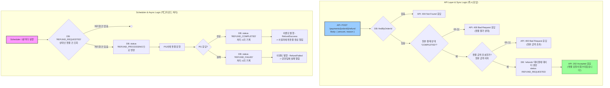

# 결제 모듈 처리 요구사항 및 대응 방안

본 문서는 결제 요청 시 발생할 수 있는 모든 시나리오를 정의하고, 각 상황에 대한 시스템의 대응 방안을 명시하여 결제 처리의 안정성과 일관성을 보장하는 것을 목적으로 한다.

1. success
    1. immediate success
2. failure 
   1. 명시적 실패 w/ 실패 메시지
   2. 일시적 실패 
   3. timeout 
   4. 중복 결제 요청 (Idempotency)
   5. 결제 중 취소 (User Cancellation)

# flowchart 
## a. 결제 flowchart 

## b. 환불 flowchart

## 1. 성공 케이스 (Happy Path)

### 1.1. 즉시 성공 (Immediate Success)

-   **상황**: PG사에 결제 요청을 보낸 후, 즉시 '성공' 응답을 받은 경우.
-   **요구사항**: 결제 상태를 '완료(COMPLETED)'로 즉시 변경하고, 사용자에게 결제가 완료되었음을 알려야 한다.
-   **대응 방안**:
    1.  `Payment` 테이블에서 해당 결제 건의 상태를 `COMPLETED`로 업데이트한다.
    2.  결제 완료 시각(`updatedAt`)을 기록한다.
    3.  주문 서비스(Order Service)에 결제 완료 이벤트를 발행(publish)하여 후속 처리(예: 배송 시작)를 위임한다.
    4.  사용자에게 결제 완료 알림(이메일, SMS 등)을 보낸다.

## 2. 실패 케이스 (Failure Cases)

### 2.1. 명시적 실패 (Definitive Failure)

-   **상황**: PG사로부터 '실패' 응답을 명확하게 받은 경우. (예: 한도 초과, 잔액 부족, 유효하지 않은 카드 정보, 사용자 취소 등)
-   **요구사항**: 결제 상태를 '실패(FAILED)'로 변경하고, 실패 원인을 기록해야 한다. 사용자에게는 명확한 실패 사유를 안내해야 한다. **이 경우는 재시도해서는 안 된다.**
-   **대응 방안**:
    1.  `Payment` 테이블의 상태를 `FAILED`로 업데이트한다.
    2.  PG가 제공한 실패 코드와 메시지를 별도 컬럼에 기록하여 원인 분석이 가능하도록 한다.
    3.  주문 서비스에 결제 실패 이벤트를 발행한다.
    4.  사용자에게 "잔액이 부족합니다." 와 같이 이해하기 쉬운 메시지를 보여주고, 재결제를 유도한다.

### 2.2. 일시적 실패 (Transient Failure)

-   **상황**: PG사 시스템의 일시적인 오류, 연동된 은행 시스템의 간헐적 장애 등으로 인해 일시적으로 '실패' 응답을 받은 경우.
-   **요구사항**: 시스템은 자동으로 제한된 횟수만큼 재시도를 수행해야 한다. 모든 재시도 후에도 실패 시, 최종적으로 '실패' 처리해야 한다.
-   **대응 방안**:
    1.  `Payment` 테이블의 `attemptCount`(시도 횟수)를 1 증가시킨다.
    2.  **Exponential Backoff** 전략을 사용하여 재시도 간격을 점차 늘려가며 최대 2~3회 재시도한다. (예: 1초, 2초, 4초 후 재시도)
    3.  최종 재시도까지 실패하면, **2.1. 명시적 실패**와 동일하게 `FAILED` 상태로 처리한다.
    4.  재시도 중에는 `Payment`의 상태를 `PROCESSING`으로 유지한다.

### 2.3. 응답 시간 초과 (Timeout / Unknown State)

-   **상황**: PG사에 결제 요청을 보냈으나, 정해진 시간(예: 30초) 내에 아무런 응답도 받지 못한 경우. **사용자가 실제로 돈을 지불했을 수도, 아닐 수도 있는 가장 위험한 상태.**
-   **요구사항**: 결제 상태를 임의로 '성공' 또는 '실패' 처리해서는 안 된다. 상태를 '처리 중(PROCESSING)' 또는 '확인 필요(UNKNOWN)'로 유지하고, 반드시 별도의 프로세스를 통해 실제 결제 결과를 확인해야 한다. **절대 요청을 재시도해서는 안 된다.**
-   **대응 방안**:
    1.  `Payment`의 상태를 `PROCESSING`으로 유지한다.
    2.  사용자에게는 "결제 결과를 확인 중입니다. 잠시 후 다시 확인해주세요." 와 같이 안내한다.
    3.  **결제 상태 확인 스케줄러(Reconciliation Job)** 를 통해 일정 시간 간격(예: 5분, 10분, 30분 후)으로 PG사에 해당 거래(`paymentKey` 또는 `orderId`)의 상태를 조회하는 API를 호출한다.
    4.  상태 조회 API를 통해 확인된 최종 결과(성공 또는 실패)를 바탕으로 `Payment`의 상태를 업데이트한다.

## 3. 시스템 및 엣지 케이스 (System & Edge Cases)

### 3.1. 중복 결제 요청 (Idempotency)

-   **상황**: 네트워크 문제나 사용자 실수(예: '결제하기' 버튼 더블 클릭)로 인해 동일한 `orderId`에 대한 결제 요청이 짧은 시간 내에 여러 번 들어온 경우.
-   **요구사항**: 시스템은 동일 주문에 대해 결제가 중복으로 실행되는 것을 방지해야 한다. 이를 위해 **멱등성**을 보장해야 한다.
-   **대응 방안**:
    1.  결제 요청을 받으면 `orderId`를 기준으로 `Payment` 테이블을 조회한다.
    2.  이미 `COMPLETED` 상태인 결제 건이 존재하면, 새로운 결제를 진행하지 않고 기존의 성공 결과를 반환한다.
    3.  `PENDING` 또는 `PROCESSING` 상태인 결제 건이 존재하면, 새로운 결제를 생성하지 않고 현재 진행 중인 결제의 상태를 조회하여 반환한다. (Locking 메커니즘 고려)

### 3.2. 결제 중 취소 (User Cancellation)

-   **상황**: 사용자가 결제를 진행하던 중(예: PG사 결제창) 이탈하거나 '취소' 버튼을 누른 경우.
-   **요구사항**: 결제 상태를 '취소(CANCELLED)'로 변경하고, 재고 등 관련 리소스를 원상 복구해야 한다.
-   **대응 방안**:
    1.  PG사가 제공하는 사용자 취소 콜백(Callback) URL을 통해 요청을 수신한다.
    2.  `Payment`의 상태를 `CANCELLED`로 업데이트한다.
    3.  주문 서비스에 결제 취소 이벤트를 발행하여 주문 취소 및 재고 복구 로직을 수행하도록 한다.
