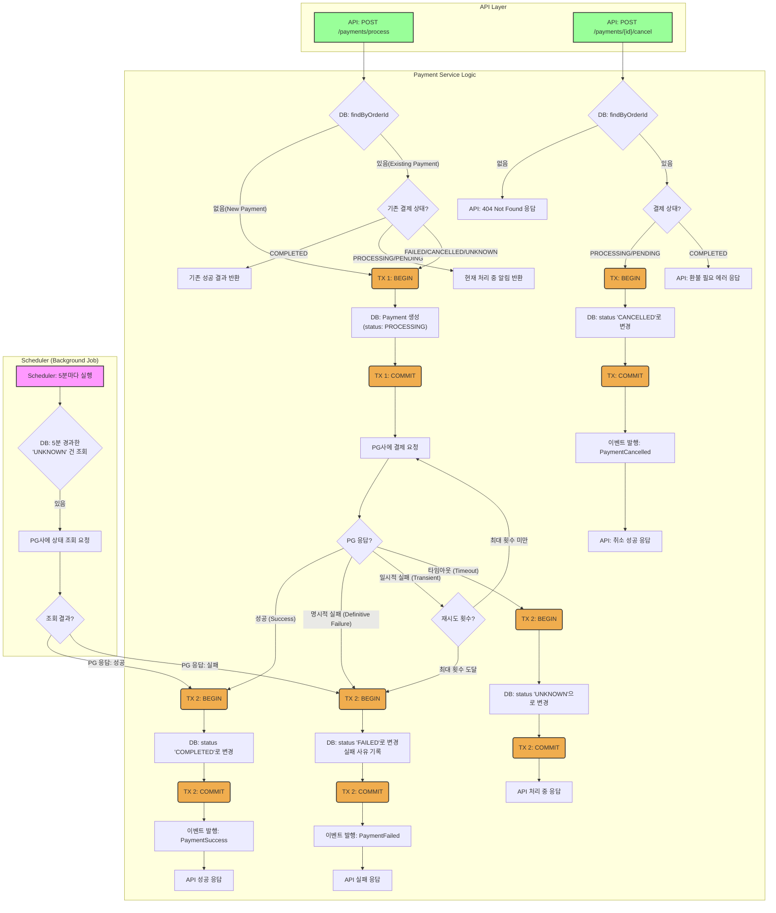
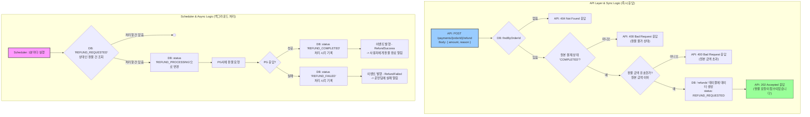
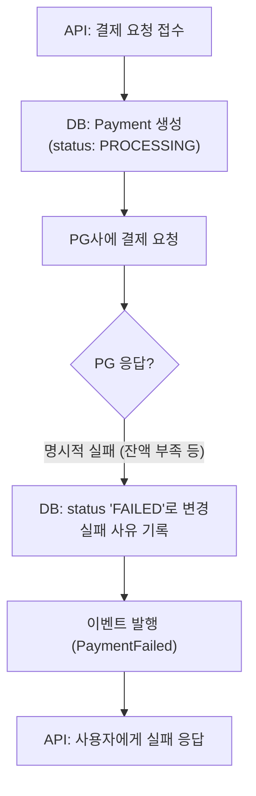
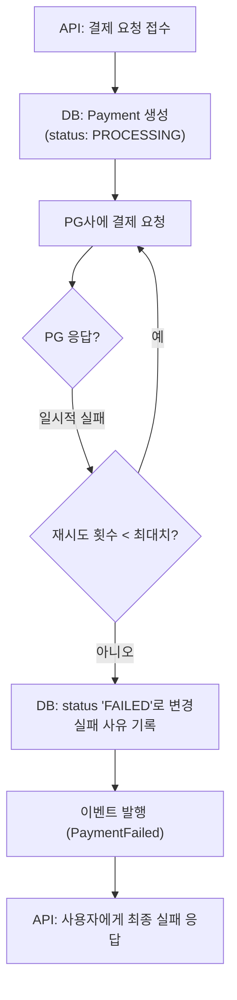
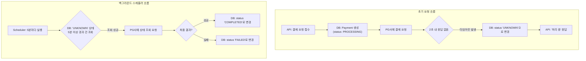
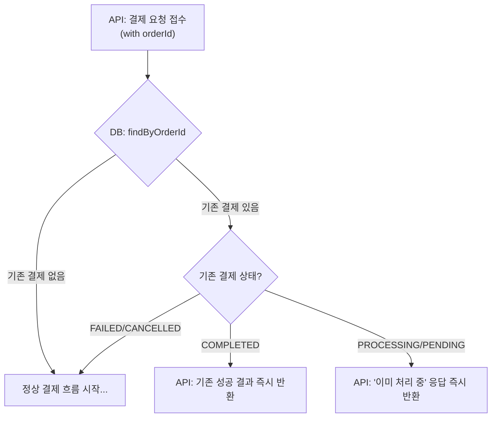
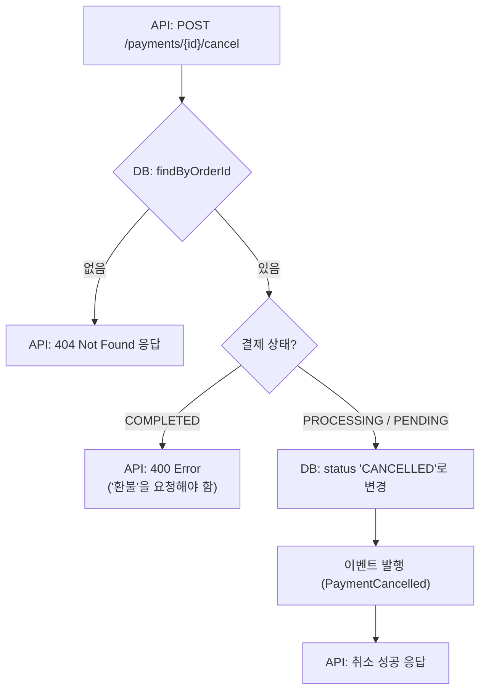
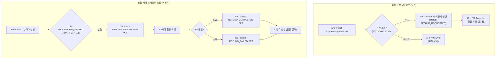
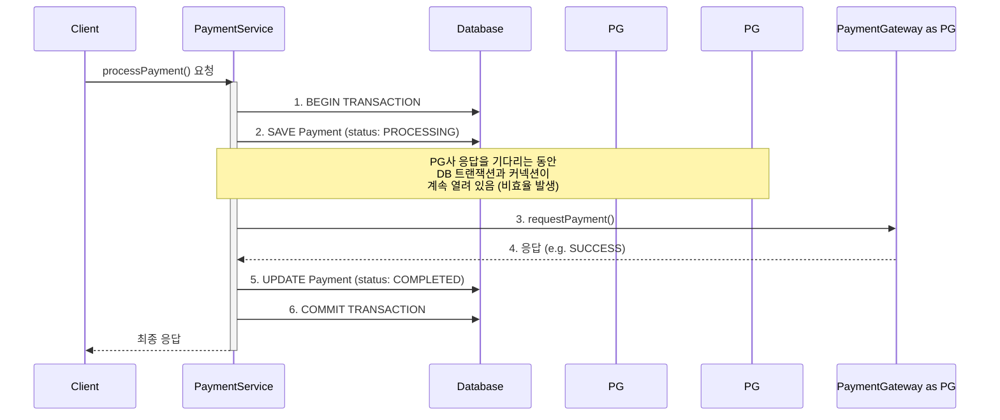
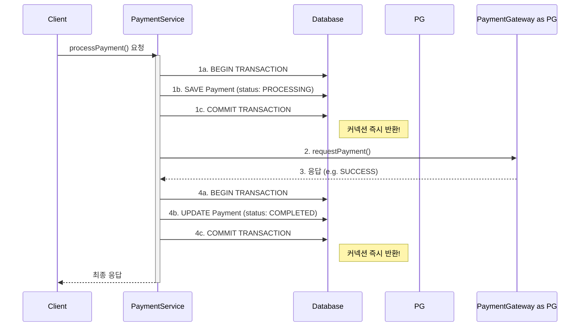

# A. 도메인 문제 해결방안

1. 결제 요청 시 발생할 수 있는 모든 시나리오를 정의하고, 
2. 각 상황에 대한 시스템의 대응 방안을 명시하여 결제 처리의 안정성과 일관성을 보장하는 것을 목적으로 한다.

## a. 결제 신청시 발생할 수 있는 경우의 수 
1. success
    1. immediate success
2. failure 
   1. 명시적 실패 w/ 실패 메시지
   2. 일시적 실패 
   3. timeout 
   4. 중복 결제 요청 (Idempotency)
   5. 결제 중 취소 (User Cancellation)
   6. 환불 요청 

## b. 해결방안 

### 1. 성공 케이스 (Happy Path)

#### 1.1. 즉시 성공 (Immediate Success)

-   **상황**: PG사에 결제 요청을 보낸 후, 즉시 '성공' 응답을 받은 경우.
-   **요구사항**: 결제 상태를 '완료(COMPLETED)'로 즉시 변경하고, 사용자에게 결제가 완료되었음을 알려야 한다.
-   **대응 방안**:
    1.  `Payment` 테이블에서 해당 결제 건의 상태를 `COMPLETED`로 업데이트한다.
    2.  결제 완료 시각(`updatedAt`)을 기록한다.
    3.  주문 서비스(Order Service)에 결제 완료 이벤트를 발행(publish)하여 후속 처리(예: 배송 시작)를 위임한다.
    4.  사용자에게 결제 완료 알림(이메일, SMS 등)을 보낸다.

### 2. 실패 케이스 (Failure Cases)

#### 2.1. 명시적 실패 (Definitive Failure)

-   **상황**: PG사로부터 '실패' 응답을 명확하게 받은 경우. (예: 한도 초과, 잔액 부족, 유효하지 않은 카드 정보, 사용자 취소 등)
-   **요구사항**: 결제 상태를 '실패(FAILED)'로 변경하고, 실패 원인을 기록해야 한다. 사용자에게는 명확한 실패 사유를 안내해야 한다. **이 경우는 재시도해서는 안 된다.**
-   **대응 방안**:
    1.  `Payment` 테이블의 상태를 `FAILED`로 업데이트한다.
    2.  PG가 제공한 실패 코드와 메시지를 별도 컬럼에 기록하여 원인 분석이 가능하도록 한다.
    3.  주문 서비스에 결제 실패 이벤트를 발행한다.
    4.  사용자에게 "잔액이 부족합니다." 와 같이 이해하기 쉬운 메시지를 보여주고, 재결제를 유도한다.

#### 2.2. 일시적 실패 (Transient Failure)

-   **상황**: PG사 시스템의 일시적인 오류, 연동된 은행 시스템의 간헐적 장애 등으로 인해 일시적으로 '실패' 응답을 받은 경우.
-   **요구사항**: 시스템은 자동으로 제한된 횟수만큼 재시도를 수행해야 한다. 모든 재시도 후에도 실패 시, 최종적으로 '실패' 처리해야 한다.
-   **대응 방안**:
    1.  `Payment` 테이블의 `attemptCount`(시도 횟수)를 1 증가시킨다.
    2.  **Exponential Backoff** 전략을 사용하여 재시도 간격을 점차 늘려가며 최대 2~3회 재시도한다. (예: 1초, 2초, 4초 후 재시도)
    3.  최종 재시도까지 실패하면, **2.1. 명시적 실패**와 동일하게 `FAILED` 상태로 처리한다.
    4.  재시도 중에는 `Payment`의 상태를 `PROCESSING`으로 유지한다.

#### 2.3. 응답 시간 초과 (Timeout / Unknown State)

-   **상황**: PG사에 결제 요청을 보냈으나, 정해진 시간(예: 30초) 내에 아무런 응답도 받지 못한 경우. **사용자가 실제로 돈을 지불했을 수도, 아닐 수도 있는 가장 위험한 상태.**
-   **요구사항**: 결제 상태를 임의로 '성공' 또는 '실패' 처리해서는 안 된다. 상태를 '처리 중(PROCESSING)' 또는 '확인 필요(UNKNOWN)'로 유지하고, 반드시 별도의 프로세스를 통해 실제 결제 결과를 확인해야 한다. **절대 요청을 재시도해서는 안 된다.**
-   **대응 방안**:
    1.  `Payment`의 상태를 `PROCESSING`으로 유지한다.
    2.  사용자에게는 "결제 결과를 확인 중입니다. 잠시 후 다시 확인해주세요." 와 같이 안내한다.
    3.  **결제 상태 확인 스케줄러(Reconciliation Job)** 를 통해 일정 시간 간격(예: 5분, 10분, 30분 후)으로 PG사에 해당 거래(`paymentKey` 또는 `orderId`)의 상태를 조회하는 API를 호출한다.
    4.  상태 조회 API를 통해 확인된 최종 결과(성공 또는 실패)를 바탕으로 `Payment`의 상태를 업데이트한다.

### 3. 시스템 및 엣지 케이스 (System & Edge Cases)

#### 3.1. 중복 결제 요청 (Idempotency)

-   **상황**: 네트워크 문제나 사용자 실수(예: '결제하기' 버튼 더블 클릭)로 인해 동일한 `orderId`에 대한 결제 요청이 짧은 시간 내에 여러 번 들어온 경우.
-   **요구사항**: 시스템은 동일 주문에 대해 결제가 중복으로 실행되는 것을 방지해야 한다. 이를 위해 **멱등성**을 보장해야 한다.
-   **대응 방안**:
    1.  결제 요청을 받으면 `orderId`를 기준으로 `Payment` 테이블을 조회한다.
    2.  이미 `COMPLETED` 상태인 결제 건이 존재하면, 새로운 결제를 진행하지 않고 기존의 성공 결과를 반환한다.
    3.  `PENDING` 또는 `PROCESSING` 상태인 결제 건이 존재하면, 새로운 결제를 생성하지 않고 현재 진행 중인 결제의 상태를 조회하여 반환한다. (Locking 메커니즘 고려)

#### 3.2. 결제 중 취소 (User Cancellation)

-   **상황**: 사용자가 결제를 진행하던 중(예: PG사 결제창) 이탈하거나 '취소' 버튼을 누른 경우.
-   **요구사항**: 결제 상태를 '취소(CANCELLED)'로 변경하고, 재고 등 관련 리소스를 원상 복구해야 한다.
-   **대응 방안**:
    1.  PG사가 제공하는 사용자 취소 콜백(Callback) URL을 통해 요청을 수신한다.
    2.  `Payment`의 상태를 `CANCELLED`로 업데이트한다.
    3.  주문 서비스에 결제 취소 이벤트를 발행하여 주문 취소 및 재고 복구 로직을 수행하도록 한다.

## c. flowchart 
### c-1. 전체 결제 flowchart 

### c-2. 환불 flowchart

### c-3. case1) 명시적 실패

*PG로부터 '잔액 부족' 등 명확한 실패 코드를 받아 즉시 '실패' 처리되는 흐름*

### c-4. 일시적 실패 (Transient Failure)

*PG로부터 '일시적 은행 오류' 등 재시도 가능한 오류 코드를 받아, 정해진 횟수만큼 재시도하는 흐름*

### c-5. 타임아웃 (Timeout)

*PG로부터 응답을 받지 못해 '상태 불명'으로 처리된 후, 스케줄러가 해결하는 흐름*

### c-6. 중복 결제 요청 (Idempotency)

*동일한 주문에 대해 결제 요청이 여러 번 들어왔을 때, 이를 감지하고 처리하는 흐름*

### c-7. 결제 중 취소 (User Cancellation)

*사용자가 결제가 완료되기 전인 PROCESSING 상태에서 취소를 요청하는 흐름*

### c-8. 환불 요청 (Refund Request)

*완료된 결제에 대해 환불을 요청하고, 백그라운드에서 비동기로 처리되는 흐름*

# B. blocking i/o 병목 문제 해결방안
## 1. 문제
스프링 프레임워크는 전통적으로 스레드 동작방식이 동기 i/o이다. 

근데 PG사 요청이 200ms~2000ms+ 엄청 오래 걸리는 요청이다. 

얘를 동기로 잡으면, 쓰레드가 요청 기다려서 동시 요청이 몰리는 환경에서는 thread starvation 에러가 뜨기 쉽다. 

## 2. 해결방안
동기 방식으로 쓰레드가 긴 요청을 기다리게 하지 말고,\
비동기 non-blocking i/o 를 써서, 메인쓰레드 몇개가 요청 받기 & 콜백함수 처리만 하고, pg사 요청 기다리는건 os kernel에 위임, 끝나면 알려달라고 하기

# C. 긴 트랜젝션 문제 해결방안 
## 1. 문제 
트랜젝션의 범위를 얼마나 잡아야 하나?

트랜젝션의 범위를 결제요청 처음부터 끝까지 잡으면, pg사 요청이 2초+ 걸려버리는 경우, DB 커넥션을 너무 오래 물고있는거 아닐까?

DB connection이 갯수를 다 써버리면, 에러나지 않을까? 

## 2. 기반지식 이해 (알면 스킵)

### 2-1. 동기 i/o에서 transaction 과 비동기 i/o에서 transaction의 차이 
- 동기 i/o에서 transaction
    - 전통적인 Spring MVC에서 사용하는 @Transactional 어노테이션은 ThreadLocal 이라는 기술을 기반으로 동작합니다. 
    - ThreadLocal은 "현재 스레드만의 개인 사물함"과 같습니다. 
    - 트랜잭션이 시작되면, 트랜잭션 정보(커넥션 등)를 현재 스레드의 사물함에 넣어두고, 같은 스레드에서 실행되는 모든 DB 작업은 그 사물함에 있는 커넥션을 사용합니다.
- 비동기 i/o에서 transaction
    - 하나의 요청을 처리하는 과정(리액티브 체인)에서, I/O 대기가 발생할 때마다 스레드가 다른 작업으로 전환됩니다. 
    - 즉, A 스레드가 DB에 저장을 요청하고, 응답을 기다리는 동안 B 스레드가 다른 일을 하다가, DB 응답이 오면 C 스레드가 그 뒷부분을 처리할 수 있습니다.
    - 이 때문에 ThreadLocal 기반의 @Transactional은 깨지게 됩니다. C 스레드는 A 스레드의 개인 사물함에 접근할 수 없기 때문이죠.
    - 해결책: TransactionalOperator 
    - 리액티브 스트림 자체에 트랜잭션 컨텍스트를 전파하므로, 스레드가 바뀌어도 트랜잭션이 유지됩니다.
    - `.as(transactionalOperator::transactional);` 이런식으로 쓴다

### 2-2. jvm threads와 connection pool thread 
- spring webflux는 cpu core 갯수만큼 메인 스레드 만들어서, 얘네들이 http 요청 받아서 os kernel에 pg사 요청 기다린 후 끝나면 알람 달라고 위임한다. 얘네가 jvm thread
- jvm thread와 별개로 DB에 CRUD할 때 쓰는 스레드들은 connection pool(thread pool)에 있다. 
- 만약에 pg사 결제요청을 DB 요청과 함께 @Transaction 범위 안에 넣어버리면, 저 connection pool에 쓰레드가 pg사 요청이 끝날 때 까지 아무것도 못하는 문제가 생긴다. 
- connection pool안에 스레드가 몇초씩 기다리는데, DB i/o 요청 많이와서 남는 connection이 없는걸 'DB connection pool starvation'이라고도 한다. 

## 3. 솔루션 
1. 일단 pg결제 요청은 엄청 기니까 transaction 밖으로 뺀다.
2. 트랜젝션 범위는 DB i/o로 한정한다. 
3. pg사 요청 전, DB에 `PROCESSING` 상태로 저장하고, PG사 요청 결과에 따라, 다시 DB에 상태를 변경해준다.
4. 결제 요청 도중에 취소 요청이 오면, transaction 도중에 개입하는게 아니라, 해당 결제의 상태를 보고 어떻게 처리할지 결정. 
5. 결제 실패시, 보상 트랜젝션 (결제 실패 -> 이벤트 남김 -> order_module에서 주문 취소 + 재고 복원)

### Before: 긴 트랜잭션

*하나의 트랜잭션이 첫 DB 저장부터 외부 PG사 호출이 끝난 후 최종 DB 업데이트까지 계속 유지되는 상황*

가장 큰 문제점은 PG사의 응답을 기다리는 동안 데이터베이스 커넥션이 계속 점유된다는 것

### After: 짧은 트랜잭션 분리 

# D. 데이터 정합성 해결방안 
## 1. 문제 
1. `[TX 1: 'PROCESSING' 저장 및 커밋] <-- (💥 시스템 장애 발생 가능 지점) --> [PG사 호출 및 최종 상태 업데이트]` 
    - "좀비 데이터" 문제 
    - 데이터베이스에는 PROCESSING 상태의 결제 기록이 남아있지만, 실제로는 PG사에 결제 요청이 전달되지 않았음 -> 영원히 처리되지 않고 DB에 남는 "좀비 데이터"가 됨.
    - 이 상태만으로는 실제로 결제가 진행 중인지, 아니면 시스템 오류로 버려진 데이터인지 구분할 수 없음. 
2. `[TX 1: 'PROCESSING' 저장 및 커밋] --> [PG사 호출 및 최종 상태 업데이트] <-- (💥 시스템 장애 발생 가능 지점) -->  [후처리]`
    - 데이터 불일치 문제
    - PG사 호출이 성공하여 고객의 돈은 실제로 빠져나갔지만, handlePGResponse에서 COMPLETED로 상태를 업데이트하는 두 번째 트랜잭션이 실패하는 경우. (예: DB가 순간적으로 장애 발생)
    - PG사는 성공, 우리 DB는 PROCESSING 상태로 데이터가 불일치
    - 사용자는 돈을 냈는데 서비스에서는 결제가 완료되지 않은 것으로 보임 

## 2. 해결방안

오래된 PROCESSING 건 처리' 스케줄러 추가

1. 스케줄러 로직: 일정 시간(예: 1시간)마다, 생성된 지 오래되었지만(예: 30분 이상) 여전히 PROCESSING 상태에 머물러 있는 결제 건들을 모두 조회합니다.
2. 상태 조회: 조회된 '좀비 의심' 결제 건들의 paymentKey를 이용해 PG사에 거래 상태 조회 API를 호출합니다.
3. 상태 업데이트: PG사로부터 받은 실제 결과(성공, 실패, 존재하지 않음 등)를 바탕으로 우리 DB의 상태를 최종적으로 업데이트하여 정합성을 맞춥니다.
    1. PG사에 해당 결제가 존재하고 성공했다면 -> 우리 DB도 **COMPLETED** 로 변경.
    2. PG사에 해당 결제가 존재하고 실패했다면 -> 우리 DB도 **FAILED** 로 변경.
    3. PG사에 해당 결제가 아예 존재하지 않는다면 -> '좀비 데이터'이므로 CANCELLED 또는 **FAILED** 로 변경.

