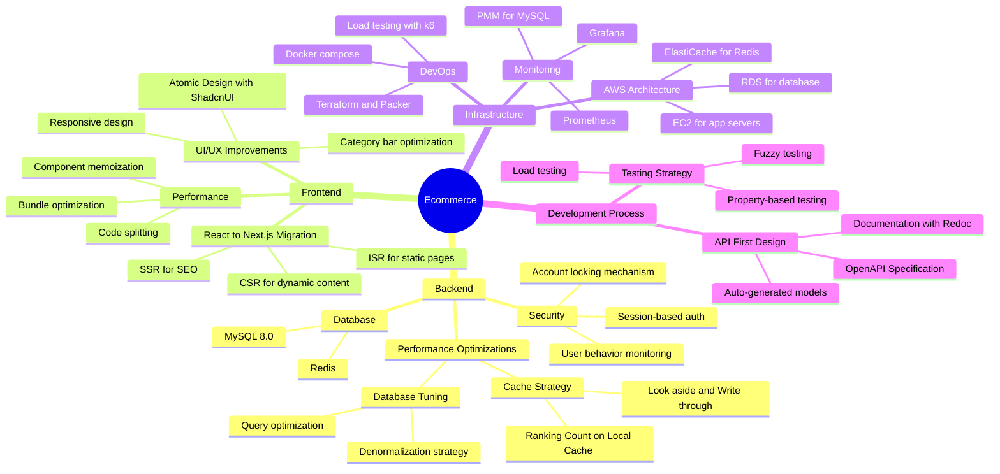

```mermaid
mindmap
  root((Ecommerce))
    Backend
        Security
            Session-based auth
            User behavior monitoring
            Account locking mechanism
        Database
            MySQL 8.0
            Redis
        Performance Optimizations
            Cache Strategy
                Look aside and Write through
                Ranking Count on Local Cache 
            Database Tuning
                Query optimization
                Denormalization strategy
    Frontend
        UI/UX Improvements
            Atomic Design with ShadcnUI
            Category bar optimization
            Responsive design
        React to Next.js Migration
            SSR for SEO
            CSR for dynamic content
            ISR for static pages
        Performance
            Code splitting
            Component memoization
            Bundle optimization
    Infrastructure
        AWS Architecture
            EC2 for app servers
            RDS for database
            ElastiCache for Redis
        Monitoring
            Prometheus
            Grafana
            PMM for MySQL
        DevOps
            Docker compose
            Terraform and Packer
            Load testing with k6
    Development Process
        API First Design
            OpenAPI Specification
            Auto-generated models
            Documentation with Redoc
        Testing Strategy
            Load testing
            Property-based testing
            Fuzzy testing
```
