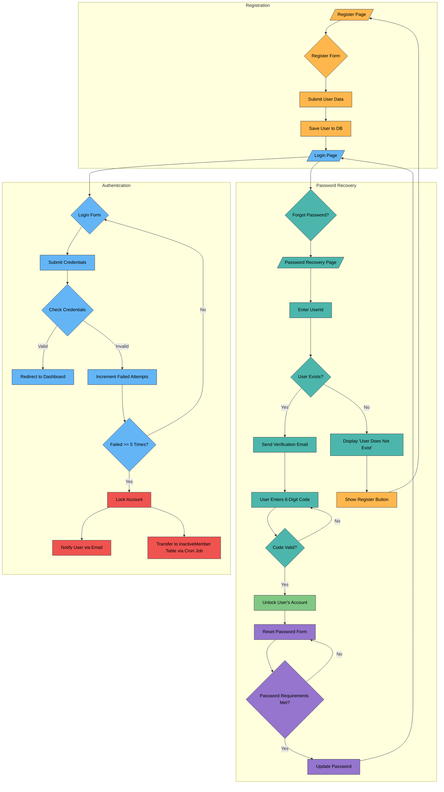

```mermaid
flowchart TD
    subgraph Registration
        A[/Register Page/] --> B{Register Form}
        B --> C[Submit User Data]
        C --> D[Save User to DB]
        D --> E[/Login Page/]
    end
    subgraph Authentication
        E[/Login Page/] --> F{Login Form}
        F --> G[Submit Credentials]
        G --> H{Check Credentials}
        H -->|Valid| I[Redirect to Dashboard]
        H -->|Invalid| Q[Increment Failed Attempts]
        Q --> R{Failed >= 5 Times?}
        R -->|No| F
        R -->|Yes| S[Lock Account]
        S --> W[Notify User via Email]
        S --> Z1[Transfer to inactiveMember Table via Cron Job]
    end
    subgraph Password Recovery
        E --> J{Forgot Password?}
        J --> U[/Password Recovery Page/]
        U --> K[Enter UserId]
        K --> L{User Exists?}
        L -->|Yes| M[Send Verification Email]
        L -->|No| N[Display 'User Does Not Exist']
        N --> V[Show Register Button] --> A
        M --> O[User Enters 6-Digit Code]
        O --> P{Code Valid?}
        P -->|Yes| T[Unlock User's Account]
        T --> X[Reset Password Form]
        X --> Y{Password Requirements Met?}
        Y -->|Yes| Z[Update Password] --> E
        Y -->|No| X
        P -->|No| O
    end
    %% Define classes for nodes with black text
    classDef blackText fill:#fff,stroke:#333,color:#000
    %% Apply black text class to all nodes
    class A,B,C,D,E,F,G,H,I,J,K,L,M,N,O,P,Q,R,S,T,U,V,W,X,Y,Z,Z1 blackText
    %% Registration nodes - Orange shades
    style A fill:#FFB74D,stroke:#333
    style B fill:#FFB74D,stroke:#333
    style C fill:#FFB74D,stroke:#333
    style D fill:#FFB74D,stroke:#333
    style V fill:#FFB74D,stroke:#333
    
    %% Authentication nodes - Blue shades
    style E fill:#64B5F6,stroke:#333
    style F fill:#64B5F6,stroke:#333
    style G fill:#64B5F6,stroke:#333
    style H fill:#64B5F6,stroke:#333
    style I fill:#64B5F6,stroke:#333
    style Q fill:#64B5F6,stroke:#333
    style R fill:#64B5F6,stroke:#333
    
    %% Account Lock/Unlock nodes - Red & Green shades
    style S fill:#EF5350,stroke:#333
    style T fill:#81C784,stroke:#333
    style W fill:#EF5350,stroke:#333
    style Z1 fill:#EF5350,stroke:#333
    
    %% Password Reset nodes - Purple shades
    style X fill:#9575CD,stroke:#333
    style Y fill:#9575CD,stroke:#333
    style Z fill:#9575CD,stroke:#333
    
    %% Password Recovery nodes - Teal shades
    style U fill:#4DB6AC,stroke:#333
    style J fill:#4DB6AC,stroke:#333
    style K fill:#4DB6AC,stroke:#333
    style L fill:#4DB6AC,stroke:#333
    style M fill:#4DB6AC,stroke:#333
    style N fill:#4DB6AC,stroke:#333
    style O fill:#4DB6AC,stroke:#333
    style P fill:#4DB6AC,stroke:#333
```