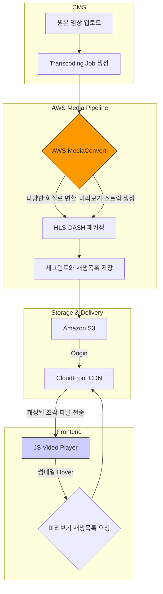
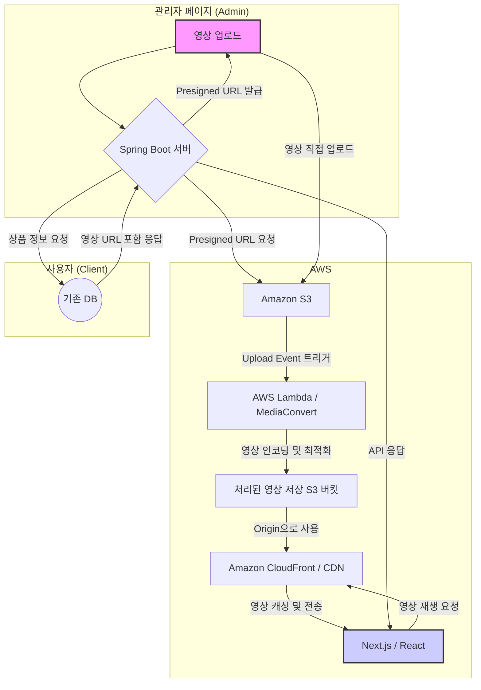
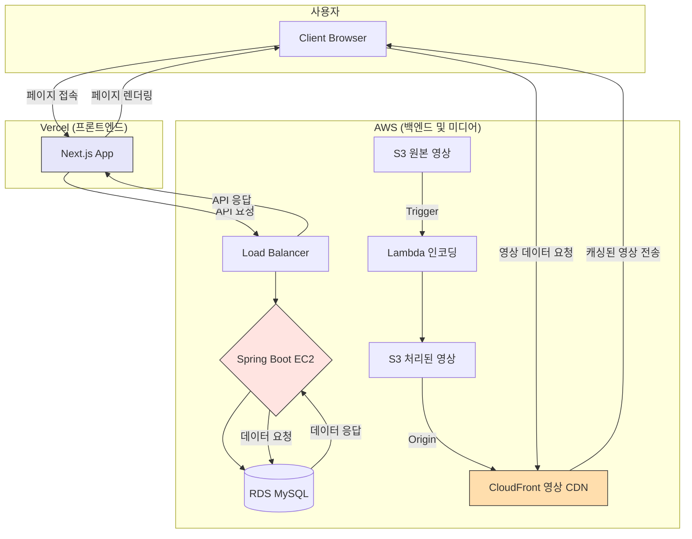
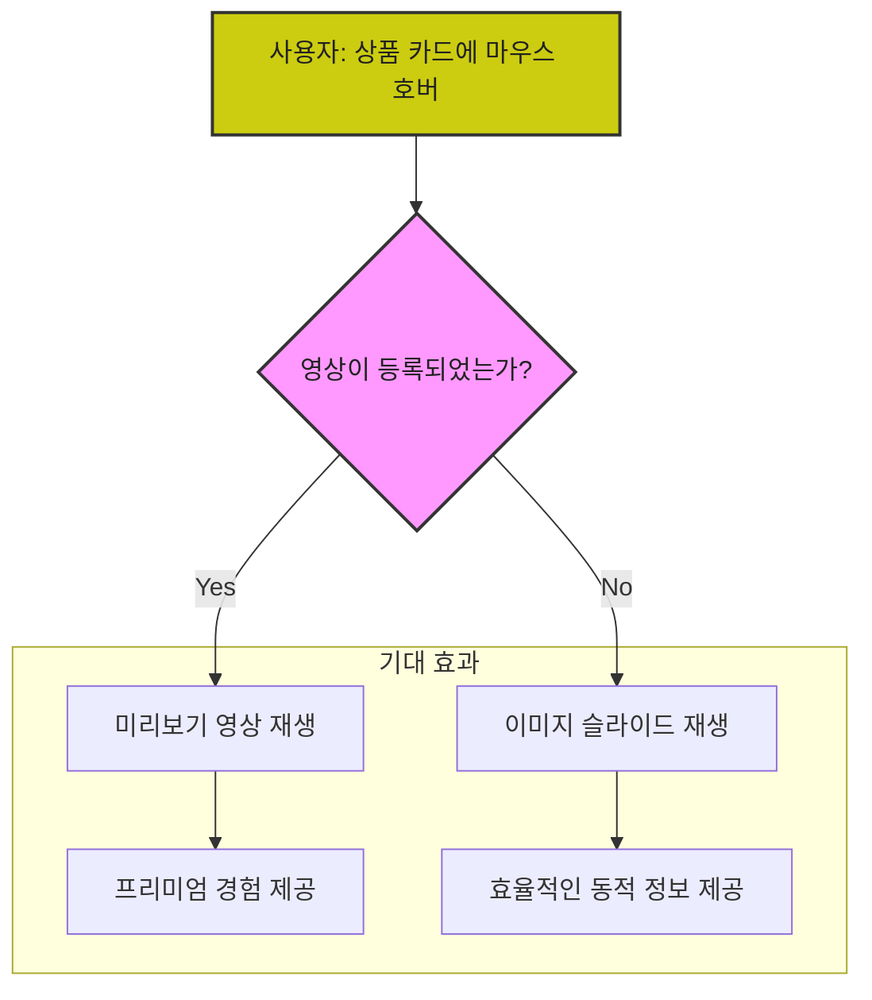

# roadmap 
### 준비단계 
DB 스키마 확정:

1. PRODUCT 테이블에 thumbnail_video_url (VARCHAR(255), nullable) 컬럼을 추가하기로 최종 결정합니다.
    - 이 컬럼에는 최종적으로 CloudFront를 통해 제공될 HLS 재생목록(.m3u8)의 URL이 저장됩니다.
2. API 명세서(OpenAPI/YAML) 업데이트: (API-First Design)
    - [POST] /api/admin/products/{productId}/videos/presigned-url: 관리자가 영상 파일을 S3에 직접 업로드할 수 있는 임시 URL을 요청하는 API.
    - [PUT] /api/admin/products/{productId}/videos: 영상 업로드 및 처리가 완료된 후, 최종 CDN URL을 상품 정보에 저장하는 API.
    - [GET] /api/products 및 [GET] /api/products/{productId}: 기존 상품 조회 API의 응답 DTO에 thumbnailVideoUrl

### AWS 인프라 구축 (Terraform 권장, 1~2일) 
백엔드와 미디어 처리를 위한 AWS 리소스를 미리 준비합니다.

1. S3 버킷 생성:

[버킷 1] 원본 영상용 (e.g., my-shop-videos-raw): 관리자가 업로드하는 원본 영상이 저장될 곳입니다.

[버킷 2] 처리된 영상용 (e.g., my-shop-videos-processed): HLS로 변환된 영상 조각(.ts)과 재생목록(.m3u8)이 저장될 곳입니다. 이 버킷은 Public Access를 차단해야 합니다. (CloudFront를 통해서만 접근)

2. AWS Elemental MediaConvert 설정 (권장):

Lambda에서 직접 ffmpeg을 다루는 것보다 훨씬 안정적이고 강력합니다.

작업 템플릿(Job Template) 생성: S3에 업로드된 영상을 입력받아, 다양한 화질(1080p, 720p, 360p...) 및 미리보기용 저화질(144p) HLS로 변환하여 [버킷 2]에 저장하도록 설정합니다.

3. AWS Lambda 함수 생성:

트리거 설정: [버킷 1]에 영상이 업로드(ObjectCreated)되면 자동으로 이 Lambda 함수가 실행되도록 설정합니다.

역할: 이 Lambda의 역할은 매우 단순합니다. 업로드된 영상 정보를 받아 위에서 설정한 MediaConvert 작업(Job)을 실행시키는 역할만 합니다.

IAM 역할: Lambda가 MediaConvert 작업을 실행하고 S3 버킷에 접근할 수 있는 권한을 부여합니다.

4. CloudFront 배포 생성:

원본(Origin): [버킷 2] (처리된 영상용 S3 버킷)를 원본으로 지정합니다.

OAI (Origin Access Identity) 설정: S3 버킷의 파일에 CloudFront만 접근할 수 있도록 설정하여 보안을 강화합니다.

캐시 정책: .m3u8, .ts 파일 확장자에 대해 적절한 캐시 TTL(Time To Live)을 설정합니다.

## step3. 백엔드 로직 구현 
1. Presigned URL 생성 기능 구현:
    - AWS SDK for Java를 사용하여 S3 [버킷 1]에 파일을 PUT 할 수 있는 Presigned URL을 생성하는 Service와 Controller를 구현합니다.
2. 영상 처리 완료 후 URL 저장 기능 구현:
    - (방법 A - 간단) 프론트엔드가 "업로드 성공"을 알려주면, 백엔드는 MediaConvert 작업 완료를 기다린 후(SNS/SQS 연동 권장), 최종 URL을 DB에 저장합니다.
    - (방법 B - 추천) MediaConvert 작업이 완료되면 **SNS(Simple Notification Service) 또는 SQS(Simple Queue Service)**를 통해 백엔드에 알림을 보내고, 백엔드는 이 알림을 받아 비동기적으로 DB에 URL을 업데이트합니다.
    - PUT /api/admin/products/{productId}/videos API를 구현합니다.
3. 상품 조회 API 수정:
    - 기존 상품 조회 로직에 thumbnailVideoUrl을 포함하도록 DTO와 Service 로직을 수정합니다.


## step4. admin page for 상품등록 
관리자가 영상을 쉽게 업로드할 수 있는 UI와 로직을 만듭니다. 

1. 상품 등록/수정 페이지 UI 변경:
    - `<input type="file" accept="video/*" />` 컴포넌트를 추가합니다.
    - 업로드 진행 상태를 보여주는 프로그레스 바(Progress Bar) UI를 추가합니다.

2. 업로드 로직 구현:
    - 1단계: 관리자가 영상을 선택하면, 백엔드에 Presigned URL을 요청합니다.
    - 2단계: 응답으로 받은 Presigned URL을 사용하여, axios나 fetch의 PUT 메서드로 영상 파일을 S3에 직접 업로드합니다. (XMLHttpRequest를 사용하면 업로드 진행률을 추적하기 용이합니다.)
    - 3단계: 업로드가 100% 완료되면, 백엔드의 URL 저장 API를 호출하여 후처리를 요청합니다.

### step5. 상품페이지 개발 
1. 데이터 바인딩:
    - 상품 목록/상세 페이지에서 데이터를 불러올 때 thumbnailVideoUrl도 함께 가져와 ProductCard 컴포넌트에 props로 전달합니다.
2. 미리보기 재생 기능 구현:
- HLS.js 라이브러리 설치: HLS 스트리밍을 웹에서 재생하기 위한 필수 라이브러리입니다. (npm install hls.js)
- ProductCard 컴포넌트 수정:
    - onMouseEnter 이벤트 발생 시, thumbnailVideoUrl이 존재하면 HLS.js 인스턴스를 생성합니다.
    - 생성된 인스턴스에 .m3u8 URL을 로드하고, 이를 `<video>` 엘리먼트에 연결(attachMedia)한 후 재생(play)합니다.
    - onMouseLeave 이벤트 발생 시, 리소스 낭비를 막기 위해 반드시 hls.destroy()를 호출하여 인스턴스를 정리하고, 영상을 정지/초기화합니다.

### step6. update docs 
1. 프로젝트명
2. 프로젝트 개요
3. 프로젝트 소개 및 주요 기능: HR, 헤드헌터를 위한 설명 (중요!)
4. 기술 스택 및 개발 상세 내용: CTO 및 개발자를 위한 설명 (이게 더 중요!)
5. 보유 기술
6. 실제 라이브 링크 (증빙자료 1)
7. 화면 캡처 이미지 및 설명 (증빙자료 2)
8. 서비스 동작 유튜브 동영상 (증빙자료 3)


# 기능 
1. Product Card에 마우스 hover 시 썸네일 영상을 재생하는 기능
2. 마우스 hover시 영상이 없으면 여러 상품 이미지 슬라이드 기능


# ABS(Adaptive Bitrate Streaming) 기술 
현대 비디오 스트리밍 기술의 핵심 원리입니다. 이 기술을 **적응형 비트레이트 스트리밍(Adaptive Bitrate Streaming, ABS)**이라고 부릅니다.

기본적인 원리는 하나의 원본 영상을 다양한 화질(bitrate)로 변환(transcoding)하고, 각각을 잘게 쪼갠 조각(segment)으로 만들어 놓는 것입니다. 플레이어는 사용자의 네트워크 상태에 맞춰 최적의 화질 조각들을 실시간으로 요청해 끊김 없이 재생합니다. 

### 1. 인코딩 & 패키징 (Encoding & Packaging) - 가장 핵심적인 단계
이 부분이 바로 '토막내는' 과정이며, 전문적인 스트리밍 서비스의 핵심입니다. AWS Elemental MediaConvert 같은 전문 미디어 변환 서비스를 사용하는 것이 일반적입니다.

트랜스코딩 (Transcoding):

하나의 원본 영상(original_720p.mp4)을 업로드하면, MediaConvert가これを 다양한 화질과 비트레이트의 영상들로 변환합니다.

결과물 예: video_1080p.mp4, video_720p.mp4, video_360p.mp4, video_144p.mp4

패키징 및 세그먼트화 (Packaging & Segmentation):

변환된 각각의 영상들을 HLS나 MPEG-DASH 같은 스트리밍 프로토콜에 맞춰 잘게 조각냅니다.

HLS (HTTP Live Streaming): Apple에서 개발했으며, 사실상 웹 표준입니다.

영상 조각: .ts 파일 (e.g., segment_001.ts, segment_002.ts, ...)

재생 목록 (Manifest): .m3u8 파일. 이 파일은 각 영상 조각들의 순서와 위치 정보가 담긴 '목차' 역할을 합니다.

각 화질별로 조각 파일들과 재생 목록이 생성됩니다.

⭐ 미리보기 스트림 생성:

바로 이 단계에서 미리보기 전용 스트림을 따로 만듭니다.

예를 들어, 전체 영상 중 하이라이트 10초만 잘라내어, 가장 낮은 화질(144p)과 비트레이트로 preview.m3u8과 해당 조각들을 생성합니다.

이 미리보기 스트림은 재생 목록도 매우 짧고, 각 조각의 용량도 극도로 작기 때문에 마우스 호버 시 거의 즉시 로딩 및 재생이 가능합니다.


### 2. 저장 (Storage)
MediaConvert의 결과물(모든 화질의 .ts 조각들과 .m3u8 재생 목록)은 Amazon S3에 체계적으로 저장됩니다.

S3 버킷의 폴더 구조 예시: 

```
/videos
  └─ /video_12345  (영상 ID)
     ├─ /HLS
     │  ├─ main.m3u8             # 마스터 재생목록 (모든 화질 정보 포함)
     │  ├─ preview.m3u8          # ⭐ 미리보기용 재생목록
     │  ├─ /1080p
     │  │  ├─ playlist.m3u8
     │  │  ├─ segment_001.ts
     │  │  └─ segment_002.ts
     │  ├─ /720p
     │  │  ├─ playlist.m3u8
     │  │  └─ ...
     │  └─ /preview_segments
     │     ├─ preview_001.ts
     │     └─ preview_002.ts
     └─ /DASH
        └─ ...
```

### 3. 전송 (Delivery)
이전 답변과 동일하게, 모든 S3 파일들은 **CDN(Amazon CloudFront)**을 통해 사용자에게 전송됩니다. CDN은 .m3u8 재생 목록과 .ts 영상 조각들을 모두 엣지 서버에 캐싱하여 매우 빠른 응답 속도를 보장합니다.

 

### 4. 프론트엔드 (Player)
단순 `<video>` 태그가 아닌, HLS나 DASH 프로토콜을 해석할 수 있는 자바스크립트 기반의 전문 비디오 플레이어 라이브러리를 사용합니다.

대표적인 라이브러리: HLS.js, Shaka Player (DASH용), Video.js 등

구현 로직:

평소에는 썸네일 이미지를 보여줍니다.

사용자가 썸네일에 마우스 호버(onMouseEnter)를 합니다.

이벤트가 발생하면 숨겨져 있던 비디오 플레이어 컴포넌트를 활성화시킵니다.

플레이어에 영상 소스로 미리보기 재생목록 URL (.../video_12345/HLS/preview.m3u8)을 전달하여 재생을 시작합니다.

onMouseLeave 이벤트가 발생하면 플레이어를 멈추고 다시 썸네일 이미지로 교체합니다.

#### HLS 재생목록 (.m3u8) 파일 예시
이 '목차' 파일은 단순 텍스트이며, 내용은 대략 이렇습니다.

preview.m3u8 (미리보기용) 

```
#EXTM3U
#EXT-X-VERSION:3
#EXT-X-TARGETDURATION:4
#EXT-X-PLAYLIST-TYPE:VOD
#EXTINF:4.000,
/preview_segments/preview_001.ts
#EXTINF:4.000,
/preview_segments/preview_002.ts
#EXTINF:2.500,
/preview_segments/preview_003.ts
#EXT-X-ENDLIST
```
이 파일만 받으면 플레이어는 3개의 조각만 순서대로 재생하면 된다는 것을 알 수 있습니다. 매우 가볍고 빠릅니다.


기존 방식(단일 MP4) vs 스트리밍 방식(HLS/DASH)

### 결론 
기존에 .mp4 방식은 영상 파일 전체를 하나의 단위로 다루고, 미리보기시 저화질 MP4 파일을 별도로 저장하고 통째로 재생

스트리밍 방식 (HLS/DASH)은 영상을 여러 조각(Segment)으로 나누어 다룸, 미리보기 전용 재생목록(.m3u8)과 조각들만 재생.

매우 빠르다는 장점이 있지만,\
구현난이도가 단순히 s3에 .mp4 쌓아놓는거 대비 복잡하다는 단점이 있다. 





# 기술스택 

1. 백엔드 및 인프라 변경 사항
가장 큰 변화는 "비디오 파일을 어떻게 저장하고, 처리하고, 안정적으로 전송할 것인가?" 에 대한 부분입니다.

## 비디오 저장 및 처리: Amazon S3 + AWS Lambda
EC2 인스턴스에 직접 영상을 저장하는 것은 확장성, 안정성, 비용 면에서 매우 비효율적입니다. 대신 AWS의 객체 스토리지인 S3를 사용하는 것이 표준적인 방법입니다.

저장 (Storage): 모든 원본 및 처리된 비디오 파일은 S3 버킷에 저장합니다.

처리 (Processing): 사용자가 어떤 형식의 영상을 올리더라도 웹에 최적화된 포맷(e.g., MP4, WebM)과 용량으로 자동 변환하는 과정이 필요합니다. 이 과정은 AWS Lambda를 이용해 서버리스(Serverless)로 자동화할 수 있습니다.

관리자가 원본 영상을 S3 버킷에 업로드합니다.

S3 업로드 이벤트를 감지하여 Lambda 함수를 자동으로 실행(Trigger)합니다.

Lambda 함수 내에서 FFmpeg 같은 오픈소스 라이브러리를 사용하여 영상을 웹 표준 포맷으로 인코딩하고, 해상도를 조절하여 용량을 최적화합니다.

처리된 영상은 다른 S3 버킷(e.g., ecommerce-videos-processed)에 저장합니다.

전문적인 솔루션으로는 AWS Elemental MediaConvert를 사용할 수도 있지만, 썸네일 영상 정도는 Lambda로 충분히 구현 가능합니다.

## 비디오 전송: Amazon CloudFront (CDN)
S3에 저장된 영상을 전 세계 사용자에게 빠르고 안정적으로 전송하기 위해 CDN(Content Delivery Network) 사용은 필수입니다. AWS에서는 CloudFront가 이 역할을 합니다.

역할: CloudFront는 처리된 영상이 저장된 S3 버킷을 원본(Origin)으로 설정합니다. 사용자가 영상을 요청하면, 가장 가까운 CDN 엣지(Edge) 서버에 캐싱된 영상을 전송하여 지연 시간(Latency)을 최소화합니다.

효과: 전 세계 어디서 접속하든 빠른 영상 로딩 속도를 보장하며, S3 데이터 전송 비용을 절감하는 효과도 있습니다.

## 1.3. API 및 데이터베이스 변경
DB 스키마 변경:

PRODUCT 테이블에 영상 URL을 저장할 컬럼을 추가합니다. (e.g., thumbnail_video_url VARCHAR(255))

이 URL은 CloudFront를 통해 접근할 수 있는 주소가 됩니다. (예: https://cdn.yourdomain.com/videos/product_123.mp4)

상품 API 수정:

기존 상품 조회 API (/products, /products/{productId})의 응답 DTO에 thumbnailVideoUrl 필드를 추가하여 프론트엔드로 전달합니다.

영상 업로드 API 구현 (Presigned URL 방식):


# flowchart 
## a. 상품 등록시 영상 처리 


## b. 유저가 영상 데이터를 받아오는 과정


## c. product card에 mouse hover시 



# 의문점 

## ROI가 나올까?
로영상 스트리밍 처리 서버비 & 운영개발비가 별도로 필요한데,\
이 기능 추가한 것 대비 매출이 나올까?

일반적인 상품을 파는 이머커스라면 효용대비 비용이 크기에 안하는게 더 좋다.\
단, 고가의 프리미엄 상품을 취급하는 ecommerce라면 도입할만 하다.


# resources 
6 social proofs
1. by best sellers
2. recent activity by others (17 customers added to the cart)
3. FOMO (hurry! only 4 left!)
4. new arrival
5. customer testimonial (4-stars, this product is awesome!)
6. youtube video  
- https://www.youtube.com/watch?v=kZb4UPj3VqM 