# index

<!--
.md jump-to-secion naming rules

1. Make all lowercase
2. Remove anything that is not a letter, number, space or hyphen, like :, ', etc
3. Change any space to a hyphen.
-->

- A. [프로젝트 소개](#a-프로젝트-소개)
	- a. [빌드 & 실행 방법](#a-빌드-및-실행-방법)
	- b. [사용 기술](#b-사용-기술)
- B. [아키텍쳐](#b-architecture)
	- a. [AWS architecture](#a-aws-architecture)
	- b. [ERD diagram](#b-erd-diagram)
	- c. [wireframe](#c-wireframe)
- C. [기술적 도전 - Backend](#c-기술적-도전---backend)
    - a. [DB 부하를 낮추기 위한 cache 도입기](#a-db-부하를-낮추기-위한-cache-도입기)
    - b. [상품 랭킹 기능 구현기, 최적화를 곁들인](#b-상품-랭킹-기능-구현기)
    - c. [전자상거래에서 인증 및 보안](#c-전자상거래에서-인증-및-보안)
	- d. [돈관련 코드 테스트 정밀도 높힌 방법](#d-돈관련-코드-테스트-정밀도-높힌-방법)
- D. [기술적 도전 - Database](#d-기술적-도전---database)
    - a. [정규화](#a-정규화)
	- b. [반정규화](#b-반정규화)
    - c. [통계 쿼리](#c-통계-쿼리)
    - d. [sql tuning](#d-sql-tuning)
	- e. [bulk insert](#e-bulk-insert)
- E. [기술적 도전 - Cloud](#e-기술적-도전---cloud)
	- a. [docker-compose로 개발환경 구성](#a-docker-compose로-개발환경-구성)
	- b. [provisioning: terraform & packer](#b-provisioning-terraform-and-packer)
	- c. [모니터링 서버 세팅: prometheus and grafana + PMM](#c-monitoring-prometheus-and-grafana--pmm)
	- d. [시행착오: 배포서버에서 log는 error랑 warn만 키자](#d-시행착오---배포서버에서-log는-error랑-warn만-키자)
	- e. [부하 테스트](#e-부하-테스트)
- F. [기술적 도전 - Frontend](#f-기술적-도전---frontend)
	- a. [카테고리바의 UX 개선기](#a-카테고리바의-UX-개선기)
	- b. [사용자경험(UX)을 반영한 맞춤형 앱 설계](#b-사용자경험ux을-반영한-맞춤형-앱-설계)
	- c. [성능개선, 더 나은 UX를 위한](#c-성능개선-더-나은-ux를-위한)
	- d. [일관성 있는 디자인으로, 더 나은 UX를 위한 atomic design pattern with shadcnUI](#d-atomic-design-pattern-with-shadcn-ui)
    - e. [개발자의 협업 플로우 개선을 위한 API First Design](#e-개발자의-협업-플로우-개선을-위한-api-first-design)


# A. 프로젝트 소개


Ecommerce MVP

## a. 빌드 및 실행 방법


### 1. nextjs + spring-server을 docker-compose로 실행

```
1. git clone https://github.com/Doohwancho/ecommerce
2. cd ecommerce
3. ecommerce/front/02.nextjs_migration/.env.local 파일 생성 후,
	- `NEXT_PUBLIC_API_URL=http://ecommerce-app1:8080` 입력
	- 만약 로컬환경에서 실행하려면 `NEXT_PUBLIC_API_URL=http://127.0.0.1:8080` 입력
4. docker compose -f ./docker-compose-nextjs-ver.yml up --build
5. http://localhost:80
```


### 2. reactjs + spring-server를 docker compose로 실행

```
1. git clone https://github.com/Doohwancho/ecommerce
2. cd ecommerce
3. ecommerce/front/01.reactjs/.env 파일 생성 후,
	- `VITE_API_BASE_URL=http://localhost/api` 입력
	- 만약 로컬환경에서 실행하려면 `VITE_API_BASE_URL=http://127.0.0.1:8080` 입력
4. docker compose -f ./docker-compose-reactjs-ver.yml up --build
5. http://localhost:80
```

#### Q. docker build시 에러: arm64 아키텍쳐가 아닙니다!

문제 원인: docker-image가 arm64 아키텍처 용이라 컴퓨터 아키텍처가 안맞아서 발생하는 문제.

해결책: linux/amd64나 다른 아키텍처의 경우, [도커 허브](https://hub.docker.com/_/mysql/tags?page=2&name=8.0)에 가서 본인 pc의 아키텍처용 버전을 찾아 수정하면 된다.


#### Q. docker build시 에러: mysql connection error일 경우

만약 ecommerce-app1이 mysql connection error 날 경우, 'ecommerce' 이름의 database를 mysql container에 접속해서 만들어 줘야 한다.

1. `docker exec -it mysql bash`
2. `mysql -u root -p`
3. `admin123`
4. `create database ecommerce;`
5. 다시 `docker compose up --build`


#### Q. 로컬환경에서 react, nextjs 프로젝트를 실행하고 싶다면?

1. react -> front/01.reactjs/.env
2. nextjs -> front/02.nextjs_migration/.env.local

파일에서

1. base_url을 http://127.0.0.1:8080 로 수정
2. `npm i`
3. `npm start` or `npm run dev`


## b. 사용 기술

### b-1. 백엔드
| Category             | Tool/Library              | Version |
|----------------------|---------------------------|---------|
| Java                 | JDK                       | 1.8     |
| Spring               | Spring Boot Starter Web   | 2.5.6   |
|                      | Spring Security           | 2.5.6   |
|                      | Spring Data JPA           | 2.5.6   |
|                      | Spring Batch              | 2.5.6   |
|                      | Spring Quartz             | 2.5.6   |
|                      | Spring Boot Starter Cache | 2.5.6   |
| External Java Library| QueryDSL                  | 4.4.0   |
|                      | OpenAPI-Codegen           | 4.3.1   |
|                      | MapStruct                 | 1.5.5   |
|                      | Jackson-datatype-jsr310   | 2.12.5  |
|                      | Datafaker                 | 1.9.0   |
| Database             | MySQL                     | 8.0.23  |
|                      | Redis                     | 7.0.9   |
| Test                 | junit                     | 5.9.2   |
|                      | hamcrest                  | 2.2     |
|                      | Jqwik                     | 1.8.1   |
|                      | jmh                       | 1.21    |
| Deploy               | AWS                       |         |
|                      | Docker                    | 20.10.13|
| Provisioning         | Terraform                 | 1.6.6   |
|                      | Packer                    | 1.10.2  |
| Monitoring           | Prometheus                | 2.49    |
|                      | Grafana                   | 10.3    |
| Stress Test          | K6                        | 0.49    |
| Development Tools    | IntelliJ                  |         |
|                      | MySQL Workbench           |         |
|                      | Postman                   |         |
|                      | Redoc                     |         |
|                      | VSC Plugin - Draw.io Integration |         |
|                      | VSC Plugin - ERD Editor|         |


### b-2. 프론트엔드

#### b-2-1. ReactJs.Ver
| Category             | Tool/Library           | Version |
|----------------------|------------------------|---------|
| Language             | Typescript             | ^5.2.2  |
| React                | React                  | ^18.2.0 |
|                      | React-Router-Dom       | ^6.20.0 |
| Style                | Styled-Component       | ^6.1.1  |
| State Management     | Recoil                 | ^0.7.7  |
|                      | React-Query            | ^3.39.3 |
| Build Tool           | Vite                   | ^5.0.0  |
| API                  | openapi-generator-cli  | ^2.7.0  |
| external library     | react-slick            | ^0.29.0 |
|                      | slick-carousel         | ^1.8.1  |
|                      | react-icons            | ^4.12.0 |
| Design               | figma                  |         |

#### b-2-2. NextJs.Ver
| Category             | Tool/Library           | Version |
|----------------------|------------------------|---------|
| Language             | Typescript             | ^5.2.2  |
| Framework            | Next.js                | ^14.2.3 |
| React                | React                  | ^18.2.0 |
| Style                | Tailwind               | ^3.4.1  |
| Form Handling        | React Hook Form        | ^7.51.4 |
| Validation           | Zod                    | ^3.23.8 |
| Performance          | Lodash                 | ^3.23.8 |
| UI Components        | Shadcn-ui              | ^4.17.21|
| API                  | openapi-generator-cli  | ^2.7.0  |
| Design               | figma                  |         |


# B. Architecture

## a. AWS architecture
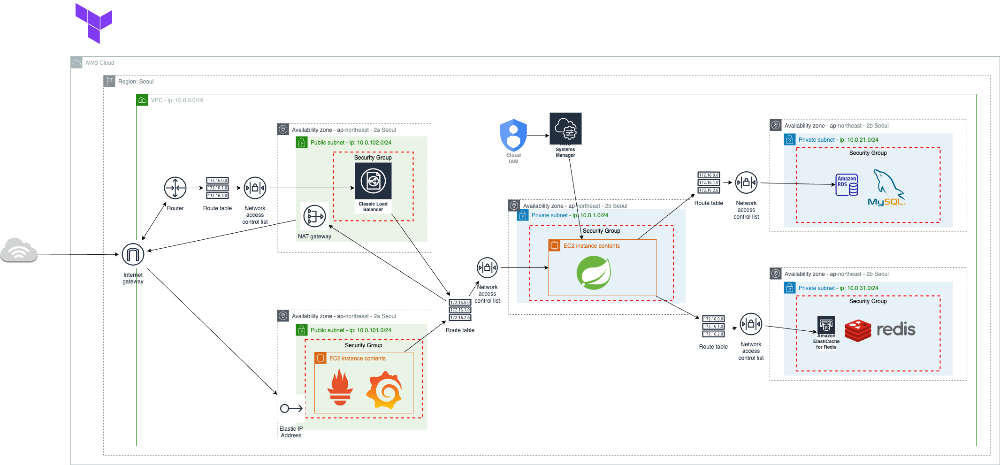


## b. ERD diagram
### b-1. 정규화 버전 ERD


### b-2. 반정규화 버전 ERD
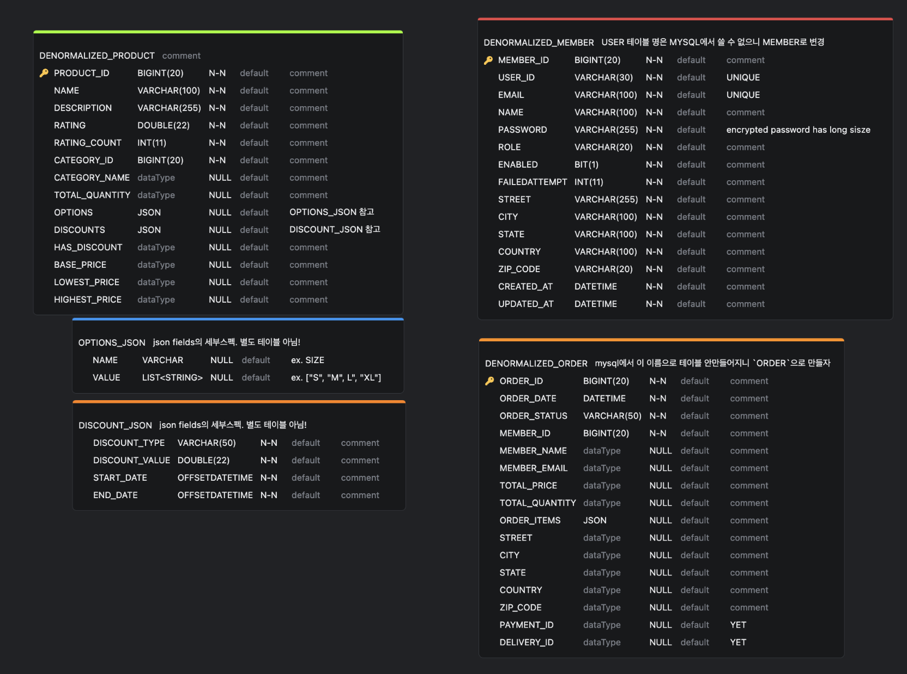

VSC plugin: ERD Editor를 다운받고, documentation/erd.vuerd.json 파일을 열 수 있다.


## c. wireframe

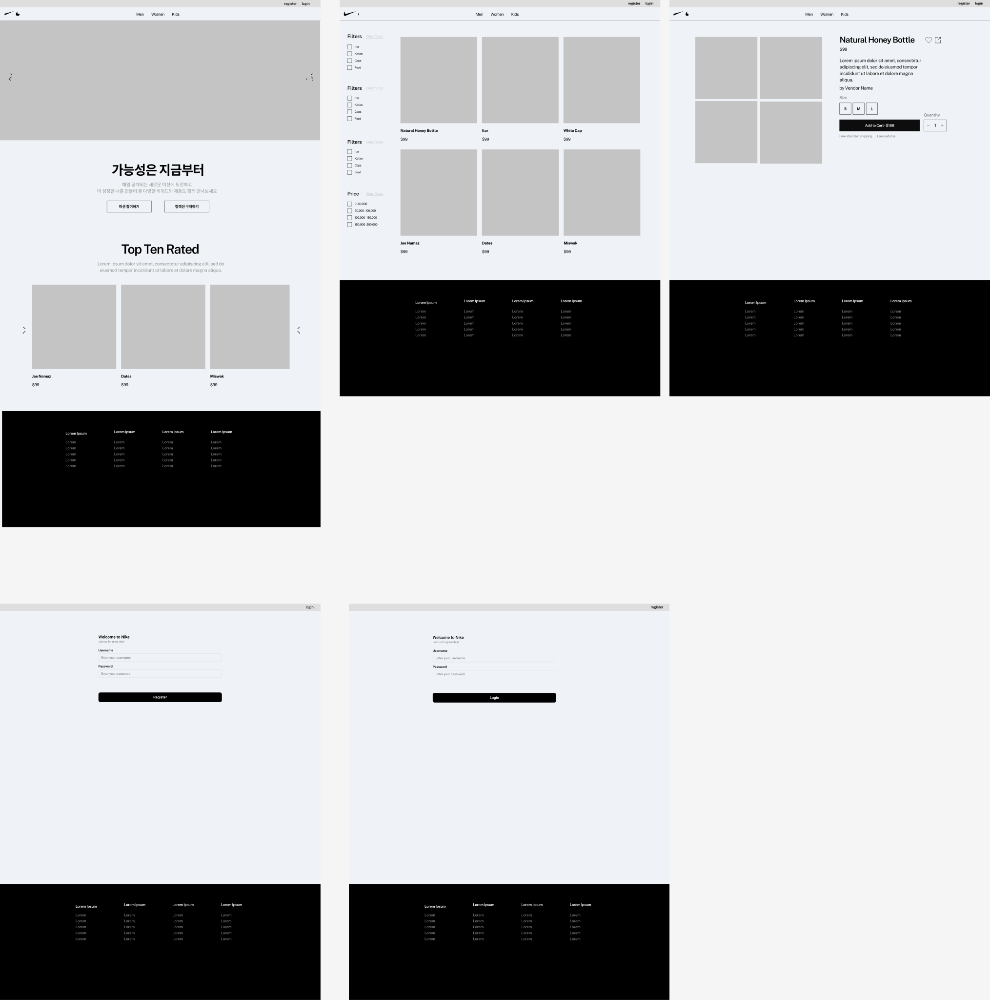

### c-1. wireframe -> home


### c-2. wireframe -> category


### c-3. wireframe -> product
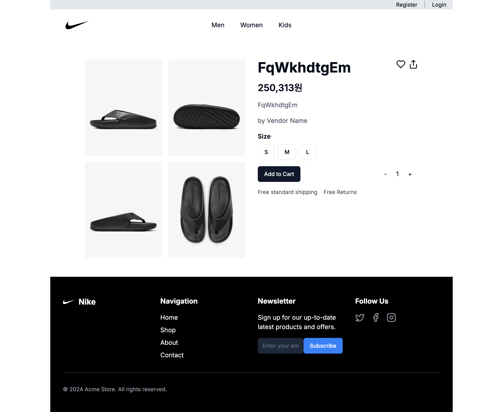


### c-4. wireframe -> register
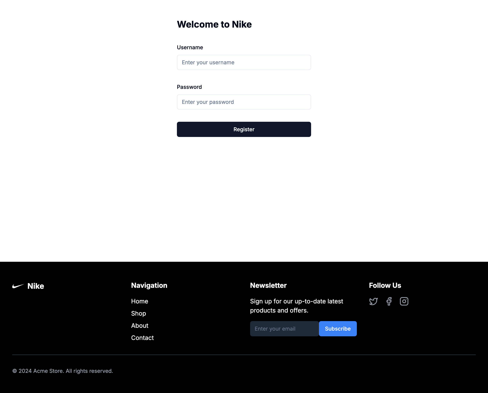


### c-5. wireframe -> login


# C. 기술적 도전 - Backend

## a. DB 부하를 낮추기 위한 cache 도입기

### 1. 문제

[부하 테스트](#e-부하-테스트)를 해보니, **DB에 i/o를 줄이는게** 성능 & 비용 측면에서 필요하다 느꼈다.

그렇다면, DB에 i/o를 줄이려면 어떻게 해야할까?

자주 i/o되는 정보 위주로,\
DB에 요청 보내기 전 앞단 미들웨어에 캐싱해두면,\
DB 부하를 줄이면서 latency가 더 줄지 않을까?


#### Q. 자주 i/o 되는 쿼리?

ecommerce 쿼리분포가 모든 상품에 **even**하게 나타나지 않는다.


유저들이 ecommerce에서 상품검색하면,\
보통 1,2,3등, 최대 10등까지 만 클릭하고 나머지 상품은 클릭 안한다.

그렇다면,\
**쿼리의 대부분을 차지하는 1,2,3등 상품정보만 캐싱하면 db부하를 줄일 수 있겠네?**


### 2. 어떤 상품이 클릭수가 높고 낮은지 어떻게 파악하지?

#### 방법1) 상품별 조회수 컬럼 추가

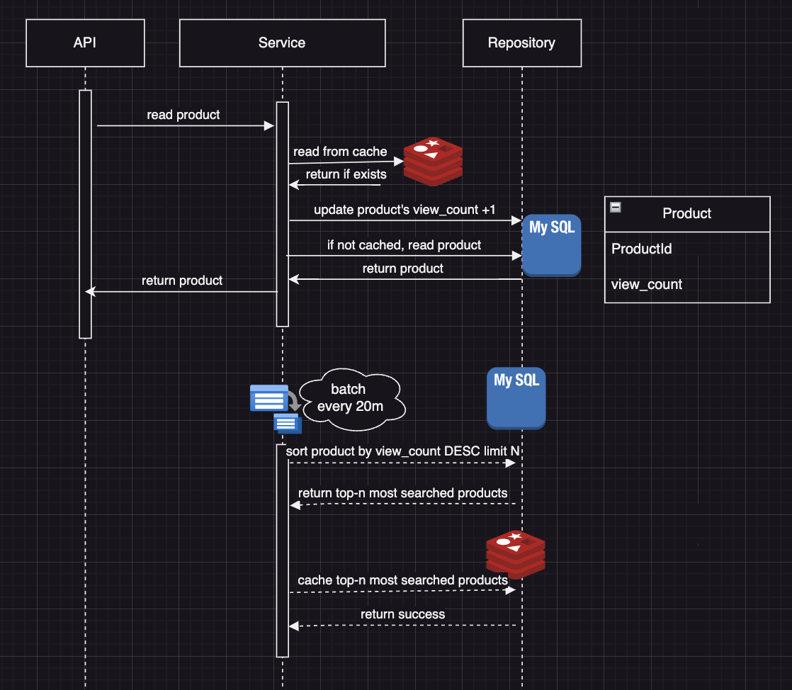

- 방법
	1. product 필드에 view_count 추가해서
	2. read 할 때마다 update(product.view_count+1) 한다.
	3. 그리고 10분 주기 batch로
		1. product order by view_count
		2. redis-cache update
		3. 모든 product들의 view_count set to 0
- 장점
	- 구현이 간단하다.
- 문제점
	1. DB에 view_count 컬럼에 계속 write하는게 DB에 부하를 많이 준다.
	2. `ORDER BY VIEW_COUNT`는 PRODUCT table size가 커질수록 cost가 커질 것으로 예상된다.
	3. 10분마다 product table을 full scan 하면서 view_count 를 0로 초기화 하는 배치 또한 DB에 부하를 많이 주고 lock contention으로 인한 latency 증가 우려가 있다.
- 결론
	- 구현은 간단하나, DB 부하 줄이겠다고 캐싱 도입한다는 본래 목적과 어긋나는 해결법이다.


#### 방법2) DB에서 처리

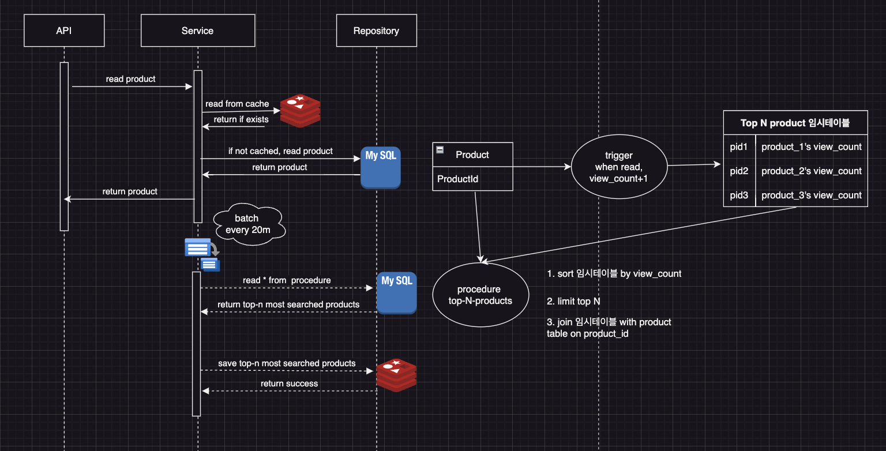

- 방법
	1. Disk i/o 없이 RAM에서 작동하는 임시 테이블을 만든다. `CREATE TEMPORARY TABLE temp_product_views { product_id INT, view_count INT}`
	2. 트리거를 건다: Product table에 특정 row가 읽힐 때 마다, 임시테이블의 해당 productId에 view_count+1
	3. 집계 프로시저를 만든다: 임시 테이블에서 product_id를 `GROUP BY`로 묶어서 `select product_id, SUM(view_count) ...`
	4. 프로시저의 결괏값을 batch로 n분마다 redis에 캐싱한다.
- 장점
	1. disk i/o가 아닌 RAM 기반이라 빠르다.
- 문제점
	1. 이 방법 역시 DB자원 아끼려고 캐시 미들웨어 도입하는 의미가 퇴색된다.
		- 그나마 방법1 대비 장점은, 임시 테이블이 Disk I/O를 하지 않고 RAM에서 작동하기 때문에, view_count 같이 빠른 빈도로 write하는 상황에 더 어울린다는 것이다.
		- 또한 product table에 직접 write하는게 아니라 다른 별개의 임시테이블에 write하기 때문에 기존에 product table에 write-lock을 걸지 않아, product table을 read/write하던 다른 쿼리에 lock contention으로 인한 latency delay를 주지 않는다.
	2. DB에서 비즈니스로직을 SQL로 처리하면, 파일로 남지않아 버전관리가 힘들어, 후임개발자가 시스템 파악에 곤란할 수 있다.


#### 방법3) message queue + 분석 전용 모듈 추가

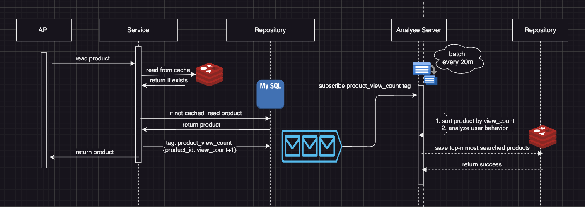

- 방법
	1. 상품조회가 일어날 때마다 비동기로 동작하는 메시지 브로커(e.g rabbitmq, kafka, etc)에 상품별 조회수를 남긴 후,
	2. 메시지큐에서 상품별 view_count를 구독하는 분석전용 서버에서 가져와
	3. view_count가 높은 상품 위주로 정렬해 redis에 저장하는 방식(다른 분석도 하는 겸)
- 장점
	1. 확장성 좋고 실시간 분석코드 추가 가능하다.
- 문제점
	1. 오버 엔지니어링이다.
- 결론
	- 단순히 핫한상품 캐시용이 아닌, 실시간 유저 행동 패턴 데이터를 a/b testing에 먹일 목적으로 전처리를 하거나, 헤비한 통계처리를 하거나 등의 특수목적용 서버가 있으면 고려해볼 순 있는 방법


#### 방법4) redis에 'sortedSet' 자료구조로 클릭률 집계하기

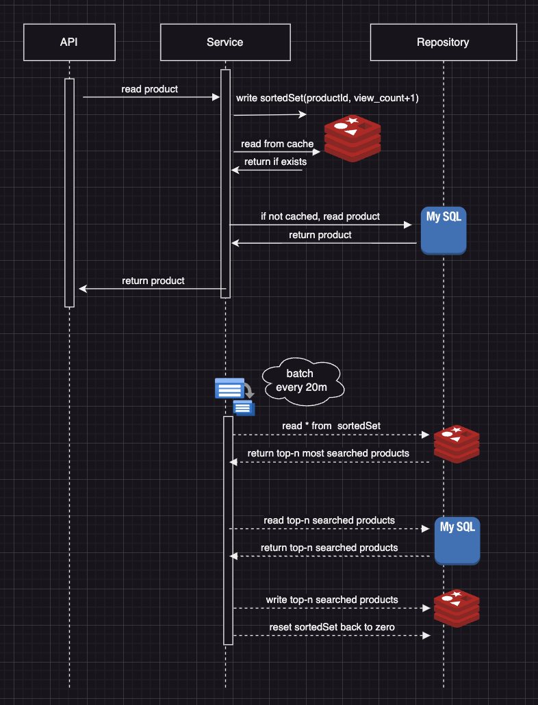

- what
	- redis 자료구조 중에 `sortedSet`를 사용하는 방식.
		- `{key:value}`인데 내부적으로 write할 때 정렬하는 듯 하며,
		- write의 time_complexity는 O(log N),
		- read의 time_complexity는 O(log N+M), where N = total element and M = number of returned element
- 방법
	1. read 할 때마다 `sortedSet`에 `{productId:view_count+1}` 추가한다.
	2. 10분에 1번씩 배치로 `sortedSet`의 상위 N개의 아이템을 DB에서 쿼리해와서 Redis에 저장한다.
- 장점
	1. 실시간 정확한 상품별 클릭률 랭킹을 집계할 수 있다.
- 문제점
	1. 이미 유저 세션관리와 상품 디테일 정보 캐싱, heavy query 캐싱으로 redis가 자원을 많이 쓰는 상황에서 자원 많이 잡아먹는 일을 추가하면 시스템이 감당될까?
		- ecommerce는 read:write 비율이 9:1인 read-heavy 앱이고, 상품 클릭률이 1초에 엄청 많은 수의 read 요청이 올텐데, 그걸 실시간으로 자료구조에서 view_count 계속 정렬하면서 다른 요청도 처리한다는건데, redis에 부하를 많이 주지 않을까?
		- 다시 생각해보니 만약에 실시간 랭킹 시스템을 만든다고 해도, 그대로 sortedSet을 사용하지는 않을 듯 하다.
		- 클릭률이 실시간으로 엄청나게 요청이 많이 올텐데, write연산이 O(1)도 아니고 O(log N)인 연산을 계속 끊기지 않고 하는건 시스템에 부하가 너무 클 듯 하다.
- 결론
	- 실시간 상품 랭킹이 필요하면 이 방법을 쓸 것 같긴 하지만, 실시간 랭킹이 아닌 대략 많이 클릭하는 상품들을 뭉텅이를 찾는 목적으로는 최적의 솔루션은 아닌 듯 하다.


#### 방법5) look aside + write through 전략

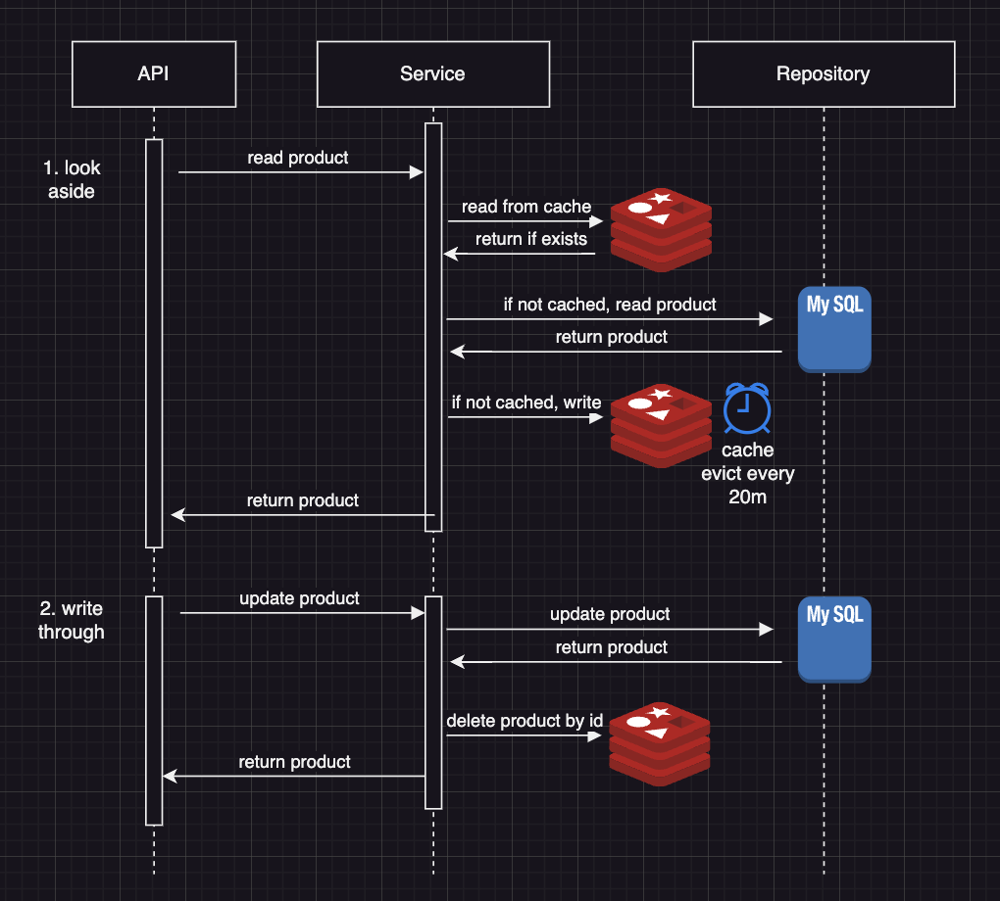

조회수 많은거 집계해서 넣지 말고,\
읽히는 상품만 캐싱하고 주기적으로 cache evict해주면,\
실시간 핫한 상품이 바뀌더라도 좀 더 유연하지 않을까?


- what
	1. 읽기 전략 (Look Aside):
	    - 데이터를 읽을 때 먼저 캐시를 확인합니다.
	    - 캐시에 데이터가 있으면(cache hit) 바로 반환합니다.
	    - 캐시에 데이터가 없으면(cache miss) DB에서 데이터를 가져와 반환하고, 동시에 캐시에 저장합니다.
	2. 쓰기 전략 (Write Around):
	    - 데이터를 쓸 때는 DB에만 직접 씁니다.
	    - 캐시는 업데이트하지 않습니다.
- 장점
	1. 트랜드가 빠르게 바뀌는 타입의 ecommerce면 조회수를 한번에 집계해서 캐싱하는 전략보다 이 전략이 유리하다.
		- Q. 만약 핫한 상품 뽑아서 캐싱했고, @CacheEvict를 3시간으로 설정했는데, 유튜브 때문에 이슈가 몰렸다던지의 이유로 특정 상품이 많이 조회되었는데 캐싱이 안된 상품이었다면?
		- A. 다음 캐싱될 3시간 동안 DB는 평소 이상으로 부하를 받아 고통받을 것이다.
- 문제점
	1. 만약 상품의 read 분포가 고르다면? -> cache miss가 많아진다.
		- Q. 여성의류쇼핑몰에서 유저 행동패턴이 안 살 상품들 이것저것 수십개씩 클릭한다? 100개 상품 중 40~50개 상품을 클릭한다면?
		- A. cache_miss율이 올라가고, 불필요하게 redis에 요청하는 스텝이 하나 더 추가 +  cache에 write하는 스탭이 추가되어 오히려 latency가 더 느려질 수 있다.
		- 또한 상품이 다양하고 양이 많을 수록, redis의 메모리 한계치까지 다 채워 out of memory의 위험도 있다.
- 해결책
	- read 분포가 퍼져서 redis 메모리가 빨리 채워진다면,  @CacheEvict 주기를 짧게 가저가서 자주 비워주면 된다.
- 결론
	- 트랜드가 자주 바뀔 수 있는 ecommerce에 적합한 캐싱 전략인 듯 하다.
	- 쿠팡같이 카테고리별 제품 1,2위 찍으면 잘 안바뀌는 특성을 가진 ecommerce는 이 전략에 @CacheEvict 주기를 매우 길게해서 사용해도 될 것 같다.


### 3. redis 고려사항

#### Q. cache evict 주기를 어떻게 설정해야 할까?

A. 정답은 없다. 서비스 앱의 특성마다 다르고, 유저의 행동패턴에 따라 달라진다.

1. redis 모니터링하면서
2. 전체 상품의 몇%가 캐싱되었을 때, 해당 상품들이 레디스의 메모리를 몇% 차지하고,
3. 다른 메모리 점유하는 데이터들과 함께, 얼마나 여유분의 메모리가 남았는지 체크하며 cache-evict 주기를 조절한다.


#### Q. 메모리 점유율 외에, 모니터링하면서 중점적으로 봐야할 부분은?
**cache-hit율**을 봐야한다.

유저의 상품 쿼리분포가 집약적이지 않고 고루 퍼져있어서 cache-miss가 자주 일어나고 있다면,\
redis에 캐싱을 안하는게 더 빠를 수 있다.


#### Q. 서버 터지면 캐싱한 데이터는 어떻게 복구하지?

- case1) 서버 자체가 터져버리는 경우 -> 로그 손실. 답이 없다.
- case2) 서버는 살아있는데 레디스가 터진 후 재시작 되는 경우
	- redis-client인 lettuce를 쓰면, 레디스 서버 시작시, 스냅샷으로 저장된걸 로드해준다고 한다.


#### Q. 데이터 복구 방법은 뭐가 있고 뭘 쓰지?

레디스에는 데이터 백업뜨는 방법이 2가지 있다.

1. 특정 조건 만족하면 snapshot 찍어서 dump.rdb파일로 보관하는 방법(default)
2. 데이터에 read 말고 write 할 때마다 appendonly.aof 파일로 저장해 보관하는 방법


1번이 부하가 몰릴 때 성능 측면에서 유리해 보이니, 1번을 선택한다.


#### Q. 스냅샷 뜨는 세팅 어떻게 설정하지?
`redis.conf`를 보면 주석을 매우 친절하게 달아줬는데,

```
# Unless specified otherwise, by default Redis will save the DB:
#   * After 3600 seconds (an hour) if at least 1 change was performed
#   * After 300 seconds (5 minutes) if at least 100 changes were performed
#   * After 60 seconds if at least 10000 changes were performed
#
# You can set these explicitly by uncommenting the following line.
#
# save 3600 1 300 100 60 10000
```

1. 매 1분마다 AOF에 저장한다. (데이터가 10000번 바뀐경우)
2. 매 5분마다 AOF에 저장한다. (데이터가 100번 바뀐경우)
3. 매 1시간마다 AOF에 저장한다. (데이터가 1번 바뀐경우)


default 세팅이고, 이대로 사용한다.


### 4. 결과 - 코드 적용
#### 1. look aside

https://github.com/Doohwancho/ecommerce/blob/3a07a123eb971db1ba7952fedc0ae39cb3cd0f09/back/1.ecommerce/src/main/java/com/cho/ecommerce/domain/product/service/ProductService.java#L64-L91

#### 2. write through

https://github.com/Doohwancho/ecommerce/blob/3a07a123eb971db1ba7952fedc0ae39cb3cd0f09/back/1.ecommerce/src/main/java/com/cho/ecommerce/domain/product/service/ProductService.java#L155-L174


## b. 상품 랭킹 기능 구현기

### 1. 문제
쇼핑몰에 가면 실시간 가장 핫한 아이템 top 10을 어렵지 않게 볼 수 있다.\
이 기능을 구현하고자 하는데,\
바로 앞전에 [redis' sortedSet으로 클릭률 집계](#방법4-redis에-sortedset-자료구조로-클릭률-집계하기)로 구현하는게 일반적인 듯하다.\
(구글 검색시 대부분 이방식으로 만듬)

문제는 DB가 비싸서 cache layer을 쓰는데,\
**cache layer 역시 비싸다**는 것이다.\
같은 기능을 리소스 효율적이게 만들 순 없을까?


### 2. 랭킹 집계에 적절한 자료구조 선정
#### step1) Redis sortedSet


| Benchmark                   | (threadCount) | Mode  | Cnt | Score      | Error | Units  |
|-----------------------------|---------------|-------|-----|------------|-------|--------|
| 01.redis_read               | 2             | thrpt | 2   | 81.402     |       | ops/ms |
| 01.redis_write              | 2             | thrpt | 2   | 83.705     |       | ops/ms |


1. 방법
	- redis의 `sortedSet` 자료구조에 `{product:view_count}`넣으면 랭킹 집계 해준다.
	- time complexity
		- write: O(log N)
		- read: O(log N+M), where N = total element and M = number of returned element
2. 장점
	1. 정확한 조회수를 집계 가능하다.
	2. 분산시스템에서 single source of truth라 ec2간 조회수 read()하면, 결과값 차이가 거의 없다.
	3. 구현이 간단하다. 이미 redis 측에서 만든 자료구조를 가져다 쓰는 것이기 때문.
3. 문제점
	1. 상품 클릭할 때마다 view_count+1되서 write 부하가 엄청나게 클 텐데, `sortedSet`의 write-time-complexity가 O(1)도 아니고 O(log N)이다. 서비스가 커지고 상품 수(N)이 커질수록, 효율이 떨어진다.
	2. redis는 비싸고 실전에서는 이미 다양하게 활용되고 있을텐데(세션관리, heavy query caching, rate-limiting, etc) 여기에 heavy_computation 작업 하나 추가하는게 맞나? 싶다.
	3. 분리된 redis(aws_elastic_cache) 서버와 통신비용이 있다.
	4. 벤치마크를 로컬pc에 설치된 redis로 돌렸기 때문에 통신비용이 고려 안되었음 + redis 서버 성능은 실전에서 사용하는 2core 6GiB RAM elastic_cache 대비, 로컬 pc가 8코어 16GiB RAM으로 월등히 우수한걸 고려하면, 실 성능이 이 보다 훨씬 더 낮다.
4. 결론
	- 벤치마크 결과가 다른 방식 대비 낮다. 다른 효율적인 방법을 찾아보자.
5. 코드

https://github.com/Doohwancho/ecommerce/blob/f35f25351bded04df94c3297a769cefa3f1e27ec/back/1.ecommerce/src/jmh/java/com/cho/ecommerce/domain/product/view_count/_01_redis/service/ProductRankingService.java#L11-L40


#### step2) Max_Heap with concurrency control

| Benchmark                   | (threadCount) | Mode  | Cnt | Score      | Error | Units  |
|-----------------------------|---------------|-------|-----|------------|-------|--------|
| 01.redis_read               | 2             | thrpt | 2   | 81.402     |       | ops/ms |
| 01.redis_write              | 2             | thrpt | 2   | 83.705     |       | ops/ms |
| 02.max_heap_read            | 2             | thrpt | 2   | 778.630    |       | ops/ms |
| 02.max_heap_write           | 2             | thrpt | 2   | 50.298     |       | ops/ms |

1. 방법
	- redis에서 view_count 집계를 하지 말고, 스프링 로컬서버에서 view_count & ranking 집계 하는 방식, max_heap 자료구조를 써서.
	- Q. 로컬에서 랭킹 집계해도 되나? 정확도가 떨어지지 않을까?
		- A. 원하는 값이 완전 정확하게 집계된 값이 아니라, 대략적으로 현재 트랜디 한 상품값이 필요한거라 이 방식이 가능한 것이다.
		- 분산환경에서 WAS서버가 5대라고 할 때, 상품클릭률 분포는 조회수 조작하는 스팸유저만 없다면(이상현상 감지 후, 벤처리) WAS서버당 고르게 분포할 것이다.
		- 만약 WAS-1에서 2등인 상품이 WAS-3에서 3 or 4등이다? 그정도의 오차는 top 10-in 했으니 괜찮다고 보는 것. 서버 자원관리를 위해.
	- 상품별 view_count 필드에 `volatile` 키워드를 걸어서, write() 후 값이 multi-threads들에게 바로 보이도록 적용.
		- multi-core 환경에서 원래는 thread들이 공유자원 접근시, cpu 내부 cache에 저장해서 쓰는데, 이러면 RAM에 값이 update되었을 때 cpu 내부 캐시 값을 읽으면 값이 틀리니까, 공유자원 값을 cpu 내부 cache에 저장하지 말고 RAM에서 가져와 쓰자는게 `volatile` 이다.
	- view_count를 read/write 시, ReentrantLock사용
		- read lock은 read하는 쓰레드끼리는 통과 가능하다
		- write lock은 베타 락이다.
	- view_count별 랭킹 정렬은 `priority_queue` 자료구조로 한다.
		- time complexity
			- write: O(log N) (ex. add(), offer())
			- read: O(log N) (ex. poll(), remove())
2. 장점
	1. 벤치마크 결과, read가 `redis_sortedSet`의 read 대비 쓰루풋이 9.6배 더 좋다.
		- `sortedSet`'s read_time_complexity: O(log N+M)
		- `priority_queue`'s read_time_complexity: O(log N)
	2. redis보다 상대적으로 비용이 저렴한 WAS서버에 로컬 램을 활용하기 때문에 경제적이다.
3. 문제점
	1. write 성능이 redis보다 안좋다. 베타 락이 `redis_sortedSet`이 내부적으로 사용하는 write_lock 방식보다 더 비용이 큰 것으로 예상된다.
	2. 왜냐면 incrementView()시, 상품별 view_count 저장과 heap에 랭킹저장 2번 하는데, 랭킹저장시 `priority_queue`에 기존 product를 지우고, 새로운 view_count가 들어있는 product를 추가하기 때문.
4. 결론
	- redis에 부담을 WAS로 덜어주면서, read 성능이 개선되었다.
	- read가 개선됬긴 했는데, 더 괜찮은 방법이 없을까?
5. 코드

https://github.com/Doohwancho/ecommerce/blob/f35f25351bded04df94c3297a769cefa3f1e27ec/back/1.ecommerce/src/jmh/java/com/cho/ecommerce/domain/product/view_count/_02_max_heap/ProductViewCountMaxHeap.java#L11-L173


#### step3) ConcurrentSkipListMap


| Benchmark                   | (threadCount) | Mode  | Cnt | Score      | Error | Units  |
|-----------------------------|---------------|-------|-----|------------|-------|--------|
| 01.redis_read               | 2             | thrpt | 2   | 81.402     |       | ops/ms |
| 01.redis_write              | 2             | thrpt | 2   | 83.705     |       | ops/ms |
| 02.max_heap_read            | 2             | thrpt | 2   | 778.630    |       | ops/ms |
| 02.max_heap_write           | 2             | thrpt | 2   | 50.298     |       | ops/ms |
| 03.concurrentSkipList_read  | 2             | thrpt | 2   | 49278.453  |       | ops/ms |
| 03.concurrentSkipList_write | 2             | thrpt | 2   | 35.381     |       | ops/ms |


1. 방법
	- `TreeMap`(sorted HashMap)인데, concurrency control이 달려있는게 `ConcurrentSkipListMap`이다.
		- time complexity
			- write: O(log N)
			- read: O(log N)
		- lock
			- 베타락 안쓰는 대신 CAS(compare and swap) 방식을 쓴다.
			- write 직후 정합성이 떨어진다고 한다.
			- 그런데 정밀한 view_count를 원하는게 아니기에, 성능이 더 좋은게 더 낫다.
2. 장점
	1. read()가 redis_read() 대비 644배, max_heap_read() 대비 66.9배 빨라졌다.
		- write()할 때 sort()까지 하는거라 read()가 엄청 빠르다.
	2. redis가 아닌 로컬 RAM 이용하는거라 자원을 더 경제적으로 쓰는 방법이다.
3. 코드
https://github.com/Doohwancho/ecommerce/blob/f35f25351bded04df94c3297a769cefa3f1e27ec/back/1.ecommerce/src/jmh/java/com/cho/ecommerce/domain/product/view_count/_03_concurrentSkipList/ProductViewCounter.java#L29-L123


##### Q. 왜 read()가 빨라졌지?

1. max_heap read: O(log N)
2. concurrentSkipListMap의 read: O(log N)
...똑같은데 왜 성능차이 나는거지?


###### A. `max_heap`에 read()가 애초에 비효율적이게 짜져있다.
```java
public List<MockProduct> getTopNProducts(int n) {
	if (n <= 0) {
		return Collections.emptyList();
	}

	heapLock.readLock().lock();
	try {
		List<MockProduct> result = new ArrayList<>();
		// Create a temporary heap for reading to avoid blocking writes
		PriorityQueue<MockProduct> tempHeap = new PriorityQueue<>(maxHeap);

		for (int i = 0; i < n && !tempHeap.isEmpty(); i++) {
			result.add(tempHeap.poll());
		}

		return result;
	} finally {
		heapLock.readLock().unlock();
	}
}
```

이게 `max_heap`의 read() 인데, 매번 read()할 때마다 `priority_queue`에 heap 통째로 넣어서 정렬한다.

Q. 근데 `max_heap` 쓰는 이유가, write()시 정렬하기 때문에 read()가 빠르다는 이점 때문에 쓰는건데, read() 할 때마다 `priority_queue` 새로 만들어서 sort()할꺼면, `max_heap` 쓰는 이유가 퇴색되는거 아닌가?

A. 맞다. 역시 늘상 느끼지만 ai가 짠 코드를 무지성으로 복붙하면 이런 폐혜가 생긴다.

여튼 `max_heap`의 올바른 read()방식은 이렇다.

write()할 때마다 정렬하면서 저장하고,

read()할 땐 root node로 부터 BST(breadth first search)로 top-N-node 까지 돌면서 읽으면 된다.

아마 `max_heap`을 원래 의도한 방식으로 짜면 `sorted treemap`과 read() 성능이 비슷하게 나올 것이라 예상된다.


##### Q. 왜 write가 느리지?

| Benchmark                   | (threadCount) | Mode  | Cnt | Score      | Error | Units  |
|-----------------------------|---------------|-------|-----|------------|-------|--------|
| 02.max_heap_write           | 2             | thrpt | 2   | 50.298     |       | ops/ms |
| 03.concurrentSkipList_write | 2             | thrpt | 2   | 35.381     |       | ops/ms |


`max_heap`은 view_count 1번, priority_queue에 1번 2번 write하는데,\
`sorted_hashmap`은 1번 write하는데 왜 느릴까?

```java
public void incrementView(String productId, long delta) {
	while (true) { // CAS loop for atomic update
		Map.Entry<ViewCount, LongAdder> existingEntry = null;

		// Find existing entry for this productId
		for (Map.Entry<ViewCount, LongAdder> entry : viewCounts.entrySet()) {
			if (entry.getKey().productId.equals(productId)) {
				existingEntry = entry;
				break;
			}
		}

		if (existingEntry == null) {
			// New product - try to insert
			ViewCount newCount = new ViewCount(productId, delta, System.nanoTime());
			LongAdder counter = new LongAdder();
			counter.add(delta);

			if (viewCounts.putIfAbsent(newCount, counter) == null) {
				// Successfully inserted
				break;
			}
			// If insert failed, retry
			continue;
		}

		// Existing product - update count
		ViewCount oldCount = existingEntry.getKey();
		LongAdder counter = existingEntry.getValue();
		counter.add(delta);

		// Remove old entry and insert new one with updated count
		ViewCount newCount = new ViewCount(productId, oldCount.count + delta,
			oldCount.timestamp);
		if (viewCounts.remove(oldCount) != null &&
			viewCounts.putIfAbsent(newCount, counter) == null) {
			// Successfully updated
			break;
		}
		// If update failed, retry
	}
}
```

값이 바뀔 때 까지 쓰레드가 `while(true)` + retry 로 `WAITING` 상태다.\
jmh 벤치마크 테스트할 때 코어수 2개에 맞게 쓰레드 2개 할당해줬는데 (실전엔 2코어 4기가 램 ec2 스케일 아웃한다고 가정)\
쓰레드1이 write 끝날 때 까지 쓰레드2가 기다린다.

CAS(compare and swap)방식이 low-contention 상황에서는 beta lock보다 성능이 더 좋다곤 하는데,

문제는 view_count + 1은 high-contention 상황이다!

그래서 write() 성능이 별로다.


#### step4) ConcurrentHashMap for write + read from cached sorted_map

| Benchmark                   | (threadCount) | Mode  | Cnt | Score      | Error | Units  |
|-----------------------------|---------------|-------|-----|------------|-------|--------|
| 01.redis_read               | 2             | thrpt | 2   | 81.402     |       | ops/ms |
| 01.redis_write              | 2             | thrpt | 2   | 83.705     |       | ops/ms |
| 02.max_heap_read            | 2             | thrpt | 2   | 778.630    |       | ops/ms |
| 02.max_heap_write           | 2             | thrpt | 2   | 50.298     |       | ops/ms |
| 03.concurrentSkipList_read  | 2             | thrpt | 2   | 49278.453  |       | ops/ms |
| 03.concurrentSkipList_write | 2             | thrpt | 2   | 35.381     |       | ops/ms |
| 04.hashMap_cache_read       | 2             | thrpt | 2   | 15962.344  |       | ops/ms |
| 04.hashMap_cache_write      | 2             | thrpt | 2   | 15855.741  |       | ops/ms |

1. 방법
	- 3번까지 아이디어는 자료구조에 write할 때 sort by view_count 하고, read할 때 이미 정렬된걸 읽자! 였다면,
	- 4번 방식은 write할 땐 젤 빠른 방식인 `hashmap`에 O(1)으로 insert하고, 10분마다 sort by view_count를 데몬쓰레드로 돌려서 캐싱해두면, 캐싱해 둔 값을 read 하는 방식이다.
2. 장점
	1. write가 매우매우 빨라졌다. redis방식 대비 무려 191배, `max_heap` 대비 317배, `sorted_hashmap` 대비 429배 쓰루풋이 더 많다. 왜? O(1)이니까.
	2. read도 매우매우 빨라졌다. 왜? 캐싱해둔거 로컬에서 그대로 꺼내쓰니까. redis 방식보다 무려 205배 빠르다.
3. 문제점
	1. 기존 1~3 방식은 실시간으로 랭킹을 볼 수 있다면, 4번 방식은 10분마다 캐싱한 랭킹을 보는 방식이라 성능을 얻었지만 정확도가 떨어졌다.
4. 결론
	1. 랭킹 정확도가 약간 떨어졌지만, read/write 효율이 압도적으로 좋아졌다.
	2. 아마 레디스로 랭킹 관리 안하고 로컬에서 관리하면 대부분 이 방식으로 구현하지 않을까? 싶다.
5. 코드

https://github.com/Doohwancho/ecommerce/blob/f35f25351bded04df94c3297a769cefa3f1e27ec/back/1.ecommerce/src/jmh/java/com/cho/ecommerce/domain/product/view_count/_04_concurrentHashMap_with_cache/CachedViewCounter.java#L30-L113


#### step5) Array for write + read from cache


| Benchmark                   | (threadCount) | Mode  | Cnt | Score      | Error | Units  |
|-----------------------------|---------------|-------|-----|------------|-------|--------|
| 01.redis_read               | 2             | thrpt | 2   | 81.402     |       | ops/ms |
| 01.redis_write              | 2             | thrpt | 2   | 83.705     |       | ops/ms |
| 02.max_heap_read            | 2             | thrpt | 2   | 778.630    |       | ops/ms |
| 02.max_heap_write           | 2             | thrpt | 2   | 50.298     |       | ops/ms |
| 03.concurrentSkipList_read  | 2             | thrpt | 2   | 49278.453  |       | ops/ms |
| 03.concurrentSkipList_write | 2             | thrpt | 2   | 35.381     |       | ops/ms |
| 04.hashMap_cache_read       | 2             | thrpt | 2   | 15962.344  |       | ops/ms |
| 04.hashMap_cache_write      | 2             | thrpt | 2   | 15855.741  |       | ops/ms |
| 05.array_read               | 2             | thrpt | 2   | 48065.797  |       | ops/ms |
| 05.array_write              | 2             | thrpt | 2   | 18921.207  |       | ops/ms |

1. 방법
	- hashmap -> array로 바꾼 방법
	- write도 O(1), read도 O(1) (from cache)
	- 10분마다 sort할 땐 hashMap은 .stream() (map reduce internally)로 한다면, array는 quicksort(n < 10000) or merge sort(n >= 10000)를 쓴다.
2. 장점
	- step4)hashmap과 벤치마크 성능을 비교해보면 read 성능이 2.17배 쓰루풋이 더 좋다. write는 1.2배 더 좋다.
3. 문제점
	1. 10분에 한번씩 객체 수만개, 수십만개를 sort()할텐데, cpu_usage spike 치면 어쩌지?
	2. 객체 수십만개 sort()하기 직전에, 기존 객체 수만, 수십만개를 메모리 해제할텐데, 이정도 규모면 full-gc 10분마다 n번씩 자주 일어나지 않을까?
4. 결론
	- redis방식 대비 read는 445배, write는 227배 나아지긴 했는데, 좀 더 최적화 시켜보자
5. 코드

https://github.com/Doohwancho/ecommerce/blob/f35f25351bded04df94c3297a769cefa3f1e27ec/back/1.ecommerce/src/jmh/java/com/cho/ecommerce/domain/product/view_count/_05_array_with_cache/ArrayViewCounter.java#L32-L139


##### Q. 왜 array가 map 대비 더 빠르지?

1. memory(cache) locality 때문.
	- `AtomicLongArray`는 메모리상에서 값을 붙여서 저장하기 때문에, for문같은거로 read할 때 컴파일러가 안읽어도 array size만큼 chunk 띄어와서 cache에 저장하고 쓰는데,
	- `hashmap`은 메모리 포인터가 다른 장소를 가르키는데, 캐싱하는 시점 컴파일러 입장에서는 포인터가 가르키는 장소에 다음 원소들이 어디있는지를 모르니까 다 읽어서 값을 가져와야 해서 느리다.
2. `array`는 `hashmap` 대비, hash 계산을 안해도 된다.
	- `hashmap`은 인덱스 정하려면 hash() 돌려야 하는데, `array`는 이 스텝을 스킵하고 바로 read/write 할 수 있다.
	- 어떤 값은 다른데 hash() 돌리면 우연히 인덱스가 같은 값이 나온다. 이 때, hash-collision handling도 해줘야 해서 `array`보다 성능이 느리다.
3. `ConcurrentHashMap`의 concurrency control이 `AtomicLongArray`의 방식보다 내부적으로 더 복잡하다고 한다.


Q. array, hashmap 둘 다 read()의 time_complexity: O(1)인데, 실상은?

```java
// Array access - truly O(1)
viewCounts.get(productId)  // Direct memory access

// ConcurrentHashMap access - technically O(1) but with more steps
viewCounts.get(productId)  // 1. Hash computation
                           // 2. Segment location
                           // 3. Bucket traversal if collision
                           // 4. Value retrieval
```

#### step6) primitive Array for write + read from cache


| Benchmark                   | (threadCount) | Mode  | Cnt | Score      | Error | Units  |
|-----------------------------|---------------|-------|-----|------------|-------|--------|
| 01.redis_read               | 2             | thrpt | 2   | 81.402     |       | ops/ms |
| 01.redis_write              | 2             | thrpt | 2   | 83.705     |       | ops/ms |
| 02.max_heap_read            | 2             | thrpt | 2   | 778.630    |       | ops/ms |
| 02.max_heap_write           | 2             | thrpt | 2   | 50.298     |       | ops/ms |
| 03.concurrentSkipList_read  | 2             | thrpt | 2   | 49278.453  |       | ops/ms |
| 03.concurrentSkipList_write | 2             | thrpt | 2   | 35.381     |       | ops/ms |
| 04.hashMap_cache_read       | 2             | thrpt | 2   | 15962.344  |       | ops/ms |
| 04.hashMap_cache_write      | 2             | thrpt | 2   | 15855.741  |       | ops/ms |
| 05.array_read               | 2             | thrpt | 2   | 48065.797  |       | ops/ms |
| 05.array_write              | 2             | thrpt | 2   | 18921.207  |       | ops/ms |
| 06.array_optimized_read     | 2             | thrpt | 2   | 269472.295 |       | ops/ms |
| 06.array_optimized_write    | 2             | thrpt | 2   | 19227.155  |       | ops/ms |


1. 방법
	- step5) array 방식에서 객체생성을 빼고, array의 index를 product_id 삼아 쓰는 방식
	- write()시 lock을 쓰진 않고 CAS방식을 쓴다.
2. 장점
	1. 객체 생성하는 단계가 스킵되서 훨씬 빠르다. 객체 생성 하고 안하고 차이가 read는 쓰루풋 5.6배 빠르고, write는 1.6% 더 빠르다.
	2. 상품별 view_count 객체 수만, 수십만개 안만들어도 되서 메모리를 아낄 수 있다.
	3. 수만, 수십만개 객체가 young generation 꽉 채우고 old generation까지 넘어가서 full-gc할 때 드는 비용도 줄일 수 있다.
3. 문제점
	1. 프레임워크/언어에서 제공하는 자료구조를 쓰면, 다양한 상황에서도 모두 오류없이 동작해야 하기 때문에, safety-check가 깐깐하게 되있어서 조금 느려진다는 단점이 있지만, 에러날 확률이 낮아진다는 극장점이 있는데, 이렇게 자체적으로 자료구조를 만들면 예상치 못한 에러가 터질 수 있기 때문에, 단순히 성능 이외에 validation-check라던지 등과 꼼꼼한 테스트 등을 고려해야 한다.
4. 결론
	1. 성능은 압도적으로 좋긴 하나, 만약 실전이라면 음... 성능이 매우 고픈 상황이 아니라면 도입하기 망설여지긴 한다.
	2. 만약 도입한다고 해도, safety-check 관련 코드를 꼼꼼히 붙이고, [fuzzy test & PBT](#d-돈관련-코드-테스트-정밀도-높힌-방법)도 붙일 듯 하다.
5. 코드

https://github.com/Doohwancho/ecommerce/blob/f35f25351bded04df94c3297a769cefa3f1e27ec/back/1.ecommerce/src/jmh/java/com/cho/ecommerce/domain/product/view_count/_06_primitive_array_with_cache/PrimitiveArrayViewCounter.java#L28-L123


### 3. 적절한 정렬 알고리즘 선정

Q. array에서 10분마다 상품별 랭킹을 sort해서 캐싱하는데, 어떤 방식으로 정렬해야 효율적일까?


#### 3-1. when N < 50, insertion sort
insertion sort의 Big O는 다음과 같다.
- Time: O(n²)
- Space: O(1)

별도의 변수, 객체 선언 없이, 기존에 있던 메모리에서 swap()하며 옮기는 방식이라 메모리를 아낄 수 있다는 장점이 있다.

시간복잡도는 O(N^2)이지만, 어짜피 N=50, 매우 작은 수라 괜찮다.

[이 사이트](https://visualgo.net/en/sorting)에서 insertion sort가 어떻게 진행되는지 시각화해서 볼 수 있다.


##### a. insertion sort, N=50 benchmark

| Benchmark | maxProductId | nonZeroElements | threadCount | Mode | Cnt | Score | Error | Units |
|-----------|-------------|-----------------|-------------|------|-----|-------|-------|--------|
| simple_insertion_sort | 100000 | 50 | 2 | sample | 90599 | 0.452 | ± 0.355 | ms/op |
| simple_insertion_sort (p0.00) | 100000 | 50 | 2 | sample | | 0.216 | | ms/op |
| simple_insertion_sort (p0.50) | 100000 | 50 | 2 | sample | | 0.219 | | ms/op |
| simple_insertion_sort (p0.90) | 100000 | 50 | 2 | sample | | 0.225 | | ms/op |
| simple_insertion_sort (p0.95) | 100000 | 50 | 2 | sample | | 0.231 | | ms/op |
| simple_insertion_sort (p0.99) | 100000 | 50 | 2 | sample | | 0.244 | | ms/op |
| simple_insertion_sort (p0.999) | 100000 | 50 | 2 | sample | | 0.309 | | ms/op |
| simple_insertion_sort (p0.9999) | 100000 | 50 | 2 | sample | | 1.965 | | ms/op |
| simple_insertion_sort (p1.00) | 100000 | 50 | 2 | sample | | 5989.466 | | ms/op |

N=50일 때 insertion sort를 벤치마크 돌린 결과값이다.

N사이즈가 작으면
1. 성능이 준수하고,
2. worse / avg / best case scenario에서 even한 퍼포먼스를 보여주며,
3. 메모리도 들지 않기 때문에

... 적절한 선택지라 볼 수 있다.

##### b. insertion sort, N=100,000 benchmark

| Benchmark | maxProductId | nonZeroElements | threadCount | Mode | Cnt | Score | Error | Units |
|-----------|-------------|-----------------|-------------|------|-----|-------|-------|--------|
| simple_insertion_sort | 100000 | 100000 | 2 | sample | 4937 | 10.320 | ± 11.823 | ms/op |
| simple_insertion_sort (p0.00) | 100000 | 100000 | 2 | sample | | 4.022 | | ms/op |
| simple_insertion_sort (p0.50) | 100000 | 100000 | 2 | sample | | 4.039 | | ms/op |
| simple_insertion_sort (p0.90) | 100000 | 100000 | 2 | sample | | 4.080 | | ms/op |
| simple_insertion_sort (p0.95) | 100000 | 100000 | 2 | sample | | 4.100 | | ms/op |
| simple_insertion_sort (p0.99) | 100000 | 100000 | 2 | sample | | 4.224 | | ms/op |
| simple_insertion_sort (p0.999) | 100000 | 100000 | 2 | sample | | 1248.086 | | ms/op |
| simple_insertion_sort (p0.9999) | 100000 | 100000 | 2 | sample | | 15837.692 | | ms/op |
| simple_insertion_sort (p1.00) | 100000 | 100000 | 2 | sample | | 15837.692 | | ms/op |


N=100,000으로 커지면, 99%까지는 고른 성능을 보여주다가,\
99.9%부터 latency가 4ms -> 1248ms 로 느려지더니,\
99.99%에는 4ms -> 15837ms 로 매우매우 느려지는걸 볼 수 있다.

따라서 N이 커졌을 때, 안정적이게 좋은 성능을 내는 다른 정렬 알고리즘을 찾아야 한다.

#### 3-2. when 50 < N < 10,000, quick sort
- Big O
	- Time: O(n log n) average
	- Space: O(log n)
- 정렬 방법
	1. pivot number를 정해서,
	2. 이 숫자보다 작은 애들을 왼쪽에, swap으로 넘기는걸 반복하면서 반씩 쪼개다가 (log N번 쪼갠다)
	3. 정렬되면 합치는걸 하는 앤데,

[이 사이트](https://visualgo.net/en/sorting)에서 quick sort가 어떻게 진행되는지 시각화해서 볼 수 있다.

반씩 쪼갤 때 별도 메모리 공간 필요해서 space complexity가 O(1)보다 크고,\
기본적으로 전체 row N 만큼 훑는걸 log N번 쪼갠 만큼 반복하니까\
time complexity가 O(N log N)이라고 대~략적으로 이해하곤 있는데\
Big O 엄밀하게 계산하는법이 따로 있다. 관심있으면 찾아보자.


##### a. quick sort, N=10,000 성능비교 w/ insertion sort

| Benchmark | maxProductId | nonZeroElements | threadCount | Mode | Cnt | Score | Error | Units |
|-----------|-------------|-----------------|-------------|------|-----|-------|-------|--------|
| optimized_multi_strategy_sort | 100000 | 10000 | 2 | thrpt | 2 | 4.357 | | ops/ms |
| simple_insertion_sort | 100000 | 10000 | 2 | thrpt | 2 | 1.928 | | ops/ms |

1. quicksort의 쓰루풋은 4.3 ops/ms
2. insertion sort의 쓰루풋은 1.9 ops/ms

2.2배 성능이 더 좋다.

왜?

insertion sort의 time complexity는 O(N^2), quicksort는 O(N log N)이기 때문.

insertion sort 대비 2배 빨라졌지만, 단점도 있다.

pivot number 기준으로 적은 수, 큰수 반토막씩 내는걸 log N번 하는데, 이 때, 추가 메모리 필요하고 stacktrace 차지한다.


#### 3-3. when N > 10,000, heap sort? quick sort?

- Time Complexity 비교
	1. Quicksort: O(N log N)
	2. Heap Sort: O(N log K), where N is size of view_count array & K is top-100 products


N이 작으면 quicksort가 이름값 한다. heap sort보다 더 빠르다.

왜?

heap은 아무래도 tree이고, tree_node가 가르키는 다음 노드의 다음노드의 주솟값이 RAM상 어디인지 모르니, 컴파일러가 한번에 못가져가니까 다 읽어야 한다.

반면 array는 arr[1000]이면 1000개 다 읽지 않아도 int size * 1000만큼 뭉텅이로 가져가서 캐싱해 처리하기 때문에 빠르다.


하지만, top-100-products 랭킹 기능에서 결국 K값이 100밖에 안되니까,

처음엔 quicksort가 더 빠를지라도, K는 고정값인데 N이 커지면, 언젠가 crossover 지점이 온다.

그 지점이 언제일까?


##### a. benchmark (quicksort vs heapsort)

| Benchmark       | maxProductId | nonZeroElements | threadCount | Mode | Cnt | Score | Error | Units |
|-----------------|--------------|-----------------|-------------|------|-----|-------|-------|-------|
| heap_sort       | 100000       | 10000           | 2           | thrpt | 2   | 4.058 |       | ops/ms |
| heap_sort       | 100000       | 100000          | 2           | thrpt | 2   | 0.667 |       | ops/ms |
| heap_sort       | 100000       | 1000000         | 2           | thrpt | 2   | 0.643 |       | ops/ms |
| quick_sort      | 100000       | 10000           | 2           | thrpt | 2   | 4.308 |       | ops/ms |
| quick_sort      | 100000       | 100000          | 2           | thrpt | 2   | 0.519 |       | ops/ms |
| quick_sort      | 100000       | 1000000         | 2           | thrpt | 2   | 0.508 |       | ops/ms |

N이 만, 십만, 백만일 때 quick_sort vs heap_sort 벤치마크 돌렸다.

N이 10,000일 때 quicksort가 heap_sort보다 쓰루풋이 더 좋다. (4.3 > 4.0)\
하지만 N이 100,000이 넘어가는 순간 heap_sort의 성능이 더 좋아진다.


| Benchmark       | maxProductId | nonZeroElements | threadCount | Mode | Cnt | Score | Error | Units |
|-----------------|--------------|-----------------|-------------|------|-----|-------|-------|-------|
| heap_sort       | 100000       | 10000           | 2           | avgt  | 2   | 0.512 |       | ms/op  |
| heap_sort       | 100000       | 100000          | 2           | avgt  | 2   | 3.189 |       | ms/op  |
| heap_sort       | 100000       | 1000000         | 2           | avgt  | 2   | 3.152 |       | ms/op  |
| quick_sort      | 100000       | 10000           | 2           | avgt  | 2   | 0.484 |       | ms/op  |
| quick_sort      | 100000       | 100000          | 2           | avgt  | 2   | 3.760 |       | ms/op  |
| quick_sort      | 100000       | 1000000         | 2           | avgt  | 2   | 3.910 |       | ms/op  |

latency를 봐도 마찬가지이다.

N이 10만이상 부터는 heap_sort가 quick_sort보다 성능이 더 좋다.

##### b. 코드로 이해하는 heap sort


https://github.com/Doohwancho/ecommerce/blob/9f536efcb18b883467a3e2d02b1fdd58c57c4dbf/back/1.ecommerce/src/jmh/java/com/cho/ecommerce/domain/product/view_count/_07_primitive_array_with_cache_and_optimized_sort/PrimitiveArrayViewCounterSortOptimized.java#L252-L276


heap sort는 크게 3파트로 이루어져 있다.

1. view_count한 array를 for-loop 한다 - O(N)
2. size가 100(top 100 products만 필요하니까)인 priority_queue에 .offer(), .poll()하면서 사이즈 100 맞춘다. - O(log K)를 2번 한다. (그래도 K값이 작아서 괜찮다.)
3. priority_queue -> array로 형변환 하면 이게 top-100-products_id 이다.

N이 10만이 넘어가도, K=100 고정값이라, step2를 반복하는 step1의 횟수가 더 늘어날 뿐이다. cost가 linear하게 늘어난다.

반면 quicksort는 O(N log N)이다.\
O(log K), where k=100 보다 O(log N), N=1,000,000 이 cost 증가폭이 더 높다.


##### Q. 왜 heap에 insert & delete가 O(log K), where K = size of heap 이지?

A. heap은 2진트리, 자식이 left_child, right_child 2개다.

tree의 depth를 알고 싶으면, 자식수가 밑인 로그를 씌우면 된다.

ex1. 2진트리에서 K값이 7(1 as root, 2 on 2nd layer, 4 on 3rd layer = total 7)일 때, depth는?

3인데, root->leaf 노드로 갈 때 2번만 타면 된다.


그래서 log_2 7 = 2.807355 -> 2

ex2. 만약 이 트리에 노드가 하나 추가되서 K=8이라면?

log_2 8 = 3  -> root node에서 3번 만으로 leaf노드까지 갈 수 있다.


##### Q . heap에 insert/delete할 때 무슨 일이 일어나지?


K=6인 heap이 있다고 하자.
```
K = 6일때:
     1          level 0 (depth 0)
   /   \
  2     3       level 1 (depth 1)
 / \   /
4   5 6         level 2 (depth 2)

depth = ⌊log₂(6)⌋ = 2
```

여기서 노드 하나 insert하면 무슨일이 일어날까?

```
K = 6, 새로운 값 8 삽입:

1) 초기 상태:        2) 8 추가:           3) swap with 3:      4) swap with 1:
     1                    1                    1                    8
   /   \                /   \                /   \                /   \
  2     3              2     3              2     8              2     3
 / \   /              / \   / \            / \   / \            / \   / \
4   5 6              4   5 6   8          4   5 6   3          4   5 6   1

총 swap 횟수 = 트리의 높이 = ⌊log₂(7)⌋ = 2
```


step1) 8을 마지막에 추가한다- O(1)\
step2) 8의 parent와 비교하여 크면 swap() 하는데, 이걸 root_node 까지 **tree_depth 만큼 반복**한다. - O(log K)

그래서 tree_depth를 구하는 O(log K)가 O(log 100) = 6.64... = 6 이니까,

매번 insert/delete 할 때마다 6번의 operation이 일어난다고 보면 된다.


### 4. 결론

| Benchmark                   | (threadCount) | Mode  | Cnt | Score      | Error | Units  |
|-----------------------------|---------------|-------|-----|------------|-------|--------|
| 01.redis_read               | 2             | thrpt | 2   | 81.402     |       | ops/ms |
| 01.redis_write              | 2             | thrpt | 2   | 83.705     |       | ops/ms |
| 02.max_heap_read            | 2             | thrpt | 2   | 778.630    |       | ops/ms |
| 02.max_heap_write           | 2             | thrpt | 2   | 50.298     |       | ops/ms |
| 03.concurrentSkipList_read  | 2             | thrpt | 2   | 49278.453  |       | ops/ms |
| 03.concurrentSkipList_write | 2             | thrpt | 2   | 35.381     |       | ops/ms |
| 04.hashMap_cache_read       | 2             | thrpt | 2   | 15962.344  |       | ops/ms |
| 04.hashMap_cache_write      | 2             | thrpt | 2   | 15855.741  |       | ops/ms |
| 05.array_read               | 2             | thrpt | 2   | 48065.797  |       | ops/ms |
| 05.array_write              | 2             | thrpt | 2   | 18921.207  |       | ops/ms |
| 06.array_optimized_read     | 2             | thrpt | 2   | 269472.295 |       | ops/ms |
| 06.array_optimized_write    | 2             | thrpt | 2   | 19227.155  |       | ops/ms |

실시간 상품랭킹 기능을 구현하였다.

일반적인 redis로 구현하는 방식 대비, read는 3326배, write는 231배의 성능 향상이 있었다.\
혹은 로컬 concurrentHashMap으로 구현하는 방식 대비, read는 16.8배, write는 1.21배 성능향상이 있었다.


10분마다 상품 조회수 정렬하는 알고리즘도,\
상품 사이즈 N에 따라서 최적화된 정렬 알고리즘(insertion_sort, quick_sort, heap_sort)을 적용하였다.


## c. 전자상거래에서 인증 및 보안

### 1. 문제

돈 안걸린 서비스(ex. 이상형 월드컵)는 해킹 당해도 피해가 크진 않다.\
'개인정보가 또 유출됬구나~'

근데 전자상거래같은 돈 걸린 사이트는 해킹당하면 큰일난다.\
'내 신용카드로 몇백 질러버리면?'\
두려움에 편도체가 마비되고 기억에 강렬하게 남아 나쁘게 입소문난다.

회사가 물질적 피해 물어줘야하고 소송당해서 법적 책임 물을 수도 있고 하여튼 골치아프다.\
무엇보다 고객의 신뢰를 잃는다는게 제일 크다.


인증 시스템을 사용해 어떻게 하면 보안수준을 높힐 수 있을까?


### 2. 방법론

#### 2-1. session vs jwt 뭐 쓰지?

세션 썼다.

왜?

세션이 jwt보다 보안적으로 더 뛰어나니까.

왜?

세션은 이상현상 감지 시, "즉시" session invalidate 하고 계정 락 걸면 계정탈취 후에 일어나는 피해를 최소화할 수 있다.

하지만 jwt는 토큰이 expire할 때 까지 서버에서 뭘 할 수가 없다.

그래서 [jwt+refresh token](https://github.com/Doohwancho/spring/tree/main/03.spring-security/jwt-refresh-token) 쓰는 방법도 만들어 봤는데,\
expire 시간을 아무리 짧게해도,\
결국 stateful한 session 방식이 아닌 stateless한 jwt방식은 탈취당하면 서버에서 벤 할 방법이 없다.


#### 2-2. 분산 시스템에서 JWT의 stateless함의 단점 극복법?
추후 서비스가 성장하고 부하가 커져서 레디스로 수 많은 세션들 부하 처리가 힘들어지거나 등의 이유로 jwt를 도입해야 할 때,\
stateless의 단점인 '탈취 후 이상현상 감지시 즉시벤이 안됨'을 어떻게 극복할 수 있을까?

redis에서 블랙리스트 관리하면 되지 않을까?\
근데 그건 stateful한 방식이잖아? -> 세션 하위호환이다.

ec2의 로컬캐시로 블랙리스트를 관리하면 된다.\
근데 분산환경에서 ec2-1, ec2-2, ec2-3 여러개가 있는데, 서로 가지고있는 블랙리스트의 싱크가 안맞으니까\
ec2들 앞단에 로드밸런서에 기능중에 sticky-session 기능이었던가? 를 이용해서\
스케일아웃된 ec2들에게 요청을 라운드로빈으로 순서대로, 랜덤하게 보내는게 아니라,\
한번 ip-2요청이 3번째 ec2에게 갔으면, 계속 ip-2는 ec2-3 에게 보내는 식으로 처리한 후,\
스프링 로컬캐시로 블랙리스트를 캐싱하여 매 jwt validate마다 같이 검증할 듯 하다.\
일정 주기마다 배치로 banned_user 테이블에 저장하고.

이 방식은 분산시스템에서 redis 서버에 부하를 주지 않으면서,\
수십, 수백개에 분산된 WAS서버에서 스스로 인증을 하는데\
stateless한 jwt의 단점을 기술적으로 극복하여\
stateful한 session의 이점인 즉시 벤처리 기능도 구현할 수 있는 방법인 것으로 예측된다.\
(근데 안만들어봐서 확실하진 않다)


#### 2-3. 세션 저장소는 어디에?
Q. 클라이언트에서 세션키를 보관할건데, 보안적으로 그나마 우수한 장소는?

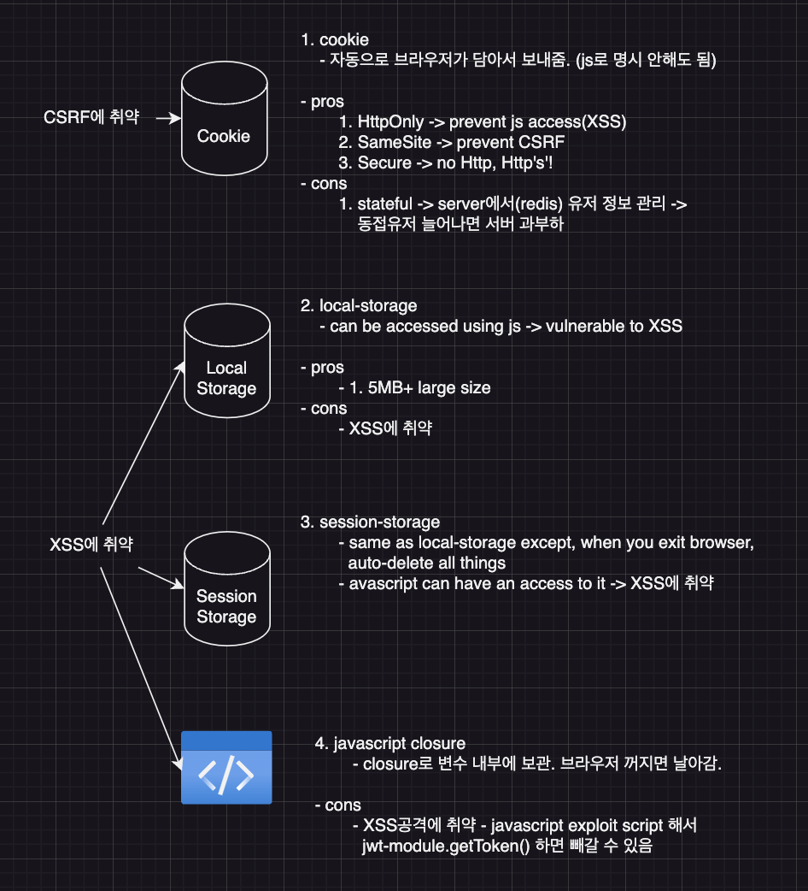

cookie에서 보관한다.

javascript로 데이터 못빼가니까 그나마 보안적으로 다른 선택지 대비 낫다고 판단된다.


#### 2-4. 이상행동 감지시 계정 잠금 기능

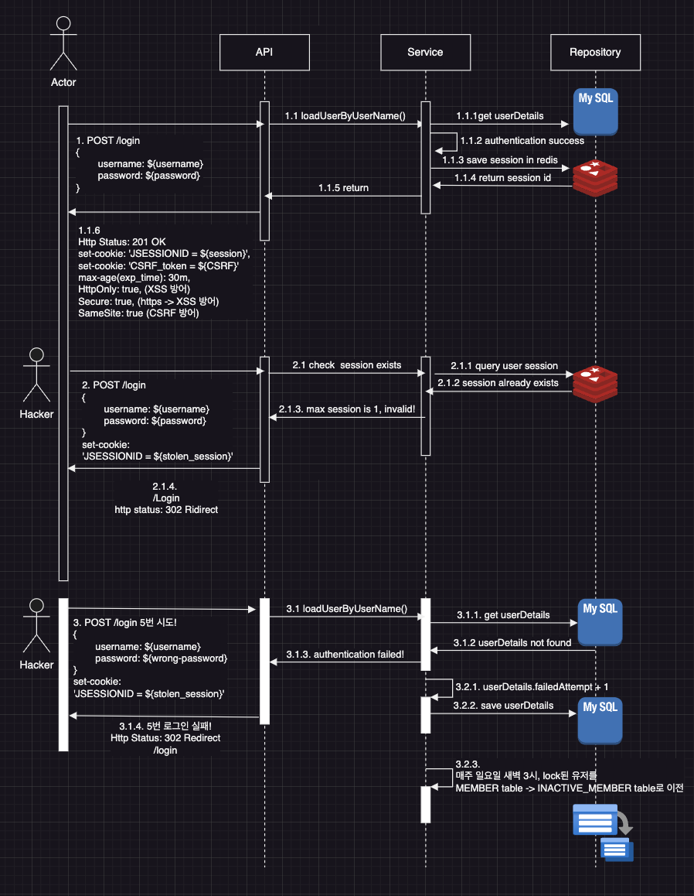


#### 2-5. inactive user를 Member 테이블로부터 이관하기


1. 매주 일요일 새벽 3시에
2. cron + batch로
3. locked account를
4. MEMBER table -> INACTIVE_MEMBER table로 이전한다.


### 3. 결과

#### 3-1. 구현기능
1. session clustering (spring security + redis)
2. 이상행동 감지시(로그인 5회 틀림) invalidate session + account lock 한다.
3. 매주 일요일 새벽 3시에 cron + batch로 locked account를 MEMBER table에서 INACTIVE_MEMBER table로 이전한다.


#### 3-2. 기능1: login attempt 실패할 때마다 카운트+1

https://github.com/Doohwancho/ecommerce/blob/33427c25a583416b8c086e7c6dbd008de95f366c/back/1.ecommerce/src/main/java/com/cho/ecommerce/domain/member/service/UserService.java#L147-L166


#### 3-3. 기능2: 카운트가 일정 수치 이상 쌓이면 비정상적인 유저라고 판단, invalidate session && lock account

https://github.com/Doohwancho/ecommerce/blob/33427c25a583416b8c086e7c6dbd008de95f366c/back/1.ecommerce/src/main/java/com/cho/ecommerce/domain/member/service/UserService.java#L168-L184


#### 3-4. 기능3: INACTIVE_MEMBER를 다른 테이블로 이전하기 batch job
https://github.com/Doohwancho/ecommerce/blob/22668b91973432f5e40fd4cb9b74816be7470db9/back/1.ecommerce/src/main/java/com/cho/ecommerce/global/config/batch/step/UserToInactiveMemberStepConfig.java#L24-L144

#### 3-5. 기능4: 매주 새벽 3시마다 batch job 실행하도록 cron 걸기

https://github.com/Doohwancho/ecommerce/blob/add3486330c26f69afb55656aa5740ed5d11577d/back/1.ecommerce/src/main/java/com/cho/ecommerce/global/config/batch/scheduled/ScheduledJobConfig.java#L22-L32


## d. 돈관련 코드 테스트 정밀도 높힌 방법

### 1. 문제

일반적인 코드는 테스트 커버리지가 넓은 integration 테스트 위주로 하면서,\
에러나면 그 부분 위주로 top-down으로 디버깅하는 방식이 효율적이다.

근데 돈 관련 코드는 실패하면 금전적 손실, 배상 및 소송, 평판 하락, 신뢰 손실 등\
골치아파지기 때문에 테스트를 더 정교하게 짜야한다.

문제는 테스트코드에서 예외케이스를 짤 정도로 **예상한 에러면, 이미 고쳤다는 것**이다.\
예상하지 못한 다양한 예외케이스를 던져주는 테스트 라이브러리가 없을까?


### 2. 방법론

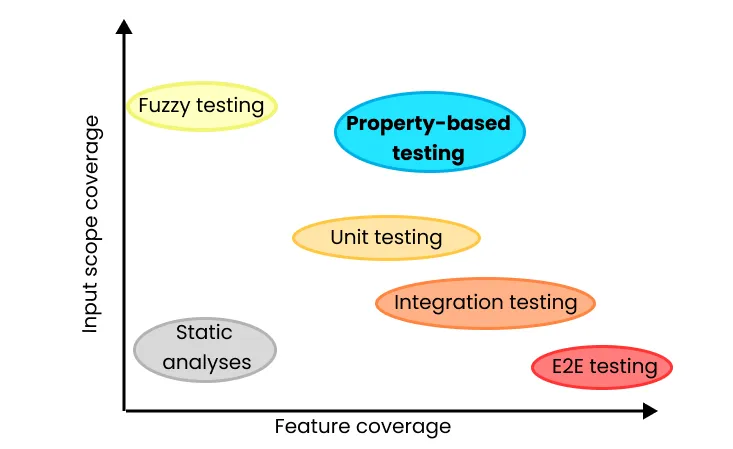

PBT(`property_based_test`) + fuzzy testing을 이용하면 이 문제를 해결할 수 있다.


#### 2-1. PBT: '속성'에서 반드시 참이어야 하는 부분 검증
PBT란 '속성'을 던져주면 해당 '속성'이라면 반드시 참이여야 하는 점을 테스트 해준다.

ex1) Q. `sort(list)`를 PBT하면, 출력 list가 반드시 만족해야 하는 속성이란?

1. 입력 list.size()가 출력 list.size()와 반드시 같아야 한다.
2. 출력 list의 n번째 원소는, n+1번째 원소보다 반드시 같거나 작아야 한다.


ex2) `add(a,b)`를 PBT하면, `add(b,a)`의 출력 값도 같게 나오는지 테스트 해준다.


...이걸 PBT가 자동으로 검증해준다.


#### 2-2. fuzzy test: 파라미터에 edge cases 검증을 세심하게 해준다.
테스트코드 짤 때, 모든 에지케이스들 다 생각하고 도입하는건 비현실적인데, 이걸 fuzzy test가 자동으로 해준다.

Q. 테스트 인풋이 `Integer`이라면?

A. 해당 인풋안에서 일어날 수 있는 모든 edge case들을 던져준다.

ex. 0, -1, null, "abc", "0xfffffff", -2147483648, 2147483647, -2147483648-1, 4294967295, ...


#### 2-3. fuzzy test: 랜덤 파라미터 넣는걸 수십, 수백번 해준다.


```java
@RunWith(JUnitQuickcheck.class)
public class StringReverserProperties {

    @Autowired
    private StringReverser stringReverser;

    @Property(trials = 50)  //랜덤 String s 를 보내고 50번 트라이 한다는 것
    public void reversingTwiceGivesOriginalString(String s) {
        String reversedOnce = stringReverser.reverse(s);
        String reversedTwice = stringReverser.reverse(reversedOnce);
        assertEquals(s, reversedTwice);
    }
}
```

예를들어, 이 코드는 `reverse_string()` 테스트 코드인데,\
PBT가 50번동안 랜덤한 `String s`를 만들어 테스트 돌려준다.

만약 테스트 실패했다?\
그러면 실패한 모든 케이스 다 주는게 아니라,\
실패 케이스 중에서 제일 짧고 간단한 케이스를 반환해줘서, 디버깅시 편하는 이점도 있다.

내가 짠 코드의 **최소 반례 데이터**를 반환해준다.


### 3. 주의점

#### 3-1. 메서드 하나에 테스트 수십,수백번 돌리는거라 cpu cost가 매우 크고 시간도 오래걸린다.
1. 수 많은 corner case들과
2. 속성에 반드시 참이어야 하는 명제
3. 랜덤 인풋 파라미터 수십번 테스트 돌리면,

... test 비용이 매우 커지고 시간도 오래걸린다.


그러니 모든 코드에 PBT를 적용할 순 없다.

사람 생명 연관된 코드, 돈 관련코드 등,\
반드시 실패하면 안되는 코드에만 적용하자.


### 4. 적용

#### 4-1. PBT + fuzzy test 지원 라이브러리 고르기

아래의 후보군이 있었는데, 선정 기준은 다음과 같다.

1. 필요한 기능(PBT + fuzzy test)을 지원하는가?
2. 최근까지 maintain 되고 있는가?
3. 사람들이 많이 사용하는가? star 수가 많은가?


`jqwik` 쓰기로 했다.

---
1. jqwik
	1. junit5와의 호환이 가능하다
	2. 최근까지 maintain 되고 있다
	3. 4494 commits
2. junit-quickcheck
	1. 2022년까지 업데이트
	2. 1161 commits
	3. junit-quickcheck (2021.10.29. 현재 1.0 버전 기준)는 junit4에 dependency를 두고 있다고 명시되어있어서,
	4. https://github.com/pholser/junit-quickcheck
3. quick theory
	1. 마지막 업데이트가 4년전
	2. 212 commits
	3. https://github.com/quicktheories/QuickTheories
4. quickcheck
	1. https://pholser.github.io/junit-quickcheck/site/1.0/javadoc.html
5. kotlin test
	1. also has basic support for PBT. Currently no shrinking yet.


#### 4-2. 가격 discount 코드에 PBT + fuzzy test 적용하기

돈관련된 상품가격에 할인율 적용하는 코드에 PBT + fuzzy test를 도입했다.

https://github.com/Doohwancho/ecommerce/blob/add3486330c26f69afb55656aa5740ed5d11577d/back/1.ecommerce/src/test/java/com/cho/ecommerce/property_based_test/ProductPriceDiscountTest.java#L39-L68


### 5. 결과

이젠 머리아프게 수 많은 코너케이스들 고려 안해도 자동으로 처리해준다.\
PBT + fuzzy test로 검증한 코드는 절대 안깨진다는걸 아니까,\
안심하고 리펙토링 할 수 있다는 이점도 있다.


# D. 기술적 도전 - Database

## a. 정규화

### 1. 문제점

- 현 프로젝트는 작은 규모의 쇼핑몰 프로젝트이다.
- 앱 론칭 초기엔, 요구사항 변경이 잦고, 그에 따라 데이터베이스 스키마가 추가/변경/삭제되는 경우도 종종 있다.
- 성능을 고려하면서도, 유연하게 변경 가능한 ecommerce ERD를 설계해야 한다.


### 2. 해결책1 - product를 비정규화 한 방식


- **pros**
	- 개별 제품 상세 페이지 쿼리는 빠르다.
- **cons**
	1. 주문 목록 query가 느려진다.
		- 구매자가 주문목록 query하려면, 모든 상품 테이블들 다 돌면서 product_id 찾아야 하니까 엄청 느리다.
		- 이걸 완화하기 위해, 모든 상품테이블에 들어았는 product_id를 인덱스 거는게 최선인 것 같지는 않다.
	2. 상품 카테고리별로 테이블 만들어줘야 해서 테이블 갯수가 수십~수백개로 늘어난다.
		- 의외로 테이블 갯수 자체가 늘어나는건 별 문제가 아니라고 한다.
		- 다만, 그보다 비정규화 했을 때, 상품 끼리 통일된 구조가 아닌게 더 문제라고 한다.
		- 통일된 구조가 아니면 나중에 확장할 때 merge, 변형 등이 힘들어지기 때문이다.
		- erd 설계 한번하면 쭉 가는줄 알았는데, 의외로 서비스 초기 때에도 스키마 변경을 자주 할 수 있다고 한다. 유연한 설계를 하자.

---

### 3. 해결책2 - order_item 테이블에 모든 비정규화한 상품테이블 리스트의 FK를 받는 방식


- **pros**
	- case 1과 같이, 개별 상품 페이지 쿼리는 빠르다.
- **cons**
	1. 필드 갯수가 100개 이상인 테이블이 생길 수 있다.
		- 상품 종류가 100가지라 상품 테이블이 100가지면, order_item가 받는 상품들의 fk가 100개+가 될 것이기 때문이다.
	2. 불필요한 null check 코드가 많아지고, 이는 휴먼에러날 확률을 높힌다.
		- 주문목록 query하려면, null check 먼저 하고,해당 아이템의 fk 가지고 아이템 찾는 식 일텐데,
		- 100개 컬럼 중 99개 컬럼이 Null인데 하나씩 Null비교해서 값을 꺼내는 방식은 안좋은 방식 같다.
		- 왜냐하면 Null처리 잘못할 수 있어서 에러날 가능성이 있는 코드구조가 될 수 있기 때문이다.


### 4. 해결책3 - 상품별 옵션을 정규화 해서 쪼개놓은 경우


- **pros**
	- 정규화가 잘 되있어서 변경에 유용하고 확장성이 좋은 설계이다.
- **cons**
	1. 정규화를 할 수록 쿼리할 떄 join & subquery 많이 해야 해서 성능이 느려진다.
		- ex. 상품 등록/업데이트/삭제 시, product/product_item/category/option/option_variation/product_option_variation 이 6개 테이블에 트랜잭션/lock 걸릴텐데, 너무 느릴 것 같다.


### 5. 결론
해결책3을 택한다. 이유는 다음과 같다.


#### 1. 서비스 초기에는 성능보다 확장성 우선

비정규화는 일종의 최적화이고 되돌리기 힘든 과정이다.\
서비스 초기 단계라면 구현된 기능 자체가 수정&삭제가 빈번한데 이럴 경우 정규화된 구조를 사용하여 기능의 수정 & 삭제같은 유지보수를 저렴한 비용으로 유연하게 할 수 있도록 하는 것이 맞다.

서비스가 더 커진다 해도 캐싱, 인덱싱, 분산처리(가용영역 추가, 비쌈)같은 테크닉을 쓸 수 있고,\
나중에 서비스가 커져서 비정규화나 MSA같이 RDBMS가 보장해주는 것 일부를 포기하고 더 최적화를 해야할 경우가 오면, 이 때 해당 프로젝트 진행하면 된다.

결론: 정규화하고 최적화는 나중에 병목이 생기면 그 때 반정규화 한다.


---
#### 2. 데이터베이스 규모별 정규화 & join 전략

join 성능은 데이터 사이즈가 커질수록 안좋아진다.

이유는 다음과 같다.

여러 테이블 join시, primary key 기준으로 join한다고 해도, 데이터 사이즈가 작으면 primary key를 index한 테이블을 몇번 안타는데,\
데이터 사이즈가 커지면, 여러 테이블들의 primary key index table 여러번 타기 때문에 join 성능이 떨어진다.

예를들어, 5개정도 테이블을 left outer join 하는 경우, 약 10개의 rows씩 5개 테이블이니까 50개 rows가 쿼리 1번당 lock되는건데, 멀티쓰레드 환경에서는 반정규화로 row 1개만 락걸고 가져오는 것 대비 성능이 좋지 않다.

따라서 서비스 초창기 때 데이터 수가 적을 땐 join 효율이 괜찮으니 정규화로 확장성을 잡다가,\
유저수가 많아지고 데이터 쌓인게 엄청 많아져 join 효율이 떨어지는 시기가 오면,
다음과 같은 행동을 취할 수 있다.

1. 사용하던 RDB에서 정규화된 테이블을 비정규화 테이블로 마이그레이션을 한다.
2. 사용하던 RDB에서 정규화된 테이블을 놔두고, 따로 비정규화된 테이블을 만들어서 write-through성 으로 따로 만든다.(대신 데이터 정합성이 떨어지는 것 고려해야 함)
3. 별개의 nosql(ex. mongodb)에 기존 RDB 테이블들(aggregates)을 비정규화한 스키마를 하나 만든다.
4. 샤딩
5. 파티셔닝
6. MSA로 쪼개서 도메인별로 해당 도메인에 맞는 데이터를 해당 서비스 전용 디비에 넣어 붙인다.
7. 자주 사용하는 쿼리는 캐싱처리한다. (ex. main page)


## b. 반정규화

### 1. 문제

정규화된 버전으로 [부하 테스트](#e-부하-테스트) 해봤는데 성능이 너무 안나왔다.

잘게 쪼개놔서 join을 많이해야 하니까 DB CPU에 부하가 금방 올라간 것으로 보인다.

반정규화 해서 join과 FK_insert 비용을 줄여보자.


### 2. 해결책


#### before) 정규화 버전


#### after) 반정규화 버전


1. db에서는 join 없이 최대한 index타서 최소량만 i/o 해오는 식으로 짠다. 나머지 데이터 조립/가공은 서버에서 한다.
	1. ex) 기존에 option, discount 테이블을 json화 시켜서 컬럼으로 밀어넣었다.
	2. 원래는 여러번 join해야 했다면, 지금은 하나의 row를 i/o한 후, json을 파싱해서 사용한다.
2. FK는 성능향상 목적으로 모두 제거했다.


### 3. 성능테스트로 검증해보자 (100~800 RPS)

#### 3-1. 실험 조건
1. ec2, rds 둘다 2 core 4GiB RAM
2. table size: user = 1000, product = 10000, order = 5000
3. table rows ratio -> user:product:order = 1 : 10 : 5
4. http request read:write ratio: 9:1

#### 3-2. 반정규화 성능테스트 결과

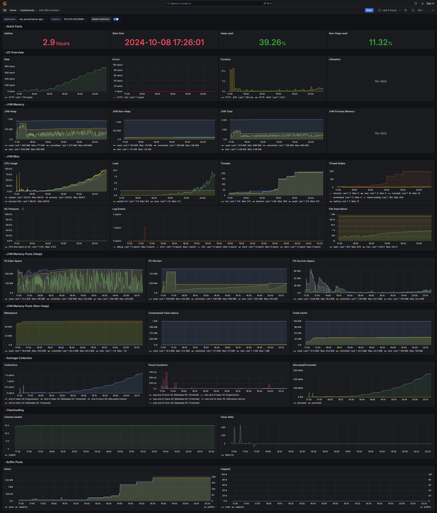

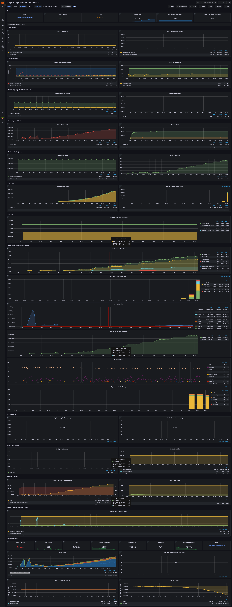


### 4. 성능테스트 결과

반정규화만 잘 하고, FK만 안넣어도, 성능차이가 어마어마하게 난다는걸 알게됬다.

좀더 자세한 정규화 vs 반정규화 성능비교는 [부하 테스트](#e-부하-테스트)에 기술했다.


## c. 통계 쿼리

### 1. 요구사항
1. 최근 N개월(최대 3개월) 사이에
2. 카테고리 별 상품 갯수
3. 해당 카테고리의 상품들의 평균 평점
4. 해당 카테고리의 총 상품 판매액
5. 해당 카테고리에서 가장 많이 팔린 상품의 productId
6. 해당 카테고리에서 가장 많이 팔린 상품의 이름
7. 해당 카테고리에서 가장 많이 팔린 상품의 총 판매액

...을 query 한다.

### 2. sql query 문

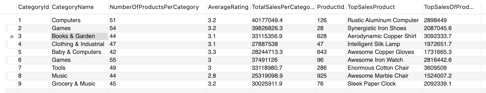

```sql
SELECT
    tmp1.CategoryId,
    tmp1.CategoryName,
    tmp1.NumberOfProductsPerCategory,
    tmp1.AverageRating,
    tmp1.TotalSalesPerCategory,
    tmp2.ProductId,
    tmp2.ProductName AS TopSalesProduct,
    tmp2.TopSalesOfProduct
FROM (
	SELECT
		c.CATEGORY_ID AS CategoryId,
		c.NAME AS CategoryName,
		COUNT(DISTINCT p.PRODUCT_ID) AS NumberOfProductsPerCategory,
		ROUND(AVG(p.RATING), 1) AS AverageRating,
		ROUND(SUM(pi.Quantity * pi.PRICE), 1) AS TotalSalesPerCategory
	FROM CATEGORY c
	INNER JOIN PRODUCT p ON c.CATEGORY_ID = p.CATEGORY_ID
	INNER JOIN PRODUCT_ITEM pi ON p.PRODUCT_ID = pi.PRODUCT_ID
	INNER JOIN product_option_variation pov ON pi.PRODUCT_ITEM_ID = pov.PRODUCT_ITEM_ID
	INNER JOIN ORDER_ITEM oi ON pov.PRODUCT_OPTION_VARIATION_ID = oi.PRODUCT_OPTION_VARIATION_ID
	INNER JOIN `ORDER` o ON oi.ORDER_ID = o.ORDER_ID
	WHERE o.ORDER_DATE BETWEEN :startDate AND ':endDate
	GROUP BY c.CATEGORY_ID
) AS tmp1
INNER JOIN
	(
	SELECT
		a.CategoryId AS CategoryId,
		b.ProductId As ProductId,
		b.ProductName As ProductName,
		a.TopSalesOfProduct AS TopSalesOfProduct
	FROM
		(SELECT
			Sub.CategoryId,
			Sub.CategoryName,
			MAX(Sub.TotalSalesPerProduct) as TopSalesOfProduct
		FROM
			(SELECT
				c.CATEGORY_ID as CategoryId,
				c.name as CategoryName,
				p2.PRODUCT_ID,
				ROUND(SUM(pi2.Quantity * pi2.PRICE), 1) as TotalSalesPerProduct
			FROM CATEGORY c
			INNER JOIN PRODUCT p2 ON c.CATEGORY_ID = p2.CATEGORY_ID
			INNER JOIN PRODUCT_ITEM pi2 ON p2.PRODUCT_ID = pi2.PRODUCT_ID
			INNER JOIN PRODUCT_OPTION_VARIATION pov2 ON pi2.PRODUCT_ITEM_ID = pov2.PRODUCT_ITEM_ID
			INNER JOIN ORDER_ITEM oi2 ON pov2.PRODUCT_OPTION_VARIATION_ID = oi2.PRODUCT_OPTION_VARIATION_ID
			INNER JOIN `ORDER` o2 ON oi2.ORDER_ID = o2.ORDER_ID
			WHERE o2.ORDER_DATE BETWEEN :startDate AND :endDate
			GROUP BY c.CATEGORY_ID, p2.PRODUCT_ID
			) as Sub
		GROUP BY Sub.CategoryId
		) a
	INNER JOIN
		(SELECT
			c.CATEGORY_ID as CategoryId,
			c.name as CategoryName,
			p2.PRODUCT_ID as ProductId,
			p2.name as ProductName,
			ROUND(SUM(pi2.Quantity * pi2.PRICE), 1) as TopSalesOfProduct
		FROM CATEGORY c
		INNER JOIN PRODUCT p2 ON c.CATEGORY_ID = p2.CATEGORY_ID
		INNER JOIN PRODUCT_ITEM pi2 ON p2.PRODUCT_ID = pi2.PRODUCT_ID
		INNER JOIN PRODUCT_OPTION_VARIATION pov2 ON pi2.PRODUCT_ITEM_ID = pov2.PRODUCT_ITEM_ID
		INNER JOIN ORDER_ITEM oi2 ON pov2.PRODUCT_OPTION_VARIATION_ID = oi2.PRODUCT_OPTION_VARIATION_ID
		INNER JOIN `ORDER` o2 ON oi2.ORDER_ID = o2.ORDER_ID
		WHERE o2.ORDER_DATE BETWEEN :startDate AND :endDate
		GROUP BY c.CATEGORY_ID, p2.PRODUCT_ID
			) b
		ON a.CategoryId = b.CategoryId AND a.TopSalesOfProduct = b.TopSalesOfProduct
	) AS tmp2
ON tmp1.CategoryId = tmp2.CategoryId
ORDER BY tmp1.CategoryId
```
https://github.com/Doohwancho/ecommerce/blob/22668b91973432f5e40fd4cb9b74816be7470db9/back/1.ecommerce/src/main/java/com/cho/ecommerce/domain/order/repository/OrderRepository.java#L15-L110


## d. SQL tuning

### a. index 튜닝

#### a-1. 문제
동일 조건에서 정규화 vs 반정규화의 성능차이가 얼마나 날까 실험중이었는데,

반정규화 DB의 cpu usage가 정규화보다 더 높았다?!

단순히 100 RPS에서 측정된 값을 비교해보면,

| Metric | 1. 정규화 버전 | 2. 반정규화 버전 |
|--------|--------------------|-----------------------|
| **EC2** |
| CPU Usage | 10% | 7.8% |
| Load Average | 0.2 | 0.1 |
| Heap Used | 8.73% | N/A |
| Non-Heap Used | 12.41% | N/A |
| Last HTTP Latency | 88ms | 9ms |
| Last Max Latency | N/A | 600ms |
| Errors | None | None |
| **RDS** |
| CPU Usage | 4.2% | 16.3% |
| Load Average | 0.3 | 0.8 |
| Memory Availability | 71.35% | 71.64% |
| QPS | 361 | 291 |
| TPS | 280 | 155 |

QPS(query per second)가 더 낮은데(join 덜하니까 쿼리를 여러번 쪼개서 날리지 않아서 그렇다고 해석)

cpu usage가 12.3%가 더 높다?

(심지어 이 점유율도 적게 잡힌것이다. 나중에 알았는데 pmm에 cpu usage 지표는 {node_name="ecommerce-db-instance"} 이걸 읽거나 전체 usage를 합친 값을 읽었어야 했는데 이땐 nice라고 써진 지표 기준으로 기록함)


#### a-2. 문제 원인 분석

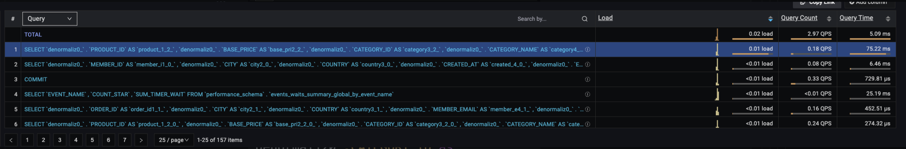

pmm query analyzer에서 latency 순으로 정렬하니까

한 쿼리가 75ms 걸리는게 확인된다.

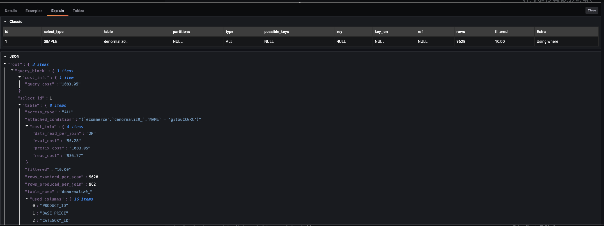

확인해보니

1. type:ALL = full scan
2. table_size가 10000rows인데 rows수 9628이면 전부 i/o 하는건데
3. filtered = 10% 이면, 힘들게 i/o한 것에 90%는 버린다는 뜻이니까,

인덱스를 안타서 엄청 비효율적이다라고 해석.


#### a-3. 해결방안
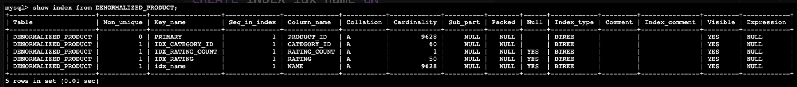

where절에 조건걸리는 필드에 인덱스를 걸어준다.

#### a-4. 개선된 결과
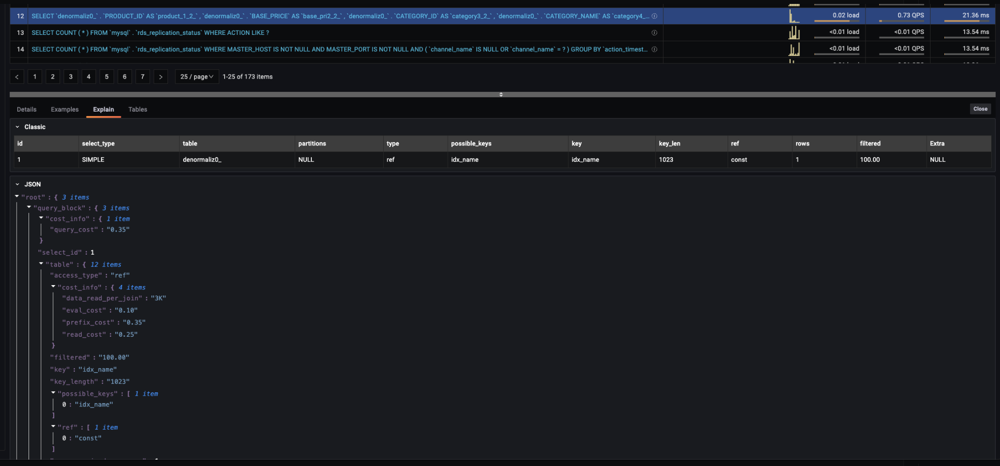

1. latency가 75ms -> 21ms 로 줄었고,
2. type:All -> ref (인덱스 탐)
3. key_len: 1023 -> 아마 9천개 rows i/o 안하고 천개만 i/o함.
4. filtered 100% -> 필터율 100%이니까 힘들게 io한걸 버리지 않는다는 뜻


### b. order by 튜닝

#### b-1. 문제

index tuning했으니까

동일 조건에서 반정규화한 앱이 정규화된 앱보다 부하테스트 성능이 더 좋겠지?

실험해봤는데, 이번에도 반정규화 앱의 RDS cpu usage가 더 높게 잡힘.

?

#### b-2. 문제 원인 분석
정규화 버전 PMM 지표와 반정규화 버전 PMM 지표 비교해봤는데

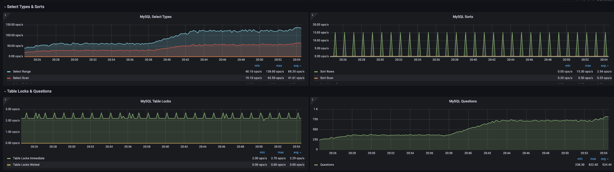
정규화 버전은 RPS 부하가 늘어나도 Sorts가 15ops/s 고정임을 확인할 수 있다.


반면 비정규화 버전은 RPS 부하가 늘어나면 Sorts가 Mysql Questions(total # of query executed)와 비례하게 늘어난다?

근데 부하테스트 하는 6개의 쿼리에서 sort를 쓴 기억이 없는데...?

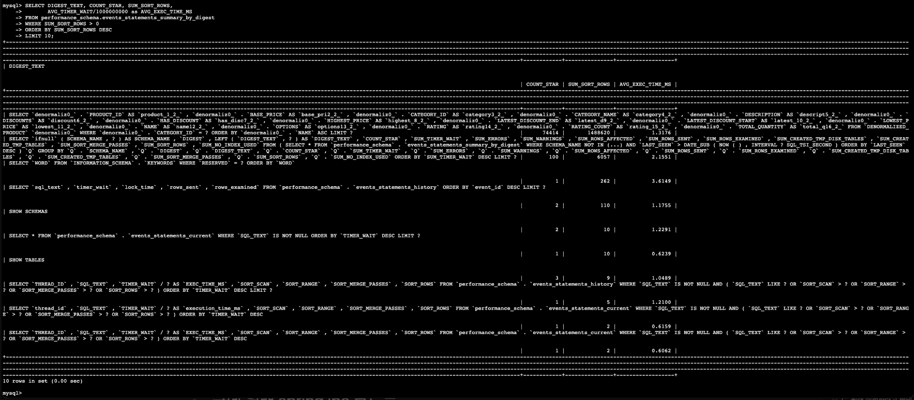

aws-rds에 ssl 접속해서 sort 빈도수가 가장 많은 순으로 쿼리 히스토리 정렬해봤더니,

저 맨 위에 쿼리가 148만개의 rows를 sort했다는걸 확인할 수 있다.


#### b-3. 해결방안
저 쿼리 담당하는 repository, service에서는 문제가 없었는데

controller에서 Pageable 객체 만들 때 sort 하는 코드가 있었다.

```java
Sort.Direction direction = sortDirection.equalsIgnoreCase("desc") ? Sort.Direction.DESC : Sort.Direction.ASC;
Pageable pageable = PageRequest.of(page, size, Sort.by(direction, sortBy));
```

성능 테스트 목적으로 ai한테 짜달라고 해서 나온건데

무지성 복붙의 폐혜가...


#### b-4. 개선된 결과
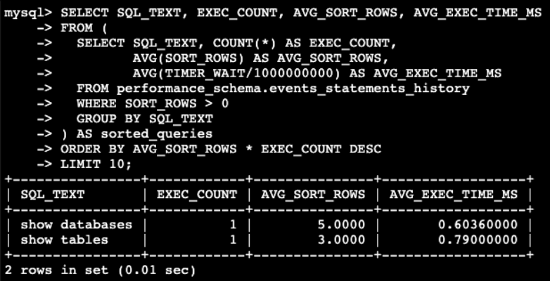

기존 order by 쓰던 쿼리가 안잡히는 모습이다.


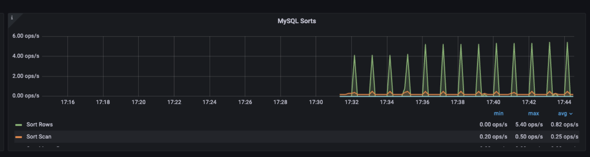

부하 테스트를 해봐도 이젠 RPS, QPS에 비례해서 Sorts ops/s가 올라가질 않는걸 확인할 수 있다.


#### b-5. 느낀점

인덱스 하나, order by 하나

쿼리 딱 2개 잘못짰는데 전체 데이터베이스 성능이 매우 하락하더라.

디비 모니터링 붙이고 슬로우 쿼리 바로바로 잡는게 중요하다는걸 느꼈고,

order by 케이스는 심지어 슬로쿼리로도 안잡혔다.

수행시간은 빠른데 cpu usage를 많이 잡아먹은 케이스가 존재하더라.

PMM에 Mysql Sorts 메트릭에 잡혀서 망정이지 아니었으면...


### c. 통계 쿼리 튜닝
[c. 통계 쿼리](#c-통계-쿼리)를 튜닝해보자.

#### c-1. before tuning
[c. 통계 쿼리](#c-통계-쿼리)"는 크게 3덩이의 subquery로 나뉜다.
1. tmp1
2. a
3. b

##### c-1-1. subquery 'a' 실행
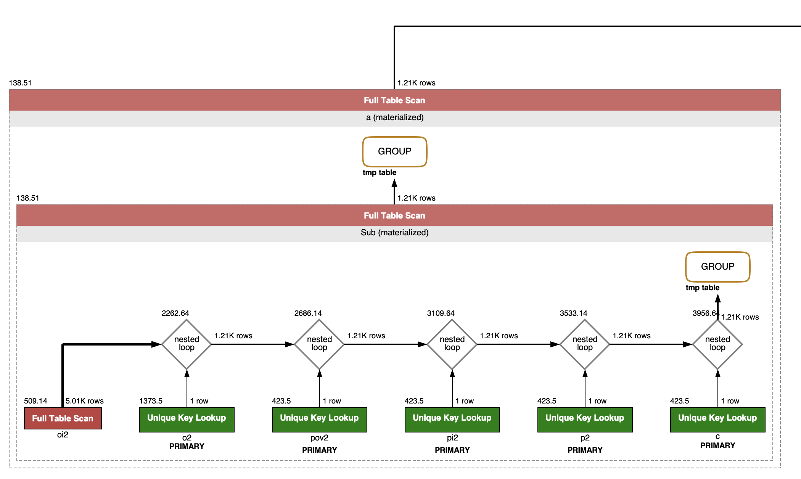
이 부분은 가장 처음에 실행되는 쿼리로, 'a' subquery이다.

문제점: 1000개 row가 있는 order 테이블을 fullscan 하는걸 볼 수 있다.

##### c-1-2. subquery 'tmp1' 실행
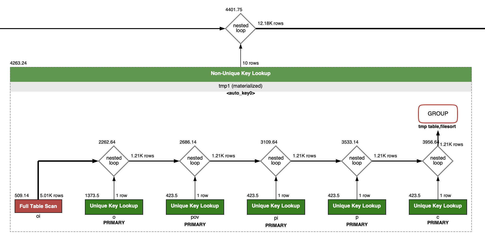

문제점: where절 조건이 인덱스를 타지 않아서 풀스캔 한다.


##### c-1-3. subquery 'b' 실행
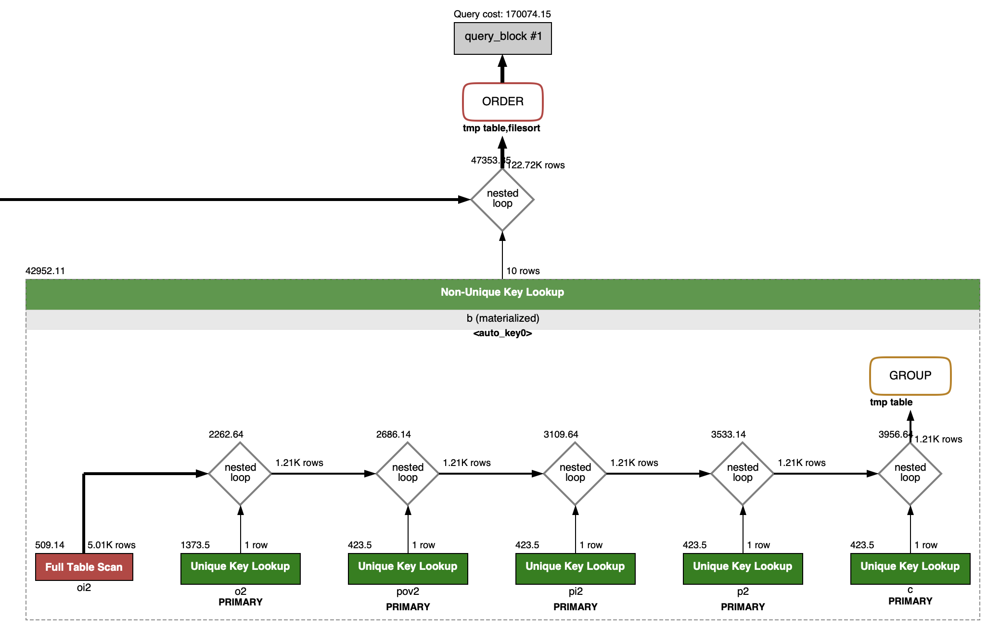
문제점: **where절 조건이 인덱스를 안타서 풀스캔을 한다.**


##### c-1-4. query statistics
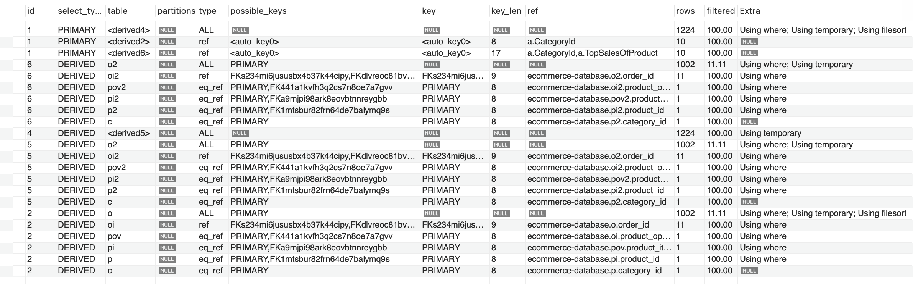

총 비용(mysql workbench의 cost 계산 툴 기준): 170,763

- 문제
    1. 풀 테이블 스캔을 5번이나 하고,
    2. index를 전혀 안탄다.

- 해결책
	- where절에 인덱스를 태워서 성능튜닝을 해보자..!

#### c-2. WHERE절 조건의 ORDER_DATE 컬럼에 인덱스 적용하기

##### c-2-1. 인덱스 만들고 적용하기

1. 인덱스를 만들고,
```java
@Entity
@Table(
    name = "`ORDER`",
    indexes = {
        @Index(name = "idx_order_date", columnList = "ORDER_DATE")
    }
)
@Getter
@Setter
public class OrderEntity {
    //...
}
```

2. 그냥 실행시켰더니, optimizer가 index를 타지 않아서, 타게하도록 힌트를 준다.
```sql
INNER JOIN `ORDER` o2 USE INDEX (idx_order_date) ON oi2.ORDER_ID = o2.ORDER_ID
WHERE o2.ORDER_DATE BETWEEN '2023-06-01' AND '2023-12-31'
```

##### c-2-2. 결과
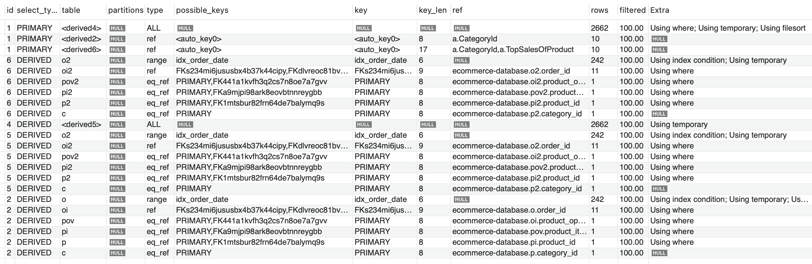

여전히 subquery해서 나온 결과물을 담은 tmp table을 두번 full scan하긴 하지만,\
"idx_order_date" 인덱스를 index range scan을 3번 타는걸로 바뀌었다.

그런데 수상하게 full scan타는 rows 수가 1200개에서 2660개로 늘어났다???


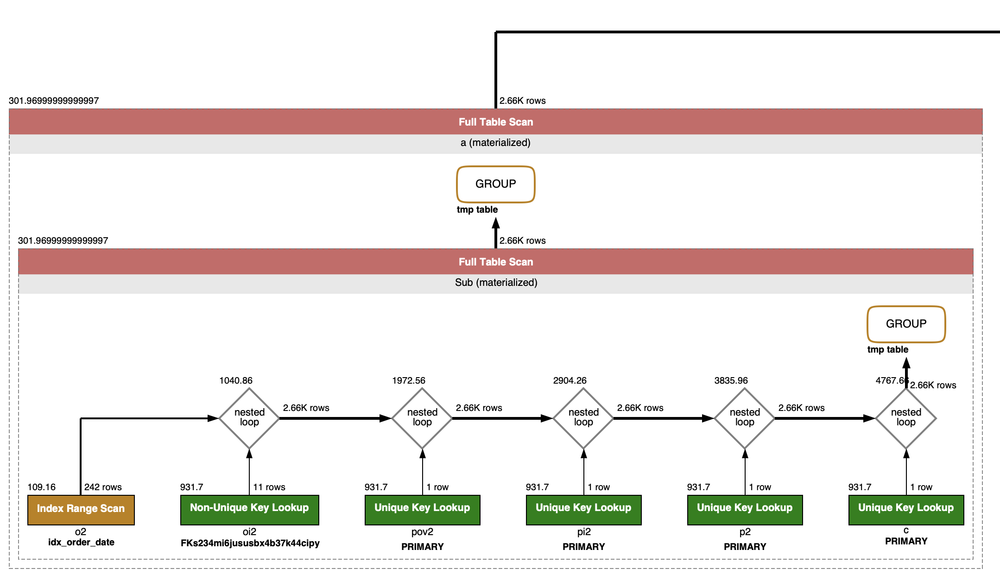

인덱스 적용했더니, 맨 처음 order table(1000 rows)에서 where절에 date 인덱스 태웠기 때문에 242 rows만 읽는걸 확인할 수 있다.

여기까진 좋았다.

그런데, 문제는 이 이후부터인데,

첫 테이블만 5000 rows -> 242 rows로 줄었고, 이후에 join할 때마다 읽는 rows수가 1.2k rows -> 2.6k rows로 늘었다.\
그런데 join을 여러번 하니까, 결과적으로 총 읽은 rows수의 양이 122k rows -> 266.6k rows로 늘었다.

나머지 subquery들도 첫번째 subquery와 같은 현상이 일어났다.

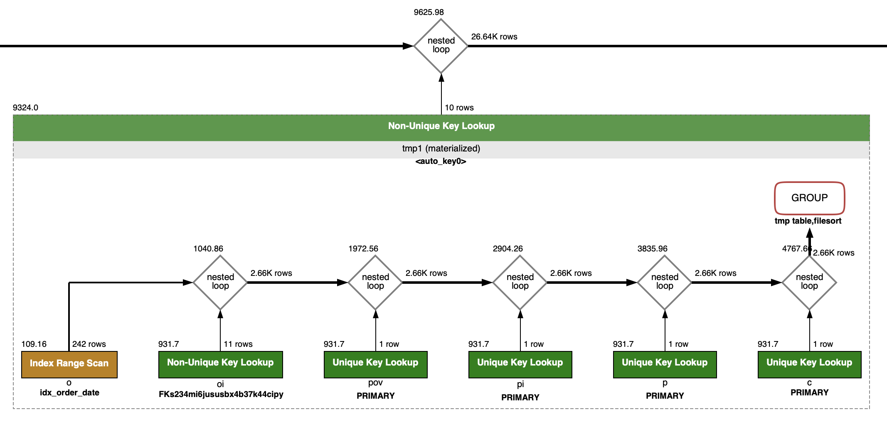
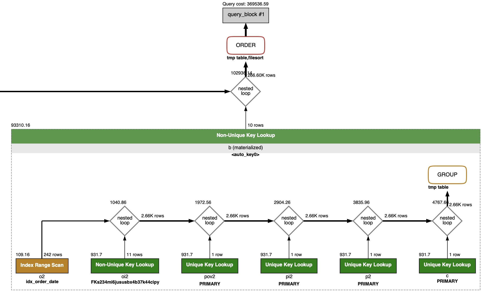

**총 읽은 rows수가 튜닝 전에는 170,763 rows 이었는데, 튜닝 후에 오히려 266,600 rows로 오히려 늘었다??**

첫 테이블 읽는 rows수가 5000 rows(full scan) 에서 인덱스 태워서 242 rows 만 읽은건 이해가 가는데,

왜 nested join loop에서 read하는 rows가 늘어나서 결과적으로는 성능이 떨어졌을까?


##### c-2-3. 실행계획 뜯어보기

###### c-2-3-1. date 인덱스 타기 전

id6 부분이 subquery 'a' 부분이다.

- 실행순서
	1. order table(1000 rows)를 full scan하면서, where절에 date를 태워서 필터한다. (약 200 rows정도 나옴)
	2. 1의 결과로 나온 order table의(200 rows)를 order item table(5000 rows)와 inner nested join하는데, inner table은 order item table이 되고, order item table이 FK로 가지고 있던 Order table의 PK를 인덱스 삼아 조인한다.
		- 이 때, where절 조건인 6개월에 걸리는 order item table의 rows 수는 약 1.2k rows(out of 5k)가 된다.
		- 이 1.2k rows from order item table이, 튜닝 전, 5k rows full scan 이후 nested join 때 반복되는 1.2k 숫자가 나온 이유이다.
	3. 해당 1.2k rows는, 다른 테이블과 nested join with pk 시 반복된다.


이제 nested loop join시 1.21k rows가 나온 이유가 설명되었다.

```sql
explain analyze select count(*)
from `order_item` oi
INNER JOIN `ORDER` o IGNORE INDEX(idx_order_date) ON oi.ORDER_ID = o.ORDER_ID
INNER JOIN PRODUCT_OPTION_VARIATION pov ON oi.PRODUCT_OPTION_VARIATION_ID = pov.PRODUCT_OPTION_VARIATION_ID
WHERE o.ORDER_DATE BETWEEN '2023-06-01' AND '2023-12-31'
```

약식 쿼리로,\
order, order item, product option variation 테이블만 떼어내서 index 없이 조인하는 쿼리의 실행계획으로 뜯어보자.

```
-> Aggregate: count(0)  (cost=1082.54 rows=1) (actual time=19.867..19.867 rows=1 loops=1)
    -> Nested loop inner join  (cost=960.08 rows=1225) (actual time=2.657..19.746 rows=1235 loops=1)
        -> Nested loop inner join  (cost=531.49 rows=1225) (actual time=2.162..15.960 rows=1235 loops=1)
            -> Filter: (o.order_date between '2023-06-01' and '2023-12-31')  (cost=102.90 rows=111) (actual time=0.065..5.557 rows=247 loops=1)
                -> Table scan on o  (cost=102.90 rows=1002) (actual time=0.060..4.873 rows=1002 loops=1)
            -> Filter: (oi.product_option_variation_id is not null)  (cost=2.76 rows=11) (actual time=0.025..0.041 rows=5 loops=247)
                -> Index lookup on oi using FKs234mi6jususbx4b37k44cipy (order_id=o.order_id)  (cost=2.76 rows=11) (actual time=0.025..0.040 rows=5 loops=247)
        -> Single-row covering index lookup on pov using PRIMARY (product_option_variation_id=oi.product_option_variation_id)  (cost=0.25 rows=1) (actual time=0.003..0.003 rows=1 loops=1235)
```

- 실행순서
	1. Table scan on o  (cost=102.90 rows=1002) (actual time=0.060..4.873 rows=1002 loops=1)
		- order table(1000 rows)를 full scan하여
	2. Filter: (o.order_date between '2023-06-01' and '2023-12-31')  (cost=102.90 rows=111) (actual time=0.065..5.557 rows=247 loops=1)
		- where절 조건에 맞는 247 rows를 추출한다.
	3. Index lookup on oi using FKs234mi6jususbx4b37k44cipy (order_id=o.order_id)  (cost=2.76 rows=11) (actual time=0.025..0.040 rows=5 loops=247)
		- 이제 order item table을 nested loop inner join하는데, inner table 삼아, order item table에 order table의 PK를 FK 인덱스로 가지고 있던걸 한번 join당 5번씩 index tree를 읽는걸, 총 247번(outer table인 order table)만큼 하여 ...
	4. Nested loop inner join  (cost=531.49 rows=1225) (actual time=2.162..15.960 rows=1235 loops=1)
		- 총 1235 rows(5 rows * 247 loops)를 읽어 order table과 order item table을 조인한다.
	5. Single-row covering index lookup on pov using PRIMARY (product_option_variation_id=oi.product_option_variation_id)  (cost=0.25 rows=1) (actual time=0.003..0.003 rows=1 loops=1235)
		- product option variation table과는 pk를 인덱스 삼아 1 rows(pk니까 유니크하다) * 1235rows (step 4까지 order + order item table 조인한 rows 수) 만큼 rows를 읽는다


###### c-2-3-2. date 인덱스 태운 이후

이번에도 id6가 subquery 'a'에 해당한다.

저 2.6k rows read는 대체 어디서 나온걸까?


nested loop join 할 때마다 2.6k rows를 읽는다는데,\
저래서 총 rows read 비용이 1.5배 이상 늘었는데, 저 2.6k rows라는 숫자는 어디서 튀어나온걸까?

```sql
select count(*)
from `order_item` oi
INNER JOIN `ORDER` o USE INDEX(idx_order_date) ON oi.ORDER_ID = o.ORDER_ID
INNER JOIN PRODUCT_OPTION_VARIATION pov ON oi.PRODUCT_OPTION_VARIATION_ID = pov.PRODUCT_OPTION_VARIATION_ID
WHERE o.ORDER_DATE BETWEEN '2023-06-01' AND '2023-12-31'
```
약식 쿼리를 만들어 실행계획을 뜯어보자!


```
-> Aggregate: count(0)  (cost=2238.76 rows=1) (actual time=21.364..21.367 rows=1 loops=1)
    -> Nested loop inner join  (cost=1972.56 rows=2662) (actual time=9.620..21.243 rows=1235 loops=1)
        -> Nested loop inner join  (cost=1040.86 rows=2662) (actual time=8.423..17.201 rows=1235 loops=1)
            -> Index range scan on o using idx_order_date over ('2023-06-01 00:00:00' <= order_date <= '2023-12-31 00:00:00'), with index condition: (o.order_date between '2023-06-01' and '2023-12-31')  (cost=109.16 rows=242) (actual time=0.734..3.069 rows=247 loops=1)
            -> Filter: (oi.product_option_variation_id is not null)  (cost=2.75 rows=11) (actual time=0.047..0.056 rows=5 loops=247)
                -> Index lookup on oi using FKs234mi6jususbx4b37k44cipy (order_id=o.order_id)  (cost=2.75 rows=11) (actual time=0.047..0.056 rows=5 loops=247)
        -> Single-row covering index lookup on pov using PRIMARY (product_option_variation_id=oi.product_option_variation_id)  (cost=0.25 rows=1) (actual time=0.003..0.003 rows=1 loops=1235)
```

- 실행순서
	1. Index range scan on o using idx_order_date over ('2023-06-01 00:00:00' <= order_date <= '2023-12-31 00:00:00'), with index condition: (o.order_date between '2023-06-01' and '2023-12-31')  (cost=109.16 rows=242) (actual time=0.734..3.069 rows=247 loops=1)
		- order table(1000 rows)를 where절의 조건으로 index scan해서 247 rows만 읽는다.
	2. Index lookup on oi using FKs234mi6jususbx4b37k44cipy (order_id=o.order_id)  (cost=2.75 rows=11) (actual time=0.047..0.056 rows=5 loops=247)
		- order item table과 Order table을 join하기 위해, order item table에서 보관하던 fk를 11 rows 읽고, nested loop inner join시, inner table인 order item table(5000 rows)를 평균 5 rows씩 247번 loop하여 조인한다.
	3. Nested loop inner join  **(cost=1040.86 rows=2662)  (actual time=8.423..17.201 rows=1235 loops=1)**
		- 1235 rows는 step2에서 nested loop join시 fk index를 평균 5rows 씩 247번 loop하여 조인한 것의 결과이다.
		- **오해했던 점은, mysql workbench에 explain visualize에서 나오던 2.6k rows를 읽는다는건, 그저 optimizer의 추정치였을 뿐, 실제 읽은 rows는 1235 rows였다!**
	4. Single-row covering index lookup on pov using PRIMARY (product_option_variation_id=oi.product_option_variation_id)  (cost=0.25 rows=1) (actual time=0.003..0.003 rows=1 loops=1235)
		- order + order item table이 조인됬는데, 다음으로 조인할 product_option_variation table은 pk로 조인하므로, 1조인 당 1개 rows씩 총 1235 loop하여 inner nested loop join을 한다.


- 결론
	1. **mysql workbench에 visual explain에서 나오는 rows read는 추정치일 뿐이라 그대로 믿으면 안된다.**
	2. 실제 실행계획 수치는 mysql console에서 commandline인 'explain analyze'을 쳐서 실측치를 봐야한다.

##### c-2-4. 검증
[c. 통계 쿼리](#c-통계-쿼리)를 다시 돌리되,\
데이터 사이즈를 키워서 index 타는 쿼리와 타지 않는 쿼리가 시간차가 얼마나 나는지 보자.

```
테이블 사이즈

user: 10000 rows
order: 10000 rows
orderItem: 50000 rows
product: 10000 rows
productItem: 30000 rows
productOptionVariation: 30000 rows
```
###### case1) where절에 index를 안태운 쿼리: 1027ms
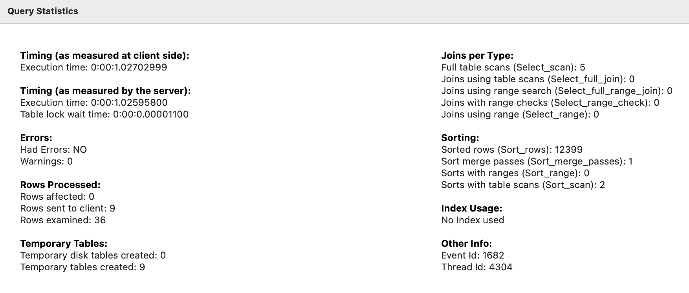


###### case2) where절에 인덱스를 태운 쿼리: 572ms
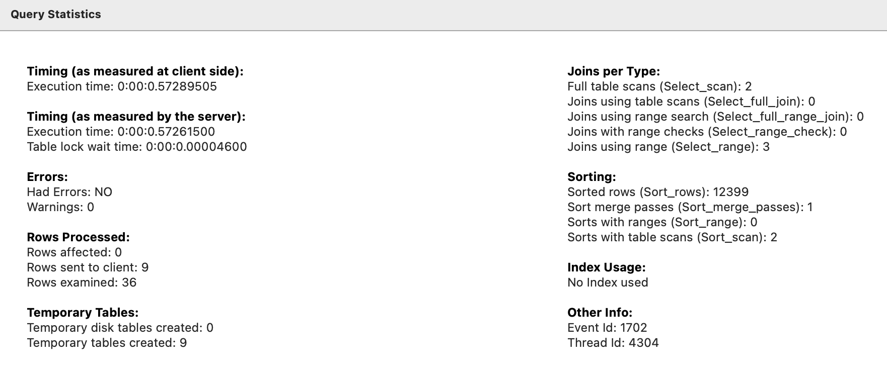


하나의 컬럼에 index를 태웠는지 여부가 약 455ms latency 차이를 보여준다.

## e. bulk insert

### 1. 문제
소규모 데이터 핸들링은, 어떤 DBMS를 사용하던, 어떻게 SQL을 짜던 큰 문제없이 처리 가능한데,\
데이터 규모가 커질수록, sql tuning이라던지, dbms, engine 선택의 중요도가 높아진다.

대규모 데이터 핸들링을 실습하기 위해, WAS 서버에서 datafaker라는 라이브러리로 가짜 데이터를 만든 후, saveAll()로 넣었다.

문제는, 어느정도 튜닝이 필요할 볼륨이 적어도 1,000,000 rows 이상은 되어야 하는데, 기존보다 약 100배정도 많은 양을 bulk insert하는게 너무 느리다는 문제가 생겼다.

백만 rows를 bulk-insert 해보자.


### 2. RDS에 최대 몇개 rows 까지 입력 가능할까?

성능 튜닝하기 전, 총 몇 rows를 넣어야 적합한지, 넣었을 때 차지하는 용량이 얼마나 되는지 등을 계산하자.


#### step1. 각 테이블의 byte size 계산하기
ERD 기준, 각 테이블의 평균 row 크기는 다음과 같다.
```
ADDRESS: 303바이트
AUTHORITY: 33바이트
CATEGORY: 95바이트
DISCOUNT: 65바이트
INACTIVE_MEMBER: 593바이트
MEMBER: 281바이트
MEMBER_AUTHORITY: 24바이트
OPTION: 66바이트
OPTION_VARIATION: 66바이트
ORDER: 49바이트
ORDER_ITEM: 24바이트
PRODUCT: 205바이트
PRODUCT_ITEM: 28바이트
PRODUCT_OPTION_VARIATION: 24바이트
```


#### step2. 데이터가 테이블마다 들어갈 비율 정하기

##### a. 사이즈가 고정인 테이블

- 2 row from AUTHORITY TABLE = 33 byte * 2
- total: **66 bytes**

##### b. 10명의 유저가 있다고 했을 때,

- 10 row from MEMBMER TABLE = 281 byte * 10
- 10 row from MEMBER_AUTHORITY TABLE = 24 byte * 10
- 10 row from ADDRESS TABLE = 303 byte * 10
- 3 row from INACTIVE_MEMBER TABLE = 593 byte * 3 (유저 10명당 휴먼 유저 3명이라 가정)
- 2 row from ORDER TABLE = 49 byte * 20 (유저 1명당 평균 2개의 주문을 했다고 가정)
- 3 row from ORDER_ITEM = 24 byte * 20 (1개 주문당 평균 3개의 주문 아이템이 있다고 가정)
- total: **9319 bytes** (2810 + 240 + 3030 + 1779 + 980 + 480), 38 rows

##### c. 카테고리

- 1 row from CATEGORY TABLE = 95 byte
- 3 root categories are fixed: MEN, WOMEN, KIDS = 95 byte * 3
- 4 mid level category per 3 root categories(total 12): Hat, Top, Bottom, Shoes per 3 root categories are fixed: 95 byte * 4 * 3
- 5 low level categories per 4 mid level categories(total 60): 95 byte * 60
- 3 option per a low level category(total 180): 49 byte * 180 = 8820
- 3 option_variation per a option(total 540): 66 byte * 540 = 35640
- total: **51585 bytes** (95 byte * (3 + 12 + 60) + 49 bytes * 180 + 66 bytes * 540), 795 rows


##### d. 상품

product테이블에 1 row씩 insert 하면, product_item과 product_option_variation에 3개 rows씩 추가 삽입 된다고 가정한다.\
1 product_item당 1개의 discount가 붙는다고 가정한다.

- PRODUCT: 1개 row = 205바이트
- PRODUCT_ITEM: 3개 row = 3 * 28바이트 = 84바이트
- DISCOUNT: 1개 row = 65 바이트
- PRODUCT_OPTION_VARIATION: 3개 row = 3 * 24바이트 = 72바이트
- total: **416 bytes** (205 + 84 + 65 + 72), 8 rows

##### e. 유저 수 대비 상품수 비율 가정하기

```
쿠팡은 2020년 기준으로 약 1,800만 명의 월간 활성 사용자를 보유하고 있으며, 약 6,500만 개 이상의 상품을 판매하고 있다고 밝혔습니다.
이는 쿠팡이 2020년 6월 미국 증시 상장을 위해 제출한 서류(F-1)를 통해 공개된 정보입니다.
```

100% 정확한 정보인지는 모르겠으나, 크리티컬하지는 않기에 맞다고 가정한다.

유저 수: 상품 수 = 1: 3.6
...으로 가정한다.

###### f. 유저 수 대비 총 rows 수 계산하기

1. 고정
	- 2 rows (AUTHORITY)
	- 795 rows (CATEGORY, OPTION)
2. 가변 (1 유저, 1 상품 가정)
	- 1 user: 3.8 rows
	- 3.6 product: 8 rows * 3.6 = 28.8 rows

- 결론: 고정 797 rows + 가변 32.6 rows per 1 user
	- 32.6X + 797, where X is number of users


##### g. 10명의 유저당 필요한 바이트수 정리

유저 수: 상품 수가 1:3.6 비율일 때,

유저 10명당 상품 36개가 등록된다고 가정하면,

1. 유저 10명: 9319 bytes
2. 상품 36개: 14976 bytes
3. 권한 테이블(고정): 66 bytes
4. 카테고리 테이블(고정): 51585 bytes

total: 51651 bytes + 24295 bytes * N


#### step3. 데이터베이스 용량 별 max 유저 수, rows 수 정하기
```
Y = (((X * 1024^3) - 51651) / 24295) / 10
```
X = 데이터베이스 용량 in GiB\
Y = 유저 수

...를 계산하려고 했으나, RDS는 64TB까지 저장 가능하고, 저장하는 데이터의 양의 비례해 요금을 부과한다고 한다.

byte단위로 용량 계산하는건, EC2에 데이터베이스 설치해서 운영할 때나 쓸만한 접근 법인듯 하다..

그런데 WAS서버를 띄운 이후, RDS로 1 million rows를 bulk insert하는 방법 이외에,
1. 1 million rows를 로컬 pc에 저장한 이후,
2. export해서
3. aws s3에 저장한걸
4. RDS에서 LOAD DATA INLINE으로 bulk insert하는 방식
...도 있기 때문에, 계산해 본다.

- 8GiB Storage = 35,000 유저, 126,000 상품, 1,141,797 rows
	- 35,356.58 users = (((8 * 1024^3) - 51651) / 24295) / 10
	- 1 million rows, 8GiB 정도면 중소규모 데이터 사이즈로, sql tuning이 유효한 사이즈로 보인다.

물론 이 방식보다 ec2,rds 생성시 자동으로 JPA-saveAll() 하는 방식이 간편하기 때문에, 왠만하면 saveAll() 방식을 쓰도록 한다.


### 3. JPA .saveAll()
```java
Integer numberOfFakeUsers = 2000; //6000 rows total
Integer numberOfFakeCategories = 10; //75 rows total
Integer numberOfFakeOptions = 3; //180 rows
Integer numberOfFakeOptionsVariations = 3; //540 rows
Integer numberOfFakeProducts = 4000;
Integer numberOfFakeProductItems = 3; //12000 + 12000 (discount) rows total
Integer numberOfFakeProductionOptionVariations = numberOfFakeProducts * numberOfFakeProductItems; //12000 rows
Integer numberOfFakeOrders = 2000; //2000 rows
Integer maxProductItemsPerOrder = 2; //4000 rows

... total 52,730 rows
```

약 5만 rows의 fake-data를 for-loop으로 insert하는 방법
```
.lambda$initData$0:88] - Total execution time: 463886 ms
```

463.886s = 7.7m

5만 rows 넣을 때 약 8분정도 소요.\
100만 rows 넣을 때 약 2시간 40분 소요


### 4. JPA .saveAll() + spring batch(chunk size of 1000)

spring batch에 chunk size를 조절하는게 있길래,\
chunk size를 1000정도로 늘려주면 한 transaction안에 여러 데이터를 넣으니까 훨씬 빠르지 않을까? 라고 생각했지만 오판이었다.

오히려 더 느려졌다.

.saveAll()하는건 똑같은데, spring batch를 내부적으로 로드하는 시간이 추가되서 그런 듯 하다.


### 5. JPA .saveAll() + batch size of 1000

spring.jpa.properties.hibernate.jdbc.batch_size = ?

30,50,100,1000,2000 으로 설정하고 결과값을 비교하여 최적 소요시간을 찾아보자.

- batch_size
	1. 설정을 안한 경우: 463886ms
	1. 30: 447800 ms
	2. 50: 445065 ms
	3. 100: 449799 ms
	4. 1000: 442736 ms
	5. 2000: 446292 ms


5만 rows를 insert했을 때 batch_size를 1000으로 할 때 442736ms으로, 설정을 안한 경우보다 21,150ms 빨라졌다.

하지만 batch_size를 30->2000으로 조절했는데도, 성능차이가 거의 안나는 것을 보면,\
bulk-insert 하는게 아니라 여전히 row by row로 한줄씩 넣어서 느린 듯 하다.

저 21,150ms 성능 개선은 jpa -> jdbc로 바꿀 때, jpa의 entity state를 hibernate가 관리해주는 로직과 safety check를 스킵해서 빨라진 듯 하다.


### 6. jdbc bulk insert + batch size 1000

Q. 왜 JPA .saveAll()이 jdbc bulk-insert보다 느릴까?

1. hibernate가 entity 객체 주기적으로 확인하고 세션에 캐싱하기 때문에 느리다.
	- JPA는 .saveAll()할 때 JPA entity lifecycle 을 거친다. 그 때, entity state를 확인하고, dirty checking을 통해 entity 객체가 modified 되었는지 확인한다. 이런 safety check 단계 때문에 bulk insert시 느려진다.
	- entity 생성시 세션에 캐싱해 놓는데, bulk-insert는 어짜피 한번 넣기만 하고, 읽지는 않을거라 이 단계가 오버헤드다.
2. @Id generation strategy 때문에 .saveAll()이 느려질 수 있다.
	- entity @Id generation strategy 중에 IDENTITY를 보통 쓰는데, 이는 id를 데이터베이스보고 id값을 구해서 넣으라는 말이다.
	- 그래서 JPA에서 쿼리 생성시, id 부분을 "?"로 채워서 보내준다.
	- 문제는 JPA hibernate는 객체의 상태관리를 해야하기 때문에, insert한 이후, db가 반환한 id값을 받아 해당 엔티티의 id값을 업데이트 해야한다.
	- 이 단계 때문에, IDENTITY 전략을 쓰면, bulk-insert를 한번에 모아서 할 수 없게된다. 한줄씩 넣은 다음, db에서 id값 받아서 업데이트 해주기 때문이다.


Q. @Id generation 전략을 IDENTITY 말고 SEQUENCE 쓴다면?

- JPA단에서 id를 순차적으로 +1해주는 SEQUENCE 전략을 써봤다.
- SEQUENCE 전략은 insert하기 전에, db에서 마지막 id값이 몇인지 읽어온 다음, 그 값에 +1한 값을 insert id에 넣는 방식이다.
- IDENTITY보다 SEQUENCE가 bulk-insert시에 성능이 훨씬 좋은데, 이유는, IDENTITY와는 다르게, 한번만 db query로 id를 가져오면, batch_size(ex. 1000)만큼 +1씩 해서 보내기 때문에, 묶어서 보낼 수 있기 때문이다.
- 써봤는데 문제가 있었다. @Id값이 균일하게 +1씩 올라가는게 아니라, 중간에 몇백씩 구멍이 생기는 경우가 생겼다.
- 파라미터 중에 allocationSize라고, batch_size인 1000을 입력하면, 천개의 rows마다 db에 마지막 id값을 쿼리해주는 파라미터가 있는데, 이게 서버가 여러개면 문제가 발생할 수 있겠다라는 생각이 들었다.
- 예를들어 스케일 아웃된 서버 A,B가 있는데, A서버가 id값을 읽어온게 1이고, B서버가 id값을 읽어온게 30이고, read 쿼리 날리는걸 bulk-insert 때문에 1000정도로 해주면, A서버는 1001될 때까지 id를 안읽어오고, B서버도 1030이 될 때 까지 안읽어온다는 말인데, B서버가 write한 id값을 A서버가 write하는 경우가 발생할 수 있기 때문에, default id generation 전략이 IDENTITY인 듯 하다.
- bulk-insert 때문에 엔티티 id 전략을 SEQUENCE로 바꾸는건 안좋은 생각인 것 같다. IDENTITY 전략을 냅두고, bulk-insert용 jdbc 쿼리를 짜는게 맞다는 생각이 든다.


JPA .saveAll() -> jdbc bulk-insert로 바꾸고 동일한 숫자의 53,000 rows를 넣은 결과,
```
Total execution time: 188,535 ms
```

442,736ms -> 188,535ms로, JPA .saveAll()방법 대비, 약 254,201ms 만큼 성능향상이 되었다.

442초 걸리던게 188초로 줄어든 것이니까 큰폭으로 성능 향상되었다.


### 7. jdbc bulk insert + batch size 1000 + &rewriteBatchedStatements=true

[stackoverflow에 jdbc batch optimization 기법](https://stackoverflow.com/questions/2993251/jdbc-batch-insert-performance)을 찾아보니
`jdbc:mysql://${url}:3306/${database-name}?${parameter}`에, `&rewriteBatchedStatements=true`을 추가하면 빨라진다고 한다.

왜냐?

기존 jdbc bulk-insert는 mysql로 이런 쿼리를 날린다고 한다.
```sql
INSERT INTO X VALUES (A1,B1,C1)
INSERT INTO X VALUES (A2,B2,C2)
...
INSERT INTO X VALUES (An,Bn,Cn)
```

그런데 `&rewriteBatchedStatements=true`을 하면, 저 쿼리를

```sql
INSERT INTO X VALUES (A1,B1,C1),(A2,B2,C2),...,(An,Bn,Cn)
```

..로 한줄 압축해서 보낸다고 한다.

실험해 본 결과,
```
Total execution time: 152384 ms
```

..로 기존 5만 rows insert, 188,535 ms 대비, 36,151ms 더 빨라졌다.

5만 rows 넣는데 2분 30초 걸리니까, 100만 rows를 넣을 때 까지, 약 50분 정도 걸린다.


### 8. jdbc bulk insert + batch size 1000 + &rewriteBatchedStatements=true + custom random generator

조금 더 성능개선할 수 있는 여지가 있지 않을까?

일단 datafaker를 안쓰고, 고정된 값을 넣으면 훨씬 빠르다.

```
Total execution time: 671 ms
```

5만 rows를 넣는게 2분 30초 걸리던게 이젠 1초도 안걸린다.

100만 rows도 넣어보았다.
```
Total execution time: 9712 ms
```

100만 rows 넣는데 10초도 안걸렸다.

그만큼 bulk-insert latency의 대부분의 병목이 datafaker 라이브러리의 random String generation에 있었다.

#### 8-1. datafaker, 왜 느린가?

datafaker library가 어떻게 random String generate하는지 뜯어보자.

주소에 넣는 컬럼중의 하나인 ZIPCODE(우리나라로 치면 우편번호)가 어떻게 생성되는지 보자.

##### step1. 먼저, [address.yml](https://github.com/datafaker-net/datafaker/blob/main/src/main/resources/en/address.yml)에는 postcode가 이런식으로 저장되어있다.

```yml
en:
    faker:
        address:
            postcode:
                - "#####" /* 저 "#####"의 의미는, '5'자리 랜덤한 숫자를 의미한다. */
```


##### step2. 이 문자열을 File I/O로 불러온다. [link](https://github.com/datafaker-net/datafaker/blob/main/src/main/java/net/datafaker/providers/base/Address.java)

저 resolve()라는 메서드를 보자.
```java
/**
 * Returns a String representing a standard 5-digit zip code.
 *
 * @return a String representing a standard zip code
 */
public String zipCode() {
	return faker.bothify(resolve("address.postcode"));
}
```

```java
/**
 * Resolves a key to a method on an object or throws an exception with specified message.
 * <p>
 * #{hello} with result in a method call to current.hello();
 * <p>
 * #{Person.hello_someone} will result in a method call to person.helloSomeone();
 */
public String resolve(String key, Object current, ProviderRegistration root, Supplier<String> exceptionMessage, FakerContext context) {
	String expression = root == null ? key2Expression.get(context.getSingletonLocale()).get(key) : null;
	if (expression == null) {
		expression = safeFetch(key, context, null);
		if (root == null) {
			key2Expression.updateNestedValue(context.getSingletonLocale(),
				MAP_STRING_STRING_SUPPLIER, key, expression);
		}
	}

	if (expression == null) {
		throw new RuntimeException(exceptionMessage.get());
	}

	return resolveExpression(expression, current, root, context);
}
```
저 `safeFetch(key, ...)`를 통해 파일을 읽어오는 듯 하다.

```java
/**
 * Safely fetches a key.
 * <p>
 * If the value is null, it will return an empty string.
 * <p>
 * If it is a list, it will assume it is a list of strings and select a random value from it.
 * <p>
 * If the retrieved value is an slash encoded regular expression such as {@code /[a-b]/} then
 * the regex will be converted to a regexify expression and returned (ex. {@code #regexify '[a-b]'})
 * <p>
 * Otherwise it will just return the value as a string.
 *
 * @param key           the key to fetch from the YML structure.
 * @param defaultIfNull the value to return if the fetched value is null
 * @return see above
 */
@SuppressWarnings("unchecked")
public String safeFetch(String key, FakerContext context, String defaultIfNull) {
	Object o = fetchObject(key, context);
	String str;
	if (o == null) return defaultIfNull;
	if (o instanceof List) {
		final List<String> values = (List<String>) o;
		final int size = values.size();
		return switch (size) {
			case 0 -> defaultIfNull;
			case 1 -> values.get(0);
			default -> values.get(context.getRandomService().nextInt(size));
		};
	} else if (isSlashDelimitedRegex(str = o.toString())) {
		return "#{regexify '%s'}".formatted(trimRegexSlashes(str));
	} else {
		return (String) o;
	}
}
```
다시 fetchObject(key, context);를 호출하는데,


```java
private final Map<SingletonLocale, FakeValuesInterface> fakeValuesInterfaceMap = new COWMap<>(IdentityHashMap::new);


/**
 * Return the object selected by the key from yaml file.
 *
 * @param key key contains path to an object. Path segment is separated by
 *            dot. E.g. name.first_name
 */
public Object fetchObject(String key, FakerContext context) {
	Object result = null;
	final List<SingletonLocale> localeChain = context.getLocaleChain();
	final boolean hasMoreThanOneLocales = localeChain.size() > 1;
	for (SingletonLocale sLocale : localeChain) {
		// exclude default locale from cache checks
		if (sLocale == DEFAULT_LOCALE && hasMoreThanOneLocales) {
			continue;
		}
		Map<String, Object> stringObjectMap = key2fetchedObject.get(sLocale);
		if (stringObjectMap != null && (result = stringObjectMap.get(key)) != null) {
			return result;
		}
	}

	String[] path = split(key);
	SingletonLocale local2Add = null;
	for (SingletonLocale sLocale : localeChain) {
		Object currentValue = fakeValuesInterfaceMap.get(sLocale);
		for (int p = 0; currentValue != null && p < path.length; p++) {
			String currentPath = path[p];
			if (currentValue instanceof Map) {
				currentValue = ((Map<?, ?>) currentValue).get(currentPath);
			} else {
				currentValue = ((FakeValuesInterface) currentValue).get(currentPath);
			}
		}
		result = currentValue;
		if (result != null) {
			local2Add = sLocale;
			break;
		}
	}
	if (local2Add != null) {
		key2fetchedObject.updateNestedValue(local2Add, MAP_STRING_OBJECT_SUPPLIER, key, result);
	}
	return result;
}

private String[] split(String string) {
	String[] result = KEY_2_SPLITTED_KEY.get(string);
	if (result != null) {
		return result;
	}
	int size = 0;
	final char splitChar = '.';
	final int length = string.length();
	for (int i = 0; i < length; i++) {
		if (string.charAt(i) == splitChar) {
			size++;
		}
	}
	result = new String[size + 1];
	final char[] chars = string.toCharArray();
	int start = 0;
	int j = 0;
	for (int i = 0; i < length; i++) {
		if (string.charAt(i) == splitChar) {
			if (i - start > 0) {
				result[j++] = String.valueOf(chars, start, i - start);
			}
			start = i + 1;
		}
	}
	result[j] = String.valueOf(chars, start, chars.length - start);
	KEY_2_SPLITTED_KEY.putIfAbsent(string, result);
	return result;
}

```
1. split()메서드에서 "address.postcode"에 마침표를 기준삼아 String[]에 ["address", "postcode"]를 나눠담고,
2. `Object currentValue = fakeValuesInterfaceMap.get(sLocale);`에서, sLocale이 수동으로 랜덤 문자열을 적은 .yml파일의 위치이고, 그 파일을 읽어서 Map에 담은 값이 currentValue인 듯 하다.

`private final Map<SingletonLocale, FakeValuesInterface> fakeValuesInterfaceMap = new COWMap<>(IdentityHashMap::new);`에서 저 `FakeValuesInterface`를 implement하는 클래스를 찾아보면,

```java
public class FakeValues implements FakeValuesInterface {

	//...

	@Override
    public Map<String, Object> get(String key) {
        if (values == null) {
            lock.lock();
            try {
                if (values == null) {
                    values = loadValues();
                }
            } finally {
                lock.unlock();
            }
        }

        return values == null ? null : (Map) values.get(key);
    }

	private Map<String, Object> loadValues() {
        Map<String, Object> result = loadFromUrl();
        if (result != null) return result;
        result = loadFromUrl();
        if (result != null) return result;
        final Locale locale = fakeValuesContext.getLocale();
        final String fileName = fakeValuesContext.getFilename();
        final String[] paths = fileName.isEmpty()
            ? new String[] {"/" + locale.getLanguage() + ".yml"}
            : new String[] {
                "/" + locale.getLanguage() + "/" + fileName,
                "/" + fileName + ".yml",
                "/" + locale.getLanguage() + ".yml"};

        for (String path : paths) {
            try (InputStream stream = getClass().getResourceAsStream(path)) {
                if (stream != null) {
                    result = readFromStream(stream);
                    enrichMapWithJavaNames(result);
                } else {
                    try (InputStream stream2 = getClass().getClassLoader().getResourceAsStream(path)) {
                        result = readFromStream(stream2);
                        enrichMapWithJavaNames(result);
                    } catch (Exception e) {
                        LOG.log(Level.SEVERE, "Exception: ", e);
                    }
                }

            } catch (IOException e) {
                LOG.log(Level.SEVERE, "Exception: ", e);
            }
            if (result != null) {
                return result;
            }
        }
        return null;
    }

	private Map<String, Object> loadFromUrl() {
        final URL url = fakeValuesContext.getUrl();
        if (url == null) {
            return null;
        }
        try (InputStream stream = url.openStream()) {
            return readFromStream(stream);
        } catch (IOException e) {
            LOG.log(Level.SEVERE, "Exception: ", e);
        }
        return null;
    }

	private Map<String, Object> readFromStream(InputStream stream) {
        if (stream == null) return null;
        final Map<String, Object> valuesMap = new Yaml().loadAs(stream, Map.class);
        Map<String, Object> localeBased = (Map<String, Object>) valuesMap.get(fakeValuesContext.getLocale().getLanguage());
        if (localeBased == null) {
            localeBased = (Map<String, Object>) valuesMap.get(fakeValuesContext.getFilename());
        }
        return (Map<String, Object>) localeBased.get("faker");
    }
}


```

1. FakeValues는 모든 .yml파일을 읽어서 램에 저장해놓는게 아니라, 호출된 .yml파일만 lazy load로 읽는 듯 하다.
2. FakeValues.get(key)는 파일을 읽기 전, ReentrantLock을 걸고, loadValues()를 호출,
3. loadFromUrl()에서 파일 URL을 Stream 객체를 이용해 읽어, `Map<String, Object>`에 저장후 반환한다..


##### step3. .yml 파일을 읽어 address.post에서 불러온 "#####"를 5자리 랜덤한 숫자로 변경한다. [link](https://github.com/datafaker-net/datafaker/blob/main/src/main/java/net/datafaker/service/FakeValuesService.java#L282)

```java
private static final char[] DIGITS = "0123456789".toCharArray();

private String bothify(String input, FakerContext context, boolean isUpper, boolean numerify, boolean letterify) {
	final int baseChar = isUpper ? 'A' : 'a';
	final char[] res = input.toCharArray();
	for (int i = 0; i < res.length; i++) {
		switch (res[i]) {
			case '#' -> {
				if (numerify) {
					res[i] = DIGITS[context.getRandomService().nextInt(10)];
				}
			}
			case 'Ø' -> {
				if (numerify) {
					res[i] = DIGITS[context.getRandomService().nextInt(1, 9)];
				}
			}
			case '?' -> {
				if (letterify) {
					res[i] = (char) (baseChar + context.getRandomService().nextInt(26)); // a-z
				}
			}
			default -> {
			}
		}
	}

	return String.valueOf(res);
}
```

파일 I/O를 파싱해서 가져온 저 "#####"값의 한자리를 지나갈 때마다, Random rand.nextInt()로 값을 얻은걸 char로 변환시켜 합친다.


##### 결론: datafaker, 왜 느린가?

1. `faker.address()` 관련 함수 호출시에는 address.yml 파일을 Stream객체로 파싱해 `Map<String, Object>`에 담아놓고, `faker.address().zipCode()`나 `faker.address().city()` 등 호출할 때, 저 맵에서 문자열을 가져오는 식으로 작동하는 듯 하다. 그러다 `faker.commerce()`나 `faker.name()`같은 다른 도메인을 호출하면, 다시 파일 I/O를 하는 듯 하다.
2. 혹시 [병렬처리](https://github.com/search?q=repo%3Adatafaker-net%2Fdatafaker%20parallel&type=code)같은 성능최적화를 했나 보았으나, 하지 않은걸 확인했다. 왜 인걸 생각해 보면, 모든 row가 같은 형식인데 데이터만 다르면, 파일을 일정한 사이즈의 청크로 잘라서 parallel하게 읽을 수 있는데, 랜덤 문자열이 담긴 .yml 파일들은 파일마다 hierarchy 구조가 제각각이기 때문에, 나눠서 병렬로 읽을 수 없는 구조였다.
3. 파일 I/O가 in-memory read보다 약 1000배정도 느리다고 하니까, 램공간만 충분하다면, in-memory에서 랜덤하게 문자열을 생성하는 알고리즘을 찾는게 성능상 더 빠르지 않을까?
4. 커스텀 랜덤 문자열 생성기를 만들면, 범용 library에 포함되는 safety check 코드도 뺄 수 있어서 성능상 좀 더 빨라지지 않을까?


#### 8-2. datafaker가 만드는 문자열은 반드시 unique하지도 않는다.

datafaker는 File I/O 때문에 느리다 라는 단점 외에 또 다른 단점이 있었는데,\
데이터 값이 커지면, unique한 값을 만들어내지도 않았다.

```java
public static void main(String[] args) {
	int count = 1_000_000; // Number of strings to generate
	Faker faker = new Faker();

	Set<String> uniqueStrings = IntStream.range(0, count)
//            .parallel()
		.mapToObj(i -> {
			return faker.name().fullName();
		})
		.collect(Collectors.toCollection(HashSet::new));

	System.out.println("Generated " + uniqueStrings.size() + " unique strings");

	int duplicateCount = count - uniqueStrings.size();
	System.out.println("Found " + duplicateCount + " duplicate strings");
}
```
해당 코드로 백만 랜덤 문자열 생성 시, 중복 확인 테스트를 해본 결과,

```
Generated 880416 unique strings
Found 119584 duplicate strings
```
1. 백만 rows의 이름을 만들면, 그 중, 약 12만 rows가 중복이고,
2. [공식문서](https://www.datafaker.net/documentation/unique-values/?h=unique#values-from-yaml-files)에 따르면, `.unique()`로 값을 뽑아낼 순 있으나, .yml 파일 안에 수동으로 입력한 값 이상을 요청하면 에러를 뱉는다고 한다.

[name.yml](https://github.com/datafaker-net/datafaker/blob/main/src/main/resources/en/name.yml) 파일은 rows 수가 6천 rows정도 되서 이정도 카디널리티가 나오지, 다른 마이너한 도메인의 문자열은 중복도가 더 심할 것으로 예상된다.

Q. 데이터가 중복으로 나오는게 왜 문제냐?

중복값이 나오는건 매우 중요하다.

인덱스 적용하는 컬럼의 카디널리티에 따라 적용되는 인덱스 종류와 조인 종류가 달라질 수 있고, 이는 성능에 크게 영향을 미칠 수 있기 때문이다.


#### 8-3. in-memory에서 생성되는 random unique String generator를 만들자

```java
private static final String CHARACTERS = "ABCDEFGHIJKLMNOPQRSTUVWXYZabcdefghijklmnopqrstuvwxyz0123456789";
private static final int STRING_LENGTH = 10;

private static String[] generateUniqueStrings(int count) {
	Set<String> uniqueSet = new HashSet<>(count);

	ThreadLocalRandom random = ThreadLocalRandom.current();
	while (uniqueSet.size() < count) {
		uniqueSet.add(generateRandomString(random));
	}

	return uniqueSet.toArray(new String[0]);
}

private static String generateRandomString(ThreadLocalRandom random) {
	StringBuilder sb = new StringBuilder(STRING_LENGTH);
	for (int i = 0; i < STRING_LENGTH; i++) {
		int randomIndex = random.nextInt(CHARACTERS.length());
		sb.append(CHARACTERS.charAt(randomIndex));
	}
	return sb.toString();
}
```

실험 결과, 백만 unique string을 만드는데 296ms가 걸렸다.

File I/O도 없고, safety check도 없어서 빠르다.

string길이도 원하는 대로 조절할 수 있다.


같은 원리인데, 멀티 스레드 환경에서는 HashSet에서 값을 꺼낼 때, 같은 값을 두 쓰레드에서 꺼내갈 수 있으니, ConcurrentLinkedQueue에 값을 넣고 빼내는 식으로만 살짝 바꾼다.


랜덤 int, double, 날짜도 필요하니 만들어준다.


#### 8-4. 필요한 랜덤 변수의 양과 메모리 요구치를 계산하자
```
1. Random Strings:
	- User-related fields (username, email, name, password, street, city, state, country, zipcode): 9 fields * 40,000 users = 360,000 strings
	- Product-related fields (name, description): 2 fields * 80,000 products = 160,000 strings
	- Category-related fields (category_code, name): 2 fields * (3 top categories + 12 mid categories + 60 low categories) = 150 strings
	- Option-related fields (value): 1 field * (60 low categories * 3 options) = 180 strings
	- OptionVariation-related fields (value): 1 field * (180 options * 3 variations) = 540 strings
	- Total random strings needed: 360,000 + 160,000 + 150 + 180 + 540 = 520,870 strings
	- 520,870 strings * 10 characters * 2 bytes = ~10.8 MB

2. Random Integers:
	- Product-related fields (rating_count): 1 field * 80,000 products = 80,000 integers
	- ProductItem-related fields (quantity): 1 field * (80,000 products * 3 items) = 240,000 integers
	- Order-related fields (quantity): 1 field * (40,000 users * 2 order items) = 80,000 integers
	- Total random integers needed: 80,000 + 240,000 + 80,000 = 400,000 integers
	- 400,000 integers * 4 bytes = ~1.6 MB

3. Random Doubles:
	- Product-related fields (rating): 1 field * 80,000 products = 80,000 doubles
	- ProductItem-related fields (price): 1 field * (80,000 products * 3 items) = 240,000 doubles
	- Discount-related fields (discount_value): 1 field * (240,000 product items * 1 discount) = 240,000 doubles
	- Order-related fields (price): 1 field * (40,000 users * 2 order items) = 80,000 doubles
	- Total random doubles needed: 80,000 + 240,000 + 240,000 + 80,000 = 640,000 doubles
	- 640,000 doubles * 8 bytes = ~5.1 MB

4. Random Dates:
	- Discount-related fields (start_date, end_date): 2 fields * (240,000 product items * 1 discount) = 480,000 dates
	- Order-related fields (order_date): 1 field * 40,000 users = 40,000 dates
	- Total random dates needed: 480,000 + 40,000 = 520,000 dates
	- 520,000 dates * 12 bytes = ~6.2 MB
```

대략적으로 23.7Mb의 메모리의 heap 공간을 차지한다고 나온다.

각 데이터 타입당, 필요한 값의 range가 다른데, 이걸 계산해보면, 다음과 같다.

---
1. string: 520,870 rows
	- product
		- product name
		- product description
	- discount type
		- discount type
	- address
	- category
	- option
	- optionVariation
2. integer
	- orderItems: 80,000 rows (40,000 * 2)
		- 1~30
	- productRatingCount : 80,000 rows
		- 1~1000
	- productItem quantity : 240,000 rows (80,000 * 3)
		- 1~1000
3. double
	- orderItem price : 80,000 rows (40,000 * 2)
		- 100~1_000_000
	- product rating: 80,000 rows
		- 0.5~5
	- product price: 240,000 rows (80,000 * 3)
		- 100~1_000_000
	- discount
		- discountRate : 1~100 (rate) : 120,000 (80,000 * 3 / 2)
		- discountRate: 100~100_000 (fixed) : 120,000 (80,000 * 3 / 2)
4. date
	- order
		- order date (today - 과거 2년 사이) : 80,000 (40,000 * 2)
	- discount: 240,000 (80,000 * 3)
		- startDate: today - 30 days
		- endDate: today + 30 days (start date + 30일 하자)

---
필요한 수량 계산

1. Integer 1~30 -> 80,000
2. Integer 1~1000 -> 320,000
3. double 0.5~5 -> 80,000
4. double 1~100 -> 120,000
5. double 100~100_000 -> 120,000
6. double 100~1_000_000 -> 320,000
7. date 2개월 전 ~ today -> 320,000


#### 8-5. 성능 측정 해보기

datafaker를 썼을 때 `Total execution time: 152384 ms` 가 나왔는데,\
custom random value generator로 바꾼 후, `Total execution time: 152731ms`가 나왔다.

왜 변화가 없을까?

1. 약 2백만 random value 만드는데 걸리는 시간을 측정해본 결과 1초 미만으로 나왔다. 이건 빠르다.
2. jvm monitoring 결과, 2백만개의 객체를 만들고, 다른 여타 datasource connection이나 preparedStatement 객체등을 만들 때, heap memory 부족으로 인해 GC가 계속 일어나는 현상을 확인했다.


- Allocation/Promotion metric을 보면, 초기에 프로그램 실행하고 2백만 객체를 만들 때, heap memory할당을 하다가, Eden 영역이 꽉 차서 promotion되는 객체들이 초당 884kb/s 의 메모리를 할당된다는걸 확인할 수 있다.
- 그 후, major gc와 allocation failure gc가 100ms~400ms의 시간을 잡아먹을 동안, 오른쪽에 Allocated 메모리는 0으로 되고, Eden/Young 공간에 공간이 확보되면, 다시 메모리를 할당하다가, 꽉 차면 100ms 정도 걸리는 minor gc (allocation failure)가 발생하는걸 확인할 수 있다.
- 만든 2백만개의 객체는, 한번 bulk-insert하면 어짜피 쓰이지 않으므로, insert이후 바로 minor gc로 메모리 해제되는 듯 하다. 다만 해제해야 하는 객체 숫자가 많아서 minor gc 시간이 오래걸리는 듯 하다.


이렇듯, in-memory에 객체 수백만개를 만드는게 File에서 읽어오는 방식보다는 Disk I/O 가 없으니까 더 빠르긴 한데,\
heap 메모리 부족으로 인한 잦은 gc 때문에 결과적으로 보았을 때, latency가 비슷했다.

혹시나 heap size에 메모리를 더 많이 할당하면, 더 빨라지지 않을까? 해서 jvm heap memory를 2GiB까지 할당했다.

```
java -Xms512m -Xmx2g -jar app.jar
```
하지만 결론적으로는 성능상 별 차이는 없었다.

Eden이 찰 때까지의 조금의 시간 동안만 약간 시간을 벌 수 있었으나, 더 많이 찬 만큼, minor gc가 더 오래 걸린게 상쇄해서이지 않을까? 로 예측된다.


### 9. jdbc bulk insert + batch size 1000 + &rewriteBatchedStatements=true + custom random generator + parallel

기존에 single thread로 bulk-insert 메서드 4개를 순차실행하지 말고,

bulk-insert 메서드 4개만큼 dataSource에서 Connection을 4개받아서, 동시에 병렬로 처리하면, 더 빨라지지 않을까?

```java
int numThreads = Runtime.getRuntime().availableProcessors(); //cpu core 수 만큼 bulk-insert를 분할정복할 thread 생성
ExecutorService executorService = Executors.newFixedThreadPool(numThreads); //bulk-insert를 불할정복할 thread pool 생성

List<Future<?>> futures = new ArrayList<>();

for (int i = 0; i < numThreads; i++) {
	int startUser = i * (numberOfUsers / numThreads);
	int endUser = (i == numThreads - 1) ? numberOfUsers : (i + 1) * (numberOfUsers / numThreads);

	int startProduct = i * (numberOfProducts / numThreads);
	int endProduct = (i == numThreads - 1) ? numberOfProducts : (i + 1) * (numberOfProducts / numThreads);

	int startOrder = i * (numberOfOrders / numThreads);
	int endOrder = (i == numThreads - 1) ? numberOfOrders : (i + 1) * (numberOfOrders / numThreads);

	futures.add(executorService.submit(() -> {
		try (Connection connection = dataSource.getConnection()) {
			connection.setAutoCommit(false);
			bulkInsertDenormalizedUsers(connection, startUser, endUser, batchSize);
			bulkInsertDenormalizedProducts(connection, startProduct, endProduct, batchSize);
			bulkInsertDenormalizedOrders(connection, startOrder, endOrder, numberOfUsers, numberOfProducts, batchSize);
			connection.commit();
		} catch (SQLException | JsonProcessingException e) {
			log.error("Error in bulk insert thread", e);
			throw new RuntimeException(e);
		}
	}));
}

// Wait for all threads to complete
for (Future<?> future : futures) {
	future.get();
}

executorService.shutdown();
```


실험해본 결과,
```
Total execution time: 150127 ms
```
5만 rows 넣는데 2,604ms 개선으로, 약간의 개선은 있었으나 큰 차이는 없었다.

왜일까?

single thread로 순차적으로 bulk-insert하는거랑,

4 thread로 동시에 4개의 bulk-insert를 하는거와 latency가 비슷하다는 말은,

병목이 database에서 있다는 말 아닐까?

database를 bulk-insert 전용으로 튜닝해보자.


### 10. jdbc bulk insert + batch size 1000 + &rewriteBatchedStatements=true + custom random generator + parallel + mysql tuning

#### 10-1. buffer pool size 사이즈 키우기

```sql
mysql> SHOW GLOBAL VARIABLES LIKE 'innodb_buffer_pool_size';
+-------------------------+-----------+
| Variable_name           | Value     |
+-------------------------+-----------+
| innodb_buffer_pool_size | 134217728 |
+-------------------------+-----------+
1 row in set (0.00 sec)
```

캐시 역할을 하는 buffer pool의 크기를 134Mb에서 500Mb로 늘려보자.

bulk-insert시, 한번에 flush()하는 총 량을 늘려주는 효과가 있다고 한다.

```
mysql> SET GLOBAL innodb_buffer_pool_size = 512000000;
Query OK, 0 rows affected, 2 warnings (0.00 sec)

mysql> SHOW GLOBAL VARIABLES LIKE 'innodb_buffer_pool_size';
+-------------------------+-----------+
| Variable_name           | Value     |
+-------------------------+-----------+
| innodb_buffer_pool_size | 536870912 |
+-------------------------+-----------+
1 row in set (0.00 sec)
```


실험 결과,
```
Total execution time: 150336 ms
```
..로 기존과 큰 차이는 없었다.


#### 10-2. disable binary logging

WAL(write ahead log)라고, 파일에 write하는 도중에 에러나면 데이터가 날아갈 수 있으니까,\
에러났을 때 대비, 백업 retry, rollback 등을 위해 로그파일에 먼저 쓰기 작업을 하는데, 어짜피 가짜 데이터이고, 백만 rows중에 몇개 손실나도 큰 상관은 없으므로, bulk-insert 도중에는 꺼둔다.

실험 결과,
```
Total execution time: 151768 ms
```
...로 기존과 큰 차이는 없었다.


주의!

root 권한이 아니면 이 설정을 할 수 없다!

로컬 mysql에는 root로 접속하기 때문에 코드레벨에서 binary logging을 끌 수 있었으나,

user로 접속하는 aws-rds의 경우 권한이 없으므로 실행하면 에러가 난다.

rds parameter에 따로 설정을 해 주어야 한다!


#### 10-3. increase max_allowed_packet size

bulk-insert시, 하나의 쿼리에 수백, 수천개의 값을 넣는데, 이 최대치를 늘려주는 설정이다.

```sql
mysql> SHOW GLOBAL VARIABLES LIKE 'max_allowed_packet';
+--------------------+----------+
| Variable_name      | Value    |
+--------------------+----------+
| max_allowed_packet | 67108864 |
+--------------------+----------+
1 row in set (0.00 sec)
```

약 67Mb인데, 100Mb로 늘려보자.

```sql
mysql> SET GLOBAL max_allowed_packet = 100000000;
Query OK, 0 rows affected, 1 warning (0.00 sec)

mysql> SHOW GLOBAL VARIABLES LIKE 'max_allowed_packet';
+--------------------+----------+
| Variable_name      | Value    |
+--------------------+----------+
| max_allowed_packet | 99999744 |
+--------------------+----------+
1 row in set (0.00 sec)
```

실험 결과,
```
Total execution time: 148634 ms
```
약간 빨라졌으나 큰 차이는 없다.

#### 10-4. `concurrent_insert` setting

동시에 insert하는게 기본은 AUTO라고 되어있다.

```sql
mysql> SHOW GLOBAL VARIABLES LIKE 'concurrent_insert';
+-------------------+-------+
| Variable_name     | Value |
+-------------------+-------+
| concurrent_insert | AUTO  |
+-------------------+-------+
1 row in set (0.01 sec)
```

```sql
mysql> SET GLOBAL concurrent_insert = 2;
Query OK, 0 rows affected (0.00 sec)
```
concurrent insert를 허용한다.


실험 결과,
```
Total execution time: 148767 ms
```
이전과 큰 차이는 없다.

### 11. jdbc bulk insert + batch size 1000 + &rewriteBatchedStatements=true + parallel + mysql tuning + custom random generator

병렬처리하고, mysql 세팅을 bulk-insert 용으로 바꿔도 latency가 개선되지 않는걸 보면,

결국 병목의 원인은 너무 많은 random value를 만들었는데, gc가 너무 자주 일어나서 생기는 문제로 보인다.

따라서, 랜덤값을 만드는 양을 최소화 해보자.

기존에 랜덤 변수 만드는 방식은 백만개 rows에서 들어가는 모든 변수들의 값을 랜덤하게 생성하는 것이었는데,

어짜피 같은 column의 값만 안겹치면 되지, 다른 column의 값은 이전에 쓴거 또 써도 상관없으니까,

랜덤값을 최소량으로 만들고, 최대한 여러 컬럼에 걸쳐서 돌려쓰게 만들자.


1. String: 520,000 -> 80,000
2. Integer, 1~30: 80000 -> 0
3. Integer, 1~1000: 320,000 -> 0
4. Double, 0~5: 80,000 -> 50 (0.1의자리 이상)
5. Double, 1~100: 120,000 -> 1000 (0.1의 자리 이상)
6. Double, 100~100,000: 120,000 -> 1,000
7. Double, 100~1,000,000: 320,000 -> 10,000
8. Double, today-N month: 520,000 -> N * 30


약 150만개 객체 -> 10만개 객체로 줄여보자

실험 결과,
```
Total execution time: 151452 ms
```

차이가 없거나 오히려 더 늘었다?


객체 150만개 만들적에는, major gc(metadata gc)는 400ms, minor gc(allocation failure)은 100ms 걸리던게,

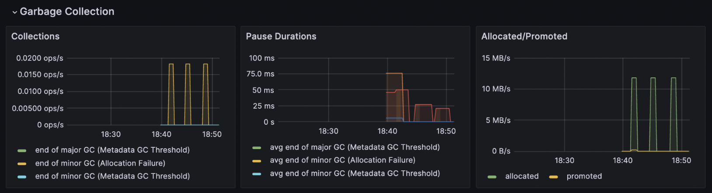

major gc(metadata gc)는 75ms, minor gc(allocation gc)는 25ms로 많이 준걸 확인할 수 있다.

그런데 왜, latency는 똑같을까?


mysql 컨테이너의 메트릭을 보니까,

network i/o에서 read는 spring app으로부터 초당 51.8Mb나 받아오는데,

disk i/o의 write 부분을 보면 2.1Mb밖에 되지 않는걸 보니, disk i/o에서 병목이 있는 것 같다.

이전 시행착오에서, mysql tuning한게 4종류 였다.
1. increase buffer pool size
2. disable binary logging
3. increase max_allowed_packet size
4. concurrent_insert setting to ON

이 중에서, 사실상 1번은 read시에 disk i/o줄일려고 캐싱하려는 목적으로 buffer pool size를 늘리는거니까 별 효과 없을 것 같고,

3번의 경우엔, 메트릭을 보니 mysql container가 초당 50Mb/s을 받아오는데, disk i/o write가 초당 2Mb밖에 안되니까, 이걸 더 늘려도 의미 없을 듯 하다.

4번의 경우엔, default setting이 auto인데, bulk-insert같은 heavy-write 시에, mysql이 자동으로 ON으로 바꾸기 때문에, 건드려도 별 차이가 없는 듯 하다.

사실상 2. disable binary logging이 가장 write disk i/o 성능을 높힐 수 있을 것 같으나,

테스트 해보니, 이걸 끄면 최대 disk i/o write 속도가 12kb/s 밖에 나오지 않았다.

왜 그렇게 나오는지는 ppm같은 mysql 전용 모니터링 툴을 붙여서 더 자세히 알아봐야 할 듯 싶다.


# E. 기술적 도전 - Cloud

## a. docker-compose로 개발환경 구성

### 1. 사용한 이유
1. 협업 할 때 개발자 머신마다 아키텍처 달라서(amd64/arm64/linux) 거기에 호환되는 버전 찾아 맞추는게 번거로운데, redis:latest 해놓으면 알아서 설치해주기에 편하다.
2. 도커 이미지 버전 명시해두면 .yml파일로 깃에 버전관리가 된다.
3. jenkins같은 cicd 서버에서 세팅하고 테스트할 때, 기존 빌드 스크립트 방식은 아주 길고 번거롭다. (java, mysql, redis, prometheus, grafana 버전 맞춰서 세팅, 중간에 에러나면 재시도 스크립트 등...) 근데 이건 `docker-compose up` 한방이면 끝난다.
4. 이 외에 모니터링 서버 배포시에도, k6로 부하테스트 할 때에도 docker container로 간편하게 처리했다.


### 2. 시행착오

docker-compose.yml 작성하면서 제일 많이 시행착오 겪은게\
**컨테이너간 통신**이다.\
컨테이너간 통신만 알면 나머지는 그다지 막히는게 없을 것이다.


### step1) 같은 network로 묶기
```yml
networks:
  bridge_network: #frontend, backend, db 같은 네트워크로 묶는 것
    driver: bridge
```

도커 컨테이너끼리 통신할 네트워크를 구성한다.

```yml
services:
  redis:
    container_name: 'redis'
    image: redis:latest
    ports:
      - "6379:6379"
    networks:
      - bridge_network

  ecommerce-app1:
    container_name: 'ecommerce-app1'
    hostname: ecommerce-app1
    build:
      context: ./back/1.ecommerce
      dockerfile: Dockerfile
    ports: #backend server port는 외부 접속을 막아둔다. 다만, 개발시에는 편의를 위해 여는 경우도 있다.
      - "8080:8080" #"HOST_PORT:CONTAINER_PORT"
    environment:
      - SERVER_PORT=8080
      - SPRING_PROFILES_ACTIVE=docker
    networks:
      - bridge_network
    depends_on:
      - redis
      - mysql
    restart: on-failure
```

ecommerce-app1 컨테이너와 redis 컨테이너가 통신하려면, 반드시 같은 'bridge_network'에 묶여있어야 한다.


### step2) 다른 컨테이너의 ip주소는 그 컨테이너의 이름으로 대체해서 적는다.

만약 nextjs container가 `fetch('ecommerce-app1', request);` 하고 싶다고 하자.

그러면 docker-compose.yml에 적은 호스트이름 대로 `http://ecommerce-app1:8080` <-- 여기에 요청해야 한다.

**컨테이너 이름이 해당 컨테이너의 ip주소를 가르킨다.**

도커 컨테이너 특성상 자주 죽었다가 재시작하는걸 염두하고 만들어졌는데,\
그 때마다 새로운 ip를 부여받고, 할당받은 새 ip가 저 이름으로 재매핑되는 원리이다.


### step3) localhost에 요청하는 경우, localhost가 아니라 host.docker.internal로 요청해야 한다.

도커 컨테이너가 생성되거나 재생성될 때 고유한 네트워크에 매번 새로운 ip를 달고 만들어진다.\
따라서 도커 내부에 호스트에 접근할 땐, localhost가 아닌 호스트 머신을 가르키는 host.docker.internal 주소를 사용해야 한다.


ex. 프론트에서 스프링에 데이터 fetch 할 때,\
`curl -X GET http://localhost:8080/products` 가 아닌,\
`curl -X GET http://host.docker.internal:8080/products`로 해야한다.


## b. provisioning: terraform and packer

### 1. 문제

그... 원래 테라폼같은 프로비저닝 툴은 세팅한번 딱 해놓고 버튼한번 누르면 인프라가 샤라락~\
전체 인프라가 돌아가는 중에 인스턴스 스펙 업/다운 하고 싶으면 .tf 파일에서 스펙만 바꾸고 업데이트하면\
자동으로 인스턴스 내리고 새롭게 만들어서 기존거랑 이어주는 맛으로 쓰는건데....

내가 테라폼을 찾게 된 이유는,\
부하테스트하려고 aws 세팅 찾아서 했는데, 내리고 다시 세팅하려니까 너무 귀찮았다.\
그래서 그냥 냅뒀는데...\
요금이 생각 이상으로 많이 나오더라.. 맘 찢어진다..\
(도메인 ip도 무료로 사서 신경 꺼놨는데 1년뒤에 자동으로 유료로 바뀌면서 청구되더라... 아...)


aws는 일일히 세팅하는것도 피곤한데, 부하테스트 끝나고 지우는 것도 피곤하다.\
그리고 다 지웠다고 생각했는데 알고보니 ebs, elastic ip 안지워져서 요금청구되는거 볼 때마다 스트레스다.\
왜냐면 인스턴스에 걸려있는 서비스는 그냥 지우면 안지워지고 그걸 걸치는 다른 서비스를 먼저 찾아서 지워야 지워지기 때문..

aws-nuke이라는것도 써봤는데 이것도 가끔씩 에러터지면서 짜잘하게 안지워지는 부분이 있더라.


### 2. 해결책

테라폼 처음 한번만 세팅해두면\
그 이후부터는 `terraform start`, `terraform destroy` 명령어 한방에 인프라가 샤라락! 펼쳐졌다 정리되기 때문에,\
처음 진입장벽만 넘어서 딱 한번만 세팅해두면 이후로 매우 편하다.


부하테스트 실험이 처음하면 생각보다 시행착오가 많다.\
부하수준별 적정 스펙 찾는거나, 부하테스트를 거는 ec2가 생각보다 코어수가 많이 필요하다.\
예를들어 1000RPS 테스트할 때 4코어 ec2로 안되길래 8코어 ec2로도 안되길래\
16코어 ec2로 해도 터지길래 32코어로 하니까 됬다.\
그리고 32코어 인스턴스, RDS, ALB, 모니터링 서버, elastic cache(cluster이면 더 비싸짐) 등 생각보다 엄청 비싼데,\
힘들게 세팅했는데 밤이 깊어서 내일 해야지~ 낼 모래 해야지~ \
미뤘다간 15일날인가 청구서 보고 손발이 덜덜 떨리는걸 경험하게된다.

부하테스트의 RPS가 올라갈 수록 생각 이상으로 비싸지니까\
`terraform start`가 땅! 끝나는 순간\
바로 부하테스트 걸고\
끝나자마자 모니터링 서버 화면 전체캡쳐 한 후\
바로 `terraform destroy`를 눌러야\
최소한의 돈으로 부하테스트를 할 수 있다.\
(이거 진짜 꿀팁임)


### 3. 다른 좋았던 점
provisioning 기능 + 부하테스트시 유용하다는 장점 이외에 의외의 장점이 있다.

**aws 이해에 도움을 준다.**

왜냐면 aws 홈페이지에서 인프라 세팅하면 건드릴 수 있는 옵션이 많은데\
대충 중요한것만 세팅하고 넘겨도 내부적으로 자동세팅 해준다.

근데 테라폼 코드는 한글자만 잘못쳐도 에러를 뱉기 때문에 자세히 알아야 한다.\
vpc, sg(security_group), rt(route_table), igw(internet_gateway) 이런 개념들 부터 시작해서

```terraform
module "vpc" {
  source                           = "terraform-aws-modules/vpc/aws"
  version                          = "5.5.0"

  name                             = "${var.namespace}-vpc"
  cidr                             = "10.0.0.0/16"

  azs                              = data.aws_availability_zones.available.names
  private_subnets                  = ["10.0.1.0/24", "10.0.2.0/24", "10.0.3.0/24"]
  public_subnets                   = ["10.0.101.0/24", "10.0.102.0/24", "10.0.103.0/24"]
  database_subnets                 = ["10.0.21.0/24", "10.0.22.0/24", "10.0.23.0/24"]
  elasticache_subnets              = ["10.0.31.0/24", "10.0.32.0/24"]

  create_database_subnet_group     = true
  enable_nat_gateway               = true
  single_nat_gateway               = true
}
```
cidr로 ip의 서브넷 나눠서 ec2, db, redis 서버에게 내부ip 할당하는걸 수동으로 해줘야 한다.

추가적으로 .tf 파일은 git으로 버전관리 된다는 것도 이점이다.


### 4. packer도 전통적인 alb-ec2-rds에서 scaleout시 유용하게 쓰일 수 있다.

packer는 비유하자면 약간 도커 컨테이너에 이것저것 설치해놓고\
이미지로 말아 도커 레지스트리에 올린거의 aws 버전이다.

1. ec2 띄우고
2. 이것저것 설치하고
3. 프로젝트 클론 뜨고
4. 빌드하고
5. 실행한다

이 과정에서 1 & 2번을 미리 해놔서 저장해놓는게 packer가 하는 일이다.


요즘은 대부분 도커로 올리면 클라우드에서 자동으로 scale-out 해주는데,\
전통적인 방식의 ec2 scale-out 하려면 앞단에 ALB 붙이고 특정 부하 시점이 오면,\
packer로 만들어놓은 ec2-ami 띄운 후, 배포 스크립트 실행시키는 식으로 스케일아웃 한 걸로 안다.


## c. monitoring: prometheus and grafana + PMM

### 1. 문제
서버를 구축하면, 에러 예방/핸들링, 성능 튜닝을 위한 스트레스 테스트 메트릭을 뽑기 위해 모니터링 서버를 구축해야 한다.

### 2. EC2 모니터링 선택

ec2 monitoring을 위해 고려한 APM 툴은 3가지 이다.
1. datadog
2. uptime kuma
3. prometheus + grafana

---
3. prometheus + grafana를 선택하였다.

- 이유
	1. 가장 현업에서 자주 쓴다는 datadog를 차용하려고 했지만, 간단한 WAS 서버 APM 최소비용만 월 `31$`이고, 이 외에 DB 모니터링은 최소 월 `70$` 부터 시작이라, 토이 프로젝트 치고 가격이 너무 쎄서 다른 툴을 쓰기로 했다.
	2. APM 오픈소스중에 uptime kuma라는 툴이 있는데, 예전에 사용해본 경험이 있어 다른 툴 대비 익숙하고, 사용법도 간단하고, 스타 수도 46000개 정도 되고, 현재까지도 업데이트가 잘 이루어지고 있어서 써볼까 했으나, 후술할 이유로 인해 사용하지 않았다.
	3. prometheus + grafana 조합이 현업에서 자주 이용되는 점과, 추후 이 프로젝트를 monolith에서 MSA로 변경할 때, k8s APM 툴로 prometheus를 많이 사용한다고 한다.


### 3. mysql 모니터링 도구 선택
mysql은 percona사에서 오픈소스로 제공하는 PMM(percona monitoring management)를 쓰기로 했다.

무료 mysql 모니터링 도구중에 메트릭제공이 상세하고, 사람들이 많이 쓰기 때문이다.


### 4. 구현 화면
#### 4-1. ec2 monitoring
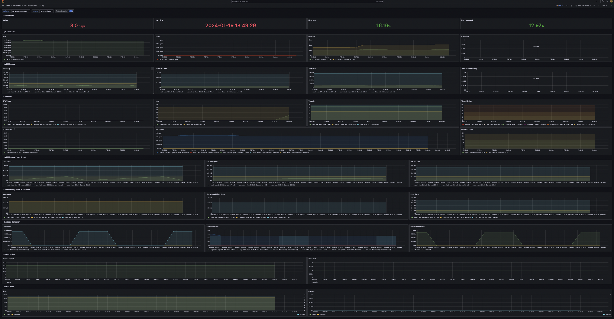

1. spring API 서버의 APM을 spring actuator + prometheus + grafana로 구성했다.
2. jvm metric dashboard는 가장 사람들이 많이 다운받은 micrometer에서 제공한 jvm metric dashboard을 썼다. (5.7M download)

#### 4-2. RDS monitoring using PMM

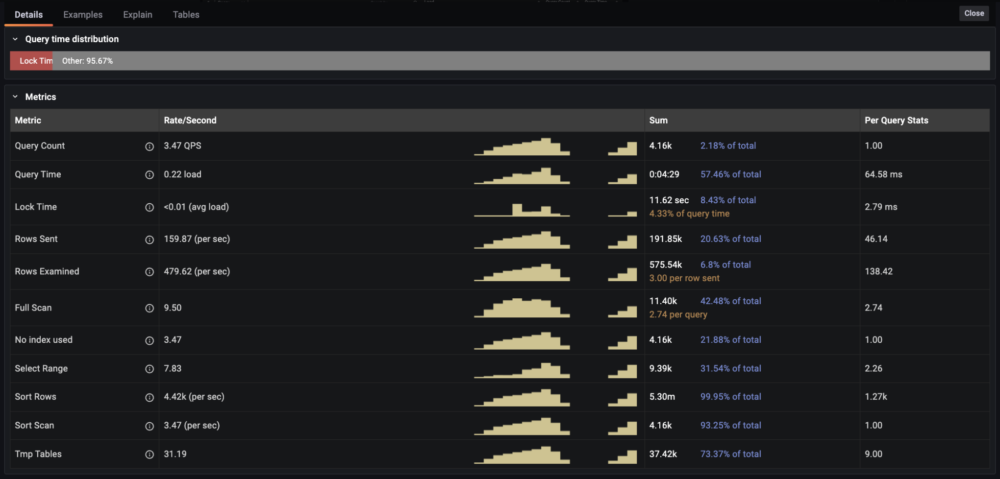


## d. 시행착오 - 배포서버에서 log는 error랑 warn만 키자


### a. 사건의 발단

대규모 트래픽을 견디는 아키텍처를 만들기 위해 먼저 aws에 간단한 3 tier architecture를 구상했다.

가볍게 초당 10 http request를 보냈는데, 이상하게도, latency가 4초나 걸렸다.

API 서버의 응답 latency는 500ms 이하여야 한다는 권장사항을 차치하더라도,

4초면 너무 오래걸리는거 아닌가? 라는 생각에 문제의 원인을 찾아보게 되었다.


#### 1. AWS 아키텍처

1. application load balancer
2. ec2
	- t2.small
		- vCPU = 1
		- RAM = 2 GiB
3. rds
	- mysql 8.0.35
	- db.t2.micro
		- vCPU = 1
		- RAM = 1 GiB
		- storage = 10 GiB


#### 2. load test 결과

```
 data_received..................: 83 MB  70 kB/s
 data_sent......................: 259 kB 216 B/s
 http_req_blocked...............: avg=139.45µs min=4.25µs   med=12.25µs max=53.52ms p(90)=26.77µs  p(95)=45.42µs
 http_req_connecting............: avg=95.88µs  min=0s       med=0s      max=19.09ms p(90)=0s       p(95)=0s
✗ http_req_duration..............: avg=4.24s    min=357.35ms med=4.49s   max=8.71s   p(90)=6.9s     p(95)=7.6s
   { expected_response:true }...: avg=4.24s    min=357.35ms med=4.49s   max=8.71s   p(90)=6.9s     p(95)=7.6s
 http_req_failed................: 0.00%  ✓ 0        ✗ 1748
 http_req_receiving.............: avg=6.86ms   min=223.95µs med=3.06ms  max=96.91ms p(90)=20.11ms  p(95)=28.44ms
 http_req_sending...............: avg=90.61µs  min=16µs     med=71.22µs max=3.43ms  p(90)=154.31µs p(95)=209.99µs
 http_req_tls_handshaking.......: avg=0s       min=0s       med=0s      max=0s      p(90)=0s       p(95)=0s
 http_req_waiting...............: avg=4.23s    min=355.99ms med=4.49s   max=8.71s   p(90)=6.89s    p(95)=7.59s
 http_reqs......................: 1748   1.456067/s
 iteration_duration.............: avg=5.24s    min=1.35s    med=5.5s    max=9.71s   p(90)=7.91s    p(95)=8.6s
 iterations.....................: 1748   1.456067/s
 vus............................: 1      min=1      max=10
 vus_max........................: 10     min=10     max=10
```

- latency(http_req_duration)가 약 4초로 매우 느린걸 확인할 수 있다.
	- latency: 의 평균이 4.24s,이고 정규분포에 90%, 95% 구간에서는 약 7초나 걸렸다.
	- minimum latency가 357ms인걸 보면, 초반 부하가 몰리지 않은 request는 빨리 처리되는데, 부하가 늘면서 병목현상이 생기는 듯 하다. 왜 일까?


#### 3. 모니터링 분석

##### 3-1. API server monitoring
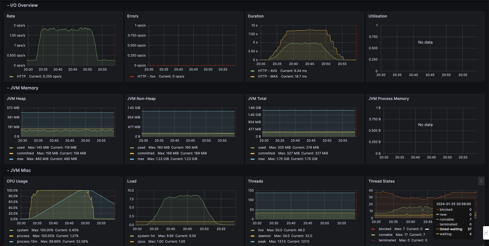

1. jvm thread state를 보면 48개의 demon jvm thread들 중에 time-waiting state인 쓰레드의 숫자가 37개가 된다.
	- TIME_WAIT 상태란 특정 조건(꺠우는 함수가 호출되거나, 특정 시간이 지나거나)을 요구하는 상태이다.
		- ex1) I/O operation(ex. database의 요청)을 기다리고 있어서가 이유가 될 수 있다.
		- ex2) synchronization lock을 기다려서 일 수도 있다.
	- RDS에서 1초당 10개의 request를 처리를 못해서 처리가 밀렸기 때문에 TIME_WAITING 상태 쓰레드가 37개로 늘어나지 않았을까? 의심할 수 있다.
	- (추후 RDS monitoring에서 확인될 내용인데, RDS의 database connections 수가 10개밖에 안된다.)
2. cpu usage가 100%를 찍었다.
	- CPU throttling이 high latency에 원인이 될 수 있다.


---
##### 3-2. RDS monitoring
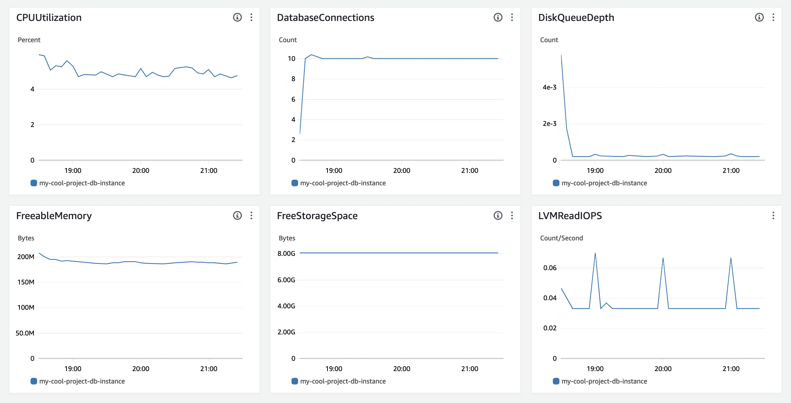

1. read시 lock 문제는 아닌 듯 하다.
	- mysql8의 InnoDB는 transaction isolation level에서 REPEATABLE READ가 기본 세팅이라, write/update/delete에는 락을 걸지만, read에는 lock을 걸지 않는다.
	- 그런데 부하 테스트를 건 쿼리는 read query이기 때문에, lock 문제는 아닌 듯 하다.
	- 만약에 lock 문제였다면, CPU usage가 5%보다 훨씬 더 많이 나왔을 것이라 추측된다.
2. query를 잘못짜서 생기는 문제일 수도 있다.
3. database connections의 갯수가 너무 적어서 생긴 문제일 수 있다.
	- database connection 수가 10개밖에 안되는데, 저게 만약 jvm demon thread에 요청을 받아 처리하는 쓰레드 갯수라면, t2.micro ec2의 jvm demon thread의 수인 50개 대비, 1/5 밖에 되지 않는다.


---
#### 4. 결론
high latency의 원인은 다음으로 유추할 수 있다.

1. database의 문제
	1. query가 느린 경우 -> sql tuning을 해야한다.
	2. database connections 갯수가 부족한 경우 -> connections 수를 늘리거나, connections을 만들기 위한 RDS의 RAM을 늘려야 한다.
	3. RDS network bandwidth이 너무 적어서 생긴 문제인지 확인한다.
2. ec2의 문제
	1. 코어 수 부족 -> vCPU를 늘린다. (가장 간단하나 돈이 든다)
	2. HikariCP의 jdbc connections 설정에 이상 없나 확인한다.
	2. 빈번한 GC가 일어나는지 확인 후 어플리케이션 코드 개선한다.
3. load balancer
	1. 현재 L7 load balancer로 구성되있는데, 어짜피 현 프로젝트에서는 http request을 열어서 ALB가 로깅한다거나 등 별도 처리를 안하니까, L7 load balancer로 변경한다.


### b. 가설1 - RDS의 connections 수가 부족해서 latency가 높아졌다.


#### 1. 문제 원인 예측

##### 1-1. jvm threads 대비 database connection의 갯수가 현저히 적다.

ec2 성능 메트릭 중에, thread state를 보면, time-waiting 상태인 쓰레드가 37개나 있다.


반면 RDS의 database connections 갯수는 10개밖에 되지 않는다.

RDS의 커넥션 갯수가 jvm 요청 쓰레드 수에 비해 훨씬 부족하기 때문에, 쓰레드가 기다리는 시간이 길어져 latency가 높아진게 아닐까?

##### 1-2. min latency 와 평균 latency의 차이가 매우 크다.
```
http_req_duration..............: avg=4.24s    min=357.35ms med=4.49s   max=8.71s   p(90)=6.9s     p(95)=7.6s
```
가장 빠른 latency가 350ms인데, 평균값이 4.2초, 최대가 7.6초나 된다.

첫 10 requests들은 jvm thread 10개가 database connections 10개에 병렬로 요청을 하고 빠르게 처리되니까 빠른데, 요청수가 쌓이게 되면서 RDS에서 동시요청 처리할 connections 갯수가 적어서 생긴 문제가 아닐까? 예측할 수 있다.

추가적인 jvm threads 38개가 database connections 10개의 처리를 기다리게 되면서 latency가 올라간게 아닐까?


EC2가 데이터베이스로 요청을 넣고 기다리는 쓰레드가 약 40개인데,

RDS의 max_connections 숫자는 10개밖에 되지 않는게 high latency의 원인이 아닐까?


#### 2. 해결방안

#### 2-1. max_connections 숫자를 늘려보자.
1. [aws RDS 공식문서에서 권장하는 공식](https://docs.aws.amazon.com/AmazonRDS/latest/UserGuide/CHAP_Limits.html#RDS_Limits.MaxConnections)에 따라 max database connections 수를 설정한다.
	- max database connections 수는 동시요청 수에 비례해 맞추는게 좋다.
	- ex) 현재 load test의 동시접속자 수는 10명이니까, 최소 10개 이상의 database connections 수를 설정하는게 좋다.
	- ex) 만약 load test의 동시접속자 수가 100명으로 늘어나면, 최소 100개의 database connections을 지원할 수 있도록 RDS RAM의 스펙업을 해주어야 한다.
2. RDS instance spec을 늘려도 해결 가능하나, max connections 수를 먼저 늘려서 테스트를 해보자. spec up을 월 이용요금이 늘어나기 때문이다.


#### 2-2. RDS의 적정 max database connection 수 계산하는 방법
1. [aws RDS 공식문서](https://docs.aws.amazon.com/AmazonRDS/latest/UserGuide/CHAP_Limits.html#RDS_Limits.MaxConnections)에 따르면, RDS 종류와 스펙마다 적정 maximum database connections size를 정하는 공식이 있다.
2. mysql8 engine에서 max connections 수를 구하는 공식은 다음과 같다.
	- DBInstanceClassMemory/12582880
		- 예를들어, 8GiB RAM은 8,589,934,592 bytes 이고,
		- 8,589,934,592 bytes / 12582880 = 683 max database connections 이라는 수가 나온다.
		- 하지만 공식문서에서는 683개를 다 쓰진 않고, os와 rds자체를 메니징 하는 프로세스를 위해 50개정도 빼고 약 630개 정도로 설정하기를 권장한다.
3. 주의사항) 주어진 RAM 대비 너무 많은 connections 갯수를 부여하는 것 역시, RAM 부족 현상이 생겨 'incompatible parameters' 상태라는 문제가 발생한다고 한다. ([incompatible paramters 문제의 해결책이 적힌 docs](https://docs.aws.amazon.com/AmazonRDS/latest/UserGuide/CHAP_Troubleshooting.html#CHAP_Troubleshooting.incompatible-parameters-memory))

#### 2-3. 1 GiB RAM에서 적정 max database connections 수 계산하기

기존 db.t2.micro의 기본 커넥션 수가 10개밖에 되지 않지만,\
1GiB RAM in bytes / 12572880 = 약 79개 정도로,\
os & rds 관리용 50개를 빼고 약 30개 정도를 max connection size로 설정해 주어도 지금보다는 latency가 훨씬 빨라질 것으로 예측된다.

#### 2-4. database 인스턴스 타입에 따른 default max_connections 수
```
1. RDS
t2.micro: 66
t2.small: 150
m3.medium: 296
t2.medium: 312
M3.large: 609
t2.large: 648
M4.large: 648
M3.xlarge: 1237
R3.large: 1258
M4.xlarge: 1320
M2.xlarge: 1412
M3.2xlarge: 2492
R3.xlarge: 2540


2. Autora
db.t2.small:    45
db.t2.medium:   90
db.t3.small:    45
db.t3.medium:   90
db.t3.large:    135
db.t4g.medium:  90
db.t4g.xlarge:  135
db.r3.large:    1000
db.r3.xlarge:   2000
db.r3.2xlarge:  3000
db.r3.4xlarge:  4000
db.r3.8xlarge:  5000
db.r4.large:    1000
db.r4.xlarge:   2000
db.r4.2xlarge:  3000
db.r4.4xlarge:  4000
db.r4.8xlarge:  5000
db.r4.16xlarge: 6000
db.r5.large:    1000
db.r5.xlarge:   2000
db.r5.2xlarge:  3000
db.r5.4xlarge:  4000
db.r5.8xlarge:  5000
db.r5.12xlarge: 6000
db.r5.16xlarge: 6000
db.r5.24xlarge: 7000
db.r6g.large	1000
db.r6g.xlarge	2000
db.r6g.2xlarge	3000
db.r6g.4xlarge	4000
db.r6g.8xlarge	5000
db.r6g.12xlarge	6000
db.r6g.16xlarge	6000
db.r6i.large	1000
db.r6i.xlarge	2000
db.r6i.2xlarge	3000
db.r6i.4xlarge	4000
db.r6i.8xlarge	5000
db.r6i.12xlarge	6000
db.r6i.16xlarge	6000
db.r6i.24xlarge	7000
db.r6i.32xlarge	7000
db.x2g.large	2000
db.x2g.xlarge	3000
db.x2g.2xlarge	4000
db.x2g.4xlarge	5000
db.x2g.8xlarge	6000
db.x2g.12xlarge	7000
db.x2g.16xlarge	7000
```

connections 수에서 50~60개 정도는 os와 통신 용도, database 관리 목적으로 쓰여서, 실제로 API server와 통신하는 connections 수는 저 숫자에서 55정도를 빼야한다. (ex. t2.micro: 66 -> 10)

max connection 수를 수동으로 올려줄 수 있지만, 성능 이상의 요청이 발생하면 DB 자체의 문제가 생길 우려가 있으므로 aws에서는 기본값을 사용 하시고 여유있게 설정하는 것을 권장한다고 한다.


그런데 10RPS 정도라면 10개정도만 늘려도 충분할 것 같으니까, 수동으로 늘려보자.


#### 2-5. connections 갯수를 구하는 쿼리
max_connections을 구하는 query
```sql
mysql> SHOW GLOBAL VARIABLES LIKE 'max_connections';
+-----------------+-------+
| Variable_name   | Value |
+-----------------+-------+
| max_connections | 10    |
+-----------------+-------+
1 row in set (0.09 sec)
```


현재 ACTIVE STATE한 스레드(connection)를 구하는 query

```sql
mysql> SHOW STATUS LIKE 'Threads_connected';
+-------------------+-------+
| Variable_name     | Value |
+-------------------+-------+
| Threads_connected | 2     |
+-------------------+-------+
1 row in set (0.01 sec)
```


#### 3. 실험1 - 수동 설정으로 connections 숫자 늘리기

##### 3-1. instance spec
1. application load balancer
2. ec2
	- t2.small
		- vCPU = 1
		- RAM = 2 GiB
3. rds
	- mysql 8.0.35
	- db.t2.micro
		- vCPU = 1
		- RAM = 1 GiB
		- max connections = 75 (default = 60)


##### 3-2. max connections 수 변경

RDS에 접속하여 직접 max_connections 수를 올리려고 했지만,

root user로 RDS 접속은 보안 문제상 AWS에서 막았기 때문에 권한 문제로 실패했다.

AWS RDS terraform code에서 parameter group을 추가해 max_connections 값인 75을 넣는다.

```terraform
resource "aws_db_parameter_group" "my-rds-parameter-group" {
  name        = "${var.namespace}-mysql-parameters"
  family      = "mysql8.0"  # Ensure this matches your database engine version
  description = "Custom parameter group for ${var.namespace}"

  parameter {
    name  = "max_connections"
    value = 75
  }
}

resource "aws_db_instance" "database" {
  allocated_storage      = 10
  engine                 = "mysql"
  engine_version         = "8.0"
  instance_class         = "db.t4g.micro"
  identifier             = "${var.namespace}-db-instance"
  /* name                   = "ecommerce" */ //deprecated field: "name"
  db_name                = "ecommerce"
  username               = "admin"
  /* password               = random_password.password.result */
  password               = "adminPassword"
  db_subnet_group_name   = var.vpc.database_subnet_group #B
  vpc_security_group_ids = [var.sg.db] #B
  skip_final_snapshot    = true

  # Associate the custom parameter group with the RDS instance
  parameter_group_name = aws_db_parameter_group.my-rds-parameter-group.name
}
```

`terraform apply`를 하면,


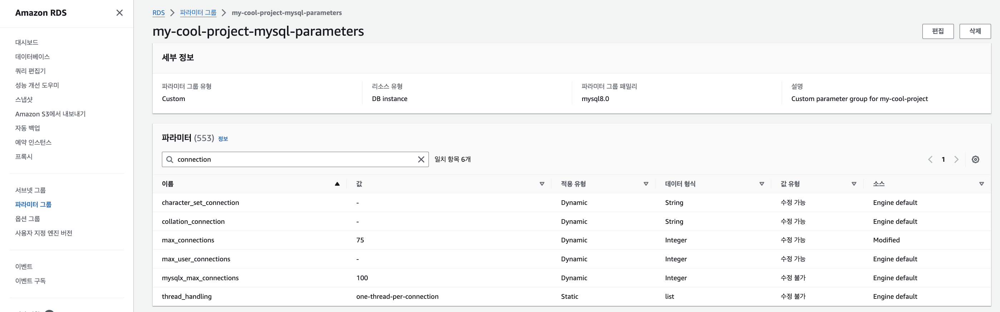

RDS 파라미터 그룹에 max_connections의 값이 75으로 modified 된걸 확인할 수 있다.

(100개로도 설정해 보았는데, 1GiB에서 너무 많이 설정하면 에러나는지 실패했다. 적당히 15개정도만 늘리니까 성공!)

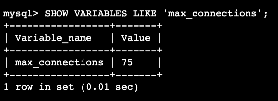

mysql에 직접 접속해서 max_connections 수가 75개 임을 확인했다.


##### 3-3. 테스트 결과

```k6
 data_received..................: 86 MB  71 kB/s
 data_sent......................: 178 kB 148 B/s
 http_req_blocked...............: avg=161.72µs min=5µs      med=13.58µs max=41.72ms  p(90)=23.7µs   p(95)=37.5µs
 http_req_connecting............: avg=114.87µs min=0s       med=0s      max=19.45ms  p(90)=0s       p(95)=0s
✗ http_req_duration..............: avg=6.62s    min=592.05ms med=7.1s    max=15.47s   p(90)=10.06s   p(95)=10.74s
   { expected_response:true }...: avg=6.62s    min=592.05ms med=7.1s    max=15.47s   p(90)=10.06s   p(95)=10.74s
 http_req_failed................: 0.00%  ✓ 0        ✗ 1205
 http_req_receiving.............: avg=12.81ms  min=376.29µs med=8.97ms  max=65.86ms  p(90)=28.79ms  p(95)=36.41ms
 http_req_sending...............: avg=87.25µs  min=13.25µs  med=72.79µs max=665.12µs p(90)=142.99µs p(95)=200.89µs
 http_req_tls_handshaking.......: avg=0s       min=0s       med=0s      max=0s       p(90)=0s       p(95)=0s
 http_req_waiting...............: avg=6.6s     min=590.56ms med=7.1s    max=15.46s   p(90)=10.05s   p(95)=10.73s
 http_reqs......................: 1205   1.002686/s
 iteration_duration.............: avg=7.62s    min=1.59s    med=8.1s    max=16.48s   p(90)=11.06s   p(95)=11.74s
 iterations.....................: 1205   1.002686/s
 vus............................: 1      min=1      max=10
 vus_max........................: 10     min=10     max=10
```

평균 latency가 4초 -> 6초로 오히려 더 느려졌다(?!)

임의로 rds의 max_connections 수를 바꾸지 말고. 동시요청 수 대비 default max_connection 수준에 맞게 스펙업 하라는 조언이 유효한 것 같다.


#### 3-4. 모니터링 분석

##### 3-4-1. RDS monitoring
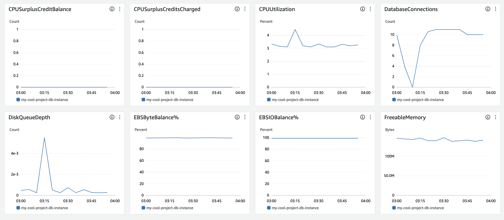

database connection 수가 증가하지 않았다!


#### 3-5. 결론

db.t2.micro의 connections 수를 수동으로 60 -> 75로 늘렸는데도, 모니터링된 database connections의 수는 기존에 10~11개와 동일했다.

이미 default connections 숫자가 최적화 되있는 듯 하다.

max_connections 수를 임의로 조절하는 방법 보다는, 권장사항에 맞게 스펙업 해야할 듯 싶다.


#### 4. 실험2 - RDS spec up을 해서 max_connections 수를 늘리자

##### 4-1. RDS class별 max_connections 숫자
```
RDS의 class별 max_connections 수

t2.micro: 66
t2.small: 150
m3.medium: 296
t2.medium: 312
M3.large: 609
t2.large: 648
M4.large: 648
M3.xlarge: 1237
R3.large: 1258
M4.xlarge: 1320
M2.xlarge: 1412
M3.2xlarge: 2492
R3.xlarge: 2540
```

t2.micro -> t2.small로 스케일업 하면, default max_connections 숫자가 늘어난다!


##### 4-2. 테스트 환경
1. application load balancer
2. ec2
	- t2.small
		- vCPU = 1
		- RAM = 2 GiB
3. rds
	- mysql 8.0.35
	- db.t2.small
		- vCPU = 2
		- RAM = 2 GiB
		- storage = 10 GiB
		- max connections = 150 (default)


##### 4-3. 테스트 결과
```
 data_received..................: 83 MB  69 kB/s
 data_sent......................: 256 kB 213 B/s
 http_req_blocked...............: avg=124.12µs min=4.33µs   med=14.2µs  max=54.13ms  p(90)=31.68µs  p(95)=51.44µs
 http_req_connecting............: avg=71.02µs  min=0s       med=0s      max=14.53ms  p(90)=0s       p(95)=0s
✗ http_req_duration..............: avg=4.25s    min=368.82ms med=4.5s    max=10.05s   p(90)=6.57s    p(95)=7.22s
   { expected_response:true }...: avg=4.25s    min=368.82ms med=4.5s    max=10.05s   p(90)=6.57s    p(95)=7.22s
 http_req_failed................: 0.00%  ✓ 0        ✗ 1744
 http_req_receiving.............: avg=7.76ms   min=168.58µs med=3.53ms  max=226.55ms p(90)=21.28ms  p(95)=28.26ms
 http_req_sending...............: avg=99.91µs  min=15.54µs  med=81.81µs max=2.34ms   p(90)=165.26µs p(95)=219.65µs
 http_req_tls_handshaking.......: avg=0s       min=0s       med=0s      max=0s       p(90)=0s       p(95)=0s
 http_req_waiting...............: avg=4.24s    min=366.98ms med=4.49s   max=10.03s   p(90)=6.56s    p(95)=7.2s
 http_reqs......................: 1744   1.451946/s
 iteration_duration.............: avg=5.25s    min=1.37s    med=5.5s    max=11.05s   p(90)=7.57s    p(95)=8.22s
 iterations.....................: 1744   1.451946/s
 vus............................: 1      min=1      max=10
 vus_max........................: 10     min=10     max=10
```
db.t2.micro와 성능차이가 없다?!

1. fail율 0%
2. average latency 약 4초


##### 4-4. 모니터링 분석

##### 4-4-1. EC2 모니터링


micro와 비교했을 때 변한게 없다.

##### 4-4-2. RDS 모니터링
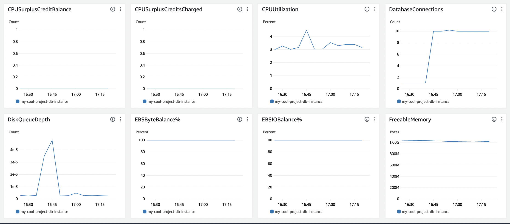

database connections 수가 여전히 10개이다?!

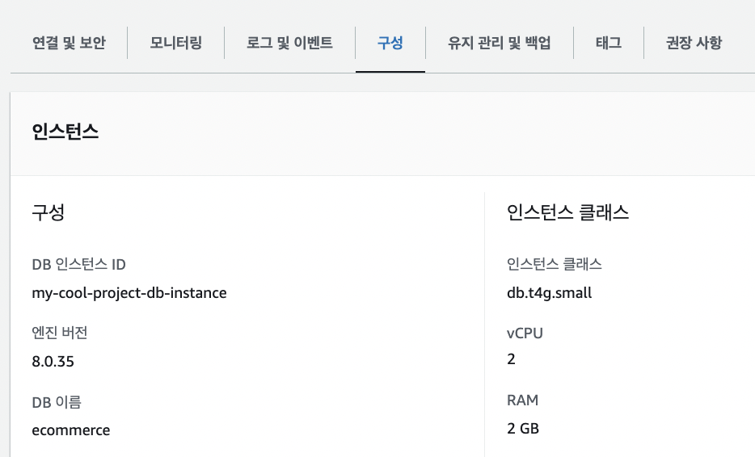

db.t2.small의 RAM이 2GiB이다. (micro는 1GiB)


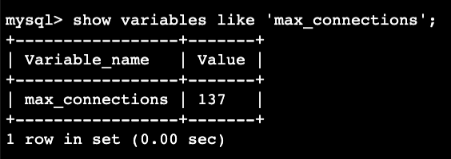

그런데 RDS에 접속해서 max connections 수를 봤는데 137개이다.


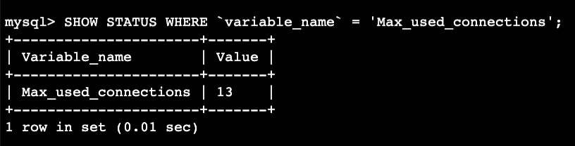

그런데 RDS monitoring에서 관측된 로드 테스트 때 사용된 최대 connections 수는 13개밖에 쓰이지 않았다.

```mysql
mysql> show variables like 'max_connections';
+-----------------+-------+
| Variable_name   | Value |
+-----------------+-------+
| max_connections | 137   |
+-----------------+-------+
1 row in set (0.01 sec)
```

```
mysql> show global status like '%connections%';
+-----------------------------------+---------------------+
| Variable_name                     | Value               |
+-----------------------------------+---------------------+
| Connection_errors_max_connections | 0                   |
| Connections                       | 81                  |
| Max_used_connections              | 13                  |
| Max_used_connections_time         | 2024-01-27 08:35:38 |
+-----------------------------------+---------------------+
4 rows in set (0.00 sec)
```


##### 4-5. 결론
max_connections가 138개 까지 늘어나도, 10 RPS에서는 connections를 어짜피 최대 13개밖에 사용하지 않았다.

RDS connections의 문제는 아닌 듯 하다.


### c. 가설2 - query가 느려서 latency가 높아졌다.


#### 1. 성능 모니터링할 쿼리

```sql
SELECT
	p.product_id,
	p.name,
	p.description,
	p.rating,
	p.rating_count,
	c.category_id,
	c.name,
	o.option_id,
	o.value,
	ov.value,
	pi.quantity,
	pi.price
FROM product as p
JOIN category as c ON p.category_id = c.category_id
JOIN product_item as pi ON p.product_id = pi.product_id
JOIN product_option_variation as pov ON pi.product_item_id = pov.product_item_id
JOIN option_variation as ov ON ov.option_variation_id = pov.option_variation_id
JOIN `option` as o ON o.option_id = ov.option_id
WHERE c.category_id = 50;
```

#### 2. 실행계획
`EXPLAIN ANALYZE`로 mysql 실행계획을 들여다보자.

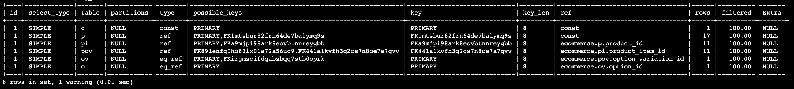

PK와 인덱스를 잘 타는걸 확인할 수 있다.

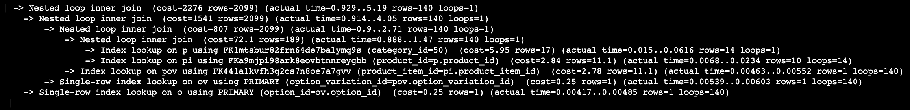

```
- Nested loop inner join (cost=2276, rows=2099) (actual time=6.82..9.34, rows=190, loops=1)
  - Nested loop inner join (cost=1541, rows=2099) (actual time=6.81..8.78, rows=190, loops=1)
    - Nested loop inner join (cost=807, rows=2099) (actual time=6.76..8.04, rows=190, loops=1)
      - Nested loop inner join (cost=72.1, rows=189) (actual time=5.79..6.48, rows=190, loops=1)
        - Index lookup on table 'p' using index 'FK1mtsbur82frn64de7balymq9s' (category_id=50) (cost=5.95, rows=17) (actual time=5.56..5.83, rows=19, loops=1)
        - Index lookup on table 'pi' using index 'FKa9mjpi98ark8eovbtnnreygbb' (product_id=p.product_id) (cost=2.84, rows=11.1) (actual time=0.0189..0.0329, rows=10, loops=19)
      - Index lookup on table 'pov' using index 'FK441a1kvfh3q2cs7n8oe7a7gvv' (product_item_id=pi.product_item_id) (cost=2.78, rows=11.1) (actual time=0.00765..0.00798, rows=1, loops=190)
    - Single-row index lookup on table 'ov' using PRIMARY index (option_variation_id=pov.option_variation_id) (cost=0.25, rows=1) (actual time=0.00365..0.00369, rows=1, loops=190)
  - Single-row index lookup on table 'o' using PRIMARY index (option_id=ov.option_id) (cost=0.25, rows=1) (actual time=0.00271..0.00274, rows=1, loops=190)
```


Q. total time spent for this query: 10ms 도 안걸린다.

빠르다. 쿼리는 문제 없다.

(actual_time의 단위가 [mysql 공식문서](https://dev.mysql.com/blog-archive/mysql-explain-analyze/)에 따르면 ms 단위이니까, 수천 ms가 걸리는게 아닌걸 볼 수 있다.)


---
#### 3. query profiling

이미 EXPLAIN ANALZE로 쿼리 latency를 어느정도 파악할 수 있지만,\
query profiling로 좀 더 정확한 latency를 구해보자.


```sql
Q. how to profile query in mysql8?

1. SET PROFILE = 1; //enable profiling
2. run query I want to profile
3. SHOW PROFILES;
4. SHOW PROFILE FOR QUERY 1;
5. SET profiling = 0; //disable profiling
```

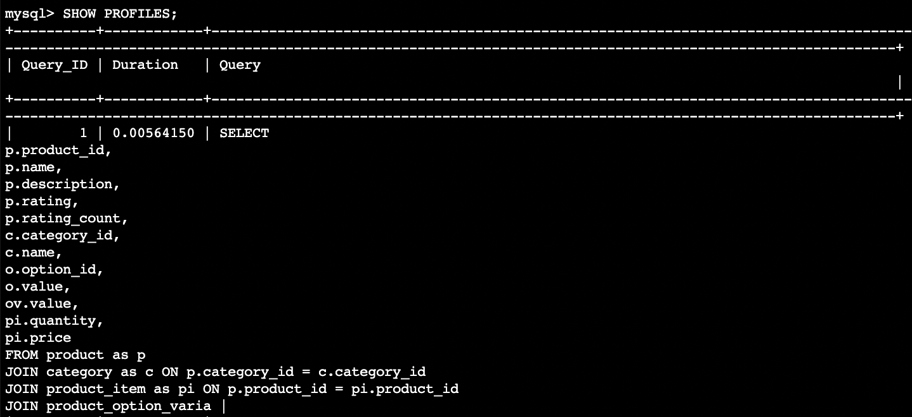

duration: 0.0056 = 5.6ms

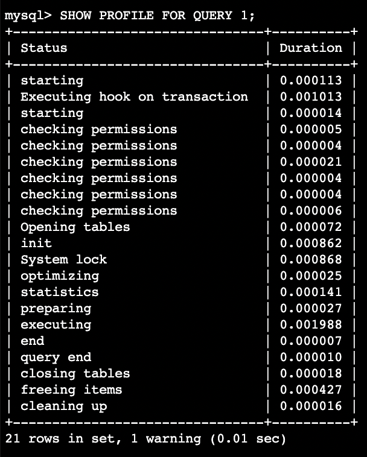


#### 4. 결론
쿼리 실행 속도는 약 5ms로 쿼리의 문제는 아니다.


### d. 가설3 - RDS의 네트워크 문제인가?

#### 1. 문제 원인 예측
[rds instance spec 비교 사이트](https://www.cloudzero.com/blog/rds-instance-types/)에 따르면, db.t2.micro의 네트워크 퍼포먼스는 'low to moderate'라고 한다.

t2.micro class는 aws 초창기 때 테스트 목적으로 만든 인스턴스라 네트워크 통신 성능이 매우 낮아서 latency가 느려진게 아닐까?


#### 2. 해결방안
최신 버전인 db.t4g.micro의 네트워크 퍼포먼스를 보면 Up to 5Gbps 라고 하니까, 업그레이드 하면 latency가 개선되지 않을까?


#### 3. 실험 결과

```
 data_received..................: 85 MB  71 kB/s
 data_sent......................: 263 kB 219 B/s
 http_req_blocked...............: avg=123.85µs min=3.75µs   med=13.29µs max=56.36ms  p(90)=24.68µs  p(95)=41.21µs
 http_req_connecting............: avg=75.7µs   min=0s       med=0s      max=16.5ms   p(90)=0s       p(95)=0s
✗ http_req_duration..............: avg=4.14s    min=374.88ms med=4.16s   max=9.77s    p(90)=6.68s    p(95)=7.31s
   { expected_response:true }...: avg=4.14s    min=374.88ms med=4.16s   max=9.77s    p(90)=6.68s    p(95)=7.31s
 http_req_failed................: 0.00%  ✓ 0        ✗ 1780
 http_req_receiving.............: avg=9.8ms    min=255.2µs  med=6.03ms  max=265.49ms p(90)=23.26ms  p(95)=30.52ms
 http_req_sending...............: avg=99.01µs  min=13.5µs   med=79.79µs max=3.54ms   p(90)=155.65µs p(95)=221.3µs
 http_req_tls_handshaking.......: avg=0s       min=0s       med=0s      max=0s       p(90)=0s       p(95)=0s
 http_req_waiting...............: avg=4.13s    min=373.57ms med=4.14s   max=9.76s    p(90)=6.67s    p(95)=7.29s
 http_reqs......................: 1780   1.482386/s
 iteration_duration.............: avg=5.15s    min=1.37s    med=5.17s   max=10.77s   p(90)=7.68s    p(95)=8.31s
 iterations.....................: 1780   1.482386/s
 vus............................: 1      min=1      max=10
 vus_max........................: 10     min=10     max=10
```

다른 조건 동일, db.t4g.micro로 테스트를 한 결과, db.t2.micro과 성능적 차이는 없었다.


#### 4. 결론
RDS의 네트워크 문제가 high latency의 문제는 아니었다.


### e. 가설4 - ec2 spec을 올려보자

Q. ec2 instance의 class를 small 에서 medium 으로 업그레이드 하면 latency가 빨라지지 않을까?


#### 1. ec2 instance 선택 과정
1. 최신 세대인 7세대를 쓴다.
	- 최신 세대일 수록 성능 개선도 있고, 에너지 소비 효율이 좋아 가격도 더 저렴하기 때문이다.
2. 범용 목적인 m class와 cpu 특화 목적인 c class가 있다.
	- 범용 목적 (공통적으로 1 vCPU에 4GiB RAM 제공)
		- m7g.medium: $0.0408 hourly (on-demand)
		- m7a.medium: $0.0580 hourly (on-demand)
	- CPU intensive 목적 (공통적으로 1 vCPU에 2GiB RAM 제공)
		- c7a.medium: $0.0513 hourly (on-demand)
		- c7gn.medium: $0.0624 hourly (on-demand)
		- c7g.medium: $0.0363 hourly (on-demand)
3. 일단 현 실험 문제원인은 ec2의 RAM문제는 아니고, CPU usage문제니까, CPU 작업에 특화된 c class를 선택한다.
4. c class 중에서, 가장 저렴한 c7g.medium 을 선택한다.


#### 2. 테스트 환경

1. application load balancer
2. ec2
	- c7g.medium
		- vCPU = 1
		- RAM = 2 GiB
		- 네트워크 대역폭 = 최대 12.5 Gbps
		- EBS 대역폭 = 최대 10 Gbps
3. rds
	- mysql 8.0.35
	- db.t4g.medium
		- vCPU = 2
		- RAM = 4 GiB
		- max connections = 150 (default)


#### 3. 테스트 결과
```
 data_received..................: 69 MB  57 kB/s
 data_sent......................: 210 kB 175 B/s
 http_req_blocked...............: avg=189.98µs min=4.7µs    med=11.29µs max=55.02ms p(90)=40µs     p(95)=65.68µs
 http_req_connecting............: avg=132.73µs min=0s       med=0s      max=24.55ms p(90)=0s       p(95)=0s
✗ http_req_duration..............: avg=5.4s     min=511.8ms  med=5.73s   max=11.5s   p(90)=8.43s    p(95)=9.4s
   { expected_response:true }...: avg=5.4s     min=511.8ms  med=5.73s   max=11.5s   p(90)=8.43s    p(95)=9.4s
 http_req_failed................: 0.00%  ✓ 0       ✗ 1431
 http_req_receiving.............: avg=8.29ms   min=266.25µs med=7ms     max=39.06ms p(90)=16.49ms  p(95)=18.99ms
 http_req_sending...............: avg=113.01µs min=19.2µs   med=83.08µs max=3.84ms  p(90)=187.08µs p(95)=251.77µs
 http_req_tls_handshaking.......: avg=0s       min=0s       med=0s      max=0s      p(90)=0s       p(95)=0s
 http_req_waiting...............: avg=5.39s    min=509.92ms med=5.72s   max=11.5s   p(90)=8.41s    p(95)=9.4s
 http_reqs......................: 1431   1.19162/s
 iteration_duration.............: avg=6.4s     min=1.51s    med=6.73s   max=12.51s  p(90)=9.43s    p(95)=10.41s
 iterations.....................: 1431   1.19162/s
 vus............................: 1      min=1     max=10
 vus_max........................: 10     min=10    max=10
```

avg latency: 5.4second


ec2 스펙을 올렸는데 레이턴시가 오히려 느려졌다?


#### 4. 모니터링 분석

##### 4-1. EC2 모니터링
1. before: t2.small
	- 
2. after: c7g.medium
	- 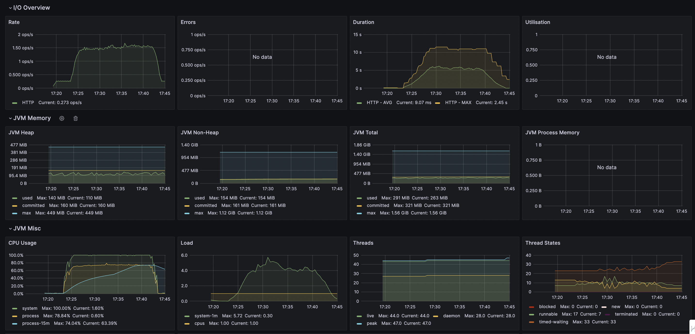

- 달라진 지표
	1. CPU usage에 process가 점유하는게 100% 에서 80%로 떨어졌다.
	2. CPU load의 max치가 7.5에서 6대로 떨어졌다.

이 외 나머지 지표는 전과 동일하다.


#### 5. 결론

1. 아무 생각 없이 EC2 스펙 올린다고 문제가 해결되지는 않는다.
	- process의 CPU 점유율이 100% -> 80%로 떨어진건 좋은 신호이긴 하지만, 결과적으로 latency가 늘어난걸 보면, 별 생각없이 EC2 CPU 업그레이드하면 해결되겠지? 는 해결책이 아닌 듯 하다.
2. CPU 점유율이 떨어졌지만 latency가 늘어난 이유는 아마 CPU throttling이 걸려서 그런 듯 하다.
	- CPU 스로틀링이란, CPU 점유율이 100% 가까이 되면, 과열에 의한 부품손상을 막기 위해 스로틀링이 걸리는데, 이는 클럭과 전압을 강제적으로 낮춰서 성능이 떨어진다.
	- 그래서 latency도 그에 따라 평균 4.2s -> 5.4s 로 늘어난 듯 하다.
3. 컴퓨팅 최적화 인스턴스라지만, 소규모 앱은 코어수 많고 RAM이 더 많은 인스턴스가 훨씬 효과가 좋다.
	- t2.small -> c7g.medium 이 물론 최신 하드웨어를 쓴다고는 하지만, vCPU = 1개, RAM = 2GiB인건 똑같았기 때문에 latency 개선된게 아닌 듯 하다.
	- AWS에서 주장하는 이 EC2는 CPU가 최적화 되있어요~ 메모리가 최적화 되있어요~ 는, 대규모 트래픽처리를 요구하는 CPU | Memory Intensive app에서만 유효한 듯 하다.


### f. 가설5 - core 수를 늘려보자

CPU core 수가 부족해서 스로틀링이 걸린게 아닐까?

여태껏 ec2의 vCPU는 1이었는데, 2개 이상인 ec2 instance를 써보자.


#### 1. ec2 instance 선택 과정
- m class (범용 클래스)
	- m7g.large (2 vCPU, 8 GiB RAM) : $0.0816 hourly
	- m7i.large (2 vCPU, 8 GiB RAM) : $0.1008 hourly
	- m7i-flex.large (2 vCPU, 8 GiB RAM) : $0.0958 hourly
	- m7a.large (2 vCPU, 8 GiB RAM) : $0.1159 hourly
- c class (컴퓨팅 최적화)
	- c7g.large (2 vCPU, 4 GiB RAM) : $0.0816 hourly
	- c7gn.large (2 vCPU, 4 GiB RAM) : unavailable
	- c7i.large (2 vCPU, 4 GiB RAM) : $0.0892 hourly
	- c7a.large (2 vCPU, 4 GiB RAM) : $0.1026 hourly

---
1. 2 vCPU 중 가장 저렴한게 m7g.large, c7g.large 이다.
2. m7g.large vs c7g.large
	- 가설4에서 깨달았듯이, CPU intensive한 앱이 아니기 때문에 범용 목적이더라도 4GiB RAM을 더 주는 m7g.large를 선택한다.


#### 2. 테스트 환경

1. application load balancer
2. ec2
	- m7g.large
		- vCPU = 2
		- RAM = 8 GiB
		- 네트워크 대역폭 = 최대 12.5 Gbps
3. rds
	- mysql 8.0.35
	- db.t4g.medium
		- vCPU = 2
		- RAM = 4 GiB
		- max connections = 150 (default)

#### 3. 테스트 결과

```
 data_received..................: 158 MB 132 kB/s
 data_sent......................: 490 kB 408 B/s
 http_req_blocked...............: avg=91.82µs min=3.91µs   med=12.45µs max=64.96ms p(90)=23.9µs   p(95)=39.33µs
 http_req_connecting............: avg=57.49µs min=0s       med=0s      max=22.54ms p(90)=0s       p(95)=0s
✗ http_req_duration..............: avg=1.74s   min=230.35ms med=1.84s   max=3.9s    p(90)=2.77s    p(95)=2.95s
   { expected_response:true }...: avg=1.74s   min=230.35ms med=1.84s   max=3.9s    p(90)=2.77s    p(95)=2.95s
 http_req_failed................: 0.00%  ✓ 0        ✗ 3335
 http_req_receiving.............: avg=3.41ms  min=188µs    med=2.58ms  max=39.45ms p(90)=6.6ms    p(95)=8.62ms
 http_req_sending...............: avg=95.9µs  min=13µs     med=72.37µs max=4.51ms  p(90)=146.31µs p(95)=212.64µs
 http_req_tls_handshaking.......: avg=0s      min=0s       med=0s      max=0s      p(90)=0s       p(95)=0s
 http_req_waiting...............: avg=1.74s   min=228.9ms  med=1.84s   max=3.89s   p(90)=2.76s    p(95)=2.95s
 http_reqs......................: 3335   2.777399/s
 iteration_duration.............: avg=2.74s   min=1.23s    med=2.84s   max=4.9s    p(90)=3.77s    p(95)=3.96s
 iterations.....................: 3335   2.777399/s
 vus............................: 1      min=1      max=10
 vus_max........................: 10     min=10     max=10
```

1.74s latency (이전: 4.24s)

min은 230ms로 별 차이 안나는데,
median, max가 큰 폭으로 줄었다!


#### 4. 모니터링 분석

##### 4-1. EC2 모니터링
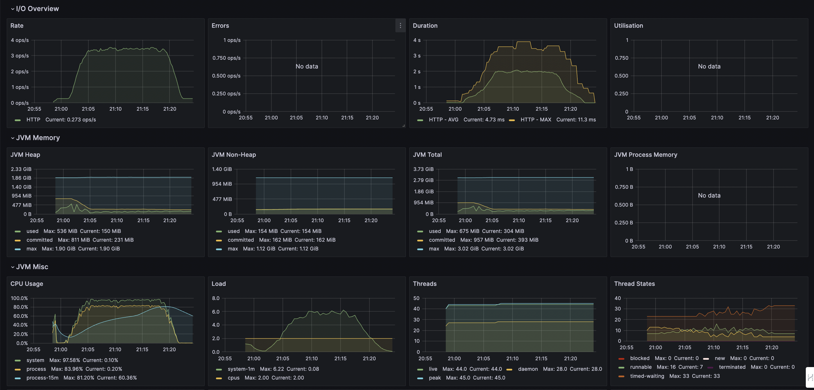

1. CPU usage Peaked at 83.96%
2. CPU load
	- 코어수가 1->2개로 늘어나니, load metric에 cpus가 1->2로 증가한걸 확인할 수 있다.
	- 그런데 여전히 max cpu load치는 6개인걸 보면, ec2 스펙업을 해도 근본원인을 제거하지 않으면, 안된다라는 생각이 든다.


#### 5. 결론


CPU core 수를 올리니까 latency가 빨라졌긴 했지만,

여전히 500ms보다 훨씬 느리다.

CPU나 메모리 등, 리소스 부족 현상이 일어날 경우, 단순히 스펙업을 통해 해결하는건,\
문제의 근본원인 제거할 때 까지인 듯 하다.


### g. 문제의 원인

#### 1. 고민

spring app에 HikariCP datasource 설정을 잡아줘야 하나?

connection pool에 minimum connection 설정을 RDS의 database connections 갯수만큼 올려줘서 요청오면 바로 쓸 수 있도록 해야하나?

load balancer가 L7이라 느린건가? L4로 바꿔줘야하나?

이런 저런 고민을 하던 중,

성능 튜닝관련 책을 찾다가 '자바 성능 튜닝 이야기'라는 책을 보게 되었다.

책 목차에 불필요한 로그 찍지 말라고 적혀있길래

어? 설마?


#### 2. 문제 원인

##### 2-1. 불필요한 로그의 콘솔 출력 및 파일 저장
```xml
<springProfile name="prod">
<include resource="log/console-appender.xml"/> <!-- info | debug | trace 레벨의 로그를 터미널에 출력 -->
<include resource="log/file-info-appender.xml"/>
<include resource="log/file-warn-appender.xml"/>
<include resource="log/file-error-appender.xml"/>

<root level="INFO"> <!-- production 환경에서는 콘솔에서 info | debug | trace 레벨 이상 로그 출력 -->
  <appender-ref ref="CONSOLE"/>

  <appender-ref ref="FILE-INFO"/>
  <appender-ref ref="FILE-WARN"/>
  <appender-ref ref="FILE-ERROR"/> <!-- file-error-appender.xml에 FILE-ERROR이라고 이름 설정해둠 -->
</root>
</springProfile>
```

기존 production 환경 로그 설정 파일이다.

INFO, WARN, ERROR 레벨 로그를 콘솔에 프린트 하고, 파일로 저장까지 하도록 되어있다.

너무 많은 양의 로그 출력과 파일 I/O는 빈번한 GC를 일으키게 되어 CPU throttling이 걸리고, GC의 stop-the-world 시간 때문에 latency가 늘어날 수 있다고 한다.

##### 2-2. log와 GC의 상관관계

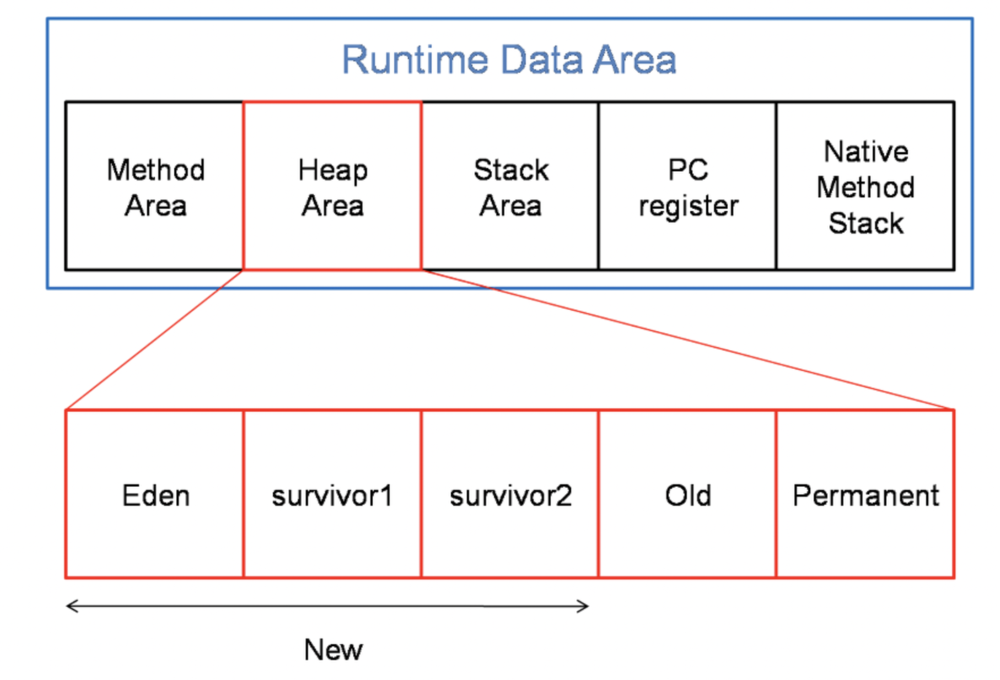

1. INFO, DEBUG 레벨 로그까지 콘솔 프린트 하면, new StringBuffer()로 객체를 생성한다.
2. 객체를 생성하면 JVM Runtime Data Area에 Heap 영역에 저장되게 된다.
3. 맨 처음엔 Eden에 저장되지만, INFO, DEBUG 레벨 로그가 너무 많으면 Eden -> survivor로, survivor space -> old space로 메모리를 이전하는데,
4. 옮길 공간이 꽉차있으면 먼저 메모리 해제부터 하고 메모리 공간 마련한 다음 옮겨야 한다.
5. 이 때, Eden -> Survivor이나, Survivor -> Survivor 옮길 때 메모리 공간 비우는건 minor GC, survivor -> old space로 옮길 때 메모리 공간 비우는걸 major gc라고 한다.


#### 3. 해결방안

1. 서버 로그 콘솔 출력을 없앤다.
2. warn & error level log만 파일로 저장하자.


### h. 실험

문제 원인을 알았으니, 실험해보자.

#### 1. 부하테스트 이전 EC2

로드 테스트를 준비하기 위해, 약 15000 rows의 fake data를 database에 insert한 직후의 메트릭이다.

---
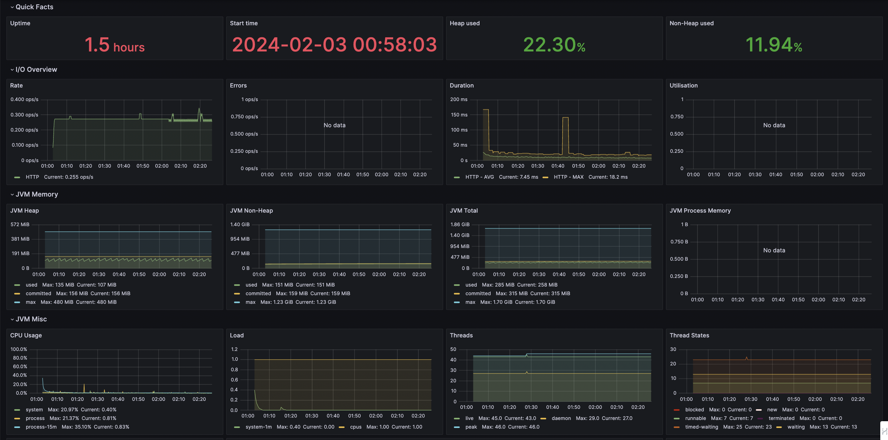

- 아무래도 15000개의 객체를 생성하다보니, JVM Heap 메모리에서 used가 요동치는걸 확인할 수 있다.
- 특정 메모리 한도(135MB)가 되면, minor gc가 되어 다시 낮아지는 듯 하다.

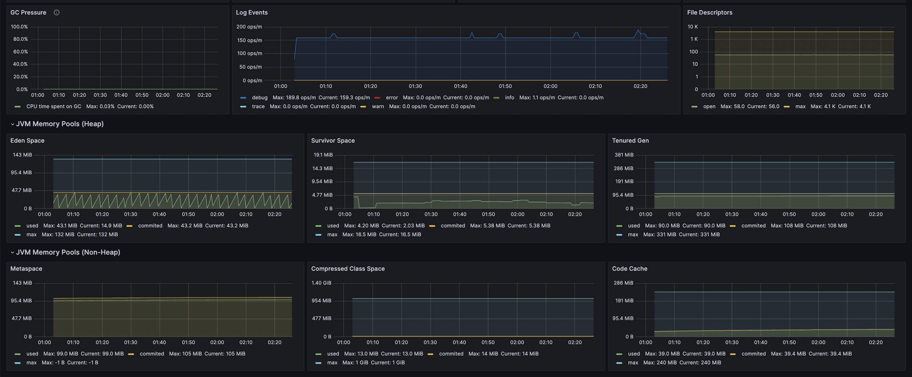

- eden space와 survivor space에서 메모리가 요동치는걸 보면, minor gc가 여러번 일어난걸 확인할 수 있다.

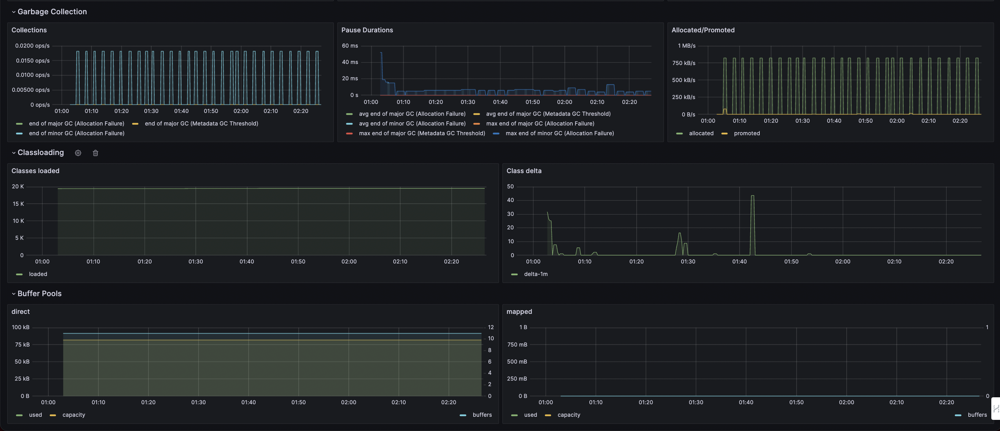

- Garbage Collection 메트릭을 보면 heap area에 young space에 어느정도 메모리가 꽉 찼을 경우 GC가 일어났다는 것을 확인할 수 있다.

#### 2. 부하테스트 후 EC2

##### 2-1. jvm gc metric

before

| S0C    | S1C    | S0U   | S1U    | EC     | EU      | OC       | OU       | MC      | MU      | CCSC  | CCSU  | YGC | YGCT  | FGC | FGCT  | GCT   |
|--------|--------|-------|--------|--------|---------|----------|----------|---------|---------|-------|-------|-----|-------|-----|-------|-------|
| 5504.0 | 5504.0 | 0.0   | 2171.2 | 44224.0| 25067.7 | 110288.0 | 92206.6  | 107776.0| 101331.1| 14336.0| 13285.5| 415 | 2.816 | 5   | 0.716 | 3.532 |


after

| S0C   | S1C   | S0U  | S1U | EC     | EU      | OC      | OU      | MC     | MU     | CCSC  | CCSU  | YGC  | YGCT  | FGC | FGCT  | GCT   |
|-------|-------|------|-----|--------|---------|---------|---------|--------|--------|-------|-------|------|-------|-----|-------|-------|
| 5504.0| 5504.0| 19.9 | 0.0 | 44224.0| 19759.1 | 110288.0| 100899.4| 109696.0| 103037.0| 14464.0| 13361.9| 1712 | 10.520| 5   | 0.716 | 11.237|


1. 총 GC로 소요된 시간은 7.7s(11.2s - 3.5s) 이다.
2. minor GC에 걸린 시간은 7.7s이다.
	- 10.52s - 2.816s
	- major gc가 load test할 때 동안 안일어났다.
3. major GC(FGC)는 5번으로 동일한데, minor GC(YGC)는 415번 -> 1712번으로 늘었다.
4. 1 minor GC당 소요시간은 평균 5.94 ms이다. (7700 / (1712 - 415))
5. minor gc가 많이 발생한 이유는, 수많은 로그를 콘솔에 프린트할 때, heap area에서 Eden -> survivor, survivor1 -> survivor2 영역으로 옮길 자리가 부족해서이고,
6. major gc가 발생하지 않은 이유는, 로그 출력을 위해 생성한 StringBuffer 객체가 오래 여러번 참조되어 쓰이지 않았기 때문에, young 영역에서만 살아있다가 메모리가 다 차면 minor GC 당한것으로 추측된다.

##### 2-2. prometheus monitoring


JVM memory에서 Heap area부분의 used 그래프가 요동치는걸 확인할 수 있다.


- Log Events metric을 보면, 초당 15만개의 로그가 발생한다는걸 확인할 수 있다.
- Jvm Memory Pool(Heap)에서 Eden 영역이 오르다 minor GC 당할 때마다 다시 0 byte로 내려가는것이 확인된다.
- survivor 영역도 minor gc 이후에 내려가는것을 볼 수 있다.

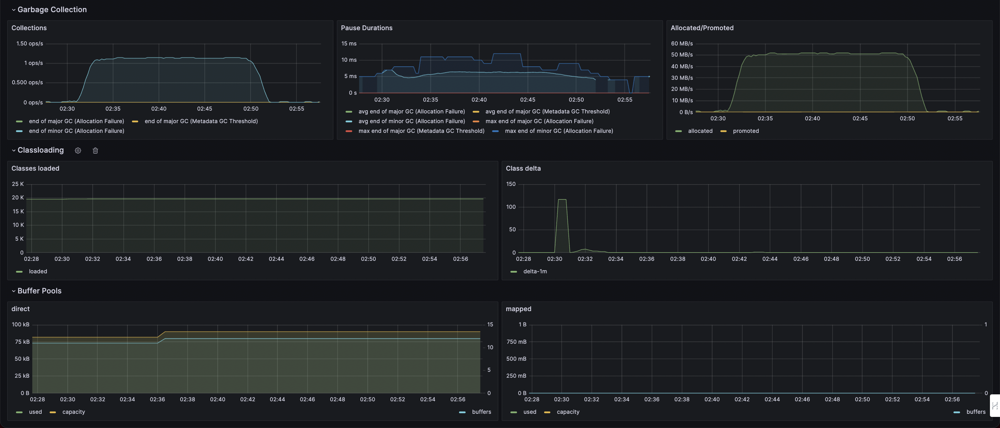

- Garbage Collection metric을 보면 major GC는 안일어났는데 minor gc가 많이 일어난걸 확인할 수 있다.
- Pause Duration metric을 보면, minor gc는 평균 5ms 정도로 minor GC 단일 원인만으로는 매우 느린 latency을 설명하기엔 부족해 보인다.
- Allocated/Promoted metric을 보면, 초당 50MB 씩이나 메모리가 할당된다는걸 확인할 수 있다.


#### 3. 로그 제거 후 부하테스트


##### 3-1. 테스트 결과

```
 data_received..................: 601 MB 500 kB/s
 data_sent......................: 1.3 MB 1.1 kB/s
 http_req_blocked...............: avg=42.77µs min=1.58µs   med=10.12µs max=55.91ms  p(90)=19.32µs  p(95)=28.36µs
 http_req_connecting............: avg=15.34µs min=0s       med=0s      max=17.36ms  p(90)=0s       p(95)=0s
✗ http_req_duration..............: avg=68.39ms min=25.31ms  med=53.76ms max=30.45s   p(90)=94.02ms  p(95)=116.01ms
   { expected_response:true }...: avg=68.39ms min=25.31ms  med=53.76ms max=30.45s   p(90)=94.02ms  p(95)=116.01ms
 http_req_failed................: 0.00%  ✓ 0        ✗ 8554
 http_req_receiving.............: avg=8.97ms  min=201.75µs med=6.23ms  max=109.69ms p(90)=18.15ms  p(95)=25.36ms
 http_req_sending...............: avg=3.63ms  min=5.2µs    med=55.39µs max=30.37s   p(90)=128.52µs p(95)=197.88µs
 http_req_tls_handshaking.......: avg=0s      min=0s       med=0s      max=0s       p(90)=0s       p(95)=0s
 http_req_waiting...............: avg=55.78ms min=23.66ms  med=45.11ms max=1.3s     p(90)=79.97ms  p(95)=99.59ms
 http_reqs......................: 8554   7.118939/s
 iteration_duration.............: avg=1.07s   min=1.02s    med=1.05s   max=31.46s   p(90)=1.09s    p(95)=1.11s
 iterations.....................: 8554   7.118939/s
 vus............................: 1      min=1      max=10
 vus_max........................: 10     min=10     max=10
```

latency가 평균 4초에서 68ms로 줄었다


##### 3-2. jvm gc metric
before load test

|   S0C   |   S1C   |   S0U   |  S1U |    EC    |     EU    |     OC     |     OU     |     MC     |     MU    |  CCSC  |  CCSU  | YGC | YGCT | FGC | FGCT |  GCT  |
|:-------:|:-------:|:-------:|:----:|:--------:|:---------:|:----------:|:----------:|:----------:|:---------:|:------:|:------:|:---:|:----:|:---:|:----:|:-----:|
|  6720.0 |  6720.0 |  2852.1 | 0.0  |  54080.0 |  20803.4  |  134860.0  |  80913.8   |  104320.0  |  98110.1  | 14208.0| 13136.4| 316 | 2.304|  6  | 0.979| 3.284 |


after load test

| S0C    | S1C    | S0U  | S1U   | EC     | EU      | OC      | OU      | MC      | MU      | CCSC  | CCSU  | YGC | YGCT  | FGC | FGCT  | GCT   |
|--------|--------|------|-------|--------|---------|---------|---------|---------|---------|-------|-------|-----|-------|-----|-------|-------|
| 6720.0 | 6720.0 | 0.0  | 546.1 | 54080.0| 33326.9 | 134860.0| 89592.1 | 108288.0| 101979.4| 14336.0| 13256.1| 2231 | 11.332| 6   | 0.979 | 12.311|


major GC는 6회로 동일한데,\
minor GC는 316 -> 2231로 증가했다.\
총 GC에 걸린 시간은 9.1s (12.3s - 3.2s)

신기하게도,\
로그를 콘솔 출력할 때 minor GC(YGC)는 1297(415번 -> 1712번)에 소요시간은 7.7s이고,\
로그 제거 후는 minor GC가 1915번에 소요시간은 9.1s이다.

이걸 보면, 수 많은 로깅이 latency를 늘린건 맞으나,\
그 이유 중 주된 원인이 minor gc 때문은 아니라는게 확인되었다.

아마 CPU throttling 같은 다른 이유가 high latency의 주 원인인 듯 하다.


##### 3-3. prometheus monitoring

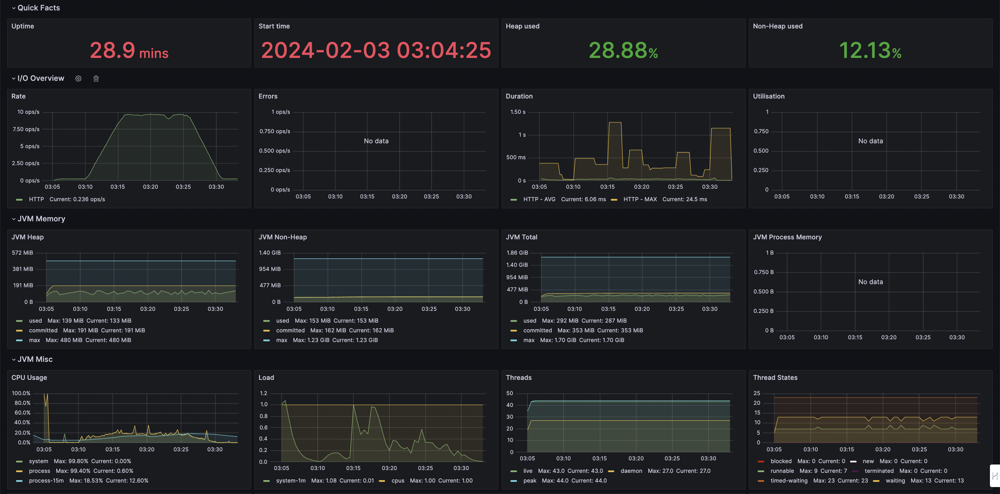

1. cpu usage가 90% -> 18%까지 줄었다.
2. cpu 요구 갯수도 1개 이하에서 발생하는걸 볼 수 있다.
3. duration(latency)가 500ms 이하로 매우 많이 개선된걸 확인할 수 있다.


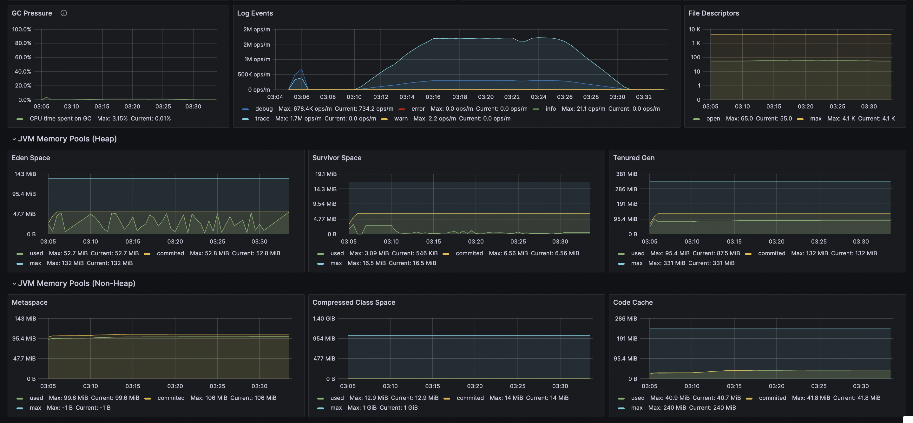
- 로그 콘솔 출력 및 파일 저장 설정을 안했는데도, Log Events 메트릭은 여전히 높다.
- Log Events 메트릭은 로그를 콘솔에 출력하거나 파일저장하는 것과 무관하게 총 로그 발생수를 나타내는 것으로 보인다.


### i. 결과 및 배운 점

#### 1. logging protocol을 정하고 지키자

1. System.out.println을 사용한 로깅 금지
2. 디버깅시 Logger 쓰지 말고 디버거 쓰기
3. Exception 처리에서 warn, error 레벨 부분 제외하고 로그 사용 금지


#### 2. CPU usage 100%는 latency에 매우 큰 영향을 준다.

CPU usage가 90%에서 18%로 줄자마자, 평균 latency가 4240ms -> 68ms 로, 6235% 성능 향상했다.

CPU가 http 요청을 처리하는 것도 바쁜데,

1. 로그 생성을 위해 수십, 수만개의 StringBuffer 객체를 생성하고
2. 수십, 수만개의 StringBuffer객체를 console에 print 하고
3. 수십, 수만개의 객체가 힙영역에 Eden, Survivor 공간을 다 채울 때마다 안쓰는 수십, 수만개의 StringBuffer 객체를 minor GC도 메모리 해제하는걸 천번 이상 수행해야 하고,
4. 위에 서술한 매우 많은 불필요한 과정이 CPU scheduling을 통해 queue에 쌓이게 되어 정작 중요한 일은 못하고
5. 멀티 쓰레드 환경에서 여러 요청을 교차하며 동시에 수행하다보니 context switching overhead도 있고,
6. CPU 점유율이 100% 가까이 되면, 과열에 의한 부품손상을 막기 위해 스로틀링이 걸리는데, 이는 클럭과 전압을 강제적으로 낮춰서 성능이 떨어진다.

.. 등의 이유로 왜 CPU 점유율을 모니터링하는지, 왜 JVM heap 영역과 GC를 강조하는지, java에서 왜 String을 쓰지 말라는지의 중요성을 피부로 느끼게 되었다.


#### 3. JVM Heap area, memory에 대해 더 잘 이해하게 되었다.

JVM 메모리 구조, heap 영역, Garbage Collection에 대해 이론적으로만 배웠고,

GC가 지원되는 언어를 쓰다보니, 메모리 처리는 JVM이 알아서 해주니까 크게 신경 안써도 되겠지? 라는 안일한 생각이 있었는데,

왜 로우레벨 개발자들이 메모리 할당 & 해제 중요성에 대해 이야기를 하고,

메모리 관리를 잘 못하면 GC가 자주 일어나 CPU 점유율과 latency 까지 영향을 미칠 수 있다는걸 배웠다.


#### 4. monitoring metric을 해석하는 방법에 대해 배우게 되었다.

처음엔 단순히 CPU usage, Memory usage, jvm thread state 이정도만 보고, 나머지 메트릭은 무시했는데,
Heap 영역 메모리와 GC가 얼마나 일어나나 확인하기 위해 관련 메트릭도 찾아보게 되었다.

이 외에, 모니터링 메트릭을 해석하는 방법론이 3가지가 있고, 시간이 지남에 따라 중요하게 여겨지는 점이 바뀌게 되면서, 중점적으로 봐야하는 메트릭도 달라진 것 같다.

1. 처음엔 CPU, disk, network에 병목이 걸리는지 위주로 보다가(USE method),
2. 웹서비스 관점으로 재해석해 트래픽 패턴과 latency를 강조한 RED method,
3. 위 두 방법론을 섞어 SRE 관점으로 해석한 4 golden signals


## e. 부하 테스트

### a. 300 RPS 부하 테스트

#### a-1. RPS 별 DAU 예측

목표: RPS당 피크 시간대 유저와 DAU 계산 in ecommerce app

1. 만약 100RPS 인 경우, 시간당 36만 request, 하루에 864만 request가 온다.
2. 1 유저당 평균 50 request를 보낸다고 가정하면, 864만 / 50 = 172,800 DAU
3. 만약 피크 시간대에 20%의 DAU가 active하다고 가정하면, 34,560 users
4. 결론1: DAU가 17만인 서비스에서, 피크시간에 3.5만명이 100RPS 를 보낸다.
5. 결론2: DAU가 51만인 서비스에서, 피크시간에 10.5만명이 300RPS 를 보낸다.
6. 결론3: DAU가 170만인 서비스에서, 피크시간에 35만명이 1,000RPS 를 보낸다.

이게 예측이 얼추 맞다고 보이는 근거는 디스패치의 aws 컨퍼런스를 보면 유추할 수 있다.

DAU가 60만명인데 [이 구간](https://youtu.be/8uesJLEXxyk?t=1425)에서 공개한 디스패치 트래픽 양을 보면

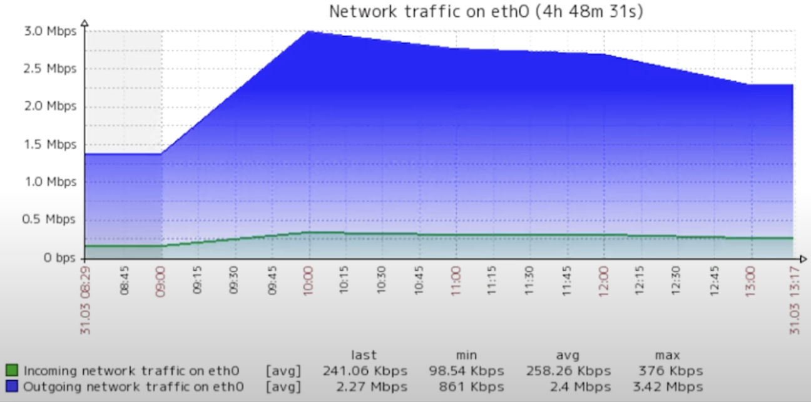

평소에 1.5 Mbps ~ 3.0 Mbps 왔다갔다 한다. (특종 기사대는 훨씬 높아짐)

근데 RPS 바꿔가며 실험했던 데이터 중에
300 RPS 때에 네트워크 트래픽 양이
```
 data_received..................: 1.4 GB 1.3 MB/s
 data_sent......................: 35 MB  33 kB/s
```
1.3 Mbps 정도 된다.

근데 저건 백엔드에서 가져오는 json만 고려한거라
html 페이지 용량까지 고려하면

대략 3.0 Mbps 정도 나온다고 본다.

처음에 디스패치 DAU가 60만명인데
위에 계산한
'DAU가 51만인 서비스에서, 피크시간에 10.5만명이 300RPS 를 보낸다.'
...에서 남는 9만명은 특종기사 같은거 떴을 때 갑작스럽게 몰리는 유저인 것으로 보인다.


#### a-2. 실험 방향 설정

1. 실험 목표
	1. failover률이 1% 미만이면서
	2. latency가 500ms 이상 걸리지 않는 aws 아키텍처를 구성한다.
	3. 위 아키텍처의 1달 유지 비용을 구한다. (on-demand 기준)
2. 실험 환경
	- back/1.ecommerce (정규화버전) 을 테스트한다.
	- ecommerce는 write/read 비중에서 read 비중이 압도적으로 높다. (9:1 이상)
	- 캐싱된 index 페이지 다음으로, 트래픽이 가장 많이 몰리는 페이지의 쿼리를 부하 테스트 한다.
	- 부하 테스트할 쿼리는 아래와 같다. (join을 5번 한다.)
		- ```java
			List<Tuple> results = queryFactory.select(
					product.productId,
					product.name,
					product.description,
					product.rating,
					product.ratingCount,
					category.categoryId,
					category.name,
					option.optionId,
					option.value,
					optionVariation.value,
					productItem.quantity,
					productItem.price)
				.from(product)
				.join(product.category, category)
				.join(product.productItems, productItem)
				.join(productItem.productOptionVariations, productOptionVariation)
				.join(productOptionVariation.optionVariation, optionVariation)
				.join(optionVariation.option, option)
				.where(category.categoryId.eq(categoryId))
				.orderBy(product.productId.asc())
				.fetch();
			```
	- 부하 테스트할 테이블의 rows 수는 다음과 같다.
		1. product table -> 1000 rows
		2. product_item table: 10000 rows
		3. category table: 75 rows
		4. option table: 180 rows
		5. option variation table: 540 rows
5. 사용 툴
	- aws (alb, ec2, rds, elasticache)
	- terraform
	- prometheus
	- grafana
	- k6


#### a-3. AWS 아키텍처


- application load balancer
- ec2 (API server)
	- m7g.large
	- vCPU = 2
	- RAM = 8 GiB
	- 네트워크 대역폭 = 최대 12.5 Gbps
- ec2 (monitoring server)
	- t2.micro
	- vCPU = 1
	- RAM = 1 GiB
- rds
	- mysql 8.0.35
	- db.t4g.medium
	- vCPU = 2
	- RAM = 4 GiB
	- max connections = 150 (default)
- elasticache
	- instance_type = cache.t4g.small
	- vCPU = 2
	- RAM = 1.37 GiB
	- 1개 노드


#### a-4. 테스트 결과

```
 data_received..................: 12 GB  10 MB/s
 data_sent......................: 37 MB  31 kB/s
 http_req_blocked...............: avg=47.68µs min=542ns   med=2.08µs  max=165.25ms p(90)=6.2µs    p(95)=8.91µs
 http_req_connecting............: avg=40.97µs min=0s      med=0s      max=53.84ms  p(90)=0s       p(95)=0s
✗ http_req_duration..............: avg=63.44ms min=18.32ms med=44.66ms max=2.4s     p(90)=102.91ms p(95)=153.42ms
   { expected_response:true }...: avg=63.44ms min=18.32ms med=44.66ms max=2.4s     p(90)=102.91ms p(95)=153.42ms
 http_req_failed................: 0.00%  ✓ 0          ✗ 253946
 http_req_receiving.............: avg=7.41ms  min=22.58µs med=2.67ms  max=562.88ms p(90)=14.06ms  p(95)=26.48ms
 http_req_sending...............: avg=26.81µs min=2.54µs  med=7.7µs   max=214.51ms p(90)=24.58µs  p(95)=43.61µs
 http_req_tls_handshaking.......: avg=0s      min=0s      med=0s      max=0s       p(90)=0s       p(95)=0s
 http_req_waiting...............: avg=56ms    min=16.93ms med=39.93ms max=2.39s    p(90)=88.78ms  p(95)=126.65ms
 http_reqs......................: 253946 211.490681/s
 iteration_duration.............: avg=1.06s   min=1.01s   med=1.04s   max=3.4s     p(90)=1.1s     p(95)=1.15s
 iterations.....................: 253946 211.490681/s
 vus............................: 1      min=1        max=300
 vus_max........................: 300    min=300      max=300
```

1. latency = 63.44ms (http_req_duration)
	- p(95)=153.42ms
	- max_req_duration = 2.4s (Q. full gc 때문?)
2. failed = 0%

#### a-5. 모니터링

##### a-5-1. Load Balancer
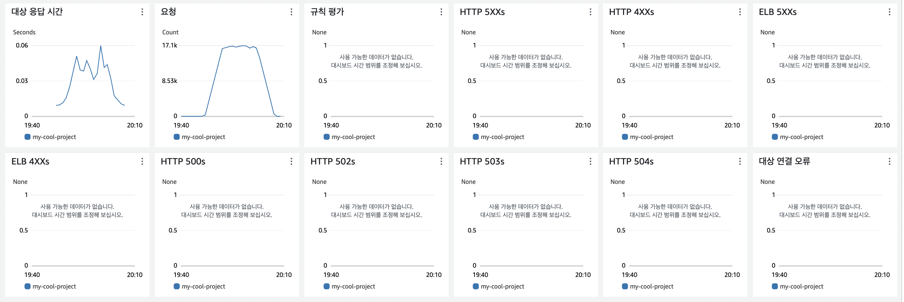

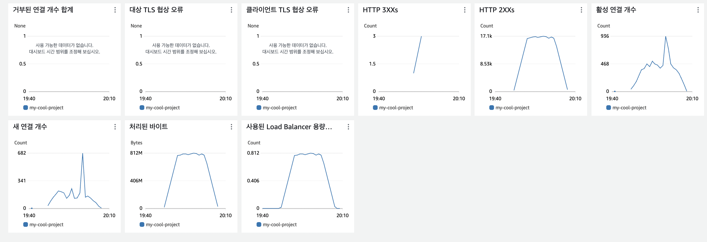


##### a-5-2. EC2
case1) 300 RPS

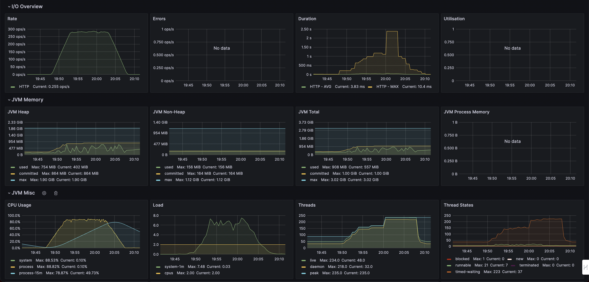

- CPU usage가 최대 88%까지 올라갔다.
	- CPU 요구치도 최대 7.48개까지 늘어나긴 하지만, latency가 63ms밖에 안되는걸 보면, 당장은 괜찮은 듯 보인다.
	- 하지만, CPU usage가 70%를 초과하는게 오래되면, 쓰로틀링이 걸려 성능이슈가 생길 수 있다.
- Duration이 한번 2.5s 까지 치솟는데, 아마 major gc가 일어난 순간인 것 같다.

---
case2) 100 RPS
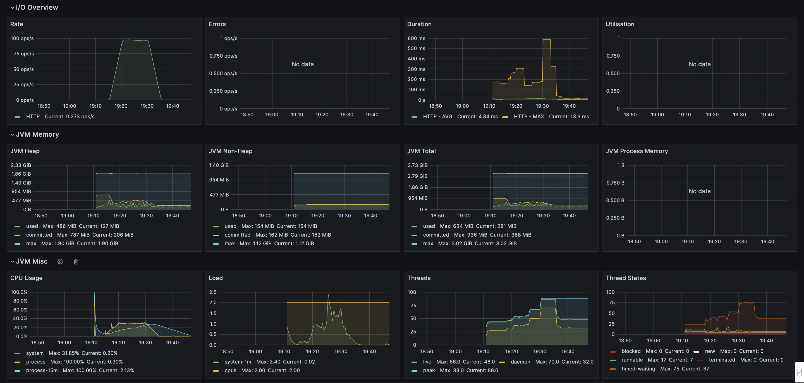
100 RPS일 떄에는 CPU usage가 최대 31% 까지 올라가고,\
CPU 로드 요구치는 2 코어 안쪽이다.

CPU usage가 40% ~ 70% 사이를 유지하는게 최적이라곤 하지만, 일일 최대 RPS를 스케일 업 or 아웃 없이 대응하기엔 적절한 EC2 instance spec인 듯 하다.

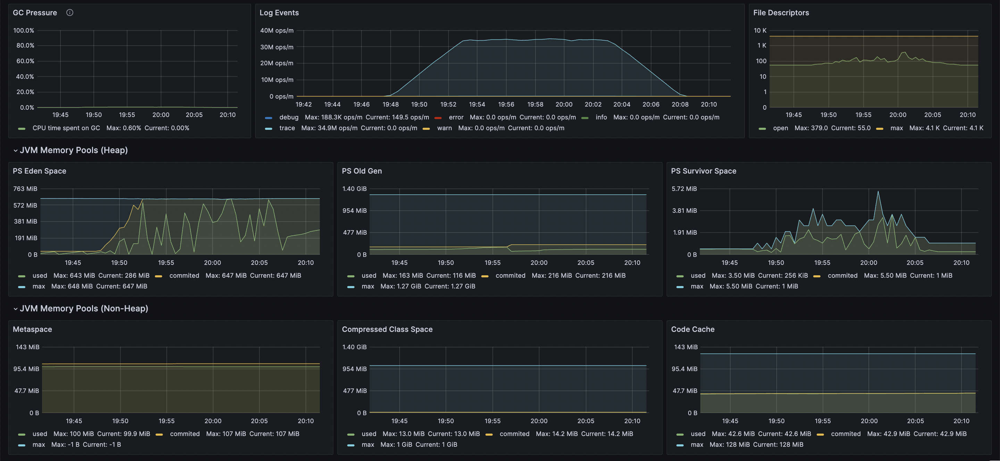

Eden과 Survivor에서 minor gc가 여러번 이루어지는게 보이고,

old gen에서 메모리가 약간씩 오르다가 19:57분경 한번 뚝 떨어지는걸 보면 저 지점이 major gc가 일어난 타이밍인듯 하다.

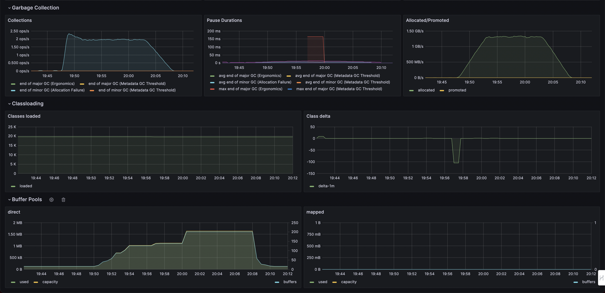

major gc가 일어난 순간, stop the world가 160ms 정도 소요된 듯 하다.

##### a-5-3. RDS
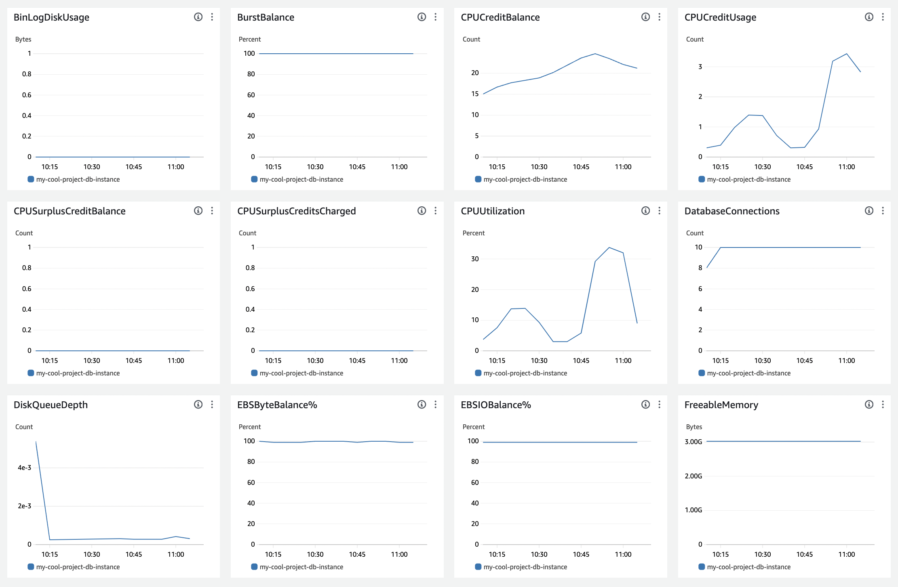

1. DatabaseConnections
	- 300 RPS인데, database connections 갯수는 여전히 10개밖에 안쓰인다.
	- 부하테스트 하는 쿼리의 latency는 대략 5ms 정도 였다.
	- 그러니 이론상, 1개 connection이 초당 200개의 request를 처리할 수 있고(lock, network, spike in request 등 다른 고려사항 제외), connections 갯수가 10개니까, 2000 RPS까지는 이론상 감당 가능한 것 처럼 보인다.
	- 하지만 해당 부하 테스트는 15000 rows, 몇 MB의 작은 사이즈의 데이터인데 심지어 같은 테이블에 대한 부하테스트라 테이블 & 인덱스가 Disk -> RAM으로 캐싱되어 I/O된다는 점을 고려하면, 실상황보다 훨씬 빠른 일종의 착시현상이라고 볼 수 있다.
	- 실상황에 수십, 수백 GiB 파일 사이즈의 데이터베이스에서 8~32GiB의 제한된 RAM에 모든 테이블 데이터와 인덱스를 RAM에 캐싱할 수 없다는 점을 고려하면, 쿼리 처리 속도라던가, 필요 connection 숫자가 이보다 더 많이 들 수도 있다고 생각한다.
2. CPUUtilization
	- max cpu usage는 대략 40%이다.
	- CPU 사용량이 70% 이하이긴 하지만, spike를 대비한 여유분을 남겨두는게 좋아 보인다.
3. DiskQueueDepth
	- read/write request가 큐에 쌓인 정도를 나타내는데, 0이라는 말은, 큐에 read/write request가 쌓이는 속도보다 처리속도가 더 빠르다는 말이니까 좋은 신호이고, 0보다 크면, 처리 속도보다 request가 더 많이 쌓인다는 거니까 안좋은 신호이다.
	- 초반에 높았다가 0으로 떨어지는데, 높은 이유는 15000 rows 가데이터 insert해서이지 부하테스트와는 관련없다.
	- 부하테스트 이후 0으로 유지되는걸 보면, 1초당 dbms가 처리하는 쿼리 양 > 300RPS 인걸 확인할 수 있다.
4. FreeableMemory
	- 새 프로세스를 만들 기 위한 사용가능한 RAM 인데, 렘은 넉넉한 것으로 보인다.


#### a-6. monthly cost estimation
- total monthly cost(load balancer 제외한 경우)
	1. on-demand: $268.33/month
	2. 인스턴스 절감형 플랜: $194.08/month
	3. 1년 선결제: $182.69/month

---
1. ec2 (API server)
	- m7g.large
		- on-demand: $73.22/m
		- EC2 인스턴스 절감형 플랜
			- 예약기간 1년 선결제: $536.11 / 12 = $44.67
			- 선결제를 안할 경우: $47.89 /m
	- monitoring
		- $ 2.1/m
2. ec2 (monitoring server)
	- t2.micro
		- on-demand: $10.51/m
		- EC2 인스턴스 절감형 플랜
			- 예약기간 1년 선결제: $70.08 / 12 = 5.84
			- 선결제를 안할 경우: $6.28 /m
3. rds
	- db.t4g.medium
		- on-demand: $148.19/m
		- 예약기간 1년 선결제: $ 1,299 / 12 = 108.25
		- 선결제를 안할 경우: $ 115.7 /m
4. elasticache
	- cache.t4g.small
	- 노드갯수 1개 클러스터
		- on-demand: 34.31 USD /m
		- 예약기간 1년 선결제: 21.83 USD /m
		- 예약기간 1년 부분 선결제: 22.11 USE /m
	- 서버리스(HA 고려): 111.33 USD /m (평균 100 RPS 기준)
5. network load balancer (optional)
	- 비용이 매우 비싼데, 아직 scale out, load balancing 까지 필요한 단계는 아니라 제외한다.
	- 고정 요금: $16.43 /m
	- 데이터 요금: $226.64 (1대 로드 밸런서, 300 RPS, 13.3 Mbps 기준, 47.88GB/h 처리량 기준)
	- Q. 분당 데이터 처리량 어떻게 계산할까?
		- 300 RPS load test의 결과에서, data_received가 10 MB/s, data_sent가 31kB/s가 나왔다.
		- 첫 5분까지 0 -> 300RPS, 그 다음 10분은 300 RPS 유지, 그 다음 5분은 300 RPS -> 0의 패턴으로 부하 테스트를 하였다.
		- 따라서 10Mb * 4/3을 하면 300 TPS시에 대략 13.3Mb/s 의 처리량이라는 숫자가 나온다.
		- 13.3Mb/s -> 47.88 Gb/h


### b. 1000 RPS 부하 테스트


#### b-1. EC2 스펙 정하기

1. core 갯수 정하기
	- 2 CPU core가 300 RPS를 CPU 점유율 최대 88%로 버텼으니까, 그의 2배인 4코어로는 600 RPS를 버틸 수 있고, 그의 2배인 8 core정도는 되어야 안정적으로 1000 RPS를 버티지 않을까?
2. RAM 사이즈 정하기
	- RAM의 경우, 100RPS에서 최대 힙 사용 용량이 466MB인데, 300RPS에서는 754MB까지 늘어났으니까, 200RPS당 약 300MB의 RAM이 더 필요하다고 하면, 1000RPS는 약 1.5GiB의 RAM의 heap 공간의 최소 필요량이고(이 이하는 out of memory로 jvm이 뻗을 수 있다), 다른 non-heap 메모리 공간이라던가, jvm 외에 필요한 RAM 메모리를 생각하면 대략 4GiB RAM 정도면 1000TPS 처리할 수 있지 않을까? 라는 생각이 든다.
	- 다만, minor && major gc가 일어나는걸 텀의 간격을 늘리기 위한 이유, 트래픽 spike가 일어났을 때 out of memory로 서버가 터질 수 있다는 점, 메모리는 싸다는 점(?)을 고려하여 4GiB보다 넉넉히 확보해준다.
	- 어짜피 AWS ec2에서 제공하는 인스턴스들은 RAM을 수동으로 정할 수 있는게 아니라, 대부분 CPU core 숫자 * 2 GiB of RAM 식으로 제공하기 때문에, 중요한 코어 숫자 위주로 ec2 instance를 결정한다.
3. EC2 instance type 정하기
	- 범용인 t,m,a-class, computing intensive 목적인 c-class, io intensive인 r,x,z-class, 스토리지 액세스 최적화인 i,d,h-class가 있다.
	- 대용량 파일 다운로드 서버가 아니니까 i,d,h-class는 제외한다.
	- io intensive class는 메모리를 많이 요구하는 앱에서 쓴다고 한다. 예를들어 real time data analytics program이라던가, 아니면 높은 throughput을 요구하는 서버인 경우다. ecommerce는 위의 케이스가 아니므로 제외한다.
	- computing intensive class는 이미지 처리라던가, 알고리즘 컴퓨팅 처리가 많이 일어나는 서버(ex. 이미지 프로세싱 서버)에 쓰므로 제외한다.
4. EC2 instance 세대 정하기
	- 최신 세대일 수록 energy efficient하고 성능이 더 좋다고 한다. 최신세대인 7세대를 선택한다.
5. 비용 고려한 프로세서 선택
	- ec2에서 제공하는 cpu processor는 3종류이다. 1. intel 2. AMD 3. aws graviton
	- 6세대 프로세서 비용을 비교했을 때, intel > AMD > aws graviton 순으로 graviton이 제일 저렴하다.
	- 7세대 프로세서 비용을 비교해보면, AMD > intel > aws graviton 순으로 graviton이 제일 저렴하다.
	- 가장 저렴한 aws graviton 프로세서를 선택한다.
6. 결론
	- [aws ec2 비교 사이트](https://instances.vantage.sh/?min_vcpus=8&region=ap-northeast-2&selected=m7g.medium,m7a.medium,c7a.medium,c7gn.medium,c7g.medium,m7g.large,m7i.large,m7i-flex.large,m7a.large,c7g.large,c7i.large,c7a.large)에서 m7 class, 8 core 중에서 on-demand cost가 제일 낮은 m7g.2xlarge를 선택한다.
	- 8 core, 32GiB+ RAM, aws graviton processor, ebs 지원, 네트워크 대역폭 15Giga Bit, on-demand cost $0.3264 hourly


#### b-2. RDS 스펙 정하기

1. 코어 갯수 정하기
	- 1000 TPS를 요청하는 쿼리가 5개의 테이블을 join하는 쿼리인데, 5개 테이블 조인 외에, 별도의 CPU 연산을(ex. 정렬 등) 요구하지 않기 때문에, RDS 서버는 코어의 갯수 보다는, RAM이나 max_connection을 더 신경쓰면 된다고 보인다.
2. RAM 사이즈 정하기
	- DB 서버에 RAM이 필요한 이유가, 자주 사용하는 인덱스, 테이블을 disk i/o로 꺼내오지 않고 RAM에 캐싱해 둘 수 있어서 인데, 실전이었다면 1000TPS가 모든 테이블에 나름 골고루 분포되어 쿼리되기 때문에 수~수십 GiB의 테이블 데이터를 RAM에 다 담을 수 없으므로 훨씬 느릴 것으로 예상된다.
	- 하지만 현 부하테스트의 경우, 가데이터를 대략 15000 rows밖에 저장 안하고, 이는 몇MB밖에 안되기 때문에, dbms가 해당 테이블과 인덱스를 캐싱할 때, 그렇게 까지 많은 양의 RAM이 필요할 것 같지는 않다.
3. max_connection 갯수 정하기
	- 부하테스트를 거는 쿼리를 프로파일링 해본 결과, 속도가 5ms 이하가 나오는데, 이는 이론상 1 connection이 1초동안 처리할 수 있는 양이 200개 쿼리라는 말이고, 1000RPS 또한 5 connection으로 해결 가능하다는건데, 이 부분은 실제 테스트를 해서 1000RPS에서 10 connection들이 5ms 쿼리를 안밀리고 처리해서 DiskQueueDepth가 0인지 확인할 필요가 있다.
4. RDS instance type 정하기
	- 범용, 메모리, 컴퓨팅 클래스 중에서, throughput이 높으면 메모리 서버를 선택하는 듯 하고, 순간 트래픽이 급상승 하는 서버는 컴퓨팅 클래스를 쓰는데, 현 프로젝트는 비교적 균등한 트래픽의 ecommerce이므로, 범용클래스를 선택한다.
5. RDS instance 세대 정하기
	- 에너지 효율이 좋아 사용량 대비 비용이 저렴한 최신세대(7,6세대)를 선택한다.
6. RDS 비용 고려하기
	1. 4 core
		- db.m7g.xlarge -> 4 core, 16 GiB RAM, 12.5 Gigabit network, mysql on-demand cost: $0.4688 hourly
		- db.m6g.xlarge -> 4 core, 16 GiB RAM, 10.0 Gigabit network, mysql on-demand cost: $0.4200 hourly
		- db.m6i.xlarge -> 4 core, 16 GiB RAM, 12.5 Gigabit network, mysql on-demand cost: $0.4720 hourly
	2. 8 core
		- db.m7g.2xlarge -> 8 core, 32 GiB RAM, 15 Gigabit network, on-demand cost: $0.9376 hourly
		- db.m6g.2xlarge -> 8 core, 32 GiB RAM, 10 Gigabit network, on-demand cost: $0.8090 hourly
		- db.m6i.2xlarge -> 8 core, 32 GiB RAM, 12.5 Gigabit network, on-demand cost: $0.9440 hourly
7. 결론
	- 4 코어, 10.0 Gigabit network로 실험해서 cpu 점유율이 70% 이하인지 먼저 테스트 한다.
	- cpu 점유율이 70%+ 이상이거나, aws RDS metric에 DiskQueueDepth이 0 이상이라 처리량보다 requests가 더 많아 넘치는지 확인한다.
	- 서버 성능이 부족하다 판단하면 8 코어 32 GiB RAM 으로 올리되, 현 프로젝트의 http response에 담기는 문자열의 양이 그리 많지 않으므로, throughput이 적기 때문에 10.0 Gigabit network을 써도 된다고 판단하여 db.m6g.xlarge 를 선택한다.


#### b-3. 시행착오 과정

1. 1000 RPS load test한 결과 latency가 4초대가 나왔다.
2. 병목의 90%는 database에서 일어난다길래, RDS를 4core -> 8core 늘렸는데도 매우 느렸다.
3. RDS monitoring metrics에 database connections을 2000개+ 중에 10개밖에 안쓰길래, jdbc connection pool size의 최솟값 & 최댓값을 코어수 * 2 + HDD수 해서 총 17로 지정했는데도, 성능이 오히려졌다.
4. 설마 인터넷 속도 문제인가 싶어서 40 Mbps 인터넷에서 440Mbps 인터넷으로 바꾼 후, 부하테스트를 했는데 latency가 500ms 보다 빨리 측정되었다.

#### b-4. 부하테스트를 거는 client의 인터넷속도 역시 중요하다.

이런저런 삽질 결과, 인터넷 속도 차이가 부하테스트 결과에 큰 영향을 미친다는걸 발견했다.

동일 조건에서, 인터넷 속도가 46 Mbps일 땐 latency가 4.84s, 83 Mbps일 땐 2.49s가 나왔다.


##### 인터넷 속도 별 부하 테스트 latency 비교

###### case1) 인터넷 속도 46 Mbps 에서는 latency(http_req_duration)가 4.84s

```
data_received..................: 7.3 GB 6.1 MB/s
data_sent......................: 23 MB  19 kB/s
http_req_blocked...............: avg=8.56ms   min=791ns      med=3.45µs  max=3.99s  p(90)=9.83µs  p(95)=14.2µs
http_req_connecting............: avg=8.47ms   min=0s         med=0s      max=3.99s  p(90)=0s      p(95)=0s
✗ http_req_duration..............: avg=4.84s    min=14.07ms    med=1.92s   max=1m0s   p(90)=15.3s   p(95)=19.38s
{ expected_response:true }...: avg=4.82s    min=14.07ms    med=1.92s   max=59.7s  p(90)=15.27s  p(95)=19.36s
http_req_failed................: 0.02%  ✓ 46         ✗ 154304
http_req_receiving.............: avg=2.93s    min=-4666639ns med=16.03ms max=58.33s p(90)=11.25s  p(95)=15.5s
http_req_sending...............: avg=168.34µs min=3.12µs     med=15.45µs max=5s     p(90)=42.45µs p(95)=80.5µs
http_req_tls_handshaking.......: avg=0s       min=0s         med=0s      max=0s     p(90)=0s      p(95)=0s
http_req_waiting...............: avg=1.9s     min=13.5ms     med=1.7s    max=33.77s p(90)=2.51s   p(95)=5.72s
http_reqs......................: 154350 128.617166/s
iteration_duration.............: avg=5.85s    min=1.01s      med=2.92s   max=1m1s   p(90)=16.31s  p(95)=20.4s
iterations.....................: 154350 128.617166/s
vus............................: 3      min=3        max=1000
vus_max........................: 1000   min=1000     max=1000

```


###### case2) 인터넷 속도가 83 Mbps에서 latency는 2.49s.

```
data_received..................: 12 GB  10 MB/s
data_sent......................: 38 MB  32 kB/s
http_req_blocked...............: avg=1.44ms   min=0s         med=2.08µs   max=2.25s  p(90)=6.37µs  p(95)=9µs
http_req_connecting............: avg=1.42ms   min=0s         med=0s       max=2.24s  p(90)=0s      p(95)=0s
✗ http_req_duration..............: avg=2.49s    min=13.34ms    med=1.6s     max=1m0s   p(90)=5.37s   p(95)=7.86s
{ expected_response:true }...: avg=2.49s    min=13.34ms    med=1.6s     max=59.34s p(90)=5.37s   p(95)=7.86s
http_req_failed................: 0.00%  ✓ 4          ✗ 257523
http_req_receiving.............: avg=1.77s    min=-5545889ns med=915.28ms max=58.93s p(90)=4.28s   p(95)=6.42s
http_req_sending...............: avg=32.62µs  min=2.7µs      med=9.08µs   max=1.61s  p(90)=24.37µs p(95)=42µs
http_req_tls_handshaking.......: avg=0s       min=0s         med=0s       max=0s     p(90)=0s      p(95)=0s
http_req_waiting...............: avg=720.31ms min=12.21ms    med=564.39ms max=30.12s p(90)=1.41s   p(95)=1.72s
http_reqs......................: 257527 214.475334/s
iteration_duration.............: avg=3.5s     min=1.01s      med=2.6s     max=1m1s   p(90)=6.37s   p(95)=8.86s
iterations.....................: 257527 214.475334/s
vus............................: 1      min=1        max=1000
vus_max........................: 1000   min=1000     max=1000
```


###### case3) 인터넷 속도가 490 Mbps에서는 latency가 480.41ms.

```
data_received..................: 29 GB  24 MB/s
data_sent......................: 90 MB  75 kB/s
http_req_blocked...............: avg=1.41ms   min=584ns      med=3.2µs    max=7.04s  p(90)=11.91µs  p(95)=19.04µs
http_req_connecting............: avg=1.37ms   min=0s         med=0s       max=7.04s  p(90)=0s       p(95)=0s
✗ http_req_duration..............: avg=480.41ms min=3.82ms     med=234.59ms max=1m0s   p(90)=1.24s    p(95)=1.63s
{ expected_response:true }...: avg=475.65ms min=3.82ms     med=234.56ms max=59.57s p(90)=1.24s    p(95)=1.63s
http_req_failed................: 0.00%  ✓ 54         ✗ 607092
http_req_receiving.............: avg=316ms    min=-7010847ns med=81.71ms  max=1m0s   p(90)=906.35ms p(95)=1.23s
http_req_sending...............: avg=881.62µs min=-6301556ns med=13.95µs  max=31.39s p(90)=70.41µs  p(95)=196.95µs
http_req_tls_handshaking.......: avg=0s       min=0s         med=0s       max=0s     p(90)=0s       p(95)=0s
http_req_waiting...............: avg=163.53ms min=2.6ms      med=53.71ms  max=21.8s  p(90)=431.21ms p(95)=635.54ms
http_reqs......................: 607146 505.743531/s
iteration_duration.............: avg=1.48s    min=1.01s      med=1.23s    max=1m1s   p(90)=2.25s    p(95)=2.64s
iterations.....................: 607146 505.743531/s
vus............................: 3      min=1        max=1000
vus_max........................: 1000   min=1000     max=1000
```


###### case4) 인터넷 속도가 490 Mbps에서 로드 테스트를 제외한 다른 모든 프로그램 종료한 경우
```
data_received..................: 38 GB  32 MB/s
data_sent......................: 119 MB 99 kB/s
http_req_blocked...............: avg=50.86µs  min=500ns     med=1.25µs  max=2.26s    p(90)=1.95µs   p(95)=2.37µs
http_req_connecting............: avg=46.87µs  min=0s        med=0s      max=2.03s    p(90)=0s       p(95)=0s
✗ http_req_duration..............: avg=115.9ms  min=17.5ms    med=44.33ms max=1m0s     p(90)=169.25ms p(95)=320.89ms
{ expected_response:true }...: avg=104.61ms min=17.5ms    med=44.32ms max=59.63s   p(90)=168.46ms p(95)=320.58ms
http_req_failed................: 0.01%  ✓ 152        ✗ 806775
http_req_receiving.............: avg=40.88ms  min=-115639ns med=2.89ms  max=59.96s   p(90)=21.37ms  p(95)=43.34ms
http_req_sending...............: avg=8.98µs   min=2.25µs    med=4.75µs  max=204.49ms p(90)=7.87µs   p(95)=13.87µs
http_req_tls_handshaking.......: avg=0s       min=0s        med=0s      max=0s       p(90)=0s       p(95)=0s
http_req_waiting...............: avg=75.01ms  min=15.4ms    med=39.84ms max=32.33s   p(90)=68.16ms  p(95)=300.85ms
http_reqs......................: 806927 671.877167/s
iteration_duration.............: avg=1.11s    min=1.01s     med=1.04s   max=1m1s     p(90)=1.16s    p(95)=1.32s
iterations.....................: 806926 671.876335/s
vus............................: 2      min=2        max=1000
vus_max........................: 1000   min=1000     max=1000
```
부하테스트를 거는 클라이언트의 core, RAM usage 역시 성능측정에 막대한 영향을 미치는걸 확인할 수 있다.

latency만 365ms 차이나고, 서버로부터 받은 response 숫자만 약 20만개 차이난다.


#### b-5. monitoring metrics

인터넷 속도를 440 Mbps로 바꾼 후 테스트 결과

##### b-5-1. aws instance specs

- network load balancer
- ec2 (API server)
	- m7g.2xlarge
	- vCPU = 8
	- RAM = 32 GiB
	- 네트워크 대역폭 = 최대 15 Gbps
- ec2 (monitoring server)
	- t2.micro
	- vCPU = 1
	- RAM = 1 GiB
- rds
	- mysql 8.0.35
	- db.m6g.xlarge
	- vCPU = 4
	- RAM = 16 GiB
	- 네트워크 대역폭 = 최대 10 Gbps
	- max connections = 1365 (default)
	- max bandwidth(Mbps) on EBS = 4750
	- max throughput(MB/s) on EBS = 593.75
	- max I/O operation/second = 20000
- elasticache
	- instance_type = cache.t4g.small
	- number of node = 1
	- vCPU = 2
	- RAM = 1.37 GiB


##### b-5-2. k6 test result
```
data_received..................: 38 GB  32 MB/s
data_sent......................: 119 MB 99 kB/s
http_req_blocked...............: avg=50.86µs  min=500ns     med=1.25µs  max=2.26s    p(90)=1.95µs   p(95)=2.37µs
http_req_connecting............: avg=46.87µs  min=0s        med=0s      max=2.03s    p(90)=0s       p(95)=0s
✗ http_req_duration..............: avg=115.9ms  min=17.5ms    med=44.33ms max=1m0s     p(90)=169.25ms p(95)=320.89ms
{ expected_response:true }...: avg=104.61ms min=17.5ms    med=44.32ms max=59.63s   p(90)=168.46ms p(95)=320.58ms
http_req_failed................: 0.01%  ✓ 152        ✗ 806775
http_req_receiving.............: avg=40.88ms  min=-115639ns med=2.89ms  max=59.96s   p(90)=21.37ms  p(95)=43.34ms
http_req_sending...............: avg=8.98µs   min=2.25µs    med=4.75µs  max=204.49ms p(90)=7.87µs   p(95)=13.87µs
http_req_tls_handshaking.......: avg=0s       min=0s        med=0s      max=0s       p(90)=0s       p(95)=0s
http_req_waiting...............: avg=75.01ms  min=15.4ms    med=39.84ms max=32.33s   p(90)=68.16ms  p(95)=300.85ms
http_reqs......................: 806927 671.877167/s
iteration_duration.............: avg=1.11s    min=1.01s     med=1.04s   max=1m1s     p(90)=1.16s    p(95)=1.32s
iterations.....................: 806926 671.876335/s
vus............................: 2      min=2        max=1000
vus_max........................: 1000   min=1000     max=1000
```

1. failed = 0.01%
	- 실패한 request가 생긴 이유는 max latency가 1m과 같고, 이유는 차후 후술한다.
2. latency = 115.9ms (http_req_duration)
	- p(95)=320.89ms
	- max_req_duration = 1m
	- p(95)가 320m정도로 양호한 편인데, max가 1m인 이유는 차후 후술한다.


#### 5-3. EC2 metrics
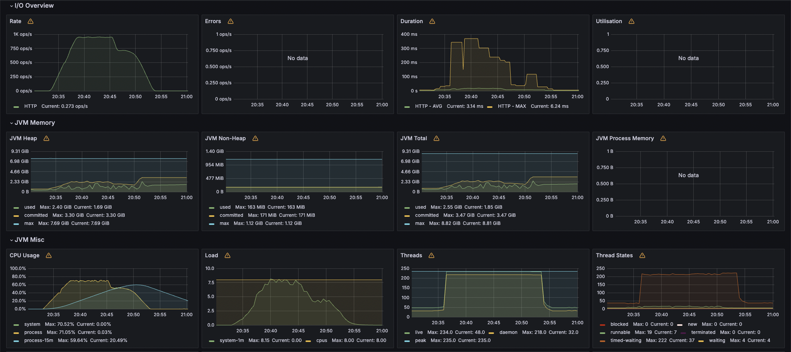

- cpu usage가 70%까지 올라가는걸 확인할 수 있다.
- cpu load가 8까지 올라가는걸 보면, 1000 RPS 부하를 견디기 위한 8코어는 적절한 선택인 듯 하다.
- 특이사항은 약 10분간 1000 RPS가 유지되어야 하는데, 8분정도 지나서 711RPS로 급격히 하락하는걸 볼 수 있다.
	- I/O overview 지표에 20:47분경 952 RPS에서 711 RPS로 급격히 하락
	- cpu usage도 20:47분경에 70% -> 50%로 급격히 하락
	- cpu load도 20:47분까지 8코어 다 쓰다가, 이후 급격히 하락
	- 1000RPS -> 700 RPS 하락 원인은 차후 후출한다.


- eden/survivor space의 메모리양이 요동치는걸 보니까, minor gc가 정상적으로 작동하고 있는걸 확인할 수 있다.
- old space에 20시 51분경에 메모리 양이 한번 뚝 떨어지는걸 보면, 해당 시간에 major gc가 일어난 것으로 보인다.

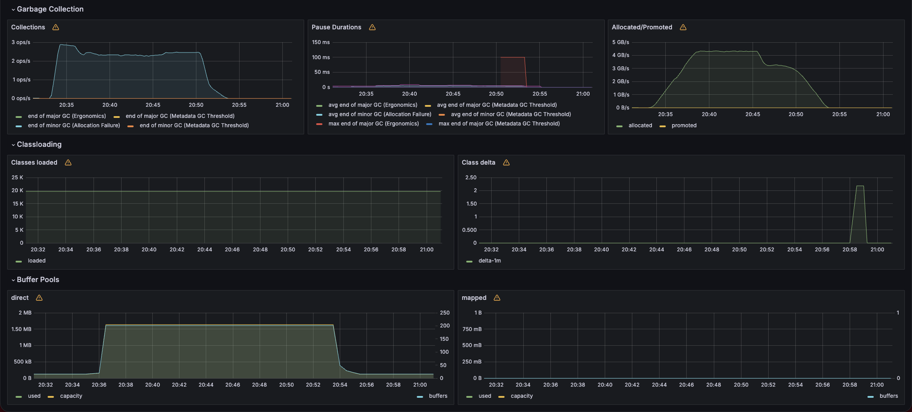

- 부하테스트가 다 끝나갈 무렵인 20:50분 부터 20:53분 경에 major gc가 일어난걸 확인할 수 있다.

#### 5-4. RDS metrics
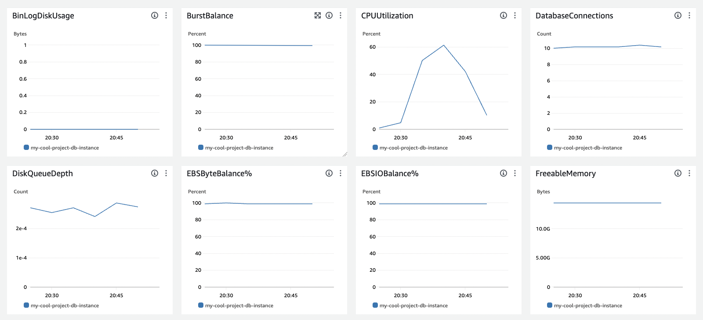
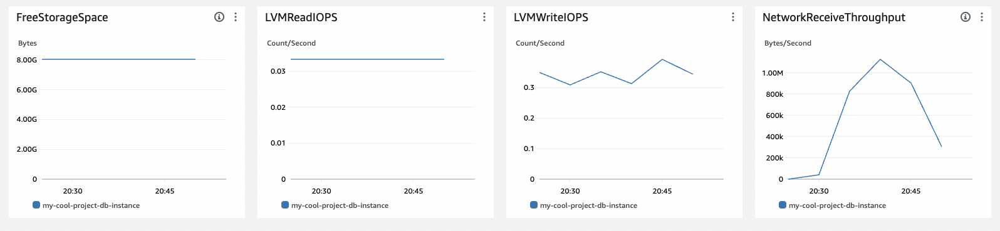
- 1000 TPS에서 cpu usage를 60%정도 쓰는걸로 보인다.
- 신기한점은 1000 RPS인데도 10 connection 밖에 쓰지 않는다는 것이다.
	- 그도 그럴 것이, 부하테스트를 건 쿼리의 실행 속도 측정 결과 5ms 이내로 나오기 때문에, isolation level을 높게 설정해서 read에 락을 걸지 않은 이상, 1 connection당 1초에 200번 쿼리 수행이 가능하고, 5 connection만 있으면 1초에 1000 쿼리를 수행 가능하다는 결론이 나온다.

##### b-5-5. Q. 왜 8분경에 1000RPS에서 700RPS로 요청량이 감소했을까?

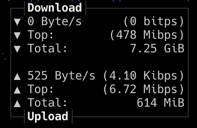

bpytop으로 부하테스트 거는 클라이언트 pc의 네트워크 탭을 보면\
1000 RPS걸 때, request는 최대 6.72 Mbps, response는 478 Mbps 의 처리량을 요구한다.

그런데 인터넷 속도는 평균 440Mbps에서 느릴때는 340Mbps~빠를 때는 680Mbps까지 요동친다.\
부하 테스트 때 8분동안 1000RPS 잘 처리하다가 마지막 2분에 꺾인 이유가\
**'서버의 처리속도가 느려서가 아니라 클라이언트의 인터넷 핑이 튀어서이지 않을까?'** 라고 생각했다.

---
```
data_received..................: 38 GB  32 MB/s
```
그런데 k6 부하 테스트 결과값을 보면, 초당 평균 처리량은 32 Mb/s(1000RPS는 대략 4/3을 곱해줘야 하니까 대략 40Mb/s)을 요구한다.

**초당 40 Mbps와 478 Mbps의 괴리는 어디에서 오는걸까?**

이는 초당 40MB/s의 response가 client pc로 오는데, client 측의 처리가 느려서 처리량보다 쌓이는 양이 많아졌기 때문에 최대 478 Mibps (인터넷 대역폭)까지 늘어난 것으로 예상된다.

```
http_req_sending...............: avg=8.98µs   min=2.25µs    med=4.75µs  max=204.49ms p(90)=7.87µs   p(95)=13.87µs
http_req_waiting...............: avg=75.01ms  min=15.4ms    med=39.84ms max=32.33s   p(90)=68.16ms  p(95)=300.85ms
http_req_receiving.............: avg=40.88ms  min=-115639ns med=2.89ms  max=59.96s   p(90)=21.37ms  p(95)=43.34ms
```

1. 그래서 처음 8분동안 1000 RPS는 잘 처리 되는 것 처럼 보이나,
2. 초당 client에 오는 response의 량(40Mbps) - 초당 client 처리량 만큼, client쪽 queue에 지속적으로 쌓이던게,
3. 한계점인 인터넷 대역폭(480 Mbps)을 넘어버리면,
4. queue size 이상의 response를 담을 수 없으니 버려지게 되고,
5. 이게 1분이상 초과되면 k6가 최대시간인 1분이라고 측정하고 timeout 처리해버리는 듯 하다.
6. 1초마다 1000 request를 보냄과 동시에 1000개의 response를 받아 500Mb를 다운로드 받는게, 일반컴퓨터의 cpu에게는 큰 부하를 주어, 평상시 8ns만에 처리하던 http_req_sending를 204ms까지 지연시킬 수 있는 점도 주목할만 하다.

따라서 부하테스트를 거는 pc또한 상당한 컴퓨터 자원을 요구하므로,\
대용량 부하테스트시, 하나의 로컬pc에서 하는게 아니라, 여러개의 ec2 인스턴스를 만들어 나눠서 부하테스트를 진행해야 하는 것으로 보인다.

#### b-6. monthly cost estimation
- architecture
	- ec2 1개, rds 1개, elasticache 1개에 대한 비용이다.
	- load balancer 비용이 예상외로 상당했기 때문에, 비용을 줄여보고자 간소화 하였다.
	- 하지만 실제 상황에서는 비용이 더 들어라도 load balancer + cpu usage가 30%정도로 유지되는 인스턴스 3개 + 1 rds + 1 elasticache가 HA 측면에서 유리하기에 더 적합할 수 있다.
		- 300 RPS 부하테스트에서, 2코어 ec2로 cpu usage가 88%까지 올라갔으니, 4코어 ec2 3개 + 로드밸런서로 1000 RPS 부하처리하는게 적절해보인다.
	- 비용계산을 하면 다음과 같다.
		1. 4core ec2인 t6g.xlarge가 on-demand 비용이 $0.1360/hr이니까, 3대면 $0.4080/hr + 1달 1000 RPS network load balancer 비용 $700
		2. 8core ec2인 m7g.2xlarge가 on-demand 비용이 $0.3264/hr + load balancer 비용 없음
	- 따라서 대략 월 돈백만원정도 차이가 나니까, ec2 인스턴스 1개인 경우, 서비스가 터졌을 때 예상 피해금액을 산정해서 월평균 백만원 이상 피해가 예상되면 instance 3개 + load balancer를 붙이는게 나아보인다.

---
- 총 요금
	1. load balancer 없는 경우
		1. on-demand: $706.49/month
		2. 인스턴스 절감형 플랜: $591.96/month
		3. 1년 선결제: $578.9/month
	2. load balancer를 포함한 경우
		1. on-demand: $1407.91/month
		2. 인스턴스 절감형 플랜: $1293.38/month
		3. 1년 선결제: $1280.32/month

---
1. network load balancer(optional)
	- 요금폭탄이 어마어마 하기도 하고, 일단 1000 RPS 트래픽이 일정하게 온다고 가정한 아키텍처 이기 떄문에 제외시키고 요금을 계산한다.
	- 단, 추후 10000 RPS+ 일 때에는 scale up의 효율이 내려가는 시점이 오므로, scale out을 해야할 때 로드밸런서를 써준다.
	- 고정 요금: 16.43 USD
	- 데이터 요금: 684.99 USD (1대 로드 밸런서, 1000 RPS, 42.4 Mbps throughput 기준, 152.64/h 처리량 기준)
	- Q. 분당 데이터 처리량 어떻게 계산할까?
		- 1000RPS load test의 결과에서, data_received가 32 MB/s, data_sent가 99kB/s가 나왔다.
		- 첫 5분까지 0 -> 1000RPS, 그 다음 10분은 1000 RPS 유지, 그 다음 5분은 1000 RPS -> 0의 패턴으로 부하 테스트를 하였다.
		- 따라서 32Mb * 4/3을 하면 1000 TPS시에 대략 42.4Mb/s 의 처리량이라는 숫자가 나온다.
		- 42.4Mb/s -> 152.64 Gb/h
2. ec2 (API server)
	- m7g.2xlarge
		- on-demand: $293.88/m
		- EC2 인스턴스 절감형 플랜
			- 예약기간 1년 선결제: $2145.32 / 12 = 178.77/m
			- 선결제를 안할 경우: $191.55 /m
	- monitoring
		- $ 2.1/m
3. ec2 (monitoring server)
	- t2.micro
		- on-demand: $10.51/m
		- EC2 인스턴스 절감형 플랜
			- 예약기간 1년 선결제: $70.08
			- 선결제를 안할 경우: $6.28 /m
4. rds
	- db.m6g.xlarge
		- single AZ
	- cost
		- on-demand: $352.59/m
	- storage
		- 100GB SSD(gp2)
		- cost: 13.10 USD
5. elasticache
	- cache.t4g.small
	- 노드갯수 1개 클러스터
		- on-demand: 34.31 USD /m
		- 예약기간 1년 선결제: 21.83 USD /m
		- 예약기간 1년 부분 선결제: 22.11 USE /m
	- 서버리스(HA 고려): 111.33 USD /m (평균 100 RPS 기준)


#### b-7. 느낀점

부하테스트 시, 처음에는 서버 처리 속도에만 관심이 있었지, 다른 네트워크 지표들은 관심이 없었다.\
예를들어, 'TCP connection 수립은 빨라서 무시해도 되겠지?' 라는 생각이나,\
'client->server, server->client 사이 인터넷 네트워크 성능은 네트워크 엔지니어가 알아서 잘 했겠지?' 라고 그냥 넘겨짚었고,\
부하테스트를 거는 클라이언트 쪽은 별 신경을 안썼다.\
심지어 부하테스트를 거는 와중에 다른 프로그램도 실행했었다.\
왜냐하면 그렇게 해도 300 RPS load test때는 전혀 문제가 없었기 때문이다.

문제는 1000 RPS load test 부터 였는데,\
점점 기계의 한계치까지 성능을 뽑아야 하는 상황이 오니까, 코어 노는지, 램은 꽉 찼는지, 스왑 메모리 잡혔는지, 네트워크 대역폭은 충분한지, 초당 송수신하는 요청의 throughput이 네트워크 대역폭 보다 적은지 등을 고려하게 되었다.

또한 부하테스트를 위한 별도서버 구축을 왜 해야 하는지도 알게되었다.


## c. 정규화 -> 반정규화로 변경 후 부하테스트 실험

### c-1. 문제점

다른 개발자의 부하테스트 글 읽었는데,

훨씬 저렴한 스펙의 ec2,rds로 더 많은 부하를 견뎠다.

왜지? join 연산 여러번 해서 그런가?


### c-2. 실험 조건
1. ec2, rds 둘다 2 core 4GiB RAM
2. table size: user = 1000, product = 10000, order = 5000
3. table rows ratio -> user:product:order = 1 : 10 : 5
4. http request read:write ratio: 9:1


#### c-2-before. 정규화 버전


#### c-2-after. 반정규화 버전


+FK도 삭제

### c-3. 성능테스트로 검증해보자 (100~800 RPS)


#### c-3-1. RDS CPU usage 메트릭 해석시 주의점

PMM에서 제공하는 CPU usage 메트릭이 총 7개 이다.
1. `{node_name="ecommerce-db-instance"}`: MySQL 인스턴스의 전체 CPU 사용률
2. `nice`: 낮은 우선순위로 실행되는 프로세스의 CPU 사용률
3. `system`: 시스템 프로세스의 CPU 사용률
4. `wait`: I/O 대기 시간의 CPU 사용률
5. `irq`: 하드웨어 인터럽트 처리에 사용된 CPU 시간
6. `user`: 사용자 프로세스의 CPU 사용률
7. `steal`: 가상화 환경에서 다른 VM에 의해 "훔쳐진" CPU 시간

처음에 잘 모를 땐 'nice'라고 써진걸 기준으로 실험결과를 기록했는데,\
나중에 알고보니 {node_name="ecommerce-db-instance"}가 전체 cpu usage를 종합한거라더라.

그런데 막상 실험해보니 저 {node_name="ecommerce-db-instance"} 에 나머지 지표까지 모두 더한게 실제 cpu usage인 것으로 추측된다.\
서버 터지는 구간이 저 모든 cpu usage 합산이 90% 넘어가는 지점이더라.

#### 100 RPS

| Metric | Normalized Version | Denormalized Version |
|--------|--------------------|-----------------------|
| **EC2** |
| CPU Usage | 10% | 7.1% |
| Load Average | 0.2 | 0.1 |
| Heap Used | 8.73% | N/A |
| Non-Heap Used | 12.41% | N/A |
| Last HTTP Latency | 88ms | 5ms |
| Last Max Latency | N/A | 290ms |
| Errors | None | None |
| **RDS** |
| CPU Usage | 4.2% | 3.1% (node: 5.78%, total: ~20%) |
| Load Average | 0.3 | 0.39 |
| Memory Availability | 71.35% | 67% |
| QPS | 361 | 285 |
| TPS | 280 | 163 |
| **MySQL Handlers Metric** |
| read_rnd_next | 20k ops/s | 10k ops/s |
| read_next | 1-2k ops/s | 2.1 ops/s |
| read_key | 1-2k ops/s | 115 ops/s |
| write | 1-2k ops/s | 162 ops/s |
| external_lock | N/A | 252 ops/s |
| **Network Traffic** |
| Inbound | 250 kb/s | 117 kb/s |
| Outbound | 610 kb/s | 439 kb/s |
| **Query Analysis** |
| Query Duration | All queries < 70ms | Most queries < 20ms, longest 21ms |

#### 200 RPS

| Metric | Normalized Version | Denormalized Version |
|--------|--------------------|-----------------------|
| **EC2** |
| CPU Usage | 20% | 14.3% |
| Load Average | 0.6 | 0.6 |
| Heap Used | 13.21% | N/A |
| Non-Heap Used | 12.43% | N/A |
| Avg Latency | 8ms | 5ms |
| Max Latency | 500ms | 292ms |
| Errors | None | None |
| **RDS** |
| CPU Usage | 8.6% | 5.3% (node: 10.73%, total: ~25%) |
| Load Average | 0.41 | 0.36 |
| Memory Availability | 71.16% | 67% |
| QPS | 704 | 576 |
| TPS | 577 | 324 |
| **MySQL Handlers Metric** |
| read_rnd_next | 40k ops/s | 18.5k ops/s |
| read_next | 3-6k ops/s | 4.5 ops/s |
| read_key | 3-6k ops/s | 225 ops/s |
| write | 3-6k ops/s | 172 ops/s |
| external_lock | N/A | 534 ops/s |
| **Network Traffic** |
| Inbound | 596 kb/s | 234 kb/s |
| Outbound | 1.5 MB/s | 1.03 MB/s |
| **Query Analysis** |
| Query Duration | All queries < 70ms | Most < 3ms, longest 20ms |

#### 300 RPS

| Metric | Normalized Version | Denormalized Version |
|--------|--------------------|-----------------------|
| **EC2** |
| CPU Usage | 30% | 23.4% |
| Load Average | 0.8 | 0.8 |
| Heap Used | 28.13% | N/A |
| Non-Heap Used | 12.73% | N/A |
| Last Avg Latency | 12.7ms | 6ms |
| Last Max Latency | 1.14s | 276ms |
| Errors | None reported | None |
| **RDS** |
| CPU Usage | 14.6% | 7.73% (node: 12.05%, total: ~30%) |
| Load Average | 1.77 | 0.57 |
| Memory Availability | 70.80% | 67% |
| QPS | 1080 | 836 |
| TPS | 855 | 483 |
| **MySQL Handlers Metric** |
| read_rnd_next | 63.9k ops/s | 29.4k ops/s |
| read_next | 5-13k ops/s | 7.6k ops/s |
| read_key | 5-13k ops/s | 343 ops/s |
| write | 5-13k ops/s | 182 ops/s |
| external_lock | N/A | 748 ops/s |
| **Network Traffic** |
| Inbound | 888 kb/s | 345 kb/s |
| Outbound | 2.94 MB/s | 1.76 MB/s |
| **Query Analysis** |
| Query Duration | All queries < 70ms | Most < 3ms, longest 20ms |

#### 400 RPS

| Metric | Normalized Version | Denormalized Version |
|--------|--------------------|-----------------------|
| **EC2** |
| CPU Usage | 51% | 33.4% |
| Load Average | 2.3/2.0 | 1.0 |
| Heap Used | 41.83% | N/A |
| Non-Heap Used | 12.66% | N/A |
| Last Avg Latency | 10.9ms | 5ms |
| Last Max Latency | 664ms | 215ms |
| Errors | None reported | None |
| **RDS** |
| CPU Usage | 21.4% | 11.9% (node: 18.78%, total: ~43%) |
| Load Average | 1.38 | 0.41 |
| Memory Availability | 70.50% | 66% |
| QPS | 1.47k | 1.16k |
| TPS | 1.17k | 657 |
| **MySQL Handlers Metric** |
| read_rnd_next | 83.1k ops/s | 35.2k ops/s |
| read_next | 18.7k ops/s | 12.9k ops/s |
| read_key | 15.3k ops/s | 449 ops/s |
| write | 500 ops/s | 269 ops/s |
| external_lock | N/A | 954 ops/s |
| **Network Traffic** |
| Inbound | 1.18 MB/s | 465 kb/s |
| Outbound | 5.71 MB/s | 3.01 MB/s |
| **Query Analysis** |
| Query Duration | All queries < 70ms | Most < 3ms, longest 20ms |

#### 500 RPS

| Metric | Normalized Version | Denormalized Version |
|--------|--------------------|-----------------------|
| **EC2** |
| CPU Usage | 73% | 43.0% |
| Load Average | 4.3/2.0 | 1.4 |
| Heap Used | 40.83% | N/A |
| Non-Heap Used | 12.66% | N/A |
| Last Avg Latency | 10.9ms | 6ms |
| Last Max Latency | 664ms | 285ms |
| Errors | None reported | None |
| **RDS** |
| CPU Usage | 30.3% | 15.9% (node: 24.3%, total: ~50%) |
| Load Average | 0.63 | 0.76 |
| Memory Availability | 70.24% | 66% |
| QPS | 1.78k | 1.44k |
| TPS | 1.41k | 778 |
| **MySQL Handlers Metric** |
| read_rnd_next | 101.1k ops/s | 45.2k ops/s |
| read_next | 48k ops/s | 19.4k ops/s |
| read_key | 33k ops/s | 551 ops/s |
| write | 640 ops/s | 201 ops/s |
| external_lock | N/A | 1.21k ops/s |
| **Network Traffic** |
| Inbound | 1.48 MB/s | 577 kb/s |
| Outbound | 9.24 MB/s | 4.65 MB/s |
| **Query Analysis** |
| Query Duration | All queries < 70ms | Most < 3ms, longest 20ms |

#### 600 RPS and above

| Metric | Normalized Version (600+ RPS) | Denormalized Version (600 RPS) |
|--------|------------------------------|--------------------------------|
| **EC2** |
| CPU Usage | 97% | 56.2% |
| Load Average | 6.6/2.0 | 2.3 |
| Heap Used | 40.83% | N/A |
| Non-Heap Used | 12.66% | N/A |
| Last Avg Latency | 10.9ms | 8s |
| Last Max Latency | 664ms | 374ms |
| Errors | None reported | None |
| **RDS** |
| CPU Usage | 39.1% | 20.0% (node: 28%, total: ~70%) |
| Load Average | 2.27 | 3.13 |
| Memory Availability | 69% | 66% |
| QPS | 2.04k | 1.75k |
| TPS | 1.6k | 985 |
| **MySQL Handlers Metric** |
| read_rnd_next | 111.1k ops/s | 56.3k ops/s |
| read_next | 65k ops/s | 27.4k ops/s |
| read_key | 43k ops/s | 671 ops/s |
| write | 712 ops/s | 211 ops/s |
| external_lock | N/A | 1.45k ops/s |
| **Network Traffic** |
| Inbound | 1.71 MB/s | 682 kb/s |
| Outbound | 12.56 MB/s | 6.93 MB/s |
| **Query Analysis** |
| Query Duration | All queries < 70ms | Most < 3ms, longest 20ms |


#### 700 RPS

| Metric | Normalized Version | Denormalized Version |
|--------|--------------------|-----------------------|
| **EC2** |
| CPU Usage | N/A (> 97% at 600 RPS) | 70.9% |
| Load Average | N/A (> 6.6 at 600 RPS) | 4.9 |
| Heap Used | N/A | N/A |
| Non-Heap Used | N/A | N/A |
| Last Avg Latency | N/A | 10ms |
| Last Max Latency | N/A | 2.23s |
| Errors | N/A | None |
| Actual RPS | N/A (< 568 at 600 RPS) | 680-690 |
| **RDS** |
| CPU Usage | N/A (> 39.1% at 600 RPS) | 25.3% (node: 32.55%, total: ~75%) |
| Load Average | N/A (> 2.27 at 600 RPS) | 1.16 |
| Memory Availability | N/A (< 69% at 600 RPS) | 65% |
| QPS | N/A (> 2.04k at 600 RPS) | 1.97k |
| TPS | N/A (> 1.6k at 600 RPS) | 1.095k |
| **MySQL Handlers Metric** |
| read_rnd_next | N/A (> 111.1k ops/s at 600 RPS) | 64.47k ops/s |
| read_next | N/A (> 65k ops/s at 600 RPS) | 40.9k ops/s |
| read_key | N/A (> 43k ops/s at 600 RPS) | 775 ops/s |
| write | N/A (> 712 ops/s at 600 RPS) | 220 ops/s |
| external_lock | N/A | 1.64k ops/s |
| **Network Traffic** |
| Inbound | N/A (> 1.71 MB/s at 600 RPS) | 796 kb/s |
| Outbound | N/A (> 12.56 MB/s at 600 RPS) | 9.96 MB/s |
| **Query Analysis** |
| Query Duration | N/A (All queries < 70ms at 600 RPS) | Most < 3ms, longest 20ms |

#### 800 RPS

| Metric | Normalized Version | Denormalized Version |
|--------|--------------------|-----------------------|
| **EC2** |
| CPU Usage | N/A (> 97% at 600 RPS) | 92.9% |
| Load Average | N/A (> 6.6 at 600 RPS) | 9.6 |
| Heap Used | N/A | N/A |
| Non-Heap Used | N/A | N/A |
| Last Avg Latency | N/A | 52.4ms |
| Last Max Latency | N/A | 1.29s |
| Errors | N/A | None |
| Actual RPS | N/A (< 568 at 600 RPS) | 750-770 |
| **RDS** |
| CPU Usage | N/A (> 39.1% at 600 RPS) | 32.17% (node: 39.48%, total: ~95%) |
| Load Average | N/A (> 2.27 at 600 RPS) | 1.99 |
| Memory Availability | N/A (< 69% at 600 RPS) | 65% |
| QPS | N/A (> 2.04k at 600 RPS) | 2.19k |
| TPS | N/A (> 1.6k at 600 RPS) | 1.2k |
| **MySQL Handlers Metric** |
| read_rnd_next | N/A (> 111.1k ops/s at 600 RPS) | 67.5k ops/s |
| read_next | N/A (> 65k ops/s at 600 RPS) | 52.6k ops/s |
| read_key | N/A (> 43k ops/s at 600 RPS) | 848 ops/s |
| write | N/A (> 712 ops/s at 600 RPS) | 240 ops/s |
| external_lock | N/A | 1.82k ops/s |
| **Network Traffic** |
| Inbound | N/A (> 1.71 MB/s at 600 RPS) | 891 kb/s |
| Outbound | N/A (> 12.56 MB/s at 600 RPS) | 13.5 MB/s |
| **Query Analysis** |
| Query Duration | N/A (All queries < 70ms at 600 RPS) | Most < 3ms, longest 20ms |


### c-4. 실험 결과 해석

같은 스펙의 ec2, rds에서, 같은 테이블 사이즈에 동일한 load test를 했을 때,\
정규화 버전의 한계는 560 RPS, 비정규화 버전의 한계는 750 RPS 정도 된다.


정규화 버전에 560RPS일 때, 2k QPS정도 나온다.\
2k QPS는 비정규화 버전에서는 700 RPS에서 나오는 수치다.\
join할 때 쿼리 한번할껄 여러번 쪼개서 하기 때문에 QPS도 많이 찍히고\
join(nested loop join, hash join)할 때 드는 cpu cost가 더 많이 드는 듯 하다.

실험한 테이블 사이즈가 user:product:order = 1000:10000:5000 인데,\
테이블 사이즈가 10만, 100만 으로 커질 수록\
join cost이 늘어나기 때문에 정규화, 비정규화 성능 격차는 더 커질 것으로 예상된다.


### c-5. 깨달은 점: 비용을 고려한 scale out 전략을 어떻게 짤 것인가?

1. 성능테스트를 할 수록 느끼는건 **쿼리만 신경써서 짜도**([example](#d-sql-tuning)) 서버 스펙에 들어가는 돈을 많이 아낄 수 있다는 것이다.
2. [반정규화](#b-반정규화) 실험에서 느낀건, 반정규화만 해놔도 서버 비용을 많이 아낄 수 있다.
3. 서비스 초기 때 HA고려를 배제하면 많은 비용을 아낄 수 있다.
	1. ALB가 생각보다 비용이 엄청 나온다. (기본 요금은 싼데 데이터 요금이 어마어마하게 많이 나온다. RDS보다 더 나온다.) 따라서 서비스 초기에 ALB + scale out 세팅 비용보다 단순 ec2 scale up이 훨씬 싸게 먹힌다.
	2. elastic cache도 scale out된 ec2들이 authentication 목적으로 동일한 장소에서 동기화 되는 유저 정보를 쓰기 위함 + 통계쿼리 같은 DB 자원 많이먹는 쿼리 캐싱해두기 위해 썼는데 고스펙 ec2 하나에 local cache 쓰면 elastic cache 비용도 아낄 수 있다. CPU가 비싼거지 RAM은 싸다.
4. DB 스케일업 전략
	1. RDS는 scale up할 때마다 기하급수적으로 비용이 늘어나기 때문에, 8코어 쓰는 것 보다 1~2코어 master/read replicas 쓰는게 더 싸다.
	2. master/slave 구조의 장점은 read heavy, write heavy 앱에 따라 전략이 달라질 수 있다. ecommerce app의 경우 read:write 9:1 비율이기 때문에, write 담당 master node는 싼거 쓰고 read replica는 CPU usage 40~70% 내에 속하는 스펙을 고르면 된다.
	3. master/slave 구조의 또 다른 장점은 RDS proxy라는 서비스를 쓰면 master/read replicas thread pool 관리를 RDS proxy가 대신 해주기 때문에 CPU usage을 조금 낮출 수 있다. 다른 지표는 괜찮은데 CPU usage가 70%가 넘어가서 어쩔 수 없이 scale up 하는 상황에서 RDS proxy를 쓰면 CPU usage를 낮추고 scale up 안해도 된다.
	4. cache layer(ex. elastic cache)를 붙이는 기준도, RDS scale up 비용이 기하급수적으로 올라가니까, RDS scale up 하느니 차라리 elastic cache 써서 거기에 쿼리 캐싱해서 RDS i/o줄이는게 이득일 때 하는 것이다.
5. webapp에 따라 캐싱을 효율적으로 쓸 수 있는 서비스가 있다.
	1. ecommerce 같은 경우엔 아무래도 판매자가 상품페이지 업데이트를 자주 할 수 있고, 했던게 바로 반영되어야 하니까, 캐싱을 이용할 수 있는 부분이 유저 인증이나 홈페이지에 뿌려지는 top 10 products 이런것들 뿐인데,
	2. 디스패치같이 평소엔 트래픽 없다가 특종 터지면 트래픽이 10배, 20배 이상 터지는 서비스의 경우, 특종된 기사를 캐시에 저장하면 디비를 거치지 않고 빠르게 뿌릴 수 있기 때문에 DB 유지비용이 많이 줄어든다. ([디스패치 트래픽 대응 컨퍼런스](https://youtu.be/8uesJLEXxyk?t=1605))


# F. 기술적 도전 - Frontend

## a. 카테고리바의 UX 개선기

#### 개선 전 vs 후 비교

##### before)


##### after)


### 감성은 디테일에서 온다. 샥! 넘기는 효과 구현하기

애플과 삼성폰의 인식의 차이는 디테일에서 오는 감탄의 차이인 듯 하다.


나이키의 카테고리 바는 샥! 넘기는 디테일이있다.


내 카테고리바는 그 맛, 그 감성이 없다. 그저 무던하다.


흠... 어떻게 하지?

[codepen.io](https://codepen.io/tahazsh/pen/wNOvyK)에 검색해보니 얼추 원리가

1. 쇽! 올라가는 효과의 `offset`(기준)을 정한다.
2. 스크롤을 일정수준 이상 내려 offset의 기준이 충족되면 `showNavbar` 변수를 `false`로 바꾼다.
3. `false`면 숨기는거니까, `transform: translateY(-100%)`로 화면 밖 위로 올리고,
4. `transition`으로 위로 올리는 속도와 가속도를 정한다.

tailwind에서는 대략 이런 코드다.

```typescript
<div className={`
  relative w-full z-50 bg-white
  transform transition-transform duration-200 ease-out
  ${showNavbar
	? '[transform:translate3d(0,0,0)]'
	: '[transform:translate3d(0,-100%,0)] shadow-none'}
`}>
```

<br />

#### 1. 중간결과1 - 쇽! 숨겨진다. 근데..


쇽! 숨겨진다!

근데 모달이 카테고리바랑 따로논다...

왜냐면 모달의 위치를 정하는걸

1. y축으로 스크롤한 정도를 `useEffect()`로 트래킹해서 modal에 넘겨주면
```javascript
useEffect(() => {
	const handleScroll = () => {
	  setScrollY(window.scrollY);
	};

	window.addEventListener('scroll', handleScroll);
	return () => window.removeEventListener('scroll', handleScroll);
}, []);
```
2. top: scrollY의 위치로 잡았는데..

```javasript
const modalTop = Math.max(80 - scrollY, 0);

<div style={{top:`${modalTop}px`}}>
```

`useEffect()`로 스크롤값 파악하는 방식은 아무리 re-랜더링 빨리 한다지만,\
중간에 미세한 딜레이가 생겨 모달 움직이는게 좀 부자연스러워 보인다.\
categoryBar에 딱 붙여야 할듯 하다.


그래서 `<Modal>`의 포지션이 원래 `position:fixed` + 카테고리 밖에 위치했기 때문에,\
페이지 전체를 커버하면서 특정 위치에서 생성되는 원리였는데,\
`position:relative`로 바꾸고 `<CategoryBar>` 안으로 편입시켜서\
`<CategoryBar>`의 포지션을 기준점으로 위치잡도록 했다.


#### 2. 중간결과2 - 같이논다! 근데...


이제 카테고리바랑 모달이랑 같이논다!

근데 모달을 펼쳤을 때 배경이 어두워지는 기능이 안된다?!


---
##### 원인
왜냐면 `<Modal>`이 `<CategoryBar>` 바깥쪽에 있을 땐, 페이지 전체를 커버하니까, `background-color:black` 했을때 적용됬던건데,\
`<CategoryBar>` 내부로 편입시킨 후에 공간할당을 결국 `<CategoryBar>`의 `<div>` 안에서밖에 못받으니까 백그라운드 fade-out effect가 적용이 안됬던 것이다.


css 선택자에 `:before`, `:after`도 시도해봤지만 결국 `<CategoryBar>`의 `<div>` 내부 공간밖에 못쓰기 때문에 실패했다.


##### 해결책
따라서 `<CategoryBar>` 바깥에 fade-out 효과만을 위한 `<div>`를 추가했다.


##### 그 외 시행착오
tailwind에서 opacity, fadeout, animation 관련 코드를 넣었는데 적용이 안되길래,\
개발자도구에서 해당 `<div>`의 스타일 태그를 확인해보니 적용이 안되있는 에러가 있었고,\
`style={{ transitionProperty: 'opacity', transitionTimingFunction: 'cubic-bezier(0.4, 0, 0.2, 1);', transitionDuration: '800ms'}}`\
이런식으로 직접 입력하니까 적용 됬다.

또한 `modalOn` 변수의 `true/false`에 따라 fade-out `<div>`를 `hidden`이었다가 보여줬다가 이런 식으로 했었을 땐 bg-black은 적용됬으나, fadeout-animation은 적용이 안됬었는데,\
`hidden`방식을 버리고 opacity를 0->100으로 바꾸는 방식과 fadeout-animation을 썼더니 잘 작동하였다.


#### 3. 중간결과3 - fadeout 작동한다! 근데...


스크롤 내렸을 때, 나이키처럼 모달이 화면 상단에 탁! 걸리는 효과가 없다.


---
##### 문제 원인
현재 모달은 `position: relative`에 `<CategoryBar>`이랑 붙어있어서,\
`<CategoryBar>`이 `translateY(-100%)`로 위로 올라가 버리면,\
`<Modal>`도 `<CategoryBar>`을 따라 사라지는 것 처럼 보인다.

근데 화면 위로 고정시키는건 `position: fixed`에 `top-0` 하면 되긴 하는데,\
문제는 `position: fixed`은 html tag랑 같이 작용하는게 아니라, 스크린에 특정 위치에 고정시키는 방식이라,\
`<CategoryBar>`와 따로노는 문제가 다시 발생한다(중간결과1에서 생겼던 문제)


----
##### 중간정리
그러니까 정리하면,\
현재 구조가

```html
<App>
	<TopNavBar>
	<CategoryBar> - when disappears, transform:translate3d(0,-100%,0)]
		<Modal> - position:relative, top: 100%
	<Fadeout>
	<Body>
<App/>
```

이런 구조인데,

`<CategoryBar>`이 `translate3d(0,-100%,0)`로 위로 사라지면 붙어있던 `<Modal>`도 같이 사라지는 문제가 있다.

스크롤 내리면 `<Modal>`은 화면 최상단에 `position:fixed, top:0` 고정시키고 싶다.

```html
<App>
	<TopNavBar>
	<CategoryBar>
	<Modal> - position:fixed, top: 0
	<Fadeout>
	<Body>
<App/>
```

이렇게 바꾸면 `<Modal>`이 화면 상단에 고정은 되는데, `<CategoryBar>`랑 따로놀게된다.


---
#### 궁금증과 해결책
Q. 어떻게 하면
1. `categoryBar`을 hover시 모달이 `<CategoryBar>`에 꼭 붙어서 펼쳐지면서,
2. 동시에 스크롤 내려서 `<CategoryBar>`가 사라지면 화면 위에 `position: fixed, top:0`으로 붙일 수 있지?


A. 이런 구조로 바꾸니까 되더라.
```html
<App>
	<TopNavBar>
	<nav> - position: relative
		<CategoryBar>
			1. case1 - 평상시 상태) position: relative,
			2. case2 - 위로 올라간 상태) position: relative, translateY(-100%)
		<Modal>
			1. case1 - 평상시 상태) position:relative, top: 100%
			2. case2 - 위로 올라간 상태) position: fixed, top:0,
	<nav/>
	<Fadeout>
	<Body>
<App/>
```

수정점1) `<CategoryBar>`가 화면 위로 사라졌을 때, `<Modal>`의 포지션을 `relative`에서 `fixed top:0`로 수정하였다.

이런 구조면 `fixed top-0`는 다른 html tag에 영향을 안받으니까, 화면 위에 붙일 수 있다.

수정점2) `<CategoryBar>`가 없어졌을 때 `<Modal>`의 `position:relative`가 위치 기준점을 잡아야 하기에 `<CategoryBar>`와 `<Modal>`을 `<nav>`로 감싸주었다.

이런식으로 수정했더니 스크롤을 내려도 모달이 상단고정 되었다.


#### 4. 중간결과4 - 모달이 상단고정은 된다. 그런데...


디테일의 영역이긴 한데, 두가지 좀 이상한 부분이 있다.

1. 문제1) `<CategoryBar>`가 화면상단으로 사라질 때, 너무 빨리 사라진다는 느낌을 준다.
	- `<CategoryBar`+`<Modal>`이 같이 샥! 올라가야 하는데,
	- `<CategoryBar>`은 올라가면서 `<Modal>`이 갑자기 위에서 생성되는 듯한 느낌을 준다.
2. 문제2) 스크롤을 위로 땡길 때, `<CategoryBar>`랑 `<Modal>`사이에 갭이 보인다.


---
현재 이런 구조인데,
```html
<App>
	<TopNavBar>
	<nav> - position: relative
		<CategoryBar>
			1. case1 - 평상시 상태) position: relative,
			2. case2 - 위로 올라간 상태) position: relative, translateY(-100%)
		<Modal>
			1. case1 - 평상시 상태) position:relative, top: 100%
			2. case2 - 위로 올라간 상태) position: fixed, top:0,
	<nav/>
	<Fadeout>
	<Body>
<App/>
```
이 구조에서, "위로 올라간 상태"를 보면,
1. `<CategoryBar>`는 `translateY()`로 올라가고,
2. `<Modal>`은 `position:fixed top-0`으로 짠! 생성되기 때문에,

둘이 따로 놀고, 올라가는 모션이 매끄럽지 않은 것이다.


---
고민해도 답이 안나오길래,


나이키가 어떻게 만들었는지 뜯어봤다.

```html
<App>
	<TopNavBar>
	<nav> - position: relative
		<CategoryBar>
			1. case1 - 평상시 상태) position: relative,
			2. case2 - 위로 올라간 상태) position: fixed, top:0, translateY(-100%)
		<Modal>
			1. case1 - 평상시 상태) position:fixed, top: 0
			2. case2 - 위로 올라간 상태) position: fixed, top:0,
	<nav/>
	<Fadeout>
	<Body>
<App/>
```

신기한 점은 `<Modal>`의 포지션이 `relative`가 아니라 `fixed`인 점이다.\
`fixed`면, `<CategoryBar>`과 따로 놀텐데????

근데 왜 보이기엔 `relative` 처럼 보이지?

`fixed` 인데 어떻게 특정 html tag에만 붙게 만들었지?

[검색](https://stackoverflow.com/questions/6794000/fixed-position-but-relative-to-container)해보니, `position:sticky`가 해결책인 듯 하다.

parent element에 붙어서 작동하면서, 동시에 `fixed`의 성질을 가지고 있는 `sticky`를 써보자.


#### 5. 중간결과5 - 성공! 근데...


된다!

1. `<CategoryBar>`와 `<Modal>`이 따로 놀지 않으면서,
2. 스크롤 내렸을 때, `<Modal>`이 화면 상단에 고정된다.


이제야 알게된 사실인데, `position:sticky` 써서 만든 html page를 개발자 도구로 까봤더니, `position:fixed`로 나왔다.

아마 나이키 페이지도 `sticky`로 구현됬는데, 전에 까봤을 때 봤던 `fixed`는 컴파일 과정에서 다른 property와 조합되서 변형된 듯 하다. 괜히 해깔렸다.

#### 해결책

```html
<App>
	<TopNavBar>
	<CategoryBar>
		1. case1 - 평상시 상태) position: relative,
		2. case2 - 위로 올라간 상태) position: fixed, top:0, translateY(-100%)
		<Modal> - placed inside <CategoryBar>!
			1. case1 - 평상시 상태) position:sticky, top: 0
			2. case2 - 위로 올라간 상태) position: sticky, top:0,
	<CategoryBar/>
	<Fadeout>
	<Body>
<App/>
```

---
##### 다른 아쉬운 점) 모달창 나타날 때 animation 효과가 없다


내가 만든건 자세히 보면, 모달창을 열 때, 그냥 짠! 하고 나타난다.


나이키 사이트는

1. 쇽! 하고 내려오고
2. 모달 안 글자가 바로 보이는게 아니라, transition으로 서서히 나타난다.

이 효과를 구현해보자.

#### 6. 중간결과6 - modal css-animation 성공! 근데...


이제 모달이 내려오고, 모달 안 text가 서서히 나타나서 처음보다 UX 측면에서 더 낫다.

이제 스크롤 내리는 도중, 살짝 올리면, 카테고리바가 나타나는 기능을 추가해보자.


#### 7. 중간결과7 - 스크롤 내리다 올렸을 때 카테고리바가 빼꼼 나오는 기능


1. scroll한 정도의 위치를 파악해 scrollUp을 감지 후,
2. 했다면 `<CategoryBar>`을 `translateY(0)`으로 나타나게 했다.

대략 로직은 이렇다.

```jsx
useEffect(() => {
    const handleScroll = () => {
        const currentScroll = window.scrollY;

        // Determine scroll direction and update state
        if (currentScroll < lastScrollPosition && currentScroll > SCROLL_OFFSET) {
            setIsScrollingUp(true);
        } else {
            setIsScrollingUp(false);
        }

        // Show the bar if:
        // 1. We're at the top of the page (within SCROLL_OFFSET)
        // 2. OR we're scrolling up
        setShowCategorybar(currentScroll < SCROLL_OFFSET || isScrollingUp);
        setLastScrollPosition(currentScroll);
    };

    window.addEventListener('scroll', handleScroll);

    return () => window.removeEventListener('scroll', handleScroll);
  }, [lastScrollPosition, isScrollingUp]);
```

```css
${showCategorybar
	? isScrollingUp
		? 'fixed top-0' //스크롤 내린 후, 다시 올릴 때 보여줌
		: 'sticky [transform:translate3d(0,0,0)]'  // 평상시
	: 'fixed top-0 left-0 right-0 [transform:translate3d(0,-80px,0)]' //스크롤 내릴 때, 숨김
}
```

`sticky`를 썼는데, `sticky`는 `fixed`와는 다르게 공간을 차지해서,\
다른 `html_tag`가 `relative`면 나왔다 사라질 때 영향을 주는 문제가 있었다.

```html
<nav className="relative h-32">
	<CategoryBar>
		<Modal />
	<CategoryBar/>
<nav/>
```
그래서 절대 height 공간을 차지하는 `position:relative`인 `<nav>`태그로 감싸주었다.


##### 또 다른 문제) 카테고리가 깜박인다?!


근데 또 다른 문제가 생겼는데,\
자세히 보면, 위 아래로 스크롤을 올렸다 내렸다 할 때,\
**카테고리바가 깜박이는 문제**가 있다.

`useEffect`에 `isScrollingUp`조건을 추가했더니, 컴포넌트가 re-rendering 되는게 원인인 듯 하다.\
스크롤이 아무래도 매우 빈번하게 일어나는 것이다 보니, 그런 듯 하다.


#### 8. 최종(?)결과8 - 불필요한 re-rendering 최소화

이제 더 이상 스크롤 업 & 다운 반복할 떄 깜박이지 않는다!

##### before)


1. 원래는 스크롤 할 때마다 `scrollY`의 변수를 계속 트래킹 하면서 바뀔 때 마다 계속 re-rendering 했다.
2. 상태관리하는 `useState` 변수도 3개씩 썼었고,
3. `useEffect(a, [b]);`에서 `[b]`에 트래킹 되는 변수가 2개가 있었다.

그래서 re-rendering이 잦았고, 불필요한 자원을 많이 썼었다.

##### after)

1. 이젠 이벤트리스너가 스크롤 시 `scrollY`를 트래킹하긴 하지만, 그 값 자체를 트래킹하지 않고, 단순하게 카테고리바 보일지 여부 & 스크롤업 여부를 useState 변수 하나로 관리한다.
2. lastScrollPosition은 `useState`에서 `useRef`로 바꿨는데, `useRef`는 값이 변경되어도 re-rendering이 일어나지 않기 때문이다.
3. 스크롤 할 때마다 트래킹 하는게 아니라, `lodash/throttle`로 100ms 간격으로 체크하게 하여 불필요한 자원낭비를 줄였다.
4. `useEffect`의 의존성도 `[]`로 비워놨기 때문에, 마운트 시에만 실행된다. (스크롤 이벤트 때마다 불필요하게 re-rendering 하지 않음)


#### 9. 최종결과9 - UX를 고려한 카테고리바 완성

완성한 줄 알았는데, 스크롤바를 급격히 빠르게 내리면 끊김현상이 있었다.

자세히 보면, 스크롤을 내릴 때 카테고리바가 올라가는데, 또 한번 원위치 했다가 다시 올라간다.

##### 문제의 원인
문제의 명확한 원인 아마 `position:sticky, relative`같은 다른 `html_element`포지션에 연관된걸 사용하다가,\
갑자기 다른DOM에 영향 안받는 `position:fixed`를 써버리는것 + `css:animation`과 같이 쓰면 내부적으로 뭔가 꼬이는 듯 하다.


##### 해결책
1. `<CategoryBar>`의 위치가 바로 위에있는 `<TopNavBar>`에 영향을 받은 것 같으니, 이 둘을 같은 `<nav>`로 묶고,
2. `<CategoryBar>`에 `position`전환을 `sticky`->`fixed`로 전환이 아닌, 항상 `fixed`를 쓰게 했더니 해결됬다.

##### 결과


빠르게 스크롤 할 때에도 부드럽다!


#### 10. 느낀점

Q. 삼성이랑 애플이랑 기능이 같은데 왜 비싼 돈 주고 애플사나요?

A. 그야, **감성**있으니까...

괜히 감성 찾는게 아니더라...\
감성 살리려면 디테일에 신경 엄청 써야한다..\
그리고 **디테일**을 챙기려면 생각 이상의 **예민함**과 **에너지**와 **기술**이 들어가더라...


## b. 사용자경험(UX)을 반영한 맞춤형 앱 설계

### 1. 필터 적용시 refresh page 여부
#### case1) nike: 필터 적용 ->  page refresh가 일어나서 끊김


나이키는 상품리스트 페이지에서 필터 적용 할 때마다,

url 주소가 바뀌면서,

**페이지 리프레쉬가 일어나 사용자 경험 도중 끊김 현상을 느낀다.**

(나이키 개발자는 이 문제를 인지했는지, GET요청 전, productCard를 흐리게하는 이펙트를 주어 유저에게 페이지가 끊기고 넘어가는게 아니라 부드럽게 넘어간다는 "느낌"을 주려고 했고, 이 해결책은 SSR-page-refresh 문제의 영리한 해결책 중 하나인 듯 하다.)

<br/>

#### case2) 현 프로젝트: 필터 적용시 page refresh 없이 부드럽게 필터 적용됨


스무스하다. 페이지 refresh 없이 filter가 적용된다.\
어떻게 이게 가능한가?\
**nike 앱의 특수성에 맞게 설계했기 때문이다.**

쿠팡같은 앱은 카테고리 하나에 product가 수천개나 있기 때문에, 한번에 다 가져올 수 없다.
1. 그만큼의 양을 캐싱할 데이터베이스의 요금이 비싸기도 하고,
2. 캐싱 안하고 i/o를 하면 부하가 너무 많기 때문에 latency가 느려지고 서버 터질 위험이 있기 때문이다.
3. client입장에서도 http response size가 너무 크면, 파싱 후 렌더링까지 시간이 오래 걸리게 되는데,
4. [적정 duration](https://x.com/__keeeeeem/status/1661246021412990983)의 근거를 찾아보니 페이지 로드속도가 500ms 이하여야 UX가 좋다라 판단할 수 있겠다.


이러한 이유 때문에 product_list 페이지는 url에 `GET ?filter1=&filter2=` 이런식으로\
필터 조건을 요청해서 sql where절에 조건절로 **일부 상품만** 가져오는 식이다.


근데 현 프로젝트는 nike앱을 모티브로 만들었다.\
**nike 앱의 특징은 카테고리가 엄청 세부적이다.**

예를 들어, '여성 재킷' 카테고리는 다음과 같이 세분화된다.

1. 봄버 재킷
2. 파카 재킷
3. 푸퍼 재킷
4. 레인 재킷
5. 트랙 재킷
6. 베스트

이러한 세부 카테고리는 매우 다양하며, 각 카테고리에 속한 상품 수는 대체로 10~30개 미만이다.\
(이는 나이키가 상품을 주기적으로 출시하고 단종시키는 전략 때문)

때문에 카테고리 별로 fetch product 해도. response되는 상품 갯수가 30개가 채 안된다.\
이정도 response size면 `GET /filter1=?&filter2=?` + SSR 식으로 상품 필터하는게 아니라

1. 한번에 30개 상품을 다 가져온 후,
2. CSR로 즉각적으로 page refresh 끊김 없이 바로바로 스무스하게 필터링

...하는게 UX 측면에서 훨씬 좋다.\
(유저 행동에 page-refresh같은 걸림이 없기 떄문)

그래서 보통 ecommerce 제작시, product_list 페이지를 SSR로 하는게 보편적이지만,\
nike를 모티브한 ecommerce app은 그 앱의 특성을 고려하여\
product_list 페이지를 뚝뚝 끊기는 SSR보다 CSR로 랜더링 하는것이 더 낫다고 판단했다.


### 2. 주의: 카테고리별 product 수가 시간이 지남에 따라 증가하는 앱이라면?
위의 UX 최적화 설계는 나이키처럼 세부 카테고리 별 상품수가 30개 언더로\
이커머스 측에서 상품관리를 해준다는 전제로 설계되었다.

만약 주기적으로 카테고리별 상품 관리를 하지 않는 ecommerce가 위의 설계대로 앱을 만들 경우,\
점점 product table size가 커질 수록,\
product_list 페이지를 넘길 때마다 디비에 부하를 주고 latency도 늘어나 UX가 안좋아 질 것이다.


실험을 해보면,

1. product table이 1000행, productItem table이 3000행일 때
2. 59개의 카테고리(16~75)에 대해
3. 카테고리별 상품 쿼리 시 평균적으로 40개의 productItem을 반환하며, 응답 크기는 약 12.2KB이다.

테이블 크기가 10배 증가하면, 쿼리당 500개의 productItem을 반환하고 응답 크기는 약 130KB로 늘어난다.\
로컬 테스트에서 124ms가 소요되었으나,\
rps가 높은 앱에서는 lock contention 등 여러가지 이유로 인해 latency가 더 늘어날 것으로 예측된다.\
이렇게 무거운 쿼리는 주요 병목 지점이 될 수도 있다.


따라서 ecommerce 앱을 만들더라도 천편일률적으로 만드는게 아니라,\
앱의 기획자와 커뮤니케이션을 나누며 이 앱은

1. 어떤 특징을 가진 유저들이
2. 어떤 니즈를 위해 이 앱을 사용하는데,
3. 어떤 쿼리 패턴을 보일 것이며,
4. 그것에 대해 어떻게 기술적으로 풀어서
5. 유저들에게 좋은 UX를 제공할 수 있는가?

...가 프론트 개발의 본질인 듯 하다.

그냥 php로 SSR 하면 되는데,
1. 새로운 기술스택 배워서 굳이굳이 CSR 적용하고,
2. CSR의 고유한 문제들(검색 bot에 안걸린다던가, 첫 페이지 로드 시간이 줄이려고 번들 파일 깎는다던가 등...) 극복하려하고,
3. latency 몇 ms 줄이겠다고 WASM 써보고

등... 의 노력들이 결국엔 더 좋은 UX를 위함인 듯 하고,\
더 좋은 UX는 **설계단계부터 유저와 앱에대한 이해가 기반되어야 한다**고 생각한다.


### 3. 여담) nike 개발자는 어떻게 SSR의 "url이 더러워 지는 문제"를 극복했는가?


SSR은 페이지 리프레쉬만 문제인게 아니라,\
필터 적용시 `/?filter1="asdfasdfasdf"&filter2="lksjglkjssldkfj"&filter3="skjdhglkh"`\
로 url이 지저분해지는데,\
이 또한 안좋은 UX경험 중 하나라고 생각한다.


nike개발자는 이런 url이 더러워지는 문제를
1. api_endpoint + 필터 조건들을 특정한 룰로 인코딩 시킨 후,
2. 로드밸런서 같은 서버 앞단에서 같은 룰로 디코딩 시켜서,
3. `/category/${categoryId}/filter1=?&filter2=?` 형식으로 다시 변환해 처리한 듯 하다.

이는 SSR 기술의 한계를 UX관점에서 극복하고자 한 좋은 시도라고 생각한다.


### 4. 아차차! product list 페이지는 SSR로 만들어야 한다.

생각해보니 ecommerce는 상품정보가 SEO에 걸리는게 중요한데,\
product list페이지를 CSR로 만들어버리면 SEO에 걸릴 가능성이 줄 것이고,\
(요즘 구글bot은 CSR로 만들어진 페이지도 SEO함 + helmet같은 CSR을 위한 SEO library도 있다곤 하지만,\
국내 검색엔진 SEO bot이 CSR페이지를 SEO한다는 말은 못들어봤다..)\
UX도 일단 유저가 검색이 되야 의미있는 것이기 때문에....

왜 나이키 개발자가 ProductCard 컴포넌트에 블러처리 효과 넣으면서 끊김느낌을 극복하려하고,\
url encoding/decoding 하면서 까지 SSR의 지저분한 주소창을 개선하려고\
SSR로 몸비틀기 한지 알게됬다.


## c. 성능개선, 더 나은 UX를 위한

### 1. 문제

페이지 로드속도가 빨라지면 사용자경험이 더 좋아지겠지?

feedback_to_action 속도가 빨라지니까.

페이지 로드 속도를 어떻게 개선시키지?


### 2. latency 개선

[uiux 관련 글](https://x.com/__keeeeeem/status/1661246021412990983)들을 찾아보면,\
페이지 로드 속도가 **500ms** 안쪽이여야 사용자가 UX적으로 불편함을 덜 느끼는 듯 하다.

latency를 줄여서 UX를 개선해보자.


#### 방법1. 불필요한 랜더링을 React.memo() 으로 최적화

- 문제
	- 페이지 이동할 때 마다 `<Header />, <Footer />, < TopNav />`가 불필요하게 다시 랜더링 되던 문제가 있었다.
- 해결책
	1. React.memo()로 감싸서 props가 바뀌지 않는한, 다시 랜더링 되지 않도록 하고,
	2. Router에서 템플릿화 시켰다.

```tsx
  const Layout = ({ children }) => (
    <>
      <Header />
      <TopNav />
      <ScrollToTop />
      {children}
      <Footer />
    </>
  );

<Routes>
	<Route path="/" element={<Layout><Home /></Layout>} />
	<Route path="/products/category/:lowCategoryId" element={<Layout><Category /></Layout>} />
	<Route path="/products/:productId" element={<Layout><Product /></Layout>} />
</Routes>
  );
```

---

#### 방법2. useMemo()로 memoization 활용

1. API fetch받은 products들을 재정리 하는 함수의 결과값을 memoization 한다.

https://github.com/Doohwancho/ecommerce/blob/ee47f915de501e7142f4fc17b7abd46549ac750e/front/ecommerce/src/pages/product/Category/hooks/useCategoryData.ts#L23-L56

option/price filter에서 product list를 호출할 때마다, 재정리를 요구하는데,
이 함수를 useMemo()로 최적화 했다.


---
...하지만 option들을 묶는 함수에 적용한 useMemo()는 이른 최적화 같다.

2. option들을 optionId를 기준으로 묶는 함수
https://github.com/Doohwancho/ecommerce/blob/ee47f915de501e7142f4fc17b7abd46549ac750e/front/ecommerce/src/pages/product/Category/hooks/useCategoryData.ts#L9-L21

- Q. 왜 useMemo()를 여기에 쓰는게 좋은 선택이 아닌가?
	1. 무거운 연산이 아니다.
	2. 파라미터가 자주 바뀌는 편이라, 한번 연산해놓고 두고두고 쓰는 함수가 아니다.


#### 방법3. code splitting

```tsx
import React, { Suspense } from 'react';

const Home: React.FC = () => {
  const CarouselComponent = React.lazy(() => import ('./component/carousel/CarouselComponent'));

  return (
    <>
	<MainElement /> //------------------- 1

	<Suspense fallback={<div>Loading...</div>}>
          <CarouselComponent /> //----------------- 2
        </Suspense>
    </>
  );
};

export default Home;
```
1. 메인페이지 최상단 이미지 + 텍스트는 그대로 랜더링
2. 화면 하단부 top 10 rated products fetch는 lazy하게 랜더링


#### 방법4. main page caching


main page에서 요구하는 top 10 rated products를 redis cache에 매 시간 갱신하여 뿌려준다.

https://github.com/Doohwancho/ecommerce/blob/22668b91973432f5e40fd4cb9b74816be7470db9/back/1.ecommerce/src/main/java/com/cho/ecommerce/global/config/redis/RedisConfig.java#L76-L79

https://github.com/Doohwancho/ecommerce/blob/22668b91973432f5e40fd4cb9b74816be7470db9/back/1.ecommerce/src/main/java/com/cho/ecommerce/domain/product/repository/ProductRepositoryCustomImpl.java#L143-L153


#### 방법5. png -> webp로 변경
이미지 용량이 약 60%로 축소됨으로 인해, 페이지 로드 속도가 빨라졌다.


### 3. 페이지마다 최적화된 랜더링 패턴을 써보자
react는 CSR 원툴이니까,\
CSR, SSR, ISR, SSG 를 하이브리드로 쓸 수 있는 nextjs로 마이그레이션 했다.

페이지마다 최적화된 렌더링 패턴을 적용해보자.


1. SSG: register, login 페이지
	- register, login 페이지는 내용이 안바뀌는 static page라 빌드타임 때 만들고 뿌리는 SSG 사용한다.
2. ISR: index 페이지
	- index 페이지는 첫 페이지 로드 시간이 빠른게 중요하기 때문에 대부분 컴포넌트가 static인데,
	- top 10 trending product 컴포넌트는 주기적으로 업데이트 되기 때문에 ISR로 렌더링한다.
3. hybrid(SSR + CSR): product_list 페이지
	- product_list 페이지는 ecommerce 특성상 검색엔진 봇에 키워드가 상품등록 직후에 바로 잡히는게 중요하기 때문에 SSR로 하되,
	- 옵션별 필터를 했을 때, SSR로 처리하면 UX가 너무 안좋으니, 이 부분은 CSR로 처리한다. 즉, product_list는 nextjs14의 하이브리드 렌더링(SSR + CSR)을 한다.
	- 만약 이 앱이 쿠팡같은 쇼핑몰이라 특정 카테고리에 상품이 만개 이상 걸리면, 이런식으로 처리하는게 구조적으로 비효율적이나, nike같은 세부 카테고리가 많고, 세부 카테고리에 걸리는 상품 종류가 300개 이하인 경우엔, SSR로 한번에 가져온 후, CSR로 처리하는게 부드럽기 때문에 UX적으로 더 나은 방법이라 생각한다.
4. SSR: product 페이지
	- product 페이지는 상품내용이 자주 업데이트 될 수 있음과 동시에 SEO에 잡히는게 중요하므로 SSR로 렌더링한다.


### 4. 결론

현업이 아니라 몰랐던 사실인데,\
수백개의 페이지가 있는 사이트에서 가장 트래픽이 몰리는 페이지는 인덱스 페이지도 아닌\
회원가입 & 로그인 페이지란다.

Q. 가장 트래픽이 많이 몰리는 register/login 페이지와 index페이지를 static page로 만들었는데도 불구하고, latency가 느리다면?

A. 빌드 파일 사이즈를 줄여보자 (`npm` -> `yarn berry`)

여기까지가 프론트 개발자가 할 수 있는 일반적인 performance optimization을 한 것이다.\
그럼에도 불구하고 static page인데 latency가 느리다면,\
그건 DB나 WAS서버 문제일 확률이 높다.


## d. atomic design pattern with shadcn-ui


### 1. 문제


가끔 카카오앱이 구린 이유.txt를 보면,\
카카오앱들의 primary color RGB값을 찍어보면 약간씩 다르다.

색상만 다른게 아니라 UI 스타일도 달라서,\
다른 카카오 앱 쓸 때마다, 심지어 어떤 경우는 같은 앱의 다른 페이지를 볼 때 이질감을 느낄 때도 있다.

이런 이질감을 없애기 위해 스타일, 색 조합, ui에 일관성이 있는 앱을 개발해야 한다.


### 2. 해결책

디자인 일관성에 맞게 앱을 개발 하는 방법은 해당 앱의 각 페이지에서 새로운 ui, 색상을 매번 새롭게 만드는게 아니라, 먼저 약속한 디자인 프로토콜에 맞게 제작된 공통된 컴포넌트를 import해서 재사용하는 식으로 개발해야 한다고 생각한다.

이런 문제를 컴포넌트 디자인 + atomic design pattern으로 해결할 수 있다고 생각한다.

1. 먼저 앱을 대표하는 primary, secondary, tertiary color 색조합과 ui 스타일을 정하고,
2. 기본적인 버튼, input form, label 등의 컴포넌트 디자인을 한 이후,
3. 이런 약속에 맞는 컴포넌트들을 조합하여 페이지를 만든다.

### 3. 시행착오

처음엔 컴포넌트 설계를 직접 하려고 했으나 [몇번의 시행착오](https://github.com/Doohwancho/javascript/tree/main/05.react/01.syntax/src/05.atomic-design)\
끝에 점점 일이 커지는걸 깨닿고, best practice opensource library인 shadcn-ui을 썼다.


## e. 개발자의 협업 플로우 개선을 위한 API first design

### 1. 문제

프론트개발자와 백엔드개발자가 협업하는 접점이 API 통신 부분인데\
초장에 잡고가지 않으면 혼란스러울 수 있다.

example)

1. "백엔드님 저 이 데이터 필요해요, 이 데이터 API로 내려주세요"
2. "생각해보니 이건 필요 없었어요". or "이거 필요해요 추가해주세요"의 반복
3. 요구사항이 자주 바뀔 수록, DTO, validation-check 로직, controller/service 로직 수정이 잦아짐.
4. API가 바뀐 부분도 버전관리가 안됨. 혹은 수동으로 API 버전관리 문서 작성해야 함.


### 2. 해결책

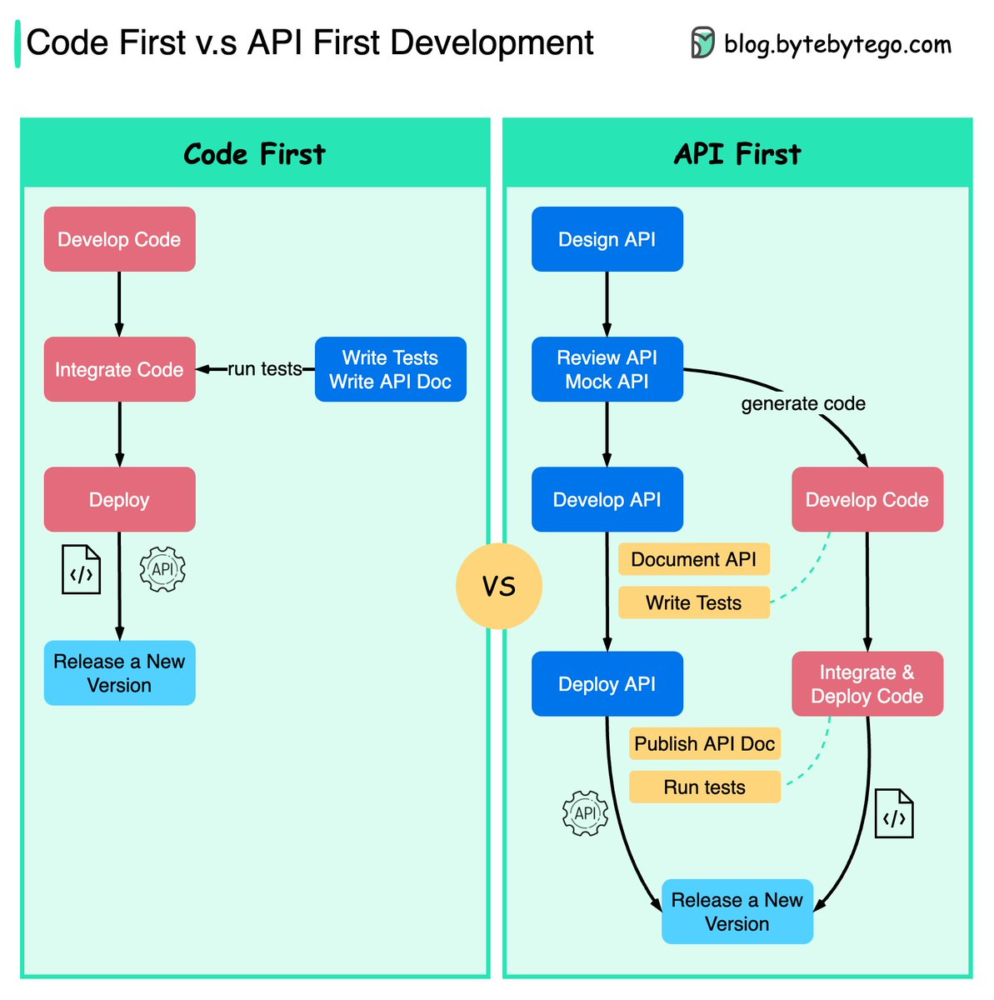

`Code First Design`은 기존 프론트 & 백 협업 방식으로, 각자 개발하고 다 만들면 합치는 방식이다.\
`API First Design`은

1. 기능구현 전, 프론트 & 백이 어떤 spec으로 API 만들지를 .yaml 파일로 적어두면,
2. 그 파일을 자동으로 파싱해서
3. 프론트에겐 모델을,
4. 백에겐 DTO와 컨트롤러 코드를 만들어준다.
5. 심지어 .yaml 파일 기반 API 문서도 생성해준다.


example)\
openapi3 spec으로 작성된 .yaml파일을 넣으면 API 문서로 변환해준다.


1. https://editor.swagger.io/
2. [openapi-docs code](https://github.com/Doohwancho/ecommerce/blob/main/back/1.ecommerce/src/main/resources/api/openapi.yaml) 붙여넣기


### 3. 결과

#### 3-1. 프론트와 백엔드의 협업 process가 개선되었다.

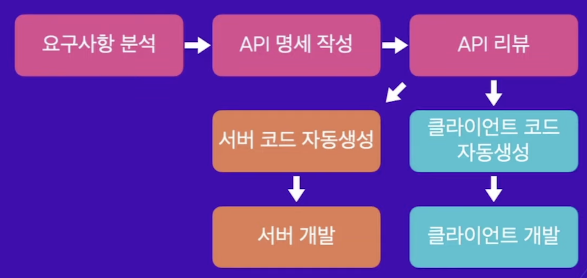

1. API 공통 프로토콜인 openapi을 사용한다.
2. API first approach을 사용해 프론트/백이 코드 작성 전에, 서버에 요청되는 request/response를 미리 합의해 정해두고, openapi 문서를 작성한다.
3. openapi spec에 맞추어 작성된 문서를 코드로 변환해주는 SDK(openapi-codegen)을 사용하여 프론트는 request, response에 필요한 모델을, 백엔드는 컨트롤러 코드를 자동으로 생성해 사용한다.
4. API를 읽는 문서는 redoc이라는 오픈소스 툴을 사용한다.


#### 3-2. 프론트는 이제 API 관련 model들 자동으로 만들어준다.

example)

https://github.com/Doohwancho/ecommerce/blob/73f634a45ae0e985eb158183ea021ea57aaf7a9c/front/02.nextjs_migration/models/src/model/product-with-options-ver2-dto.ts#L16-L83

1. [reactjs_ver](https://github.com/Doohwancho/ecommerce/tree/main/front/01.reactjs/models)
2. [nextjs_ver](https://github.com/Doohwancho/ecommerce/tree/main/front/02.nextjs_migration/models)


#### 3-3. 백엔드는 이제 controller와 request/response DTO를 자동으로 만들어준다.
##### step1) openapi.yml에 아래처럼 적는다.

```yml
paths:
  /products/{productId}:
    get:
      summary: Get product details by product ID
      operationId: getProductDetailDTOsById
      tags:
        - Product
      parameters:
        - name: productId
          in: path
          required: true
          description: The ID of the product to retrieve.
          schema:
            type: integer
            format: int64
      responses:
        '200':
          description: An array of product objects along with related details.
          content:
            application/json:
              schema:
                type: array
                items:
                  $ref: '#/components/schemas/ProductDetailResponseDTO'
        '404':
          description: Product not found
          content:
            application/json:
              schema:
                $ref: '#/components/schemas/ErrorResponseDTO'
        default: #ensures any unexpected errors are handled in a consistent format, providing a clear and standardized method
          description: Unexpected error
          content:
            application/json:
              schema:
                $ref: '#/components/schemas/ErrorResponseDTO'
```


##### step2) openapi.yml를 빌드하면, 컨트롤러 코드와 DTO가 자동생성된다.
자동 생성된 코드를 가져다 쓰기만 하면 된다.


###### 1. 자동 생성된 컨트롤러 코드
```java
@ApiOperation(value = "Get product details by product ID", nickname = "getProductDetailDTOsById", notes = "", response = ProductDetailResponseDTO.class, responseContainer = "List", tags={ "Product", })
@ApiResponses(value = {
	@ApiResponse(code = 200, message = "An array of product objects along with related details.", response = ProductDetailResponseDTO.class, responseContainer = "List"),
	@ApiResponse(code = 404, message = "Product not found", response = ErrorResponseDTO.class),
	@ApiResponse(code = 200, message = "Unexpected error", response = ErrorResponseDTO.class) })
@RequestMapping(value = "/products/{productId}",
	produces = { "application/json" },
	method = RequestMethod.GET)
default ResponseEntity<List<ProductDetailResponseDTO>> getProductDetailDTOsById(@ApiParam(value = "The ID of the product to retrieve.",required=true) @PathVariable("productId") Long productId) {
	getRequest().ifPresent(request -> {
		for (MediaType mediaType: MediaType.parseMediaTypes(request.getHeader("Accept"))) {
			if (mediaType.isCompatibleWith(MediaType.valueOf("application/json"))) {
				String exampleString = "{ \"quantity\" : 5, \"productId\" : 0, \"rating\" : 6.027456183070403, \"description\" : \"description\", \"categoryCode\" : \"categoryCode\", \"ratingCount\" : 1, \"categoryName\" : \"categoryName\", \"optionVariationId\" : 2, \"discounts\" : [ { \"endDate\" : \"2000-01-23T04:56:07.000+00:00\", \"discountType\" : \"discountType\", \"discountId\" : 2, \"discountValue\" : 7.061401241503109, \"startDate\" : \"2000-01-23T04:56:07.000+00:00\" }, { \"endDate\" : \"2000-01-23T04:56:07.000+00:00\", \"discountType\" : \"discountType\", \"discountId\" : 2, \"discountValue\" : 7.061401241503109, \"startDate\" : \"2000-01-23T04:56:07.000+00:00\" } ], \"optionVariationName\" : \"optionVariationName\", \"price\" : 5.637376656633329, \"name\" : \"name\", \"optionId\" : 3, \"optionName\" : \"optionName\", \"categoryId\" : 9 }";
				com.cho.ecommerce.api.ApiUtil.setExampleResponse(request, "application/json", exampleString);
				break;
			}
		}
	});
	return new ResponseEntity<>(HttpStatus.NOT_IMPLEMENTED);

}
```


###### 2. 자동 생성된 DTO
```java
@JacksonXmlRootElement(localName = "ProductDetailResponseDTO")
@XmlRootElement(name = "ProductDetailResponseDTO")
@XmlAccessorType(XmlAccessType.FIELD)
public class ProductDetailResponseDTO  implements Serializable {
  private static final long serialVersionUID = 1L;

  @JsonProperty("productId")
  @JacksonXmlProperty(localName = "productId")
  private Long productId;

  @JsonProperty("name")
  @JacksonXmlProperty(localName = "name")
  private String name;

  @JsonProperty("description")
  @JacksonXmlProperty(localName = "description")
  private String description;

  //...
}
```

#### 3-4. API 문서 관리 자동화


본 프로젝트에서는 `redoc`을 사용했고, 사용법은 아래와 같다.

```
Q. how to install redoc and run?

npm i -g @redocly/cli
git clone https://github.com/Doohwancho/ecommerce
cd ecommerce
redocly preview-docs back/1.ecommerce/src/main/resources/api/openapi.yaml
```


