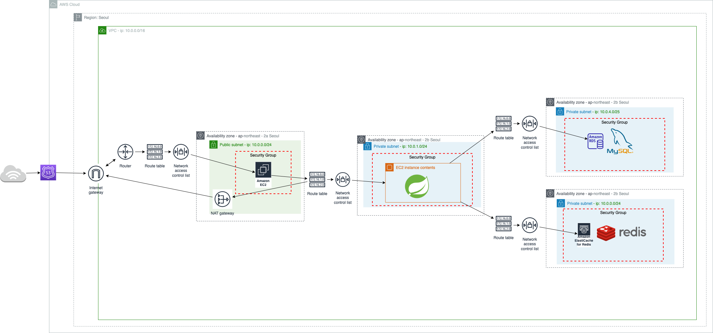
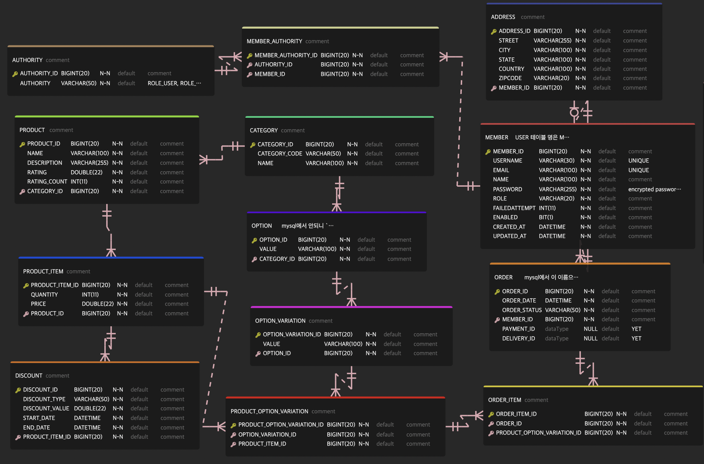
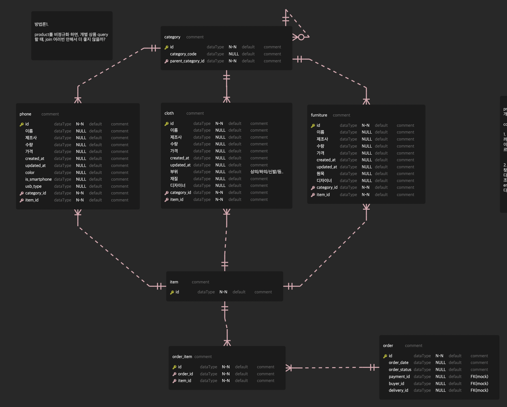
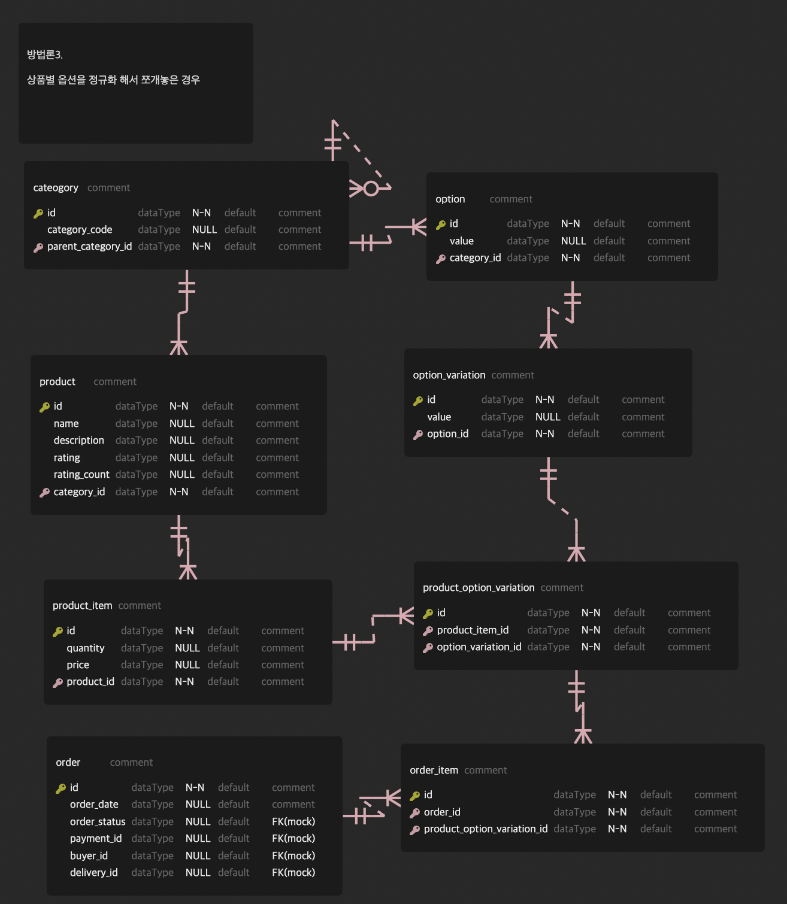
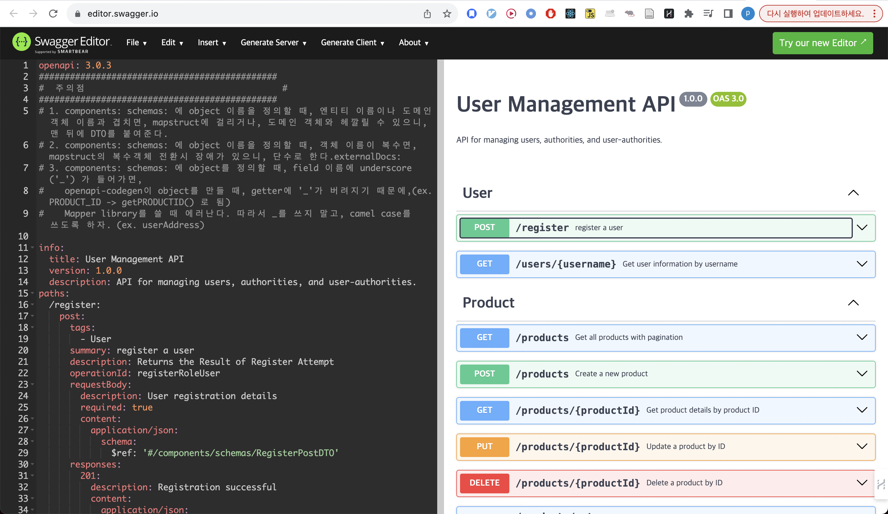
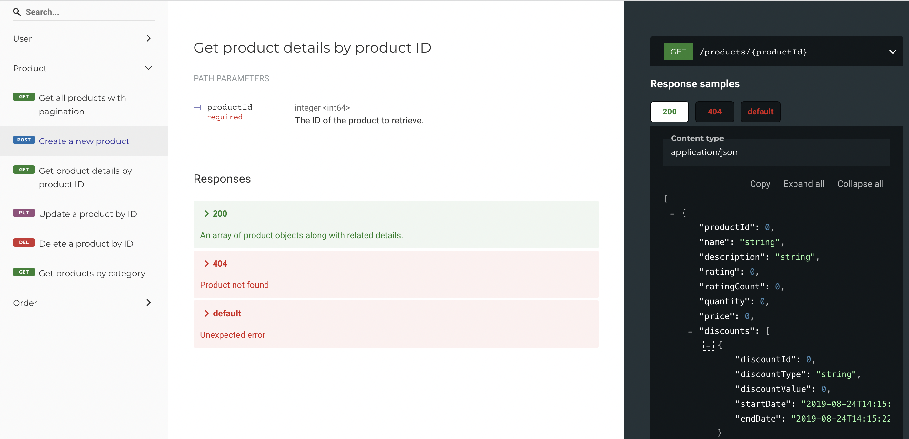
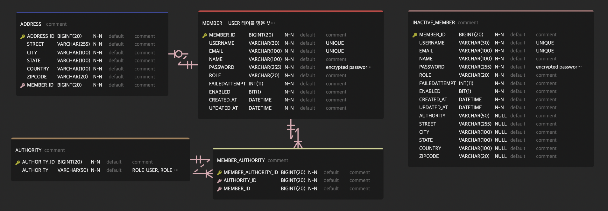

# index

- A. [프로젝트 소개](#a-프로젝트-소개)
- B. [사용 기술](#b-사용-기술)
- C. [프로젝트 구조](#c-프로젝트-구조)
- D. [AWS architecture](#d-aws-architecture)
- E. [ERD diagram](#e-erd-diagram)
- F. [Sequence Diagram](#f-sequence-diagram)
    - a. [spring security + redis로 세션관리 하면서 이상행동 감지시 invalidate session + account lock](#a-spring-security--redis로-세션관리-하면서-이상행동-감지시-invalidate-session--account-lock) -- yet
- G. [기술적 도전](#g-기술적-도전)
    - a. [정규화](#a-정규화)
    - b. [bulk insert](#b-bulk-insert)
    - c. [API first design](#c-api-first-design)
    - d. [spring batch](#d-spring-batch)
    - e. [query tuning](#e-query-tuning) -- yet
    - f. [defensive programming](#f-defensive-programming)
    - g. [clean code](#g-clean-code)
- H. [Trouble Shooting](#h-trouble-shooting)
    - a. [queryDSL library와 openapi-codegen이 build.gradle에서 컴파일시 깨지는 문제 해결](#a-querydsl-library와-openapi-codegen이-컴파일시-깨지는-문제-해결)
    - b. [그 외 trouble shooting 내역](#b-그-외-trouble-shooting-커밋-내역들)


# A. 프로젝트 소개

쇼핑몰 MVP.

인증, 상품, 주문 관련 기능이 존재한다.

## how to start project?
```
1. git clone https://github.com/Doohwancho/ecommerce
2. docker compose up
```


# B. 사용 기술

| Category             | Tool/Library           | Version |
|----------------------|------------------------|---------|
| Java                 | JDK                    | 1.8     |
| Spring               | Spring Boot Starter Web| 2.5.6   |
|                      | Spring Security        | 2.5.6   |
|                      | Spring Data JPA        | 2.5.6   |
|                      | Spring Batch           | 2.5.6   |
|                      | Spring Quartz          | 2.5.6   |
| External Java Library| QueryDSL               | 4.4.0   |
|                      | OpenAPI-Codegen        | 4.3.1   |
|                      | Jqwik                  | 1.8.1   |
|                      | MapStruct              | 1.5.5   |
|                      | Datafaker              | 1.9.0   |
| Database             | MySQL                  | 8.0.23  |
|                      | Redis                  | 7.0.9   |
| Test                 | junit                  | 5.9.2   |
|                      | hamcrest               | 2.2     |
| Deploy               | AWS                    |         |
|                      | Docker                 |         |
| Development Tools    | IntelliJ               |         |
|                      | MySQL Workbench        |         |
|                      | Postman                |         |
|                      | Redoc                  |         |
|                      | VSC Plugin - Draw.io Integration |         |
|                      | VSC Plugin - ERD Editor|         |


# C. 프로젝트 구조

```
── src
│   ├── main
│   │   ├── java
│   │   │   └── com
│   │   │       └── cho
│   │   │           └── ecommerce
│   │   │               ├── Application.java
│   │   │               ├── domain
│   │   │               │   ├── member
|   │   │               │   ├── order
│   │   │               │   └── product
|   │   │               ├── global
│   │   │               │   ├── config
│   │   │               │   │   ├── batch
│   │   │               │   │   │   ├── config
│   │   │               │   │   │   ├── job
│   │   │               │   │   │   ├── listener
│   │   │               │   │   │   ├── scheduled
│   │   │               │   │   │   └── step
│   │   │               │   │   ├── database
│   │   │               │   │   ├── fakedata
│   │   │               │   │   ├── parser
│   │   │               │   │   ├── redis
│   │   │               │   │   └── security
│   │   │               │   │       ├── handler
│   │   │               │   │       └── session
│   │   │               │   ├── error
│   │   │               │   │   └── exception
│   │   │               │   │       ├── business
│   │   │               │   │       ├── common
│   │   │               │   │       └── member
│   │   │               │   └── util
│   │   │               └── infra
│   │   │                   ├── email
│   │   │                   └── sms
│   │   └── resources
│   │       ├── api
│   │       │   ├── config.json
│   │       │   └── openapi.yaml
│   │       ├── application-local.yml
│   │       ├── application-prod.yml
│   │       ├── application-test.yml
│   │       ├── application.yml
│   │       ├── log
│   │       │   ├── console-appender.xml
│   │       │   ├── file-error-appender.xml
│   │       │   ├── file-info-appender.xml
│   │       │   └── file-warn-appender.xml
│   │       ├── logback-spring.xml
│   │       └── templates
│   └── test
│       └── java
│           └── com
│               └── cho
│                   └── ecommerce
│                       ├── Integration_test
│                       ├── property_based_test
│                       ├── smoke_test
│                       └── unit_test
├── log
│   ├── error
│   ├── info
│   └── warn
```

# D. AWS architecture



# E. ERD diagram


VSC plugin: ERD Editor를 다운받고, documentation/erd.vuerd.json 파일을 열 수 있다.


# F. Sequence Diagram

## a. spring security + redis로 세션관리 하면서 이상행동 감지시 invalidate session + account lock
?


# G. 기술적 도전

## a. 정규화

### 가. 방법론1. product를 비정규화 한 방식


#### 가-1. pros
개별 제품 상세 페이지 쿼리는 빠름

---

#### 가-2. cons

1. 구매자가 주문목록 query하려면, 모든 상품 테이블들 다 돌면서 product_id 찾아야 하니까 엄청 느림.
이걸 완화하기 위해, 모든 상품테이블에 들어았는 product_id를 인덱스 거는게 최선일지 모르겠음.


2. 또한, 상품 카테고리별로 테이블 만들어줘야 해서 테이블 갯수가 수십~수백개로 늘어남. 
검색해보니, 의외로 테이블 갯수 자체가 늘어나는건 별 문제가 아니라고 한다.
다만, 그보다 비정규화 했을 때, 상품 끼리 통일된 구조가 아닌게 더 문제라고 함. 통일된 구조가 아니면 나중에 확장할 때 merge, 변형 등이 힘들어지기 떄문. 
erd 설계 한번하면 쭉 가는줄 알았는데, 의외로 서비스 초기 때에도 db 변경을 자주 할 수 있다고 한다. 유연한 설계를 하자.

---

### 나. 방법론2. order_item 테이블에 모든 비정규화한 상품테이블 리스트의 FK를 받는 방식


#### 나-1. pros
방법론 1과 같이, 개별 상품 페이지 쿼리는 빠름.

---

#### 나-2. cons

1. 상품 종류가 100가지라 상품 테이블이 100가지면, order_item가 받는 상품들의 fk가 100개+가 될텐데,\
필드값이 100개인 테이블을 만든다는게 좀 이상한 것 같다.
2. 주문목록 query하려면, null check 먼저 하고,해당 아이템의 fk 가지고 아이템 찾는 식 일텐데, 100개 컬럼 중 99개 컬럼이 Null인데 하나씩 Null비교해서 값을 꺼내는 방식은 안좋은 방식 같고, Null처리 잘못할 수 있어서 에러날 가능성이 있는 코드구조가 될 수 있음.


---
b. 또한, 
100개의 컬럼 중 99개가 null이 들어가는 테이블을 만든다는게 조금 이상할 것 같다.


### 다. 방법론3. 상품별 옵션을 정규화 해서 쪼개놓은 경우


#### 다-1. pros

정규화가 잘 되있어서 변경에 유용하고 확장성이 좋은 설계이다. 


#### 다-2. cons
1. 개발 상품 페이지 쿼리할 떄 subquery & join 겁나 많이 해야 해서 느림. 
2. 주문목록 query할 때도 join & subquery 많이 해야 해서 느림.
3. 상품 등록/업데이트/삭제 시, product/product_item/category/option/option_variation/product_option_variation 이 6개 테이블에 트랜잭션/lock 걸릴텐데, 너무 느릴 것 같음.


#### 다-3. solution
방법론3을 택한다. 이유는 후술.


##### 다-3-1. 확장성 우선

비정규화는 일종의 최적화이고 되돌리기 힘든 과정이다.\
서비스 초기 단계라면 구현된 기능 자체가 수정&삭제가 빈번한데 이럴 경우 정규화된 구조를 사용하여 기능의 수정 & 삭제같은 유지보수를 저렴한 비용으로 유연하게 할 수 있도록 하는 것이 맞다.

서비스가 더 커진다 해도 캐싱, 인덱싱, 분산처리(가용영역 추가, 비쌈)같은 테크닉을 쓸 수 있고,\
나중에 서비스가 커져서 비정규화나 MSA같이 RDBMS가 보장해주는 것 일부를 포기하고 더 최적화를 해야할 경우가 오면 이때 해당 프로젝트 진행하면 된다.

결론: 정규화하고 최적화는 나중에 병목이 생기면 그 때 반정규화 하라.


---
##### 다-3-2. 의외로 간단한 쿼리에 join 여러번하는건 보통 걱정 안한다고 한다. 캐싱이 있기 때문이다.


간단한 쿼리의 조인 속도는 보통 걱정 안한다.\
조회수 순, 추천제품 순으로 캐싱해버리니까 걱정하던거의 1000배는 빨라진다.\
확장성이 우선이다.


---
##### 다-3-3. 의문점: 정규화 한 결과로 여러 테이블을 join 해야하면, lock & transaction 때문에 쿼리 성능이 떨어지지 않을까?

A. database, 버전, 옵티마이저에 따라 다르긴 하겠지만, 요즘 데이터베이스는 테이블 단위로 락 거는 경우는 드물고, row 단위로 락 걸기 때문에 괜찮다고 한다. (TODO - 정말 그런지 확인해보기)


## b. bulk insert

1. 문제: 가데이터를 for-loop으로 넣던게 약 14분 30초 정도 걸림. 
2. 해결책: spring batch + jpa bulk insert로 변경해서 4분30초 로 10분 단축

https://github.com/Doohwancho/ecommerce/blob/main/back/ecommerce/src/main/java/com/cho/ecommerce/global/config/batch/step/InsertFakeUsersStepConfig.java#L28-L132

> [bulk insert code link](https://github.com/Doohwancho/ecommerce/blob/main/back/ecommerce/src/main/java/com/cho/ecommerce/global/config/batch/step/InsertFakeUsersStepConfig.java)

```
...for inserting

3000 users
10 categories
30 options
90 option variations
3000 products
9000 product items
9000 product option variations
3000 orders
15000 order items
```


1. before (for-loop insert)
    - Total execution time: 14m 25s (864952 ms)
2. after (bulk insert)
    - 4m 30s 436ms
    - Job: [SimpleJob: [name=dataInitializationJob]] completed with the following parameters: [{run.id=1700922576191, numberOfFakeUsers=3000, numberOfFakeCategories=10, numberOfFakeOptionsPerCategory=3, numberOfFakeOptionVariationsPerOption=3, numberOfFakeProducts=3000, numberOfFakeProductItemsPerProduct=3, numberOfFakeOrderItemsPerOrder=5}] and the following status: [COMPLETED] in 4m30s436ms


## c. API first design
openapi-codgen + redoc 적용

### 1. openapi codegen



- Q. how to see oepnapi docs online?
    1. https://editor.swagger.io/
    2. [openapi-docs code](https://github.com/Doohwancho/ecommerce/blob/main/back/ecommerce/src/main/resources/api/openapi.yaml) 붙여넣기


### 2. redoc


```
Q. how to install redoc and run?

npm i -g @redocly/cli
git clone https://github.com/Doohwancho/ecommerce
cd ecommerce
redocly preview-docs back/ecommerce/src/main/resources/api/openapi.yaml
```


## d. spring batch



1. 이상행동으로 잠긴 유저 계정을 
2. 매주 일요일 새벽 3시에 
3. INACTIVE_USER로 옮기고, 
4. 기존 유저 테이블에서 제거하는 배치 생성


https://github.com/Doohwancho/ecommerce/blob/main/back/ecommerce/src/main/java/com/cho/ecommerce/global/config/batch/step/UserToInactiveMemberStepConfig.java#L26-L146

> [batch code link](https://github.com/Doohwancho/ecommerce/blob/main/back/ecommerce/src/main/java/com/cho/ecommerce/global/config/batch/step/UserToInactiveMemberStepConfig.java)


## e. query tuning
?


## f. defensive programming

### 1. testing 전략
1. smoke test
    - springboot app이 잘 실행되는지
    - 유저 인증시 이상 현상이 일어나는지 확인
2. integration test
    - 도메인 별로 굵직한 서비스 레이어 위주로 테스트
    - mocking을 하지 않고 최대한 넓은 범위의 모듈을 커버하여, 
3. property test
    - 절대 문제생기면 안되는 기능(ex. 돈 관련 코드 등..)을 PBT로 테스트. ([PBT code link](https://github.com/Doohwancho/ecommerce/blob/main/back/ecommerce/src/test/java/com/cho/ecommerce/property_based_test/ProductPriceDiscountTest.java))
4. unit test
    - 그 외 작은 기능 단위는 unit test로 처리


### 2. exception 전략
1. Runtime Error가 날만한 부분에 throw CustomException 처리한다.
2. [custom Error Code Number Protocol](https://github.com/Doohwancho/ecommerce/blob/main/back/ecommerce/src/main/java/com/cho/ecommerce/global/error/ErrorCode.java) 에 맞추어 error code를 enum으로 선언한다. 
3. Runtime Exception을 domain별로 나누어 일괄관리한다.
    - 모든 business 관련 Exception들은 BusinessException을 상속받아 일괄관리하고,
    - 모든 member 관련 Exception들 또한 MemberException을 상속받아 일괄관리한다.
    - Exception에 들어가는 Error Code역시 도메인 별로 일괄관리한다.

> 

### 3. logging 전략
1. 에러가 날만한 부분에 log.error()
2. logging format을 가독성이 좋게 설정 (디테일한 정보 + log level별 색깔 다르게 설정)
3. profile 별(ex. test/local/prod) log level을 구분하여 log/ 디렉토리에 레벨별로 저장


## g. clean code

### 1. protocol 설정
1. [commit-message protocol](https://github.com/Doohwancho/ecommerce/blob/main/documentation/commit-message.md)
2. [error code protocol](https://github.com/Doohwancho/ecommerce/blob/main/back/ecommerce/src/main/java/com/cho/ecommerce/global/error/ErrorCode.java)
3. [common / business / member 용 exception 구분](https://github.com/Doohwancho/ecommerce/tree/main/back/ecommerce/src/main/java/com/cho/ecommerce/global/error/exception)

### 2. linter intellij plugins 적용
1. sonarlint
2. checkstyle
3. code-style-formatter ([google style java format 적용](https://google.github.io/styleguide/javaguide.html))

# H. Trouble Shooting

## a. queryDSL library와 openapi-codegen이 컴파일시 깨지는 문제 해결

### 1. 문제
1. 스프링 + openapi-codgen library도 잘 동작하고, 
2. 스프링 + queryDSL로 잘 동작하는데, 
3. 둘을 동시에 쓰면 빌드가 안되는 현상 발생

### 2. 문제 원인
queryDSL과 openapi-codegen 둘 다 빌드시 코드를 동적으로 생성하는데,\
compileQuerydsl시 아직 컴파일 안된 openapi-codegen 코드부분 때문에 에러 발생

### 3. 해결책
1. gradle 빌드 순서를 openapi-codegen 컴파일이 먼저 실행되고,
2. queryDSL이 다음에 실행되고,
3. 마지막으로 compileJava가 실행되도록 변경했다.

https://github.com/Doohwancho/ecommerce/blob/main/back/ecommerce/build.gradle#L143-L145

> [해결한 커밋 link](https://github.com/Doohwancho/ecommerce/commit/ffb5355069d127ba1e6745626bbbcd6da4fbc4ac)

### 4. 이 트러블 슈팅이 기억에 남는 이유
기능 만들고 싶은데 어떻게 만드는지 모르거나, 프레임워크에서 에러나는건 \
배워서 만들거나, googling, issue 탭 찾아보면 되는 일인데,

외부 라이브러리들 끼리 서로 궁합이 안맞아서 빌드 깨지는건,\
구글링 해도 안나오고, 이슈 탭에서도 없고,\
라이브러리를 까봐야 하나? 라는 생각이 들어도 querydsl은 22만줄, openapi-generator-cli는 2만 1천줄인데,\
querydsl나 openapi-codegen에서 문제가 생긴게 아니라,\
얘네들이 의존하는 다른 라이브러리에서 오류난 걸 수도 있으니까

막연한 절망감(?) 속에서 gradle 문서 보면서 이런 저런 시도를 하는데,\
논리상 되야되는데 안될 때마다 '이 라이브러리 쓰고싶은데 안써야 하나?'\
하다가 삽질 끝에 되게 해서 기억에 남습니다..


## b. 그 외 trouble shooting 커밋 내역들
```
Q. how to find all trouble shooting list?

1. git clone https://github.com/Doohwancho/ecommerce
2. git log --grep="fix"
```