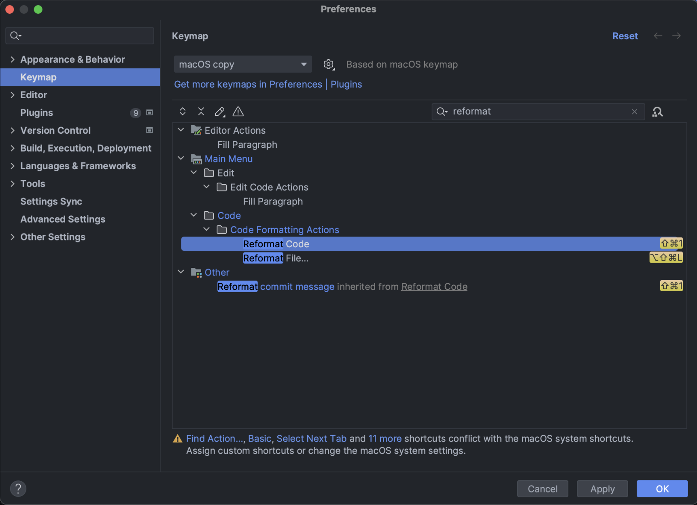
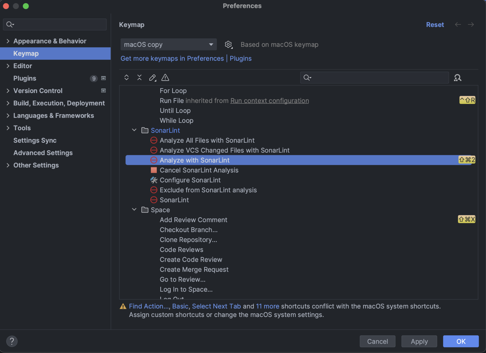
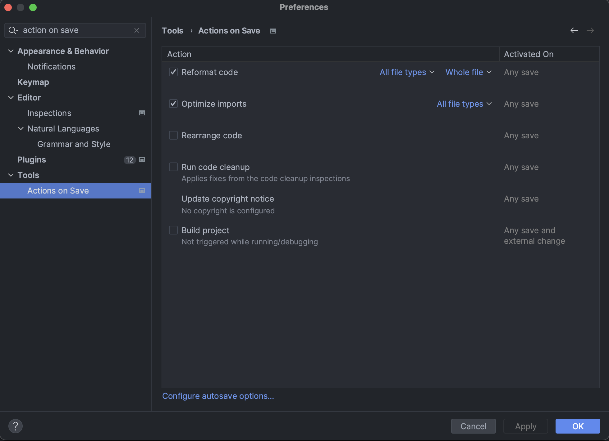

# index

- A. [프로젝트 소개](#a-프로젝트-소개)
- B. [사용 기술](#b-사용-기술)
- C. [AWS architecture](#c-aws-architecture)
- D. [ERD diagram](#d-erd-diagram)
- E. [기술적 도전 - Backend](#e-기술적-도전---backend)
    - a. [spring security - authentication](#a-spring-security---authentication)
    - b. [spring batch](#b-spring-batch)
	- c. [test 전략](#c-test-전략)
    - d. [defensive programming](#d-defensive-programming)
    - e. [clean code](#e-clean-code)
	- f. [refactoring](#f-refactoring)
	- g. [요구사항을 비즈니스 로직 코드로 구현](#g-요구사항을-비즈니스-로직-코드로-구현)
- F. [기술적 도전 - Database](#f-기술적-도전---database)
    - a. [정규화](#a-정규화)
    - b. [통계 쿼리](#b-통계-쿼리)
    - c. [sql tuning](#c-sql-tuning)
- G. [기술적 도전 - Cloud](#g-기술적-도전---cloud)
	- a. [provisioning with terraform](#a-provisioning-with-terraform)
	- b. [prometheus and grafana](#b-prometheus-and-grafana)
	- c. [부하 테스트](#c-부하-테스트)
- H. [기술적 도전 - Frontend](#h-기술적-도전---frontend)
	- a. [프로젝트 구조](#a-프로젝트-구조)
	- b. [component 모듈화](#b-component-모듈화)
	- c. [state management](#c-state-managment)
    - d. [API first design](#d-api-first-design)
	- e. [filter 기능 구현](#e-filter-기능-구현)
	- f. [페이지 로드 속도 개선](#f-페이지-로드-속도-개선)
- I. [Trouble Shooting](#i-trouble-shooting)
    - a. [사건의 발단](#a-사건의-발단)
    - b. [가설1 - RDS connections 부족](#b-가설1---RDS의-connections-수가-부족해서-latency가-높아졌다)
    - c. [가설2 - 느린 query](#c-가설2---query가-느려서-latency가-높아졌다)
    - d. [가설3 - RDS의 네트워크 대역폭](#d-가설3---RDS의-네트워크-문제인가?)
	- e. [가설4 - ec2 spec을 올려보자](#e-가설4---ec2-spec을-올려보자)
	- f. [가설5 - core 수를 늘려보자](#f-가설5---core-수를-늘려보자)
	- g. [문제의 원인 및 해결방안](#g-문제의-원인-및-해결방안)
	- h. [실험](#h-실험)
	- i. [결과 및 배운 점](#i-결과-및-배운-점)


# A. 프로젝트 소개


쇼핑몰 MVP\
인증, 상품, 주문 관련 기능이 존재한다.

## a. how to start project?
```
1. git clone https://github.com/Doohwancho/ecommerce
2. cd ecommerce
3. docker compose up --build
4. 1000 data insert 완료할 때까지 기다리기
5. http://localhost:80  or  http://127.0.0.1:80 로 접속
```


# B. 사용 기술

## a. 백엔드
| Category             | Tool/Library              | Version |
|----------------------|---------------------------|---------|
| Java                 | JDK                       | 1.8     |
| Spring               | Spring Boot Starter Web   | 2.5.6   |
|                      | Spring Security           | 2.5.6   |
|                      | Spring Data JPA           | 2.5.6   |
|                      | Spring Batch              | 2.5.6   |
|                      | Spring Quartz             | 2.5.6   |
|                      | Spring Boot Starter Cache | 2.5.6   |
| External Java Library| QueryDSL                  | 4.4.0   |
|                      | OpenAPI-Codegen           | 4.3.1   |
|                      | Jqwik                     | 1.8.1   |
|                      | MapStruct                 | 1.5.5   |
|                      | Datafaker                 | 1.9.0   |
| Database             | MySQL                     | 8.0.23  |
|                      | Redis                     | 7.0.9   |
| Test                 | junit                     | 5.9.2   |
|                      | hamcrest                  | 2.2     |
| Deploy               | AWS                       |         |
|                      | Docker                    | 20.10.13 |
| Provisioning         | Terraform                 | 1.6.6   |
| Monitoring           | Prometheus                | 2.49    |
|                      | Grafana                   | 10.3    |
| Stress Test          | K6                        | 0.49    |
| Development Tools    | IntelliJ                  |         |
|                      | MySQL Workbench           |         |
|                      | Postman                   |         |
|                      | Redoc                     |         |
|                      | VSC Plugin - Draw.io Integration |         |
|                      | VSC Plugin - ERD Editor|         |


## b. 프론트엔드
| Category             | Tool/Library           | Version |
|----------------------|------------------------|---------|
| Language             | Typescript             | ^5.2.2  |
| React                | React                  | ^18.2.0 |
|                      | React-Router-Dom       | ^6.20.0 |
| Style                | Styled-Component       | ^6.1.1  |
| State Management     | Recoil                 | ^0.7.7  |
|                      | React-Query            | ^3.39.3 |
| Build Tool           | Vite                   | ^5.0.0  |
| API                  | openapi-generator-cli  | ^2.7.0  |
| external library     | react-slick            | ^0.29.0 |
|                      | slick-carousel         | ^1.8.1  |
|                      | react-icons            | ^4.12.0 |


# C. AWS architecture


# D. ERD diagram


VSC plugin: ERD Editor를 다운받고, documentation/erd.vuerd.json 파일을 열 수 있다.


# E. 기술적 도전 - Backend

## a. spring security - authentication

### 1. 문제
ecommerce에 유저 인증 시스템이 필요하다.

### 2. 구현 방법론

#### 2-1. session vs jwt

- 핵심
	- 인증 시스템 만듬에 있어서, 가장 중요하게 생각해야하는 요소는 보안이라고 생각한다.
- 이유
	1. ecommerce는 사용자의 돈이 걸린 서비스이다.
		- 게시판이나 지도앱 같은 다른 앱들은 돈이 걸린 앱이 아니어서 인증이 탈취당해도 소송을 당한다거나, 피해규모가 크지 않다.
		- 그런데 ecommerce의 경우, 해킹당하면 금전적인 피해가 있을 확률이 높고, 그에 따른 소송 가능성도 있다.
	2. session의 이상현상 감지 시, 즉각 invalidate session 기능은 jwt보다 보안적으로 강력하다.
		- session이나 jwt이나 어짜피 client side에 보관한다면 local/session storage에 보관하나, cookie에 보관하나, 탈취당하기 마련이라고 보았다.
		- 어짜피 탈취당할 거라면, 서버에서 이상현상 발견시 즉각 invalidate 할 수 있는 세션이 보안적으로 더 낫다고 보았다.
		- jwt는 탈취당하면 유효기간이 끝날 때 까지 서버를 이용할 수 있고, 서버에서는 이를 막을 수 없다.
		- 위 문제를 보완하기 위해 jwt + refresh token 방식으로 구현했을 경우, refresh token의 expiration을 짧게하면 토큰 재발급 통신비용이 늘어나 성능이 session과 별 다를바가 없어지고, 그렇다고 늘리면 보안성이 떨어진다는 문제점이 있다.
		-  어느 쇼핑몰 사이트가 해킹당해서 금전적 손해를 봤는데 즉각적인 대처를 못했다는 소문이 SNS로 퍼지면 브랜드 이미지에 큰 타격을 입힐 수 있다.
		- session은 jwt와는 다르게 이상현상 감지 시, 즉각적으로 session invalidate 할 수 있기 때문에 보안적 이점이 크다.
	3. monolith는 session 방식이, msa는 jwt 방식이 더 궁합상 맞다고 생각한다.
		- MSA에서 백엔드 서버가 수십개로 나뉘어져 있고, 각 서버마다 인증서버와 통신해야 한다면 너무 비효율이니 보안을 약간 포기하더라도 jwt를 선택하는게 맞다고 보인다.
		- 다만 monolith는 인증을 한번만 하면 모든게 하나의 서버에서 처리되니까, 보안적 이점이 더 있는 session 방식이 더 적합하다고 판단했다.


#### 2-2. 구현 기능

1. session clustering (spring security + redis)
2. 이상행동 감지시(로그인 5회 틀림) invalidate session + account lock 한다.
3. 매주 일요일 새벽 3시에 cron + batch로 locked account를 MEMBER table에서 INACTIVE_MEMBER table로 이전한다.


### 3. 결과


## b. spring batch

### 1. inactive user를 Member 테이블로부터 이관하기


authentication에 3번째 구현기능인

`iii. 매주 일요일 새벽 3시에 cron + batch로 locked account를 MEMBER table에서 INACTIVE_MEMBER table로 이전한다.`

...를 spring batch로 구현하였다.

https://github.com/Doohwancho/ecommerce/blob/73ddd650c20ca7349cdbf3d992ca1fe357c67da4/back/ecommerce/src/main/java/com/cho/ecommerce/global/config/batch/step/UserToInactiveMemberStepConfig.java#L26-L146


### 2. bulk insert fake data for test

- 구현 기능
	- datafaker라는 오픈소스 라이브러리를 이용해 가데이터 수천 & 수만 데이터를 JPA .saveAll()을 이용해 입력한다.
- 오해했던 점
	- .saveAll()이 .save()처럼 개별 row마다 insert시 Transaction 걸어서 느린데, spring batch의 batch size를 1000개로 설정하면, 트렌젝션을 1000개 단위로 훨씬 적게 거니까 insert 성능이 빨라지지 않을까? 기대하였다.
	- 그러나, .saveAll() 역시 트렌젝션 한번에 전부 insert하는 거였고, 성능상 개선은 거의 없었다.
	- 다만, 10000개 rows를 insert할 때, .saveAll()은 중간에 한번 에러나면 10000개가 전부다 rollback 되는 것에 반에, spring batch의 .chunk(1000) 를 이용하면, 1000개 rows씩 insert 하다가 중간에 에러나면, 1000 개 단위로 트렌젝션이 걸려 롤백되기 때문에, data lose나 recovery 관점에서의 이점은 있었다.


구현 코드)

https://github.com/Doohwancho/ecommerce/blob/73ddd650c20ca7349cdbf3d992ca1fe357c67da4/back/ecommerce/src/main/java/com/cho/ecommerce/global/config/batch/step/InsertFakeUsersStepConfig.java#L28-L153


## c. test 전략

### 1. 문제
Q. ecommerce app은 어떤 테스트 방법론을 써야 적합할까?


### 2. 방법론

1. 고전파 & TDD
	- unit test 을 바텀업으로 꼼꼼하게 높은 test coverage를 목표로 하는 방법
	- 군사, 의료처럼 절대 깨지거나 실패하면 안되는 앱 만들 때 하면 좋은 듯 하다.
	- 선택과 집중의 문제인데, 현 프로젝트는 쇼핑몰 MVP인데, 테스트 코드에 시간 & 리소스를 써서 서비스 안정성을 높히는 것 보다, MVP 서비스 초기 때는 빨리 기능 하나 추가하는게 우선순위 상위로 판단된다.
2. 런던파 & mockist
	- top down식으로 의존하는 모듈은 mocking 하는 방법이다.
	- 테스트 범위가 좁고 세밀한게 정확히 어디서 에러났는지 찾을 수 있다는 장점이 있지만, 그만큼 테스트 커버리지를 늘리려면 많은 테스트 코드를 작성해야 한다.
	- mocking 을 많이 해 놓으면, 통합 테스트 환경이 아니라 실제로 작동한다는 보장이 없다.
	- 개발자가 제어할 수 없는 외부 API 사용 시나, database 연동하는 테스트가 많이 무거울 경우에 선택적으로 사용하는게 좋아 보인다고 판단했다.
3. 여러 방법론을 결합한 혼종
	1. 테스트 커버리지가 높아야 에러 발견확률이 늘어나기 때문에 unit test 보다는 integration test 위주로 작성한다.
	2. 크리티컬한 기능 위주로 테스트 하는 smoke test(ex. 서버가 시작했는지 체크하는 테스트)도 포함한다.
	3. unit test는 개발자가 모든 이상 input에 대해 대비할 수 있는것이 아니고, 대비해서 unit test를 작성할 정도라면 이미 코드 수정을 했을 것이다.
	4. 따라서 프로그램이 반드시 만족해야하는 속성(input range)을 설정해두면, 해당 범위 내에 발생할 수 있는 대부분의 input test case를(corner case 포함) 자동 생성 후 테스트 까지 해주는 PBT(Property Based Test)를 한다.
	5. 단, PBT는 CPU 리소스를 너무 많이 잡아먹고, 시간도 오래 걸리므로, 돈이 걸린 매우 중요한 메서드 위주(ex. 상품 가격에 discount 적용하는 코드)로 적용한다.


### 3. 결과

1. smoke test
    - springboot app이 RUNNING 상태인지 확인한다.
    - 유저 인증시 이상 현상이 일어나는지 확인한다.
2. integration test
    - 도메인 별로 굵직한 서비스 레이어 위주로 테스트한다.
    - mocking 보다는, 최대한 넓은 범위의 모듈을 커버하여 깨지는 부분이 있는지, 있다면 대략 어느 부분인지 확인한다.
3. property based test (PBT)
    - 절대 문제 생기면 안되는 기능(ex. 돈 관련 코드 등..)을 PBT로 테스트한다. ([PBT code link](https://github.com/Doohwancho/ecommerce/blob/main/back/ecommerce/src/test/java/com/cho/ecommerce/property_based_test/ProductPriceDiscountTest.java))
4. unit test
    - 이 외 작은 기능 단위는 unit test로 처리한다.


## d. defensive programming

### 1. exception 전략
1. [custom Error Code Protocol](https://github.com/Doohwancho/ecommerce/blob/main/back/ecommerce/src/main/java/com/cho/ecommerce/global/error/ErrorCode.java) 에 맞추어 error code를 enum으로 선언한다.
2. 도메인 별로 Error Code를 나누고 파일 하나에 일괄 관리한다.
3. 도메인 별로 Runtime Exception을 나누어 일괄관리한다.
    - 모든 business 관련 Exception들은 BusinessException을 상속받아 일괄관리하고,
    - 모든 member 관련 Exception들 또한 MemberException을 상속받아 일괄관리한다.
4. Runtime Error가 날만한 부분에 throw CustomException 처리한다.

>

### 2. logging 전략
1. logback-spring.xml에 logging format을 가독성이 좋게 설정한다. (디테일한 정보 + log level별 색깔 다르게 설정)
2. 에러가 날만한 부분에 log.error() 처리한다.
3. profile 별(ex. local/docker/prod/test) log level을 구분하여 log/ 디렉토리에 레벨별로 저장한다.
4. production에서 error 로그 확인 시, 실행중인 스프링 앱에서 에러 로그를 찾지 말고, log/error/ 를 확인한다.


### 3. Valid 전략
- backend server filtering
	1. openapi에서 필드마다 validity 조건 걸어서, 컨트롤러 레이어에서 파라미터로 받을 때, 백엔드 시스템 안에 들어오는 필드값을 1차적으로 type check, null check한다.
	2. backend Entity에 validity 조건을 걸어서 database에 값을 넣을 때, 올바른 값이 들어가는지 다시한번 필터링 한다.


### 4. rate limiting
1. backend server에 http request시,
2. 개별 ip address마다
3. 1초에 5 request 리밋을 건다.
4. 단, "burst"라고 초당 기본 5 request에 short spike of 10 request까지 queue에 담아 허용한다.
5. 그 이상 request가 오면 503 Service Temporarily Unavailable error 를 보낸다.

https://github.com/Doohwancho/ecommerce/blob/91f61cd43591f8d56b8925e9bb8ceac0cbe89d29/web-server/default.conf#L1-L5

https://github.com/Doohwancho/ecommerce/blob/dc963b102c65178fe7bd52960a344991272cfeab/web-server/default.conf#L29-L34


## e. clean code

### 1. code convention & protocol 설정
1. [google style java code convention](https://google.github.io/styleguide/javaguide.html)
2. [custom error code protocol](https://github.com/Doohwancho/ecommerce/blob/main/back/ecommerce/src/main/java/com/cho/ecommerce/global/error/ErrorCode.java)
3. [common / business / member, 도메인 별 exception](https://github.com/Doohwancho/ecommerce/tree/main/back/ecommerce/src/main/java/com/cho/ecommerce/global/error/exception)
4. [commit-message protocol](https://github.com/Doohwancho/ecommerce/blob/main/documentation/protocols/commit-message.md)

### 2. linter를 단축키로 적용
- intellij plugins
	1. sonarlint
	2. checkstyle
- intellij 단축키 설정
	1. command + shift + 1 단축키로 google style java code convention 적용
		- 
	2. command + shift + 2 단축키로 sonarlint를 적용
		- 
	3. 'format on save'을 해서 저장 시에 자동으로 포멧이 되게끔 설정한다.
		- 


## f. refactoring

### 1. 문제
```java
@Service
public class ProductService {

    private ProductService self;

    @Transactional
    public List<Product> getProductDetailDTOsById(Long productId) {
        //business logics
    }

    public List<ProductDetailResponseDTO> findProductDetailDTOsById(Long productId) {
        List<Product> productDetailDTOsList = self.getProductDetailDTOsById(productId); //fix: solution to "Methods should not call same-class methods with incompatible @Transactional"

        return productMapper.productsToProductDetailDTOs(productDetailDTOsList);
    }
}
```
1. 서비스 메서드의 반환타입이 `List<ResponseDTO>`로 하자니, 재사용성이 떨어지고, `List<도메인VO>`로 하면 재사용성은 올라가는데, 컨트롤러에 반환시 ResponseDTO로 한번 더 변환해주어야 한다.
2. ResponseDTO로 변환해주는 메서드를 동일한 서비스 레이어 파일에서 작성 시, @Transactional이 걸려있는 경우, self.메서드()로 참조해야 하는데, 그닥 좋은 패턴은 아닌 듯 하다.
3. 서비스 레이어에서는 서비스 로직 관련 코드만 있어야 하는데, 로직은 없고 DTO 변환 코드가 있어서 가독성에 문제가 생기고 서비스 레이어가 비대해진다.


### 2. 해결책

service layer와 adapter layer를 분리한다.

```java
1) Adapter layer

@Component
public class ProductAdapter {
    @Autowired
    private ProductMapper productMapper;
    @Autowired
    private ProductService productService;

    public List<ProductDetailResponseDTO> getProductDetailDTOsById(Long id) {
        List<Product> productList = productService.getProductDetailDTOsById(id);

        return productMapper.productsToProductDetailDTOs(productList);
    }
}
```
```
2) Service layer

@Service
public class ProductService {

    private ProductService self;

    @Transactional
    public List<Product> getProductDetailDTOsById(Long productId) {
        //business logics
    }
}
```

1. 타입 변환만 전문적으로 하는 어답터 레이어
2. 서비스 레이어

...로 분리함으로써, 서비스 레이어에서는 비즈니스 로직만 있도록 했다.


## g. 요구사항을 비즈니스 로직 코드로 구현

### 1. 요구사항
클라이언트가 요청한 product_item에 대해 할인된 가격을 적용하여 주문을 등록한다.

### 2. validation
1. validation check를 하되
2. 악성 request라면, invalidate session + lock user account 한다.

구현 코드)
https://github.com/Doohwancho/ecommerce/blob/c595a8dd1f9932577be4a40f4e3c42d5b20b79d9/back/ecommerce/src/main/java/com/cho/ecommerce/domain/order/service/OrderService.java#L68-L88


### 3. domain 메서드

1. product의 가격을 계산하는 함수

https://github.com/Doohwancho/ecommerce/blob/c595a8dd1f9932577be4a40f4e3c42d5b20b79d9/back/ecommerce/src/main/java/com/cho/ecommerce/domain/product/domain/Product.java#L57-L66

2. 상품 가격에 discount를 적용하는 함수

https://github.com/Doohwancho/ecommerce/blob/c595a8dd1f9932577be4a40f4e3c42d5b20b79d9/back/ecommerce/src/main/java/com/cho/ecommerce/domain/product/domain/Discount.java#L20-L37

### 4. domain 메서드는 PBT로 테스트

Discount 도메인 객체에 applyDiscount()는 돈이 걸린 아주 중요한 함수이므로,\
Property Based Testing을 한다.

https://github.com/Doohwancho/ecommerce/blob/c595a8dd1f9932577be4a40f4e3c42d5b20b79d9/back/ecommerce/src/test/java/com/cho/ecommerce/property_based_test/ProductPriceDiscountTest.java#L25-L100


### 5. 요구사항을 구현한 주문 코드
https://github.com/Doohwancho/ecommerce/blob/c595a8dd1f9932577be4a40f4e3c42d5b20b79d9/back/ecommerce/src/main/java/com/cho/ecommerce/domain/order/service/OrderService.java#L68-L174


# F. 기술적 도전 - Database

## a. 정규화

### 가. case 1. product를 비정규화 한 방식


#### case 1's pros
개별 제품 상세 페이지 쿼리는 빠르다.

---

#### case1's cons

1. 주문 목록 query가 느려진다.
	- 구매자가 주문목록 query하려면, 모든 상품 테이블들 다 돌면서 product_id 찾아야 하니까 엄청 느리다.
	- 이걸 완화하기 위해, 모든 상품테이블에 들어았는 product_id를 인덱스 거는게 최선인 것 같지는 않다.
2. 상품 카테고리별로 테이블 만들어줘야 해서 테이블 갯수가 수십~수백개로 늘어난다.
	- 의외로 테이블 갯수 자체가 늘어나는건 별 문제가 아니라고 한다.
	- 다만, 그보다 비정규화 했을 때, 상품 끼리 통일된 구조가 아닌게 더 문제라고 한다.
	- 통일된 구조가 아니면 나중에 확장할 때 merge, 변형 등이 힘들어지기 때문이다.
	- erd 설계 한번하면 쭉 가는줄 알았는데, 의외로 서비스 초기 때에도 스키마 변경을 자주 할 수 있다고 한다. 유연한 설계를 하자.

---

### 나. case 2. order_item 테이블에 모든 비정규화한 상품테이블 리스트의 FK를 받는 방식


#### case 2's pros
case 1과 같이, 개별 상품 페이지 쿼리는 빠르다.

---

#### case 2's cons

1. 필드 갯수가 100개 이상인 테이블이 생길 수 있다.
	- 상품 종류가 100가지라 상품 테이블이 100가지면, order_item가 받는 상품들의 fk가 100개+가 될 것이기 때문이다.
2. 불필요한 null check 코드가 많아지고, 이는 휴먼에러날 확률을 높힌다.
	- 주문목록 query하려면, null check 먼저 하고,해당 아이템의 fk 가지고 아이템 찾는 식 일텐데,
	- 100개 컬럼 중 99개 컬럼이 Null인데 하나씩 Null비교해서 값을 꺼내는 방식은 안좋은 방식 같다.
	- 왜냐하면 Null처리 잘못할 수 있어서 에러날 가능성이 있는 코드구조가 될 수 있기 때문이다.


### 다. case 3. 상품별 옵션을 정규화 해서 쪼개놓은 경우


#### case 3's pros

정규화가 잘 되있어서 변경에 유용하고 확장성이 좋은 설계이다.


#### case 3's cons

1. 정규화를 할 수록 쿼리할 떄 join & subquery 많이 해야 해서 느리다.
	- ex. 상품 등록/업데이트/삭제 시, product/product_item/category/option/option_variation/product_option_variation 이 6개 테이블에 트랜잭션/lock 걸릴텐데, 너무 느릴 것 같다.


### 라. 결론
case 3을 택한다. 이유는 다음과 같다.


#### 1. 서비스 초기에는 성능보다 확장성 우선

비정규화는 일종의 최적화이고 되돌리기 힘든 과정이다.\
서비스 초기 단계라면 구현된 기능 자체가 수정&삭제가 빈번한데 이럴 경우 정규화된 구조를 사용하여 기능의 수정 & 삭제같은 유지보수를 저렴한 비용으로 유연하게 할 수 있도록 하는 것이 맞다.

서비스가 더 커진다 해도 캐싱, 인덱싱, 분산처리(가용영역 추가, 비쌈)같은 테크닉을 쓸 수 있고,\
나중에 서비스가 커져서 비정규화나 MSA같이 RDBMS가 보장해주는 것 일부를 포기하고 더 최적화를 해야할 경우가 오면, 이 때 해당 프로젝트 진행하면 된다.

결론: 정규화하고 최적화는 나중에 병목이 생기면 그 때 반정규화 한다.


---
#### 2. 데이터베이스 규모별 정규화 & join 전략

join 성능은 데이터 사이즈가 커질수록 안좋아진다.

이유는 다음과 같다.

여러 테이블 join시, primary key 기준으로 join한다고 해도, 데이터 사이즈가 작으면 primary key를 index한 테이블을 몇번 안타는데,\
데이터 사이즈가 커지면, 여러 테이블들의 primary key index table 여러번 타기 때문에 join 성능이 떨어진다.

예를들어, 5개정도 테이블을 left outer join 하는 경우, 약 10개의 rows씩 5개 테이블이니까 50개 rows가 쿼리 1번당 lock되는건데, 멀티쓰레드 환경에서는 반정규화로 row 1개만 락걸고 가져오는 것 대비 성능이 좋지 않다.

따라서 서비스 초창기 때 데이터 수가 적을 땐 join 효율이 괜찮으니 정규화로 확장성을 잡다가,\
유저수가 많아지고 데이터 쌓인게 엄청 많아져 join 효율이 떨어지는 시기가 오면,
다음과 같은 행동을 취할 수 있다.

1. 사용하던 RDB에서 정규화된 테이블을 비정규화 테이블로 마이그레이션을 한다.
2. 사용하던 RDB에서 정규화된 테이블을 놔두고, 따로 비정규화된 테이블을 만들어서 write-through성 으로 따로 만든다.(대신 데이터 정합성이 떨어지는 것 고려해야 함)
3. 별개의 nosql(ex. mongodb)에 기존 RDB 테이블들(aggregates)을 비정규화한 스키마를 하나 만든다.
4. 샤딩
5. 파티셔닝
6. MSA로 쪼개서 도메인별로 해당 도메인에 맞는 데이터를 해당 서비스 전용 디비에 넣어 붙인다.
7. 자주 사용하는 쿼리는 캐싱처리한다. (ex. main page)


## b. 통계 쿼리
### 1. 요구사항
1. 23년 6월 ~ 23년 12월 사이에
2. 카테고리 별 상품 갯수
3. 해당 카테고리의 상품들의 평균 평점
4. 해당 카테고리의 총 상품 판매액
5. 해당 카테고리에서 가장 많이 팔린 상품의 productId
6. 해당 카테고리에서 가장 많이 팔린 상품의 이름
7. 해당 카테고리에서 가장 많이 팔린 상품의 총 판매액

...을 query 한다.

### 2. sql query 문


```sql
SELECT
    tmp1.CategoryId,
    tmp1.CategoryName,
    tmp1.NumberOfProductsPerCategory,
    tmp1.AverageRating,
    tmp1.TotalSalesPerCategory,
    tmp2.ProductId,
    tmp2.ProductName AS TopSalesProduct,
    tmp2.TopSalesOfProduct
FROM (
	SELECT
		c.CATEGORY_ID AS CategoryId,
		c.NAME AS CategoryName,
		COUNT(DISTINCT p.PRODUCT_ID) AS NumberOfProductsPerCategory,
		ROUND(AVG(p.RATING), 1) AS AverageRating,
		ROUND(SUM(pi.Quantity * pi.PRICE), 1) AS TotalSalesPerCategory
	FROM CATEGORY c
	INNER JOIN PRODUCT p ON c.CATEGORY_ID = p.CATEGORY_ID
	INNER JOIN PRODUCT_ITEM pi ON p.PRODUCT_ID = pi.PRODUCT_ID
	INNER JOIN product_option_variation pov ON pi.PRODUCT_ITEM_ID = pov.PRODUCT_ITEM_ID
	INNER JOIN ORDER_ITEM oi ON pov.PRODUCT_OPTION_VARIATION_ID = oi.PRODUCT_OPTION_VARIATION_ID
	INNER JOIN `ORDER` o ON oi.ORDER_ID = o.ORDER_ID
	WHERE o.ORDER_DATE BETWEEN '2023-06-01' AND '2023-12-31'
	GROUP BY c.CATEGORY_ID
) AS tmp1
INNER JOIN
	(
	SELECT
		a.CategoryId AS CategoryId,
		b.ProductId As ProductId,
		b.ProductName As ProductName,
		a.TopSalesOfProduct AS TopSalesOfProduct
	FROM
		(SELECT
			Sub.CategoryId,
			Sub.CategoryName,
			MAX(Sub.TotalSalesPerProduct) as TopSalesOfProduct
		FROM
			(SELECT
				c.CATEGORY_ID as CategoryId,
				c.name as CategoryName,
				p2.PRODUCT_ID,
				ROUND(SUM(pi2.Quantity * pi2.PRICE), 1) as TotalSalesPerProduct
			FROM CATEGORY c
			INNER JOIN PRODUCT p2 ON c.CATEGORY_ID = p2.CATEGORY_ID
			INNER JOIN PRODUCT_ITEM pi2 ON p2.PRODUCT_ID = pi2.PRODUCT_ID
			INNER JOIN PRODUCT_OPTION_VARIATION pov2 ON pi2.PRODUCT_ITEM_ID = pov2.PRODUCT_ITEM_ID
			INNER JOIN ORDER_ITEM oi2 ON pov2.PRODUCT_OPTION_VARIATION_ID = oi2.PRODUCT_OPTION_VARIATION_ID
			INNER JOIN `ORDER` o2 ON oi2.ORDER_ID = o2.ORDER_ID
			WHERE o2.ORDER_DATE BETWEEN '2023-06-01' AND '2023-12-31'
			GROUP BY c.CATEGORY_ID, p2.PRODUCT_ID
			) as Sub
		GROUP BY Sub.CategoryId
		) a
	INNER JOIN
		(SELECT
			c.CATEGORY_ID as CategoryId,
			c.name as CategoryName,
			p2.PRODUCT_ID as ProductId,
			p2.name as ProductName,
			ROUND(SUM(pi2.Quantity * pi2.PRICE), 1) as TopSalesOfProduct
		FROM CATEGORY c
		INNER JOIN PRODUCT p2 ON c.CATEGORY_ID = p2.CATEGORY_ID
		INNER JOIN PRODUCT_ITEM pi2 ON p2.PRODUCT_ID = pi2.PRODUCT_ID
		INNER JOIN PRODUCT_OPTION_VARIATION pov2 ON pi2.PRODUCT_ITEM_ID = pov2.PRODUCT_ITEM_ID
		INNER JOIN ORDER_ITEM oi2 ON pov2.PRODUCT_OPTION_VARIATION_ID = oi2.PRODUCT_OPTION_VARIATION_ID
		INNER JOIN `ORDER` o2 ON oi2.ORDER_ID = o2.ORDER_ID
		WHERE o2.ORDER_DATE BETWEEN '2023-06-01' AND '2023-12-31'
		GROUP BY c.CATEGORY_ID, p2.PRODUCT_ID
			) b
		ON a.CategoryId = b.CategoryId AND a.TopSalesOfProduct = b.TopSalesOfProduct
	) AS tmp2
ON tmp1.CategoryId = tmp2.CategoryId
ORDER BY tmp1.CategoryId
```
https://github.com/Doohwancho/ecommerce/blob/4e978a6279c639991811bc4628dc5bfb0a2bbea4/back/ecommerce/src/main/java/com/cho/ecommerce/domain/order/repository/OrderRepository.java#L11-L97


## c. sql tuning
[b. 통계 쿼리](#b-통계-쿼리)를 튜닝해보자.

### 1. before tuning
[b. 통계 쿼리](#b-통계-쿼리)"는 크게 3덩이의 subquery로 나뉜다.
1. tmp1
2. a
3. b

#### 1-1. subquery 'a' 실행

이 부분은 가장 처음에 실행되는 쿼리로, 'a' subquery이다.

문제점: 1000개 row가 있는 order 테이블을 fullscan 하는걸 볼 수 있다.

#### 1-2. subquery 'tmp1' 실행


문제점: where절 조건이 인덱스를 타지 않아서 풀스캔 한다.


#### 1-3. subquery 'b' 실행

문제점: **where절 조건이 인덱스를 안타서 풀스캔을 한다.**


#### 1-4. query statistics


총 비용(mysql workbench의 cost 계산 툴 기준): 170,763

- 문제
    1. 풀 테이블 스캔을 5번이나 하고,
    2. index를 전혀 안탄다.

- 해결책
	- where절에 인덱스를 태워서 성능튜닝을 해보자..!

### 2. WHERE절 조건의 ORDER_DATE 컬럼에 인덱스 적용하기

#### 2-1. 인덱스 만들고 적용하기

1. 인덱스를 만들고,
```java
@Entity
@Table(
    name = "`ORDER`",
    indexes = {
        @Index(name = "idx_order_date", columnList = "ORDER_DATE")
    }
)
@Getter
@Setter
public class OrderEntity {
    //...
}
```

2. 그냥 실행시켰더니, optimizer가 index를 타지 않아서, 타게하도록 힌트를 준다.
```sql
INNER JOIN `ORDER` o2 USE INDEX (idx_order_date) ON oi2.ORDER_ID = o2.ORDER_ID
WHERE o2.ORDER_DATE BETWEEN '2023-06-01' AND '2023-12-31'
```

#### 2-2. 결과


여전히 subquery해서 나온 결과물을 담은 tmp table을 두번 full scan하긴 하지만,\
"idx_order_date" 인덱스를 index range scan을 3번 타는걸로 바뀌었다.

그런데 수상하게 full scan타는 rows 수가 1200개에서 2660개로 늘어났다???


인덱스 적용했더니, 맨 처음 order table(1000 rows)에서 where절에 date 인덱스 태웠기 때문에 242 rows만 읽는걸 확인할 수 있다.

여기까진 좋았다.

그런데, 문제는 이 이후부터인데,

첫 테이블만 5000 rows -> 242 rows로 줄었고, 이후에 join할 때마다 읽는 rows수가 1.2k rows -> 2.6k rows로 늘었다.\
그런데 join을 여러번 하니까, 결과적으로 총 읽은 rows수의 양이 122k rows -> 266.6k rows로 늘었다.

나머지 subquery들도 첫번째 subquery와 같은 현상이 일어났다.


**총 읽은 rows수가 튜닝 전에는 170,763 rows 이었는데, 튜닝 후에 오히려 266,600 rows로 오히려 늘었다??**

첫 테이블 읽는 rows수가 5000 rows(full scan) 에서 인덱스 태워서 242 rows 만 읽은건 이해가 가는데,

왜 nested join loop에서 read하는 rows가 늘어나서 결과적으로는 성능이 떨어졌을까?


#### 2-3. 실행계획 뜯어보기

##### 2-3-1. date 인덱스 타기 전

id6 부분이 subquery 'a' 부분이다.

- 실행순서
	1. order table(1000 rows)를 full scan하면서, where절에 date를 태워서 필터한다. (약 200 rows정도 나옴)
	2. 1의 결과로 나온 order table의(200 rows)를 order item table(5000 rows)와 inner nested join하는데, inner table은 order item table이 되고, order item table이 FK로 가지고 있던 Order table의 PK를 인덱스 삼아 조인한다.
		- 이 때, where절 조건인 6개월에 걸리는 order item table의 rows 수는 약 1.2k rows(out of 5k)가 된다.
		- 이 1.2k rows from order item table이, 튜닝 전, 5k rows full scan 이후 nested join 때 반복되는 1.2k 숫자가 나온 이유이다.
	3. 해당 1.2k rows는, 다른 테이블과 nested join with pk 시 반복된다.


이제 nested loop join시 1.21k rows가 나온 이유가 설명되었다.

```sql
explain analyze select count(*)
from `order_item` oi
INNER JOIN `ORDER` o IGNORE INDEX(idx_order_date) ON oi.ORDER_ID = o.ORDER_ID
INNER JOIN PRODUCT_OPTION_VARIATION pov ON oi.PRODUCT_OPTION_VARIATION_ID = pov.PRODUCT_OPTION_VARIATION_ID
WHERE o.ORDER_DATE BETWEEN '2023-06-01' AND '2023-12-31'
```

약식 쿼리로,\
order, order item, product option variation 테이블만 떼어내서 index 없이 조인하는 쿼리의 실행계획으로 뜯어보자.

```
-> Aggregate: count(0)  (cost=1082.54 rows=1) (actual time=19.867..19.867 rows=1 loops=1)
    -> Nested loop inner join  (cost=960.08 rows=1225) (actual time=2.657..19.746 rows=1235 loops=1)
        -> Nested loop inner join  (cost=531.49 rows=1225) (actual time=2.162..15.960 rows=1235 loops=1)
            -> Filter: (o.order_date between '2023-06-01' and '2023-12-31')  (cost=102.90 rows=111) (actual time=0.065..5.557 rows=247 loops=1)
                -> Table scan on o  (cost=102.90 rows=1002) (actual time=0.060..4.873 rows=1002 loops=1)
            -> Filter: (oi.product_option_variation_id is not null)  (cost=2.76 rows=11) (actual time=0.025..0.041 rows=5 loops=247)
                -> Index lookup on oi using FKs234mi6jususbx4b37k44cipy (order_id=o.order_id)  (cost=2.76 rows=11) (actual time=0.025..0.040 rows=5 loops=247)
        -> Single-row covering index lookup on pov using PRIMARY (product_option_variation_id=oi.product_option_variation_id)  (cost=0.25 rows=1) (actual time=0.003..0.003 rows=1 loops=1235)
```

- 실행순서
	1. Table scan on o  (cost=102.90 rows=1002) (actual time=0.060..4.873 rows=1002 loops=1)
		- order table(1000 rows)를 full scan하여
	2. Filter: (o.order_date between '2023-06-01' and '2023-12-31')  (cost=102.90 rows=111) (actual time=0.065..5.557 rows=247 loops=1)
		- where절 조건에 맞는 247 rows를 추출한다.
	3. Index lookup on oi using FKs234mi6jususbx4b37k44cipy (order_id=o.order_id)  (cost=2.76 rows=11) (actual time=0.025..0.040 rows=5 loops=247)
		- 이제 order item table을 nested loop inner join하는데, inner table 삼아, order item table에 order table의 PK를 FK 인덱스로 가지고 있던걸 한번 join당 5번씩 index tree를 읽는걸, 총 247번(outer table인 order table)만큼 하여 ...
	4. Nested loop inner join  (cost=531.49 rows=1225) (actual time=2.162..15.960 rows=1235 loops=1)
		- 총 1235 rows(5 rows * 247 loops)를 읽어 order table과 order item table을 조인한다.
	5. Single-row covering index lookup on pov using PRIMARY (product_option_variation_id=oi.product_option_variation_id)  (cost=0.25 rows=1) (actual time=0.003..0.003 rows=1 loops=1235)
		- product option variation table과는 pk를 인덱스 삼아 1 rows(pk니까 유니크하다) * 1235rows (step 4까지 order + order item table 조인한 rows 수) 만큼 rows를 읽는다


##### 2-3-2. date 인덱스 태운 이후

이번에도 id6가 subquery 'a'에 해당한다.

저 2.6k rows read는 대체 어디서 나온걸까?


nested loop join 할 때마다 2.6k rows를 읽는다는데,\
저래서 총 rows read 비용이 1.5배 이상 늘었는데, 저 2.6k rows라는 숫자는 어디서 튀어나온걸까?

```sql
select count(*)
from `order_item` oi
INNER JOIN `ORDER` o USE INDEX(idx_order_date) ON oi.ORDER_ID = o.ORDER_ID
INNER JOIN PRODUCT_OPTION_VARIATION pov ON oi.PRODUCT_OPTION_VARIATION_ID = pov.PRODUCT_OPTION_VARIATION_ID
WHERE o.ORDER_DATE BETWEEN '2023-06-01' AND '2023-12-31'
```
약식 쿼리를 만들어 실행계획을 뜯어보자!


```
-> Aggregate: count(0)  (cost=2238.76 rows=1) (actual time=21.364..21.367 rows=1 loops=1)
    -> Nested loop inner join  (cost=1972.56 rows=2662) (actual time=9.620..21.243 rows=1235 loops=1)
        -> Nested loop inner join  (cost=1040.86 rows=2662) (actual time=8.423..17.201 rows=1235 loops=1)
            -> Index range scan on o using idx_order_date over ('2023-06-01 00:00:00' <= order_date <= '2023-12-31 00:00:00'), with index condition: (o.order_date between '2023-06-01' and '2023-12-31')  (cost=109.16 rows=242) (actual time=0.734..3.069 rows=247 loops=1)
            -> Filter: (oi.product_option_variation_id is not null)  (cost=2.75 rows=11) (actual time=0.047..0.056 rows=5 loops=247)
                -> Index lookup on oi using FKs234mi6jususbx4b37k44cipy (order_id=o.order_id)  (cost=2.75 rows=11) (actual time=0.047..0.056 rows=5 loops=247)
        -> Single-row covering index lookup on pov using PRIMARY (product_option_variation_id=oi.product_option_variation_id)  (cost=0.25 rows=1) (actual time=0.003..0.003 rows=1 loops=1235)
```

- 실행순서
	1. Index range scan on o using idx_order_date over ('2023-06-01 00:00:00' <= order_date <= '2023-12-31 00:00:00'), with index condition: (o.order_date between '2023-06-01' and '2023-12-31')  (cost=109.16 rows=242) (actual time=0.734..3.069 rows=247 loops=1)
		- order table(1000 rows)를 where절의 조건으로 index scan해서 247 rows만 읽는다.
	2. Index lookup on oi using FKs234mi6jususbx4b37k44cipy (order_id=o.order_id)  (cost=2.75 rows=11) (actual time=0.047..0.056 rows=5 loops=247)
		- order item table과 Order table을 join하기 위해, order item table에서 보관하던 fk를 11 rows 읽고, nested loop inner join시, inner table인 order item table(5000 rows)를 평균 5 rows씩 247번 loop하여 조인한다.
	3. Nested loop inner join  **(cost=1040.86 rows=2662)  (actual time=8.423..17.201 rows=1235 loops=1)**
		- 1235 rows는 step2에서 nested loop join시 fk index를 평균 5rows 씩 247번 loop하여 조인한 것의 결과이다.
		- **오해했던 점은, mysql workbench에 explain visualize에서 나오던 2.6k rows를 읽는다는건, 그저 optimizer의 추정치였을 뿐, 실제 읽은 rows는 1235 rows였다!**
	4. Single-row covering index lookup on pov using PRIMARY (product_option_variation_id=oi.product_option_variation_id)  (cost=0.25 rows=1) (actual time=0.003..0.003 rows=1 loops=1235)
		- order + order item table이 조인됬는데, 다음으로 조인할 product_option_variation table은 pk로 조인하므로, 1조인 당 1개 rows씩 총 1235 loop하여 inner nested loop join을 한다.


- 결론
	1. **mysql workbench에 visual explain에서 나오는 rows read는 추정치일 뿐이라 그대로 믿으면 안된다.**
	2. 실제 실행계획 수치는 mysql console에서 commandline인 'explain analyze'을 쳐서 실측치를 봐야한다.

#### 2-4. 검증
[b. 통계 쿼리](#b-통계-쿼리)를 다시 돌리되,\
데이터 사이즈를 키워서 index 타는 쿼리와 타지 않는 쿼리가 시간차가 얼마나 나는지 보자.

```
테이블 사이즈

user: 10000 rows
order: 10000 rows
orderItem: 50000 rows
product: 10000 rows
productItem: 30000 rows
productOptionVariation: 30000 rows
```
##### case1) where절에 index를 안태운 쿼리: 1027ms


##### case2) where절에 인덱스를 태운 쿼리: 572ms


하나의 컬럼에 index를 태웠는지 여부가 약 455ms latency 차이를 보여준다.


# G. 기술적 도전 - Cloud

## a. provisioning with terraform

### 1. 문제
1. aws 서버 구성하고 한달동안 쓰지도 않았는데 10만원이 청부되었다.
2. 그래서 서버를 다 껐는데 ec2를 꺼도 elastic ip나 ebs같은 서비스가 남아서 요금이 청구되었다.
3. 다 지우고 다시 aws 서버를 처음부터 구축하려니 너무 번거로웠다.

### 2. 해결책
1. 명령어 한번에 클라우드가 구성되고, 전부 제거되는 툴을 찾다보니 terraform이라는 provisioning tool을 찾아 적용하게 되었다.
2. terraform 파일 작성시 막혔을 땐, 직접 수동으로 aws를 구성하고 terraformer이라는 오픈소스를 이용해 terraform 파일로 import해서 참조했다.

### 3. 다른 좋았던 점
1. 부하 테스트에서 인스턴스의 스펙별로 스트레스 테스트를 할 때, provisioning tool이 유용했다.
	- 원래였다면 테스트 케이스마다 수동으로 ec2 내리고 다른 스펙으로 만들고 security group, elastic ip, ebs 등 매번 재설정 해야 했다.
	- 그런데 terraform을 쓰면, 이미 작성된 테라폼 파일에 변경된 스펙만 바꾸고 `terraform apply`만 하면 적용되는게 편했다.
2. 테라폼도 코드 형식이기 때문에, git으로 버전관리가 된다는 이점도 존재한다.
3. aws 학습 목적으로도 좋았다.
	- 세세한 설정 하나만 빠지거나 잘못 입력해도 테라폼은 작동을 안하기 때문에 vpc, sg, rt, igw 등의 세부 설정을 왜 해야하는지 이해하는데 도움을 주었다.

## b. prometheus and grafana


spring API 서버의 APM을 spring actuator + prometheus + grafana로 구성했다.

## c. 부하 테스트

1. 가정
	1. 일일 평균 동시접속자 수는 DAU 대비, 10% 이라고 가정한다.
		- ex. [당근마켓](https://youtu.be/3iLTBBC9ZX4?t=191)의 경우, 21년도 3분기 8월 기준, 1600만 MAU, 400만 DAU, 75k http request per second, gRPG 60k RPS라고 한다.
		- 통합 약 130k RPS를 감당하면 대략 400만 DAU까지 커버할 수 있다 예측할 수 있다.
		- RPS to DAU ratio 는 약 3%이다.
	2. 일일 최대 동시접속자 수는 평균 동시 점속자 수 대비 3배라고 가정한다.
	3. DAU to MAU ratio는 ecommerce가 매일 접속하는 종류의 앱이 아닌 점을 고려해 약 10%로 가정한다.
2. 실험 케이스
	1. case1. 일평균 RPS(request per second): 100, 일일 최대 RPS: 300, DAU: 1,000, MAU: 10,000
	2. case2. 일평균 RPS(request per second): 1,000, 일일 최대 RPS: 3,000, DAU: 10,000 MAU: 100,000
3. 실험 목표
	- 각 케이스 별로,
		1. failover률이 1% 미만이면서
		2. latency가 500ms 이상 걸리지 않는 aws 아키텍처를 구성한다.
		3. 위 아키텍처의 1달 유지 비용을 구한다. (on-demand 기준)
4. 실험 환경
	- ecommerce는 cpu보다는 I/O intensive 한 앱이다.
	- ecommerce는 write/read 비중에서 read 비중이 압도적으로 높다. (9:1 이상)
	- 캐싱된 index 페이지 다음으로, 트래픽이 가장 많이 몰리는 페이지의 쿼리를 부하 테스트 한다.
	- 부하 테스트할 쿼리는 아래와 같다. (join을 5번 한다.)
		- ```java
			List<Tuple> results = queryFactory.select(
					product.productId,
					product.name,
					product.description,
					product.rating,
					product.ratingCount,
					category.categoryId,
					category.name,
					option.optionId,
					option.value,
					optionVariation.value,
					productItem.quantity,
					productItem.price)
				.from(product)
				.join(product.category, category)
				.join(product.productItems, productItem)
				.join(productItem.productOptionVariations, productOptionVariation)
				.join(productOptionVariation.optionVariation, optionVariation)
				.join(optionVariation.option, option)
				.where(category.categoryId.eq(categoryId))
				.orderBy(product.productId.asc())
				.fetch();
			```
	- 부하 테스트할 테이블의 rows 수는 다음과 같다.
		1. product table -> 1000 rows
		2. product_item table: 10000 rows
		3. category table: 75 rows
		4. option table: 180 rows
		5. option variation table: 540 rows
5. 사용 툴
	- aws (alb, ec2, rds, elasticache)
	- terraform
	- prometheus
	- grafana
	- k6

### a. 300 RPS(peak), 100 RPS(avg), 1,000 DAU, 10,000 MAU

#### 1. AWS 아키텍처


- classic load balancer
- ec2 (API server)
	- m7g.large
	- vCPU = 2
	- RAM = 8 GiB
	- 네트워크 대역폭 = 최대 12.5 Gbps
- ec2 (monitoring server)
	- t2.micro
	- vCPU = 1
	- RAM = 1 GiB
- rds
	- mysql 8.0.35
	- db.t4g.medium
	- vCPU = 2
	- RAM = 4 GiB
	- max connections = 150 (default)
- elasticache
	- instance_type = cache.t4g.small
	- vCPU = 2
	- RAM = 1.37 GiB


#### 2. 테스트 결과

```
 data_received..................: 12 GB  10 MB/s
 data_sent......................: 37 MB  31 kB/s
 http_req_blocked...............: avg=47.68µs min=542ns   med=2.08µs  max=165.25ms p(90)=6.2µs    p(95)=8.91µs
 http_req_connecting............: avg=40.97µs min=0s      med=0s      max=53.84ms  p(90)=0s       p(95)=0s
✗ http_req_duration..............: avg=63.44ms min=18.32ms med=44.66ms max=2.4s     p(90)=102.91ms p(95)=153.42ms
   { expected_response:true }...: avg=63.44ms min=18.32ms med=44.66ms max=2.4s     p(90)=102.91ms p(95)=153.42ms
 http_req_failed................: 0.00%  ✓ 0          ✗ 253946
 http_req_receiving.............: avg=7.41ms  min=22.58µs med=2.67ms  max=562.88ms p(90)=14.06ms  p(95)=26.48ms
 http_req_sending...............: avg=26.81µs min=2.54µs  med=7.7µs   max=214.51ms p(90)=24.58µs  p(95)=43.61µs
 http_req_tls_handshaking.......: avg=0s      min=0s      med=0s      max=0s       p(90)=0s       p(95)=0s
 http_req_waiting...............: avg=56ms    min=16.93ms med=39.93ms max=2.39s    p(90)=88.78ms  p(95)=126.65ms
 http_reqs......................: 253946 211.490681/s
 iteration_duration.............: avg=1.06s   min=1.01s   med=1.04s   max=3.4s     p(90)=1.1s     p(95)=1.15s
 iterations.....................: 253946 211.490681/s
 vus............................: 1      min=1        max=300
 vus_max........................: 300    min=300      max=300
```

1. latency = 63.44ms (http_req_duration)
	- max_req_duration = 2.4s
2. failed = 0%

#### 3. 모니터링

##### 3-1. Load Balancer


##### 3-1. EC2
case1) 300 RPS


- CPU usage가 최대 88%까지 올라갔다.
	- CPU 요구치도 최대 7.48개까지 늘어나긴 하지만, latency가 63ms밖에 안되는걸 보면, 당장은 쓰로틀링이 일어나는 것 같지는 않다.
	- 하지만, CPU usage가 70%를 초과하는게 오래되면, 성능이슈가 생길 수 있다.
- Duration이 한번 2.5s 까지 치솟는데, 아마 major gc가 일어난 순간인 것 같다.

---
case2) 100 RPS

100 RPS일 떄에는 CPU usage가 최대 31% 까지 올라가고,\
CPU 로드 요구치는 2 코어 안쪽이다.

CPU usage가 40% ~ 70% 사이를 유지하는게 최적이라곤 하지만, 일일 최대 RPS를 스케일 업 or 아웃 없이 대응하기엔 적절한 EC2 instance spec인 듯 하다.

추후 auto scaling group에 scale out 설정으로 비용최적화를 하자.


Eden과 Survivor에서 minor gc가 여러번 이루어지는게 보이고,

old gen에서 메모리가 약간씩 오르다가 19:57분경 한번 뚝 떨어지는걸 보면 저 지점이 major gc가 일어난 타이밍인듯 하다.


major gc가 일어난 순간, stop the world가 160ms 정도 소요된 듯 하다.

##### 3-2. RDS


300 RPS인데, database connections 갯수는 여전히 10개밖에 안쓰인다.

부하테스트 하는 쿼리의 latency는 대략 5ms 정도 였다.

그러니 이론상, 1개 connection이 초당 200개의 request를 처리할 수 있고,\
connections 갯수가 10개니까, 2000 RPS까지는 이론상 감당 가능할지 싶다.


#### 4. 월 요금(on-demand)
- 총 요금
	1. on-demand: $370.61/m
	2. 인스턴스 절감형 플랜: $308.56/m
	3. 1년 선결제: $297.45/m


---
- classic load balancer
	- 고정 요금: $18.25 /m
	- 데이터 요금: $7.01 (100 RPS, 시간당 처리된 바이트 수 1.2 GiB 기준)
- ec2 (API server)
	- m7g.large
		- on-demand: $73.22/m
		- EC2 인스턴스 절감형 플랜
			- 예약기간 1년 선결제: $536.11
			- 선결제를 안할 경우: $47.89 /m
	- monitoring
		- $ 2.1/m
- ec2 (monitoring server)
	- t2.micro
		- on-demand: $10.51/m
		- EC2 인스턴스 절감형 플랜
			- 예약기간 1년 선결제: $70.08
			- 선결제를 안할 경우: $6.28 /m
- rds
	- db.t4g.medium
		- on-demand: $148.19/m
		- 예약기간 1년 선결제: $ 1,299
		- 선결제를 안할 경우: $ 115.7 /m
- elasticache
	- instance_type = cache.t4g.small
	- 서버리스: 111.33 USD (평균 100 RPS 기준)


# H. 기술적 도전 - Frontend

## a. 프로젝트 구조

```
public
├── images
models
├── src
│   └── model
src
├── assets
│   └── styles
├── components
│   ├── Footer
│   │   └── styles
│   ├── Header
│   │   ├── hooks
│   │   └── styles
│   └── TopNav
│       ├── hooks
│       ├── modal
│       │   ├── styles
│       │   ├── type
│       │   └── util
│       ├── styles
│       └── util
├── hooks
├── pages
│   ├── authentication
│   │   ├── login
│   │   │   ├── constants
│   │   │   ├── hooks
│   │   │   ├── styles
│   │   │   └── types
│   │   └── register
│   │       ├── constants
│   │       ├── hooks
│   │       └── styles
│   └── product
│       ├── Category
│       │   ├── hooks
│       │   ├── service
│       │   ├── styles
│       │   ├── types
│       │   └── ui
│       ├── Home
│       │   ├── component
│       │   │   └── carousel
│       │   │       ├── service
│       │   │       ├── styles
│       │   │       └── types
│       │   └── styles
│       └── Product
│           ├── component
│           │   ├── discount
│           │   ├── productDetails
│           │   └── productImages
│           ├── hooks
│           ├── service
│           ├── styles
│           ├── types
│           └── util
└── store
```

1. 도메인 컴포넌트들을 도메인 별로 구분하여 page/에서 관리한다.
2. Header, Footer과 같은 공통 컴포넌트들은 component/에서 관리한다.
3. 각 컴포넌트마다 style, types, service, custom hooks, ui, component, util, constant를 폴더로 나눠 관리한다.
4. 공통 custom hooks들은 hooks/에서 관리한다.
5. openapi-codgen으로 생성된 모델 DTO들은 models/src/model/에 생성된다.


## b. component 모듈화

ex. `<Product />`를 모듈화 한 방법

```
├── Product.tsx
├── component
│   ├── discount
│   │   └── Discount.tsx
│   ├── productDetails
│   │   └── ProductDetail.tsx
│   └── productImages
│       ├── ProductImages.styles.ts
│       └── ProductImages.tsx
├── hooks
│   └── useProductData.ts
├── service
│   └── ProductService.ts
├── styles
│   └── Product.styles.ts
├── types
│   └── Product.types.ts
└── util
    └── Product.util.ts
```

## c. state managment

1. react query
	- server state를 관리한다.
	- custom hooks에 react query의 fetch 함수와 더불어, 각 페이지에 맞게 가공하여 전달하는 함수까지 포함한다.
2. recoil
	- client state를 관리한다.
	- global state에 담아 관리해야할 것을(ex. user authentication status) recoil로 관리한다.
3. props
	- 가능한 depth 1 정도만 props를 내려준다. 그 이상 depth는 recoil 사용을 고려한다. (props drilling problem)
	- ex. `<ProductCard />`같이 loop 돌면서 값을 내려줘야 하는 경우


## d. API first design

### 1. 문제
1. 기존 프론트/백 협업 방식은 프론트 개발자와 백엔드 개발자 사이의 결합도가 높아진다는 문제점이 있다.
	- 기존에 frontend, backend 협업 시, 코드를 각자 짜면서 슬랙으로 프론트가 백 한테 필요 데이터를 매번 요청하는 식으로 일했다.
	- 프론트 개발자의 요구사항이 수시로 바뀌는 경우, 백엔드 개발자도 그에 맞춰서 엔드포인트를 계속 수정해야 하는데, 이는 일의 효율을 저해한다.
2. API endpoint 변경시, 누가 언제 어느 목적으로 추가/변경/삭제했는지 버전관리 하기 힘들다.
3. API endpoint를 정의하는 사내 프로토콜의 부재

### 2. 문제의 원인
- API 공통 프로토콜의 부재


### 3. 해결책
1. API 공통 프로토콜인 openapi을 사용한다.
2. API first approach을 사용해 프론트/백이 코드 작성 전에, 서버에 요청되는 request/response를 미리 합의해 정해두고, openapi 문서를 작성한다.
3. openapi spec에 맞추어 작성된 문서를 코드로 변환해주는 SDK(openapi-codegen)을 사용하여 프론트는 request, response에 필요한 모델을, 백엔드는 컨트롤러 코드를 자동으로 생성해 사용한다.
4. API를 읽는 문서는 redoc이라는 오픈소스 툴을 사용한다.


#### 3-1. openapi codegen


openapi3 spec으로 작성된 코드를 swagger로 변환해준 모습

- Q. how to see oepnapi docs online?
    1. https://editor.swagger.io/
    2. [openapi-docs code](https://github.com/Doohwancho/ecommerce/blob/main/back/ecommerce/src/main/resources/api/openapi.yaml) 붙여넣기


#### 3-2. redoc


```
Q. how to install redoc and run?

npm i -g @redocly/cli
git clone https://github.com/Doohwancho/ecommerce
cd ecommerce
redocly preview-docs back/ecommerce/src/main/resources/api/openapi.yaml
```


## e. filter 기능 구현


## f. 페이지 로드 속도 개선

### 1. 불필요한 랜더링을 React.memo() 으로 최적화

- 문제
	- 페이지 이동할 때 마다 `<Header />, <Footer />, < TopNav />`가 불필요하게 다시 랜더링 되던 문제가 있었다.
- 해결책
	1. React.memo()로 감싸서 props가 바뀌지 않는한, 다시 랜더링 되지 않도록 하고,
	2. Router에서 템플릿화 시켰다.

```tsx
  const Layout = ({ children }) => (
    <>
      <Header />
      <TopNav />
      <ScrollToTop />
      {children}
      <Footer />
    </>
  );

<Routes>
	<Route path="/" element={<Layout><Home /></Layout>} />
	<Route path="/products/category/:lowCategoryId" element={<Layout><Category /></Layout>} />
	<Route path="/products/:productId" element={<Layout><Product /></Layout>} />
</Routes>
  );
```

---

### 2. useMemo()로 memoization 활용

1. API fetch받은 products들을 재정리 하는 함수의 결과값을 memoization 한다.

https://github.com/Doohwancho/ecommerce/blob/ee47f915de501e7142f4fc17b7abd46549ac750e/front/ecommerce/src/pages/product/Category/hooks/useCategoryData.ts#L23-L56

option/price filter에서 product list를 호출할 때마다, 재정리를 요구하는데,
이 함수를 useMemo()로 최적화 했다.


---
...하지만 option들을 묶는 함수에 적용한 useMemo()는 이른 최적화 같다.

2. option들을 optionId를 기준으로 묶는 함수
https://github.com/Doohwancho/ecommerce/blob/ee47f915de501e7142f4fc17b7abd46549ac750e/front/ecommerce/src/pages/product/Category/hooks/useCategoryData.ts#L9-L21

- Q. 왜 useMemo()를 여기에 쓰는게 좋은 선택이 아닌가?
	1. 무거운 연산이 아니다.
	2. 파라미터가 자주 바뀌는 편이라, 한번 연산해놓고 두고두고 쓰는 함수가 아니다.


### 3. code splitting

```tsx
import React, { Suspense } from 'react';

const Home: React.FC = () => {
  const CarouselComponent = React.lazy(() => import ('./component/carousel/CarouselComponent'));

  return (
    <>
	<MainElement /> //------------------- 1

	<Suspense fallback={<div>Loading...</div>}>
          <CarouselComponent /> //----------------- 2
        </Suspense>
    </>
  );
};

export default Home;
```
1. 메인페이지 최상단 이미지 + 텍스트는 그대로 랜더링
2. 화면 하단부 top 10 rated products fetch는 lazy하게 랜더링


### 4. main page caching


main page에서 요구하는 top 10 rated products를 redis cache에 매 시간 갱신하여 뿌려준다.

https://github.com/Doohwancho/ecommerce/blob/ee47f915de501e7142f4fc17b7abd46549ac750e/back/ecommerce/src/main/java/com/cho/ecommerce/global/config/redis/RedisConfig.java#L51-L61

https://github.com/Doohwancho/ecommerce/blob/ee47f915de501e7142f4fc17b7abd46549ac750e/back/ecommerce/src/main/java/com/cho/ecommerce/domain/product/repository/ProductRepositoryCustomImpl.java#L116-L126


### 5. .png -> .webp로 변경
이미지 용량이 약 60%로 축소됨으로 인해, 페이지 로드 속도가 빨라졌다.


# I. Trouble Shooting

## a. 사건의 발단

대규모 트래픽을 견디는 아키텍처를 만들기 위해 먼저 aws에 간단한 3 tier architecture를 구상했다.

가볍게 초당 10 http request를 보냈는데, 이상하게도, latency가 4초나 걸렸다.

API 서버의 응답 latency는 500ms 이하여야 한다는 권장사항을 차치하더라도,

4초면 너무 오래걸리는거 아닌가? 라는 생각에 문제의 원인을 찾아보게 되었다.


### 1. AWS 아키텍처

1. classic load balancer
2. ec2
	- t2.small
		- vCPU = 1
		- RAM = 2 GiB
3. rds
	- mysql 8.0.35
	- db.t2.micro
		- vCPU = 1
		- RAM = 1 GiB
		- storage = 10 GiB


### 2. load test 결과

```
 data_received..................: 83 MB  70 kB/s
 data_sent......................: 259 kB 216 B/s
 http_req_blocked...............: avg=139.45µs min=4.25µs   med=12.25µs max=53.52ms p(90)=26.77µs  p(95)=45.42µs
 http_req_connecting............: avg=95.88µs  min=0s       med=0s      max=19.09ms p(90)=0s       p(95)=0s
✗ http_req_duration..............: avg=4.24s    min=357.35ms med=4.49s   max=8.71s   p(90)=6.9s     p(95)=7.6s
   { expected_response:true }...: avg=4.24s    min=357.35ms med=4.49s   max=8.71s   p(90)=6.9s     p(95)=7.6s
 http_req_failed................: 0.00%  ✓ 0        ✗ 1748
 http_req_receiving.............: avg=6.86ms   min=223.95µs med=3.06ms  max=96.91ms p(90)=20.11ms  p(95)=28.44ms
 http_req_sending...............: avg=90.61µs  min=16µs     med=71.22µs max=3.43ms  p(90)=154.31µs p(95)=209.99µs
 http_req_tls_handshaking.......: avg=0s       min=0s       med=0s      max=0s      p(90)=0s       p(95)=0s
 http_req_waiting...............: avg=4.23s    min=355.99ms med=4.49s   max=8.71s   p(90)=6.89s    p(95)=7.59s
 http_reqs......................: 1748   1.456067/s
 iteration_duration.............: avg=5.24s    min=1.35s    med=5.5s    max=9.71s   p(90)=7.91s    p(95)=8.6s
 iterations.....................: 1748   1.456067/s
 vus............................: 1      min=1      max=10
 vus_max........................: 10     min=10     max=10
```

- latency(http_req_duration)가 약 4초로 매우 느린걸 확인할 수 있다.
	- latency: 의 평균이 4.24s,이고 정규분포에 90%, 95% 구간에서는 약 7초나 걸렸다.
	- minimum latency가 357ms인걸 보면, 초반 부하가 몰리지 않은 request는 빨리 처리되는데, 부하가 늘면서 병목현상이 생기는 듯 하다. 왜 일까?


### 3. 모니터링 분석

#### 3-1. API server monitoring


1. jvm thread state를 보면 48개의 demon jvm thread들 중에 time-waiting state인 쓰레드의 숫자가 37개가 된다.
	- TIME_WAIT 상태란 특정 조건(꺠우는 함수가 호출되거나, 특정 시간이 지나거나)을 요구하는 상태이다.
		- ex1) I/O operation(ex. database의 요청)을 기다리고 있어서가 이유가 될 수 있다.
		- ex2) synchronization lock을 기다려서 일 수도 있다.
	- RDS에서 1초당 10개의 request를 처리를 못해서 처리가 밀렸기 때문에 TIME_WAITING 상태 쓰레드가 37개로 늘어나지 않았을까? 의심할 수 있다.
	- (추후 RDS monitoring에서 확인될 내용인데, RDS의 database connections 수가 10개밖에 안된다.)
2. cpu usage가 100%를 찍었다.
	- CPU throttling이 high latency에 원인이 될 수 있다.


---
#### 3-2. RDS monitoring


1. read시 lock 문제는 아닌 듯 하다.
	- mysql8의 InnoDB는 transaction isolation level에서 REPEATABLE READ가 기본 세팅이라, write/update/delete에는 락을 걸지만, read에는 lock을 걸지 않는다.
	- 그런데 부하 테스트를 건 쿼리는 read query이기 때문에, lock 문제는 아닌 듯 하다.
	- 만약에 lock 문제였다면, CPU usage가 5%보다 훨씬 더 많이 나왔을 것이라 추측된다.
2. query를 잘못짜서 생기는 문제일 수도 있다.
3. database connections의 갯수가 너무 적어서 생긴 문제일 수 있다.
	- database connection 수가 10개밖에 안되는데, 저게 만약 jvm demon thread에 요청을 받아 처리하는 쓰레드 갯수라면, t2.micro ec2의 jvm demon thread의 수인 50개 대비, 1/5 밖에 되지 않는다.


---
### 4. 결론
high latency의 원인은 다음으로 유추할 수 있다.

1. database의 문제
	1. query가 느린 경우 -> sql tuning을 해야한다.
	2. database connections 갯수가 부족한 경우 -> connections 수를 늘리거나, connections을 만들기 위한 RDS의 RAM을 늘려야 한다.
	3. RDS network bandwidth이 너무 적어서 생긴 문제인지 확인한다.
2. ec2의 문제
	1. 코어 수 부족 -> vCPU를 늘린다. (가장 간단하나 돈이 든다)
	2. HikariCP의 jdbc connections 설정에 이상 없나 확인한다.
	2. 빈번한 GC가 일어나는지 확인 후 어플리케이션 코드 개선한다.
3. load balancer
	1. 현재 L7 load balancer로 구성되있는데, 어짜피 현 프로젝트에서는 http request을 열어서 ALB가 로깅한다거나 등 별도 처리를 안하니까, L7 load balancer로 변경한다.


## b. 가설1 - RDS의 connections 수가 부족해서 latency가 높아졌다.


### 1. 문제 원인 예측

#### 1-1. jvm threads 대비 database connection의 갯수가 현저히 적다.

ec2 성능 메트릭 중에, thread state를 보면, time-waiting 상태인 쓰레드가 37개나 있다.


반면 RDS의 database connections 갯수는 10개밖에 되지 않는다.

RDS의 커넥션 갯수가 jvm 요청 쓰레드 수에 비해 훨씬 부족하기 때문에, 쓰레드가 기다리는 시간이 길어져 latency가 높아진게 아닐까?

#### 1-2. min latency 와 평균 latency의 차이가 매우 크다.
```
http_req_duration..............: avg=4.24s    min=357.35ms med=4.49s   max=8.71s   p(90)=6.9s     p(95)=7.6s
```
가장 빠른 latency가 350ms인데, 평균값이 4.2초, 최대가 7.6초나 된다.

첫 10 requests들은 jvm thread 10개가 database connections 10개에 병렬로 요청을 하고 빠르게 처리되니까 빠른데, 요청수가 쌓이게 되면서 RDS에서 동시요청 처리할 connections 갯수가 적어서 생긴 문제가 아닐까? 예측할 수 있다.

추가적인 jvm threads 38개가 database connections 10개의 처리를 기다리게 되면서 latency가 올라간게 아닐까?


EC2가 데이터베이스로 요청을 넣고 기다리는 쓰레드가 약 40개인데,

RDS의 max_connections 숫자는 10개밖에 되지 않는게 high latency의 원인이 아닐까?


### 2. 해결방안

### 2-1. max_connections 숫자를 늘려보자.
1. [aws RDS 공식문서에서 권장하는 공식](https://docs.aws.amazon.com/AmazonRDS/latest/UserGuide/CHAP_Limits.html#RDS_Limits.MaxConnections)에 따라 max database connections 수를 설정한다.
	- max database connections 수는 동시요청 수에 비례해 맞추는게 좋다.
	- ex) 현재 load test의 동시접속자 수는 10명이니까, 최소 10개 이상의 database connections 수를 설정하는게 좋다.
	- ex) 만약 load test의 동시접속자 수가 100명으로 늘어나면, 최소 100개의 database connections을 지원할 수 있도록 RDS RAM의 스펙업을 해주어야 한다.
2. RDS instance spec을 늘려도 해결 가능하나, max connections 수를 먼저 늘려서 테스트를 해보자. spec up을 월 이용요금이 늘어나기 때문이다.


### 2-2. RDS의 적정 max database connection 수 계산하는 방법
1. [aws RDS 공식문서](https://docs.aws.amazon.com/AmazonRDS/latest/UserGuide/CHAP_Limits.html#RDS_Limits.MaxConnections)에 따르면, RDS 종류와 스펙마다 적정 maximum database connections size를 정하는 공식이 있다.
2. mysql8 engine에서 max connections 수를 구하는 공식은 다음과 같다.
	- DBInstanceClassMemory/12582880
		- 예를들어, 8GiB RAM은 8,589,934,592 bytes 이고,
		- 8,589,934,592 bytes / 12582880 = 683 max database connections 이라는 수가 나온다.
		- 하지만 공식문서에서는 683개를 다 쓰진 않고, os와 rds자체를 메니징 하는 프로세스를 위해 50개정도 빼고 약 630개 정도로 설정하기를 권장한다.
3. 주의사항) 주어진 RAM 대비 너무 많은 connections 갯수를 부여하는 것 역시, RAM 부족 현상이 생겨 'incompatible parameters' 상태라는 문제가 발생한다고 한다. ([incompatible paramters 문제의 해결책이 적힌 docs](https://docs.aws.amazon.com/AmazonRDS/latest/UserGuide/CHAP_Troubleshooting.html#CHAP_Troubleshooting.incompatible-parameters-memory))

### 2-3. 1 GiB RAM에서 적정 max database connections 수 계산하기

기존 db.t2.micro의 기본 커넥션 수가 10개밖에 되지 않지만,\
1GiB RAM in bytes / 12572880 = 약 79개 정도로,\
os & rds 관리용 50개를 빼고 약 30개 정도를 max connection size로 설정해 주어도 지금보다는 latency가 훨씬 빨라질 것으로 예측된다.

### 2-4. database 인스턴스 타입에 따른 default max_connections 수
```
1. RDS
t2.micro: 66
t2.small: 150
m3.medium: 296
t2.medium: 312
M3.large: 609
t2.large: 648
M4.large: 648
M3.xlarge: 1237
R3.large: 1258
M4.xlarge: 1320
M2.xlarge: 1412
M3.2xlarge: 2492
R3.xlarge: 2540


2. Autora
db.t2.small:    45
db.t2.medium:   90
db.t3.small:    45
db.t3.medium:   90
db.t3.large:    135
db.t4g.medium:  90
db.t4g.xlarge:  135
db.r3.large:    1000
db.r3.xlarge:   2000
db.r3.2xlarge:  3000
db.r3.4xlarge:  4000
db.r3.8xlarge:  5000
db.r4.large:    1000
db.r4.xlarge:   2000
db.r4.2xlarge:  3000
db.r4.4xlarge:  4000
db.r4.8xlarge:  5000
db.r4.16xlarge: 6000
db.r5.large:    1000
db.r5.xlarge:   2000
db.r5.2xlarge:  3000
db.r5.4xlarge:  4000
db.r5.8xlarge:  5000
db.r5.12xlarge: 6000
db.r5.16xlarge: 6000
db.r5.24xlarge: 7000
db.r6g.large	1000
db.r6g.xlarge	2000
db.r6g.2xlarge	3000
db.r6g.4xlarge	4000
db.r6g.8xlarge	5000
db.r6g.12xlarge	6000
db.r6g.16xlarge	6000
db.r6i.large	1000
db.r6i.xlarge	2000
db.r6i.2xlarge	3000
db.r6i.4xlarge	4000
db.r6i.8xlarge	5000
db.r6i.12xlarge	6000
db.r6i.16xlarge	6000
db.r6i.24xlarge	7000
db.r6i.32xlarge	7000
db.x2g.large	2000
db.x2g.xlarge	3000
db.x2g.2xlarge	4000
db.x2g.4xlarge	5000
db.x2g.8xlarge	6000
db.x2g.12xlarge	7000
db.x2g.16xlarge	7000
```

connections 수에서 50~60개 정도는 os와 통신 용도, database 관리 목적으로 쓰여서, 실제로 API server와 통신하는 connections 수는 저 숫자에서 55정도를 빼야한다. (ex. t2.micro: 66 -> 10)

max connection 수를 수동으로 올려줄 수 있지만, 성능 이상의 요청이 발생하면 DB 자체의 문제가 생길 우려가 있으므로 aws에서는 기본값을 사용 하시고 여유있게 설정하는 것을 권장한다고 한다.


그런데 10RPS 정도라면 10개정도만 늘려도 충분할 것 같으니까, 수동으로 늘려보자.


### 2-5. connections 갯수를 구하는 쿼리
max_connections을 구하는 query
```sql
mysql> SHOW GLOBAL VARIABLES LIKE 'max_connections';
+-----------------+-------+
| Variable_name   | Value |
+-----------------+-------+
| max_connections | 10    |
+-----------------+-------+
1 row in set (0.09 sec)
```


현재 ACTIVE STATE한 스레드(connection)를 구하는 query

```sql
mysql> SHOW STATUS LIKE 'Threads_connected';
+-------------------+-------+
| Variable_name     | Value |
+-------------------+-------+
| Threads_connected | 2     |
+-------------------+-------+
1 row in set (0.01 sec)
```


### 3. 실험1 - 수동 설정으로 connections 숫자 늘리기

#### 3-1. instance spec
1. classic load balancer
2. ec2
	- t2.small
		- vCPU = 1
		- RAM = 2 GiB
3. rds
	- mysql 8.0.35
	- db.t2.micro
		- vCPU = 1
		- RAM = 1 GiB
		- max connections = 75 (default = 60)


#### 3-2. max connections 수 변경

RDS에 접속하여 직접 max_connections 수를 올리려고 했지만,

root user로 RDS 접속은 보안 문제상 AWS에서 막았기 때문에 권한 문제로 실패했다.

AWS RDS terraform code에서 parameter group을 추가해 max_connections 값인 75을 넣는다.

```terraform
resource "aws_db_parameter_group" "my-rds-parameter-group" {
  name        = "${var.namespace}-mysql-parameters"
  family      = "mysql8.0"  # Ensure this matches your database engine version
  description = "Custom parameter group for ${var.namespace}"

  parameter {
    name  = "max_connections"
    value = 75
  }
}

resource "aws_db_instance" "database" {
  allocated_storage      = 10
  engine                 = "mysql"
  engine_version         = "8.0"
  instance_class         = "db.t4g.micro"
  identifier             = "${var.namespace}-db-instance"
  /* name                   = "ecommerce" */ //deprecated field: "name"
  db_name                = "ecommerce"
  username               = "admin"
  /* password               = random_password.password.result */
  password               = "adminPassword"
  db_subnet_group_name   = var.vpc.database_subnet_group #B
  vpc_security_group_ids = [var.sg.db] #B
  skip_final_snapshot    = true

  # Associate the custom parameter group with the RDS instance
  parameter_group_name = aws_db_parameter_group.my-rds-parameter-group.name
}
```

`terraform apply`를 하면,


RDS 파라미터 그룹에 max_connections의 값이 75으로 modified 된걸 확인할 수 있다.

(100개로도 설정해 보았는데, 1GiB에서 너무 많이 설정하면 에러나는지 실패했다. 적당히 15개정도만 늘리니까 성공!)


mysql에 직접 접속해서 max_connections 수가 75개 임을 확인했다.


#### 3-3. 테스트 결과

```k6
 data_received..................: 86 MB  71 kB/s
 data_sent......................: 178 kB 148 B/s
 http_req_blocked...............: avg=161.72µs min=5µs      med=13.58µs max=41.72ms  p(90)=23.7µs   p(95)=37.5µs
 http_req_connecting............: avg=114.87µs min=0s       med=0s      max=19.45ms  p(90)=0s       p(95)=0s
✗ http_req_duration..............: avg=6.62s    min=592.05ms med=7.1s    max=15.47s   p(90)=10.06s   p(95)=10.74s
   { expected_response:true }...: avg=6.62s    min=592.05ms med=7.1s    max=15.47s   p(90)=10.06s   p(95)=10.74s
 http_req_failed................: 0.00%  ✓ 0        ✗ 1205
 http_req_receiving.............: avg=12.81ms  min=376.29µs med=8.97ms  max=65.86ms  p(90)=28.79ms  p(95)=36.41ms
 http_req_sending...............: avg=87.25µs  min=13.25µs  med=72.79µs max=665.12µs p(90)=142.99µs p(95)=200.89µs
 http_req_tls_handshaking.......: avg=0s       min=0s       med=0s      max=0s       p(90)=0s       p(95)=0s
 http_req_waiting...............: avg=6.6s     min=590.56ms med=7.1s    max=15.46s   p(90)=10.05s   p(95)=10.73s
 http_reqs......................: 1205   1.002686/s
 iteration_duration.............: avg=7.62s    min=1.59s    med=8.1s    max=16.48s   p(90)=11.06s   p(95)=11.74s
 iterations.....................: 1205   1.002686/s
 vus............................: 1      min=1      max=10
 vus_max........................: 10     min=10     max=10
```

평균 latency가 4초 -> 6초로 오히려 더 느려졌다(?!)

임의로 rds의 max_connections 수를 바꾸지 말고. 동시요청 수 대비 default max_connection 수준에 맞게 스펙업 하라는 조언이 유효한 것 같다.


### 3-4. 모니터링 분석

#### 3-4-1. RDS monitoring


database connection 수가 증가하지 않았다!


### 3-5. 결론

db.t2.micro의 connections 수를 수동으로 60 -> 75로 늘렸는데도, 모니터링된 database connections의 수는 기존에 10~11개와 동일했다.

이미 default connections 숫자가 최적화 되있는 듯 하다.

max_connections 수를 임의로 조절하는 방법 보다는, 권장사항에 맞게 스펙업 해야할 듯 싶다.


### 4. 실험2 - RDS spec up을 해서 max_connections 수를 늘리자

#### 4-1. RDS class별 max_connections 숫자
```
RDS의 class별 max_connections 수

t2.micro: 66
t2.small: 150
m3.medium: 296
t2.medium: 312
M3.large: 609
t2.large: 648
M4.large: 648
M3.xlarge: 1237
R3.large: 1258
M4.xlarge: 1320
M2.xlarge: 1412
M3.2xlarge: 2492
R3.xlarge: 2540
```

t2.micro -> t2.small로 스케일업 하면, default max_connections 숫자가 늘어난다!


#### 4-2. 테스트 환경
1. classic load balancer
2. ec2
	- t2.small
		- vCPU = 1
		- RAM = 2 GiB
3. rds
	- mysql 8.0.35
	- db.t2.small
		- vCPU = 2
		- RAM = 2 GiB
		- storage = 10 GiB
		- max connections = 150 (default)


#### 4-3. 테스트 결과
```
 data_received..................: 83 MB  69 kB/s
 data_sent......................: 256 kB 213 B/s
 http_req_blocked...............: avg=124.12µs min=4.33µs   med=14.2µs  max=54.13ms  p(90)=31.68µs  p(95)=51.44µs
 http_req_connecting............: avg=71.02µs  min=0s       med=0s      max=14.53ms  p(90)=0s       p(95)=0s
✗ http_req_duration..............: avg=4.25s    min=368.82ms med=4.5s    max=10.05s   p(90)=6.57s    p(95)=7.22s
   { expected_response:true }...: avg=4.25s    min=368.82ms med=4.5s    max=10.05s   p(90)=6.57s    p(95)=7.22s
 http_req_failed................: 0.00%  ✓ 0        ✗ 1744
 http_req_receiving.............: avg=7.76ms   min=168.58µs med=3.53ms  max=226.55ms p(90)=21.28ms  p(95)=28.26ms
 http_req_sending...............: avg=99.91µs  min=15.54µs  med=81.81µs max=2.34ms   p(90)=165.26µs p(95)=219.65µs
 http_req_tls_handshaking.......: avg=0s       min=0s       med=0s      max=0s       p(90)=0s       p(95)=0s
 http_req_waiting...............: avg=4.24s    min=366.98ms med=4.49s   max=10.03s   p(90)=6.56s    p(95)=7.2s
 http_reqs......................: 1744   1.451946/s
 iteration_duration.............: avg=5.25s    min=1.37s    med=5.5s    max=11.05s   p(90)=7.57s    p(95)=8.22s
 iterations.....................: 1744   1.451946/s
 vus............................: 1      min=1      max=10
 vus_max........................: 10     min=10     max=10
```
db.t2.micro와 성능차이가 없다?!

1. fail율 0%
2. average latency 약 4초


#### 4-4. 모니터링 분석

#### 4-4-1. EC2 모니터링


micro와 비교했을 때 변한게 없다.

#### 4-4-2. RDS 모니터링


database connections 수가 여전히 10개이다?!


db.t2.small의 RAM이 2GiB이다. (micro는 1GiB)


그런데 RDS에 접속해서 max connections 수를 봤는데 137개이다.


그런데 RDS monitoring에서 관측된 로드 테스트 때 사용된 최대 connections 수는 13개밖에 쓰이지 않았다.

```mysql
mysql> show variables like 'max_connections';
+-----------------+-------+
| Variable_name   | Value |
+-----------------+-------+
| max_connections | 137   |
+-----------------+-------+
1 row in set (0.01 sec)
```

```
mysql> show global status like '%connections%';
+-----------------------------------+---------------------+
| Variable_name                     | Value               |
+-----------------------------------+---------------------+
| Connection_errors_max_connections | 0                   |
| Connections                       | 81                  |
| Max_used_connections              | 13                  |
| Max_used_connections_time         | 2024-01-27 08:35:38 |
+-----------------------------------+---------------------+
4 rows in set (0.00 sec)
```


#### 4-5. 결론
max_connections가 138개 까지 늘어나도, 10 RPS에서는 connections를 어짜피 최대 13개밖에 사용하지 않았다.

RDS connections의 문제는 아닌 듯 하다.


## c. 가설2 - query가 느려서 latency가 높아졌다.


### 1. 성능 모니터링할 쿼리

```sql
SELECT
	p.product_id,
	p.name,
	p.description,
	p.rating,
	p.rating_count,
	c.category_id,
	c.name,
	o.option_id,
	o.value,
	ov.value,
	pi.quantity,
	pi.price
FROM product as p
JOIN category as c ON p.category_id = c.category_id
JOIN product_item as pi ON p.product_id = pi.product_id
JOIN product_option_variation as pov ON pi.product_item_id = pov.product_item_id
JOIN option_variation as ov ON ov.option_variation_id = pov.option_variation_id
JOIN `option` as o ON o.option_id = ov.option_id
WHERE c.category_id = 50;
```

### 2. 실행계획
`EXPLAIN ANALYZE`로 mysql 실행계획을 들여다보자.


PK와 인덱스를 잘 타는걸 확인할 수 있다.


```
- Nested loop inner join (cost=2276, rows=2099) (actual time=6.82..9.34, rows=190, loops=1)
  - Nested loop inner join (cost=1541, rows=2099) (actual time=6.81..8.78, rows=190, loops=1)
    - Nested loop inner join (cost=807, rows=2099) (actual time=6.76..8.04, rows=190, loops=1)
      - Nested loop inner join (cost=72.1, rows=189) (actual time=5.79..6.48, rows=190, loops=1)
        - Index lookup on table 'p' using index 'FK1mtsbur82frn64de7balymq9s' (category_id=50) (cost=5.95, rows=17) (actual time=5.56..5.83, rows=19, loops=1)
        - Index lookup on table 'pi' using index 'FKa9mjpi98ark8eovbtnnreygbb' (product_id=p.product_id) (cost=2.84, rows=11.1) (actual time=0.0189..0.0329, rows=10, loops=19)
      - Index lookup on table 'pov' using index 'FK441a1kvfh3q2cs7n8oe7a7gvv' (product_item_id=pi.product_item_id) (cost=2.78, rows=11.1) (actual time=0.00765..0.00798, rows=1, loops=190)
    - Single-row index lookup on table 'ov' using PRIMARY index (option_variation_id=pov.option_variation_id) (cost=0.25, rows=1) (actual time=0.00365..0.00369, rows=1, loops=190)
  - Single-row index lookup on table 'o' using PRIMARY index (option_id=ov.option_id) (cost=0.25, rows=1) (actual time=0.00271..0.00274, rows=1, loops=190)
```


Q. total time spent for this query: 10ms 도 안걸린다.

빠르다. 쿼리는 문제 없다.

(actual_time의 단위가 [mysql 공식문서](https://dev.mysql.com/blog-archive/mysql-explain-analyze/)에 따르면 ms 단위이니까, 수천 ms가 걸리는게 아닌걸 볼 수 있다.)


---
### 3. query profiling

이미 EXPLAIN ANALZE로 쿼리 latency를 어느정도 파악할 수 있지만,\
query profiling로 좀 더 정확한 latency를 구해보자.


```sql
Q. how to profile query in mysql8?

1. SET PROFILE = 1; //enable profiling
2. run query I want to profile
3. SHOW PROFILES;
4. SHOW PROFILE FOR QUERY 1;
5. SET profiling = 0; //disable profiling
```


duration: 0.0056 = 5.6ms


### 4. 결론
쿼리 실행 속도는 약 5ms로 쿼리의 문제는 아니다.


## d. 가설3 - RDS의 네트워크 문제인가?

### 1. 문제 원인 예측
[rds instance spec 비교 사이트](https://www.cloudzero.com/blog/rds-instance-types/)에 따르면, db.t2.micro의 네트워크 퍼포먼스는 'low to moderate'라고 한다.

t2.micro class는 aws 초창기 때 테스트 목적으로 만든 인스턴스라 네트워크 통신 성능이 매우 낮아서 latency가 느려진게 아닐까?


### 2. 해결방안
최신 버전인 db.t4g.micro의 네트워크 퍼포먼스를 보면 Up to 5Gbps 라고 하니까, 업그레이드 하면 latency가 개선되지 않을까?


### 3. 실험 결과

```
 data_received..................: 85 MB  71 kB/s
 data_sent......................: 263 kB 219 B/s
 http_req_blocked...............: avg=123.85µs min=3.75µs   med=13.29µs max=56.36ms  p(90)=24.68µs  p(95)=41.21µs
 http_req_connecting............: avg=75.7µs   min=0s       med=0s      max=16.5ms   p(90)=0s       p(95)=0s
✗ http_req_duration..............: avg=4.14s    min=374.88ms med=4.16s   max=9.77s    p(90)=6.68s    p(95)=7.31s
   { expected_response:true }...: avg=4.14s    min=374.88ms med=4.16s   max=9.77s    p(90)=6.68s    p(95)=7.31s
 http_req_failed................: 0.00%  ✓ 0        ✗ 1780
 http_req_receiving.............: avg=9.8ms    min=255.2µs  med=6.03ms  max=265.49ms p(90)=23.26ms  p(95)=30.52ms
 http_req_sending...............: avg=99.01µs  min=13.5µs   med=79.79µs max=3.54ms   p(90)=155.65µs p(95)=221.3µs
 http_req_tls_handshaking.......: avg=0s       min=0s       med=0s      max=0s       p(90)=0s       p(95)=0s
 http_req_waiting...............: avg=4.13s    min=373.57ms med=4.14s   max=9.76s    p(90)=6.67s    p(95)=7.29s
 http_reqs......................: 1780   1.482386/s
 iteration_duration.............: avg=5.15s    min=1.37s    med=5.17s   max=10.77s   p(90)=7.68s    p(95)=8.31s
 iterations.....................: 1780   1.482386/s
 vus............................: 1      min=1      max=10
 vus_max........................: 10     min=10     max=10
```

다른 조건 동일, db.t4g.micro로 테스트를 한 결과, db.t2.micro과 성능적 차이는 없었다.


### 4. 결론
RDS의 네트워크 문제가 high latency의 문제는 아니었다.


## e. 가설4 - ec2 spec을 올려보자

Q. ec2 instance의 class를 small 에서 medium 으로 업그레이드 하면 latency가 빨라지지 않을까?


### 1. ec2 instance 선택 과정
1. 최신 세대인 7세대를 쓴다.
	- 최신 세대일 수록 성능 개선도 있고, 에너지 소비 효율이 좋아 가격도 더 저렴하기 때문이다.
2. 범용 목적인 m class와 cpu 특화 목적인 c class가 있다.
	- 범용 목적 (공통적으로 1 vCPU에 4GiB RAM 제공)
		- m7g.medium: $0.0408 hourly (on-demand)
		- m7a.medium: $0.0580 hourly (on-demand)
	- CPU intensive 목적 (공통적으로 1 vCPU에 2GiB RAM 제공)
		- c7a.medium: $0.0513 hourly (on-demand)
		- c7gn.medium: $0.0624 hourly (on-demand)
		- c7g.medium: $0.0363 hourly (on-demand)
3. 일단 현 실험 문제원인은 ec2의 RAM문제는 아니고, CPU usage문제니까, CPU 작업에 특화된 c class를 선택한다.
4. c class 중에서, 가장 저렴한 c7g.medium 을 선택한다.


### 2. 테스트 환경

1. classic load balancer
2. ec2
	- c7g.medium
		- vCPU = 1
		- RAM = 2 GiB
		- 네트워크 대역폭 = 최대 12.5 Gbps
		- EBS 대역폭 = 최대 10 Gbps
3. rds
	- mysql 8.0.35
	- db.t4g.medium
		- vCPU = 2
		- RAM = 4 GiB
		- max connections = 150 (default)


### 3. 테스트 결과
```
 data_received..................: 69 MB  57 kB/s
 data_sent......................: 210 kB 175 B/s
 http_req_blocked...............: avg=189.98µs min=4.7µs    med=11.29µs max=55.02ms p(90)=40µs     p(95)=65.68µs
 http_req_connecting............: avg=132.73µs min=0s       med=0s      max=24.55ms p(90)=0s       p(95)=0s
✗ http_req_duration..............: avg=5.4s     min=511.8ms  med=5.73s   max=11.5s   p(90)=8.43s    p(95)=9.4s
   { expected_response:true }...: avg=5.4s     min=511.8ms  med=5.73s   max=11.5s   p(90)=8.43s    p(95)=9.4s
 http_req_failed................: 0.00%  ✓ 0       ✗ 1431
 http_req_receiving.............: avg=8.29ms   min=266.25µs med=7ms     max=39.06ms p(90)=16.49ms  p(95)=18.99ms
 http_req_sending...............: avg=113.01µs min=19.2µs   med=83.08µs max=3.84ms  p(90)=187.08µs p(95)=251.77µs
 http_req_tls_handshaking.......: avg=0s       min=0s       med=0s      max=0s      p(90)=0s       p(95)=0s
 http_req_waiting...............: avg=5.39s    min=509.92ms med=5.72s   max=11.5s   p(90)=8.41s    p(95)=9.4s
 http_reqs......................: 1431   1.19162/s
 iteration_duration.............: avg=6.4s     min=1.51s    med=6.73s   max=12.51s  p(90)=9.43s    p(95)=10.41s
 iterations.....................: 1431   1.19162/s
 vus............................: 1      min=1     max=10
 vus_max........................: 10     min=10    max=10
```

avg latency: 5.4second


ec2 스펙을 올렸는데 레이턴시가 오히려 느려졌다?


### 4. 모니터링 분석

#### 4-1. EC2 모니터링
1. before: t2.small
	- 
2. after: c7g.medium
	- 

- 달라진 지표
	1. CPU usage에 process가 점유하는게 100% 에서 80%로 떨어졌다.
	2. CPU load의 max치가 7.5에서 6대로 떨어졌다.

이 외 나머지 지표는 전과 동일하다.


### 5. 결론

1. 아무 생각 없이 EC2 스펙 올린다고 문제가 해결되지는 않는다.
	- process의 CPU 점유율이 100% -> 80%로 떨어진건 좋은 신호이긴 하지만, 결과적으로 latency가 늘어난걸 보면, 별 생각없이 EC2 CPU 업그레이드하면 해결되겠지? 는 해결책이 아닌 듯 하다.
2. CPU 점유율이 떨어졌지만 latency가 늘어난 이유는 아마 CPU throttling이 걸려서 그런 듯 하다.
	- CPU 스로틀링이란, CPU 점유율이 100% 가까이 되면, 과열에 의한 부품손상을 막기 위해 스로틀링이 걸리는데, 이는 클럭과 전압을 강제적으로 낮춰서 성능이 떨어진다.
	- 그래서 latency도 그에 따라 평균 4.2s -> 5.4s 로 늘어난 듯 하다.
3. 컴퓨팅 최적화 인스턴스라지만, 소규모 앱은 코어수 많고 RAM이 더 많은 인스턴스가 훨씬 효과가 좋다.
	- t2.small -> c7g.medium 이 물론 최신 하드웨어를 쓴다고는 하지만, vCPU = 1개, RAM = 2GiB인건 똑같았기 때문에 latency 개선된게 아닌 듯 하다.
	- AWS에서 주장하는 이 EC2는 CPU가 최적화 되있어요~ 메모리가 최적화 되있어요~ 는, 대규모 트래픽처리를 요구하는 CPU | Memory Intensive app에서만 유효한 듯 하다.


## f. 가설5 - core 수를 늘려보자

CPU core 수가 부족해서 스로틀링이 걸린게 아닐까?

여태껏 ec2의 vCPU는 1이었는데, 2개 이상인 ec2 instance를 써보자.


### 1. ec2 instance 선택 과정
- m class (범용 클래스)
	- m7g.large (2 vCPU, 8 GiB RAM) : $0.0816 hourly
	- m7i.large (2 vCPU, 8 GiB RAM) : $0.1008 hourly
	- m7i-flex.large (2 vCPU, 8 GiB RAM) : $0.0958 hourly
	- m7a.large (2 vCPU, 8 GiB RAM) : $0.1159 hourly
- c class (컴퓨팅 최적화)
	- c7g.large (2 vCPU, 4 GiB RAM) : $0.0816 hourly
	- c7gn.large (2 vCPU, 4 GiB RAM) : unavailable
	- c7i.large (2 vCPU, 4 GiB RAM) : $0.0892 hourly
	- c7a.large (2 vCPU, 4 GiB RAM) : $0.1026 hourly

---
1. 2 vCPU 중 가장 저렴한게 m7g.large, c7g.large 이다.
2. m7g.large vs c7g.large
	- 가설4에서 깨달았듯이, CPU intensive한 앱이 아니기 때문에 범용 목적이더라도 4GiB RAM을 더 주는 m7g.large를 선택한다.


### 2. 테스트 환경

1. classic load balancer
2. ec2
	- m7g.large
		- vCPU = 2
		- RAM = 8 GiB
		- 네트워크 대역폭 = 최대 12.5 Gbps
3. rds
	- mysql 8.0.35
	- db.t4g.medium
		- vCPU = 2
		- RAM = 4 GiB
		- max connections = 150 (default)

### 3. 테스트 결과

```
 data_received..................: 158 MB 132 kB/s
 data_sent......................: 490 kB 408 B/s
 http_req_blocked...............: avg=91.82µs min=3.91µs   med=12.45µs max=64.96ms p(90)=23.9µs   p(95)=39.33µs
 http_req_connecting............: avg=57.49µs min=0s       med=0s      max=22.54ms p(90)=0s       p(95)=0s
✗ http_req_duration..............: avg=1.74s   min=230.35ms med=1.84s   max=3.9s    p(90)=2.77s    p(95)=2.95s
   { expected_response:true }...: avg=1.74s   min=230.35ms med=1.84s   max=3.9s    p(90)=2.77s    p(95)=2.95s
 http_req_failed................: 0.00%  ✓ 0        ✗ 3335
 http_req_receiving.............: avg=3.41ms  min=188µs    med=2.58ms  max=39.45ms p(90)=6.6ms    p(95)=8.62ms
 http_req_sending...............: avg=95.9µs  min=13µs     med=72.37µs max=4.51ms  p(90)=146.31µs p(95)=212.64µs
 http_req_tls_handshaking.......: avg=0s      min=0s       med=0s      max=0s      p(90)=0s       p(95)=0s
 http_req_waiting...............: avg=1.74s   min=228.9ms  med=1.84s   max=3.89s   p(90)=2.76s    p(95)=2.95s
 http_reqs......................: 3335   2.777399/s
 iteration_duration.............: avg=2.74s   min=1.23s    med=2.84s   max=4.9s    p(90)=3.77s    p(95)=3.96s
 iterations.....................: 3335   2.777399/s
 vus............................: 1      min=1      max=10
 vus_max........................: 10     min=10     max=10
```

1.74s latency (이전: 4.24s)

min은 230ms로 별 차이 안나는데,
median, max가 큰 폭으로 줄었다!


### 4. 모니터링 분석

#### 4-1. EC2 모니터링


1. CPU usage Peaked at 83.96%
2. CPU load
	- 코어수가 1->2개로 늘어나니, load metric에 cpus가 1->2로 증가한걸 확인할 수 있다.
	- 그런데 여전히 max cpu load치는 6개인걸 보면, ec2 스펙업을 해도 근본원인을 제거하지 않으면, 안된다라는 생각이 든다.


### 5. 결론


CPU core 수를 올리니까 latency가 빨라졌긴 했지만,

여전히 500ms보다 훨씬 느리다.

CPU나 메모리 등, 리소스 부족 현상이 일어날 경우, 단순히 스펙업을 통해 해결하는건,\
문제의 근본원인 제거할 때 까지인 듯 하다.


## g. 문제의 원인

### 1. 고민

spring app에 HikariCP datasource 설정을 잡아줘야 하나?

connection pool에 minimum connection 설정을 RDS의 database connections 갯수만큼 올려줘서 요청오면 바로 쓸 수 있도록 해야하나?

load balancer가 L7이라 느린건가? L4로 바꿔줘야하나?

이런 저런 고민을 하던 중,

성능 튜닝관련 책을 찾다가 '자바 성능 튜닝 이야기'라는 책을 보게 되었다.

책 목차에 불필요한 로그 찍지 말라고 적혀있길래

어? 설마?


### 2. 문제 원인

#### 2-1. 불필요한 로그의 콘솔 출력 및 파일 저장
```xml
<springProfile name="prod">
<include resource="log/console-appender.xml"/> <!-- info | debug | trace 레벨의 로그를 터미널에 출력 -->
<include resource="log/file-info-appender.xml"/>
<include resource="log/file-warn-appender.xml"/>
<include resource="log/file-error-appender.xml"/>

<root level="INFO"> <!-- production 환경에서는 콘솔에서 info | debug | trace 레벨 이상 로그 출력 -->
  <appender-ref ref="CONSOLE"/>

  <appender-ref ref="FILE-INFO"/>
  <appender-ref ref="FILE-WARN"/>
  <appender-ref ref="FILE-ERROR"/> <!-- file-error-appender.xml에 FILE-ERROR이라고 이름 설정해둠 -->
</root>
</springProfile>
```

기존 production 환경 로그 설정 파일이다.

INFO, WARN, ERROR 레벨 로그를 콘솔에 프린트 하고, 파일로 저장까지 하도록 되어있다.

너무 많은 양의 로그 출력과 파일 I/O는 빈번한 GC를 일으키게 되어 CPU throttling이 걸리고, GC의 stop-the-world 시간 때문에 latency가 늘어날 수 있다고 한다.

#### 2-2. log와 GC의 상관관계


1. INFO, DEBUG 레벨 로그까지 콘솔 프린트 하면, new StringBuffer()로 객체를 생성한다.
2. 객체를 생성하면 JVM Runtime Data Area에 Heap 영역에 저장되게 된다.
3. 맨 처음엔 Eden에 저장되지만, INFO, DEBUG 레벨 로그가 너무 많으면 Eden -> survivor로, survivor space -> old space로 메모리를 이전하는데,
4. 옮길 공간이 꽉차있으면 먼저 메모리 해제부터 하고 메모리 공간 마련한 다음 옮겨야 한다.
5. 이 때, Eden -> Survivor이나, Survivor -> Survivor 옮길 때 메모리 공간 비우는건 minor GC, survivor -> old space로 옮길 때 메모리 공간 비우는걸 major gc라고 한다.


### 3. 해결방안

1. 서버 로그 콘솔 출력을 없앤다.
2. warn & error level log만 파일로 저장하자.


## h. 실험

문제 원인을 알았으니, 실험해보자.

### 1. 부하테스트 이전 EC2

로드 테스트를 준비하기 위해, 약 15000 rows의 fake data를 database에 insert한 직후의 메트릭이다.

---


- 아무래도 15000개의 객체를 생성하다보니, JVM Heap 메모리에서 used가 요동치는걸 확인할 수 있다.
- 특정 메모리 한도(135MB)가 되면, minor gc가 되어 다시 낮아지는 듯 하다.


- eden space와 survivor space에서 메모리가 요동치는걸 보면, minor gc가 여러번 일어난걸 확인할 수 있다.


- Garbage Collection 메트릭을 보면 heap area에 young space에 어느정도 메모리가 꽉 찼을 경우 GC가 일어났다는 것을 확인할 수 있다.

### 2. 부하테스트 후 EC2

#### 2-1. jvm gc metric

before

| S0C    | S1C    | S0U   | S1U    | EC     | EU      | OC       | OU       | MC      | MU      | CCSC  | CCSU  | YGC | YGCT  | FGC | FGCT  | GCT   |
|--------|--------|-------|--------|--------|---------|----------|----------|---------|---------|-------|-------|-----|-------|-----|-------|-------|
| 5504.0 | 5504.0 | 0.0   | 2171.2 | 44224.0| 25067.7 | 110288.0 | 92206.6  | 107776.0| 101331.1| 14336.0| 13285.5| 415 | 2.816 | 5   | 0.716 | 3.532 |


after

| S0C   | S1C   | S0U  | S1U | EC     | EU      | OC      | OU      | MC     | MU     | CCSC  | CCSU  | YGC  | YGCT  | FGC | FGCT  | GCT   |
|-------|-------|------|-----|--------|---------|---------|---------|--------|--------|-------|-------|------|-------|-----|-------|-------|
| 5504.0| 5504.0| 19.9 | 0.0 | 44224.0| 19759.1 | 110288.0| 100899.4| 109696.0| 103037.0| 14464.0| 13361.9| 1712 | 10.520| 5   | 0.716 | 11.237|


1. 총 GC로 소요된 시간은 7.7s(11.2s - 3.5s) 이다.
2. minor GC에 걸린 시간은 7.7s이다.
	- 10.52s - 2.816s
	- major gc가 load test할 때 동안 안일어났다.
3. major GC(FGC)는 5번으로 동일한데, minor GC(YGC)는 415번 -> 1712번으로 늘었다.
4. 1 minor GC당 소요시간은 평균 5.94 ms이다. (7700 / (1712 - 415))
5. minor gc가 많이 발생한 이유는, 수많은 로그를 콘솔에 프린트할 때, heap area에서 Eden -> survivor, survivor1 -> survivor2 영역으로 옮길 자리가 부족해서이고,
6. major gc가 발생하지 않은 이유는, 로그 출력을 위해 생성한 StringBuffer 객체가 오래 여러번 참조되어 쓰이지 않았기 때문에, young 영역에서만 살아있다가 메모리가 다 차면 minor GC 당한것으로 추측된다.

#### 2-2. prometheus monitoring


JVM memory에서 Heap area부분의 used 그래프가 요동치는걸 확인할 수 있다.


- Log Events metric을 보면, 초당 15만개의 로그가 발생한다는걸 확인할 수 있다.
- Jvm Memory Pool(Heap)에서 Eden 영역이 오르다 minor GC 당할 때마다 다시 0 byte로 내려가는것이 확인된다.
- survivor 영역도 minor gc 이후에 내려가는것을 볼 수 있다.


- Garbage Collection metric을 보면 major GC는 안일어났는데 minor gc가 많이 일어난걸 확인할 수 있다.
- Pause Duration metric을 보면, minor gc는 평균 5ms 정도로 minor GC 단일 원인만으로는 매우 느린 latency을 설명하기엔 부족해 보인다.
- Allocated/Promoted metric을 보면, 초당 50MB 씩이나 메모리가 할당된다는걸 확인할 수 있다.


### 3. 로그 제거 후 부하테스트


#### 3-1. 테스트 결과

```
 data_received..................: 601 MB 500 kB/s
 data_sent......................: 1.3 MB 1.1 kB/s
 http_req_blocked...............: avg=42.77µs min=1.58µs   med=10.12µs max=55.91ms  p(90)=19.32µs  p(95)=28.36µs
 http_req_connecting............: avg=15.34µs min=0s       med=0s      max=17.36ms  p(90)=0s       p(95)=0s
✗ http_req_duration..............: avg=68.39ms min=25.31ms  med=53.76ms max=30.45s   p(90)=94.02ms  p(95)=116.01ms
   { expected_response:true }...: avg=68.39ms min=25.31ms  med=53.76ms max=30.45s   p(90)=94.02ms  p(95)=116.01ms
 http_req_failed................: 0.00%  ✓ 0        ✗ 8554
 http_req_receiving.............: avg=8.97ms  min=201.75µs med=6.23ms  max=109.69ms p(90)=18.15ms  p(95)=25.36ms
 http_req_sending...............: avg=3.63ms  min=5.2µs    med=55.39µs max=30.37s   p(90)=128.52µs p(95)=197.88µs
 http_req_tls_handshaking.......: avg=0s      min=0s       med=0s      max=0s       p(90)=0s       p(95)=0s
 http_req_waiting...............: avg=55.78ms min=23.66ms  med=45.11ms max=1.3s     p(90)=79.97ms  p(95)=99.59ms
 http_reqs......................: 8554   7.118939/s
 iteration_duration.............: avg=1.07s   min=1.02s    med=1.05s   max=31.46s   p(90)=1.09s    p(95)=1.11s
 iterations.....................: 8554   7.118939/s
 vus............................: 1      min=1      max=10
 vus_max........................: 10     min=10     max=10
```

latency가 평균 4초에서 68ms로 줄었다


#### 3-2. jvm gc metric
before load test

|   S0C   |   S1C   |   S0U   |  S1U |    EC    |     EU    |     OC     |     OU     |     MC     |     MU    |  CCSC  |  CCSU  | YGC | YGCT | FGC | FGCT |  GCT  |
|:-------:|:-------:|:-------:|:----:|:--------:|:---------:|:----------:|:----------:|:----------:|:---------:|:------:|:------:|:---:|:----:|:---:|:----:|:-----:|
|  6720.0 |  6720.0 |  2852.1 | 0.0  |  54080.0 |  20803.4  |  134860.0  |  80913.8   |  104320.0  |  98110.1  | 14208.0| 13136.4| 316 | 2.304|  6  | 0.979| 3.284 |


after load test

| S0C    | S1C    | S0U  | S1U   | EC     | EU      | OC      | OU      | MC      | MU      | CCSC  | CCSU  | YGC | YGCT  | FGC | FGCT  | GCT   |
|--------|--------|------|-------|--------|---------|---------|---------|---------|---------|-------|-------|-----|-------|-----|-------|-------|
| 6720.0 | 6720.0 | 0.0  | 546.1 | 54080.0| 33326.9 | 134860.0| 89592.1 | 108288.0| 101979.4| 14336.0| 13256.1| 2231 | 11.332| 6   | 0.979 | 12.311|


major GC는 6회로 동일한데,\
minor GC는 316 -> 2231로 증가했다.\
총 GC에 걸린 시간은 9.1s (12.3s - 3.2s)

신기하게도,\
로그를 콘솔 출력할 때 minor GC(YGC)는 1297(415번 -> 1712번)에 소요시간은 7.7s이고,\
로그 제거 후는 minor GC가 1915번에 소요시간은 9.1s이다.

이걸 보면, 수 많은 로깅이 latency를 늘린건 맞으나,\
그 이유 중 주된 원인이 minor gc 때문은 아니라는게 확인되었다.

아마 CPU throttling 같은 다른 이유가 high latency의 주 원인인 듯 하다.


#### 3-3. prometheus monitoring


1. cpu usage가 90% -> 18%까지 줄었다.
2. cpu 요구 갯수도 1개 이하에서 발생하는걸 볼 수 있다.
3. duration(latency)가 500ms 이하로 매우 많이 개선된걸 확인할 수 있다.


- 로그 콘솔 출력 및 파일 저장 설정을 안했는데도, Log Events 메트릭은 여전히 높다.
- Log Events 메트릭은 로그를 콘솔에 출력하거나 파일저장하는 것과 무관하게 총 로그 발생수를 나타내는 것으로 보인다.


## i. 결과 및 배운 점

### 1. logging protocol을 정하고 지키자

1. System.out.println을 사용한 로깅 금지
2. 디버깅시 Logger 쓰지 말고 디버거 쓰기
3. Exception 처리에서 warn, error 레벨 부분 제외하고 로그 사용 금지


### 2. CPU usage 100%는 latency에 매우 큰 영향을 준다.

CPU usage가 90%에서 18%로 줄자마자, 평균 latency가 4240ms -> 68ms 로, 6235% 성능 향상했다.

CPU가 http 요청을 처리하는 것도 바쁜데,

1. 로그 생성을 위해 수십, 수만개의 StringBuffer 객체를 생성하고
2. 수십, 수만개의 StringBuffer객체를 console에 print 하고
3. 수십, 수만개의 객체가 힙영역에 Eden, Survivor 공간을 다 채울 때마다 안쓰는 수십, 수만개의 StringBuffer 객체를 minor GC도 메모리 해제하는걸 천번 이상 수행해야 하고,
4. 위에 서술한 매우 많은 불필요한 과정이 CPU scheduling을 통해 queue에 쌓이게 되어 정작 중요한 일은 못하고
5. 멀티 쓰레드 환경에서 여러 요청을 교차하며 동시에 수행하다보니 context switching overhead도 있고,
6. CPU 점유율이 100% 가까이 되면, 과열에 의한 부품손상을 막기 위해 스로틀링이 걸리는데, 이는 클럭과 전압을 강제적으로 낮춰서 성능이 떨어진다.

.. 등의 이유로 왜 CPU 점유율을 모니터링하는지, 왜 JVM heap 영역과 GC를 강조하는지, java에서 왜 String을 쓰지 말라는지의 중요성을 피부로 느끼게 되었다.


### 3. JVM Heap area, memory에 대해 더 잘 이해하게 되었다.

JVM 메모리 구조, heap 영역, Garbage Collection에 대해 이론적으로만 배웠고,

GC가 지원되는 언어를 쓰다보니, 메모리 처리는 JVM이 알아서 해주니까 크게 신경 안써도 되겠지? 라는 안일한 생각이 있었는데,

왜 로우레벨 개발자들이 메모리 할당 & 해제 중요성에 대해 이야기를 하고,

메모리 관리를 잘 못하면 GC가 자주 일어나 CPU 점유율과 latency 까지 영향을 미칠 수 있다는걸 배웠다.


### 4. monitoring metric을 해석하는 방법에 대해 배우게 되었다.

처음엔 단순히 CPU usage, Memory usage, jvm thread state 이정도만 보고, 나머지 메트릭은 무시했는데,
Heap 영역 메모리와 GC가 얼마나 일어나나 확인하기 위해 관련 메트릭도 찾아보게 되었다.

이 외에, 모니터링 메트릭을 해석하는 방법론이 3가지가 있고, 시간이 지남에 따라 중요하게 여겨지는 점이 바뀌게 되면서, 중점적으로 봐야하는 메트릭도 달라진 것 같다.

1. 처음엔 CPU, disk, network에 병목이 걸리는지 위주로 보다가(USE method),
2. 웹서비스 관점으로 재해석해 트래픽 패턴과 latency를 강조한 RED method,
3. 위 두 방법론을 섞어 SRE 관점으로 해석한 4 golden signals


