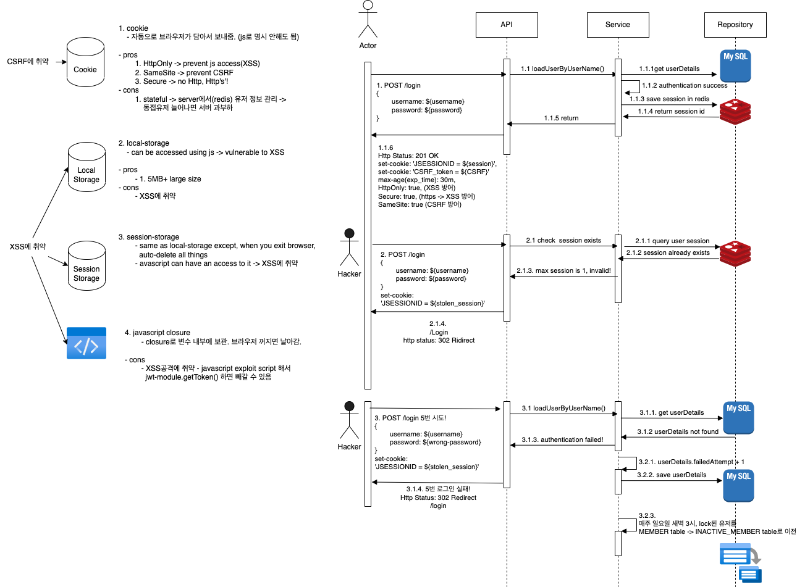

# index

- A. [프로젝트 소개](#a-프로젝트-소개)
- B. [사용 기술](#b-사용-기술)
- C. [프로젝트 구조](#c-프로젝트-구조)
- D. [AWS architecture](#d-aws-architecture)
- E. [ERD diagram](#e-erd-diagram)
- F. [Sequence Diagram](#f-sequence-diagram)
- G. [기술적 도전](#g-기술적-도전)
    - a. [정규화](#a-정규화)
    - b. [bulk insert](#b-bulk-insert)
    - c. [API first design](#c-api-first-design)
    - d. [spring batch](#d-spring-batch)
    - e. [통계 쿼리](#e-통계-쿼리)
    - f. [sql tuning](#f-sql-tuning)
    - g. [defensive programming](#g-defensive-programming)
    - h. [clean code](#h-clean-code)
- H. [Trouble Shooting](#h-trouble-shooting)
    - a. [queryDSL library와 openapi-codegen이 build.gradle에서 컴파일시 깨지는 문제 해결](#a-querydsl-library와-openapi-codegen이-컴파일시-깨지는-문제-해결)
    - b. [그 외 trouble shooting 내역](#b-그-외-trouble-shooting-커밋-내역들)


# A. 프로젝트 소개

쇼핑몰 MVP.

인증, 상품, 주문 관련 기능이 존재한다.

## how to start project?
```
1. git clone https://github.com/Doohwancho/ecommerce
2. docker compose up
```


# B. 사용 기술

| Category             | Tool/Library           | Version |
|----------------------|------------------------|---------|
| Java                 | JDK                    | 1.8     |
| Spring               | Spring Boot Starter Web| 2.5.6   |
|                      | Spring Security        | 2.5.6   |
|                      | Spring Data JPA        | 2.5.6   |
|                      | Spring Batch           | 2.5.6   |
|                      | Spring Quartz          | 2.5.6   |
| External Java Library| QueryDSL               | 4.4.0   |
|                      | OpenAPI-Codegen        | 4.3.1   |
|                      | Jqwik                  | 1.8.1   |
|                      | MapStruct              | 1.5.5   |
|                      | Datafaker              | 1.9.0   |
| Database             | MySQL                  | 8.0.23  |
|                      | Redis                  | 7.0.9   |
| Test                 | junit                  | 5.9.2   |
|                      | hamcrest               | 2.2     |
| Deploy               | AWS                    |         |
|                      | Docker                 |         |
| Development Tools    | IntelliJ               |         |
|                      | MySQL Workbench        |         |
|                      | Postman                |         |
|                      | Redoc                  |         |
|                      | VSC Plugin - Draw.io Integration |         |
|                      | VSC Plugin - ERD Editor|         |


# C. 프로젝트 구조

```
── src
│   ├── main
│   │   ├── java
│   │   │   └── com
│   │   │       └── cho
│   │   │           └── ecommerce
│   │   │               ├── Application.java
│   │   │               ├── domain
│   │   │               │   ├── member
|   │   │               │   ├── order
│   │   │               │   └── product
|   │   │               ├── global
│   │   │               │   ├── config
│   │   │               │   │   ├── batch
│   │   │               │   │   │   ├── config
│   │   │               │   │   │   ├── job
│   │   │               │   │   │   ├── listener
│   │   │               │   │   │   ├── scheduled
│   │   │               │   │   │   └── step
│   │   │               │   │   ├── database
│   │   │               │   │   ├── fakedata
│   │   │               │   │   ├── parser
│   │   │               │   │   ├── redis
│   │   │               │   │   └── security
│   │   │               │   │       ├── handler
│   │   │               │   │       └── session
│   │   │               │   ├── error
│   │   │               │   │   └── exception
│   │   │               │   │       ├── business
│   │   │               │   │       ├── common
│   │   │               │   │       └── member
│   │   │               │   └── util
│   │   │               └── infra
│   │   │                   ├── email
│   │   │                   └── sms
│   │   └── resources
│   │       ├── api
│   │       │   ├── config.json
│   │       │   └── openapi.yaml
│   │       ├── application-local.yml
│   │       ├── application-prod.yml
│   │       ├── application-test.yml
│   │       ├── application.yml
│   │       ├── log
│   │       │   ├── console-appender.xml
│   │       │   ├── file-error-appender.xml
│   │       │   ├── file-info-appender.xml
│   │       │   └── file-warn-appender.xml
│   │       ├── logback-spring.xml
│   │       └── templates
│   └── test
│       └── java
│           └── com
│               └── cho
│                   └── ecommerce
│                       ├── Integration_test
│                       ├── property_based_test
│                       ├── smoke_test
│                       └── unit_test
├── log
│   ├── error
│   ├── info
│   └── warn
```

# D. AWS architecture


# E. ERD diagram


VSC plugin: ERD Editor를 다운받고, documentation/erd.vuerd.json 파일을 열 수 있다.


# F. Sequence Diagram

## a. authentication
1. spring security + redis(session clustering)로 세션관리 하면서
2. 이상행동 감지시(로그인 5회 틀림) invalidate session + account lock
3. 매주 일요일 새벽 3시에 cron + batch로 locked account를 MEMBER table에서 INACTIVE_MEMBER table로 이전




# G. 기술적 도전

## a. 정규화

### 가. 방법론1. product를 비정규화 한 방식


#### 가-1. pros
개별 제품 상세 페이지 쿼리는 빠름

---

#### 가-2. cons

1. 구매자가 주문목록 query하려면, 모든 상품 테이블들 다 돌면서 product_id 찾아야 하니까 엄청 느림.
이걸 완화하기 위해, 모든 상품테이블에 들어았는 product_id를 인덱스 거는게 최선일지 모르겠음.


2. 또한, 상품 카테고리별로 테이블 만들어줘야 해서 테이블 갯수가 수십~수백개로 늘어남. 
검색해보니, 의외로 테이블 갯수 자체가 늘어나는건 별 문제가 아니라고 한다.
다만, 그보다 비정규화 했을 때, 상품 끼리 통일된 구조가 아닌게 더 문제라고 함. 통일된 구조가 아니면 나중에 확장할 때 merge, 변형 등이 힘들어지기 떄문. 
erd 설계 한번하면 쭉 가는줄 알았는데, 의외로 서비스 초기 때에도 db 변경을 자주 할 수 있다고 한다. 유연한 설계를 하자.

---

### 나. 방법론2. order_item 테이블에 모든 비정규화한 상품테이블 리스트의 FK를 받는 방식


#### 나-1. pros
방법론 1과 같이, 개별 상품 페이지 쿼리는 빠름.

---

#### 나-2. cons

1. 상품 종류가 100가지라 상품 테이블이 100가지면, order_item가 받는 상품들의 fk가 100개+가 될텐데,\
필드값이 100개인 테이블을 만든다는게 좀 이상한 것 같다.
2. 주문목록 query하려면, null check 먼저 하고,해당 아이템의 fk 가지고 아이템 찾는 식 일텐데, 100개 컬럼 중 99개 컬럼이 Null인데 하나씩 Null비교해서 값을 꺼내는 방식은 안좋은 방식 같고, Null처리 잘못할 수 있어서 에러날 가능성이 있는 코드구조가 될 수 있음.


---
b. 또한, 
100개의 컬럼 중 99개가 null이 들어가는 테이블을 만든다는게 조금 이상할 것 같다.


### 다. 방법론3. 상품별 옵션을 정규화 해서 쪼개놓은 경우


#### 다-1. pros

정규화가 잘 되있어서 변경에 유용하고 확장성이 좋은 설계이다. 


#### 다-2. cons
1. 개발 상품 페이지 쿼리할 떄 subquery & join 겁나 많이 해야 해서 느림. 
2. 주문목록 query할 때도 join & subquery 많이 해야 해서 느림.
3. 상품 등록/업데이트/삭제 시, product/product_item/category/option/option_variation/product_option_variation 이 6개 테이블에 트랜잭션/lock 걸릴텐데, 너무 느릴 것 같음.


#### 다-3. solution
방법론3을 택한다. 이유는 후술.


##### 다-3-1. 확장성 우선

비정규화는 일종의 최적화이고 되돌리기 힘든 과정이다.\
서비스 초기 단계라면 구현된 기능 자체가 수정&삭제가 빈번한데 이럴 경우 정규화된 구조를 사용하여 기능의 수정 & 삭제같은 유지보수를 저렴한 비용으로 유연하게 할 수 있도록 하는 것이 맞다.

서비스가 더 커진다 해도 캐싱, 인덱싱, 분산처리(가용영역 추가, 비쌈)같은 테크닉을 쓸 수 있고,\
나중에 서비스가 커져서 비정규화나 MSA같이 RDBMS가 보장해주는 것 일부를 포기하고 더 최적화를 해야할 경우가 오면 이때 해당 프로젝트 진행하면 된다.

결론: 정규화하고 최적화는 나중에 병목이 생기면 그 때 반정규화 하라.


---
##### 다-3-2. 의외로 간단한 쿼리에 join 여러번하는건 보통 걱정 안한다고 한다. 캐싱이 있기 때문이다.


간단한 쿼리의 조인 속도는 보통 걱정 안한다.\
조회수 순, 추천제품 순으로 캐싱해버리니까 걱정하던거의 1000배는 빨라진다.\
확장성이 우선이다.


---
##### 다-3-3. 의문점: 정규화 한 결과로 여러 테이블을 join 해야하면, lock & transaction 때문에 쿼리 성능이 떨어지지 않을까?

A. database, 버전, 옵티마이저에 따라 다르긴 하겠지만, 요즘 데이터베이스는 테이블 단위로 락 거는 경우는 드물고, row 단위로 락 걸기 때문에 괜찮다고 한다. (TODO - 정말 그런지 확인해보기)


## b. bulk insert

1. 문제: 가데이터를 for-loop으로 넣던게 약 14분 30초 정도 걸림. 
2. 해결책: spring batch(chunk size 1000) + jpa bulk insert로 변경해서 4분30초 로 10분 단축

```
...for inserting

3000 users
10 categories
30 options
90 option variations
3000 products
9000 product items
9000 product option variations
3000 orders
15000 order items
```


1. before (for-loop insert)
    - Total execution time: 14m 25s (864952 ms)
2. after (bulk insert)
    - 4m 30s 436ms
    - Job: [SimpleJob: [name=dataInitializationJob]] completed with the following parameters: [{run.id=1700922576191, numberOfFakeUsers=3000, numberOfFakeCategories=10, numberOfFakeOptionsPerCategory=3, numberOfFakeOptionVariationsPerOption=3, numberOfFakeProducts=3000, numberOfFakeProductItemsPerProduct=3, numberOfFakeOrderItemsPerOrder=5}] and the following status: [COMPLETED] in 4m30s436ms

https://github.com/Doohwancho/ecommerce/blob/73ddd650c20ca7349cdbf3d992ca1fe357c67da4/back/ecommerce/src/main/java/com/cho/ecommerce/global/config/batch/step/InsertFakeUsersStepConfig.java#L28-L153


## c. API first design
openapi-codgen + redoc 적용

### 1. openapi codegen


- Q. how to see oepnapi docs online?
    1. https://editor.swagger.io/
    2. [openapi-docs code](https://github.com/Doohwancho/ecommerce/blob/main/back/ecommerce/src/main/resources/api/openapi.yaml) 붙여넣기


### 2. redoc


```
Q. how to install redoc and run?

npm i -g @redocly/cli
git clone https://github.com/Doohwancho/ecommerce
cd ecommerce
redocly preview-docs back/ecommerce/src/main/resources/api/openapi.yaml
```


## d. spring batch


1. 이상행동으로 잠긴 유저 계정을 
2. 매주 일요일 새벽 3시에 
3. INACTIVE_USER로 옮기고, 
4. 기존 유저 테이블에서 제거하는 배치 생성


https://github.com/Doohwancho/ecommerce/blob/73ddd650c20ca7349cdbf3d992ca1fe357c67da4/back/ecommerce/src/main/java/com/cho/ecommerce/global/config/batch/step/UserToInactiveMemberStepConfig.java#L26-L146


## e. 통계 쿼리
### 1. 요구사항
1. 23년 6월 ~ 23년 12월 사이에
2. 카테고리 별 상품 갯수
3. 해당 카테고리의 상품들의 평균 평점
4. 해당 카테고리의 총 상품 판매액
5. 해당 카테고리에서 가장 많이 팔린 상품의 productId
6. 해당 카테고리에서 가장 많이 팔린 상품의 이름
7. 해당 카테고리에서 가장 많이 팔린 상품의 총 판매액

...을 query 한다.

### 2. sql query 문


```sql
SELECT
	tmp1.CategoryId,
    tmp1.CategoryName,
    tmp1.NumberOfProductsPerCategory,
    tmp1.AverageRating,
    tmp1.TotalSalesPerCategory,
    tmp2.ProductId,
    tmp2.ProductName AS TopSalesProduct,
    tmp2.TopSalesOfProduct
FROM (
	SELECT 
		c.CATEGORY_ID AS CategoryId,
		c.NAME AS CategoryName,
		COUNT(DISTINCT p.PRODUCT_ID) AS NumberOfProductsPerCategory,
		ROUND(AVG(p.RATING), 1) AS AverageRating,
		ROUND(SUM(pi.Quantity * pi.PRICE), 1) AS TotalSalesPerCategory
	FROM CATEGORY c
	INNER JOIN PRODUCT p ON c.CATEGORY_ID = p.CATEGORY_ID
	INNER JOIN PRODUCT_ITEM pi ON p.PRODUCT_ID = pi.PRODUCT_ID
	INNER JOIN product_option_variation pov ON pi.PRODUCT_ITEM_ID = pov.PRODUCT_ITEM_ID
	INNER JOIN ORDER_ITEM oi ON pov.PRODUCT_OPTION_VARIATION_ID = oi.PRODUCT_OPTION_VARIATION_ID
	INNER JOIN `ORDER` o ON oi.ORDER_ID = o.ORDER_ID
	WHERE o.ORDER_DATE BETWEEN '2023-06-01' AND '2023-12-31'
	GROUP BY c.CATEGORY_ID
) AS tmp1
INNER JOIN
	(
	SELECT
		a.CategoryId AS CategoryId,
		b.ProductId As ProductId,
		b.ProductName As ProductName,
		a.TopSalesOfProduct AS TopSalesOfProduct
	FROM
		(SELECT 
			Sub.CategoryId,
			Sub.CategoryName,
			MAX(Sub.TotalSalesPerProduct) as TopSalesOfProduct
		FROM
			(SELECT 
				c.CATEGORY_ID as CategoryId,
				c.name as CategoryName,
				p2.PRODUCT_ID,
				ROUND(SUM(pi2.Quantity * pi2.PRICE), 1) as TotalSalesPerProduct
			FROM CATEGORY c
			INNER JOIN PRODUCT p2 ON c.CATEGORY_ID = p2.CATEGORY_ID
			INNER JOIN PRODUCT_ITEM pi2 ON p2.PRODUCT_ID = pi2.PRODUCT_ID
			INNER JOIN PRODUCT_OPTION_VARIATION pov2 ON pi2.PRODUCT_ITEM_ID = pov2.PRODUCT_ITEM_ID
			INNER JOIN ORDER_ITEM oi2 ON pov2.PRODUCT_OPTION_VARIATION_ID = oi2.PRODUCT_OPTION_VARIATION_ID
			INNER JOIN `ORDER` o2 ON oi2.ORDER_ID = o2.ORDER_ID
			WHERE o2.ORDER_DATE BETWEEN '2023-06-01' AND '2023-12-31'
			GROUP BY c.CATEGORY_ID, p2.PRODUCT_ID
			) as Sub
		GROUP BY Sub.CategoryId
		) a
	INNER JOIN
		(SELECT 
			c.CATEGORY_ID as CategoryId,
			c.name as CategoryName,
			p2.PRODUCT_ID as ProductId,
			p2.name as ProductName,
			ROUND(SUM(pi2.Quantity * pi2.PRICE), 1) as TopSalesOfProduct
		FROM CATEGORY c
		INNER JOIN PRODUCT p2 ON c.CATEGORY_ID = p2.CATEGORY_ID
		INNER JOIN PRODUCT_ITEM pi2 ON p2.PRODUCT_ID = pi2.PRODUCT_ID
		INNER JOIN PRODUCT_OPTION_VARIATION pov2 ON pi2.PRODUCT_ITEM_ID = pov2.PRODUCT_ITEM_ID
		INNER JOIN ORDER_ITEM oi2 ON pov2.PRODUCT_OPTION_VARIATION_ID = oi2.PRODUCT_OPTION_VARIATION_ID
		INNER JOIN `ORDER` o2 ON oi2.ORDER_ID = o2.ORDER_ID
		WHERE o2.ORDER_DATE BETWEEN '2023-06-01' AND '2023-12-31'
		GROUP BY c.CATEGORY_ID, p2.PRODUCT_ID
			) b
		ON a.CategoryId = b.CategoryId AND a.TopSalesOfProduct = b.TopSalesOfProduct
	) AS tmp2
ON tmp1.CategoryId = tmp2.CategoryId
ORDER BY tmp1.CategoryId
```
https://github.com/Doohwancho/ecommerce/blob/4e978a6279c639991811bc4628dc5bfb0a2bbea4/back/ecommerce/src/main/java/com/cho/ecommerce/domain/order/repository/OrderRepository.java#L11-L97


## f. sql tuning
e. 통계쿼리를 튜닝해보자.

### 1. before tuning
"e. 통계쿼리"는 크게 3덩이의 subquery로 나뉜다.
1. tmp1
2. a
3. b

#### 1-1. subquery 'a' 실행

이 부분은 가장 처음에 실행되는 쿼리로, 'a' subquery이다.

문제점: 1000개 row가 있는 order 테이블을 fullscan 하는걸 볼 수 있다.

#### 1-2. subquery 'tmp1' 실행


문제점: where절 조건이 인덱스를 타지 않아서 풀스캔 한다.


#### 1-3. subquery 'b' 실행

문제점: **where절 조건이 인덱스를 안타서 풀스캔을 한다.**


#### 1-4. query statistics


총 비용(mysql workbench의 cost 계산 툴 기준): 170,763

- 문제
    1. 풀 테이블 스캔을 5번이나 하고, 
    2. index를 전혀 안탄다.

- 해결책
	- where절에 인덱스를 태워서 성능튜닝을 해보자..!

### 2. WHERE절 조건의 ORDER_DATE 컬럼에 인덱스 적용하기

#### 2-1. 인덱스 만들고 적용하기

1. 인덱스를 만들고,
```java
@Entity
@Table(
    name = "`ORDER`",
    indexes = {
        @Index(name = "idx_order_date", columnList = "ORDER_DATE")
    }
)
@Getter
@Setter
public class OrderEntity {
    //...
}
```

2. 그냥 실행시켰더니, optimizer가 index를 타지 않아서, 타게하도록 힌트를 준다.
```sql
INNER JOIN `ORDER` o2 USE INDEX (idx_order_date) ON oi2.ORDER_ID = o2.ORDER_ID
WHERE o2.ORDER_DATE BETWEEN '2023-06-01' AND '2023-12-31'
```

#### 2-2. 결과 


여전히 subquery해서 나온 결과물을 담은 tmp table을 두번 full scan하긴 하지만,\
"idx_order_date" 인덱스를 index range scan을 3번 타는걸로 바뀌었다.

그런데 수상하게 full scan타는 rows 수가 1200개에서 2660개로 늘어났다???


인덱스 적용했더니, 맨 처음 order table(1000 rows)에서 where절에 date 인덱스 태웠기 때문에 242 rows만 읽는걸 확인할 수 있다.

여기까진 좋았다.

그런데, 문제는 이 이후부터인데, 

첫 테이블만 5000 rows -> 242 rows로 줄었고, 이후에 join할 때마다 읽는 rows수가 1.2k rows -> 2.6k rows로 늘었다.\
그런데 join을 여러번 하니까, 결과적으로 총 읽은 rows수의 양이 122k rows -> 266.6k rows로 늘었다. 

나머지 subquery들도 첫번째 subquery와 같은 현상이 일어났다. 


**총 읽은 rows수가 튜닝 전에는 170,763 rows 이었는데, 튜닝 후에 오히려 266,600 rows로 오히려 늘었다??**

첫 테이블 읽는 rows수가 5000 rows(full scan) 에서 인덱스 태워서 242 rows 만 읽은건 이해가 가는데,

왜 nested join loop에서 read하는 rows가 늘어나서 결과적으로는 성능이 떨어졌을까?


#### 2-3. 실행계획 뜯어보기

##### A. date 인덱스 타기 전

id6 부분이 subquery 'a' 부분이다. 

- 실행순서
	1. order table(1000 rows)를 full scan하면서, where절에 date를 태워서 필터한다. (약 200 rows정도 나옴)
	2. 1의 결과로 나온 order table의(200 rows)를 order item table(5000 rows)와 inner nested join하는데, inner table은 order item table이 되고, order item table이 FK로 가지고 있던 Order table의 PK를 인덱스 삼아 조인한다.
		- 이 때, where절 조건인 6개월에 걸리는 order item table의 rows 수는 약 1.2k rows(out of 5k)가 된다.
		- 이 1.2k rows from order item table이, 튜닝 전, 5k rows full scan 이후 nested join 때 반복되는 1.2k 숫자가 나온 이유이다.
	3. 해당 1.2k rows는, 다른 테이블과 nested join with pk 시 반복된다.


이제 nested loop join시 1.21k rows가 나온 이유가 설명되었다. 

```sql
explain analyze select count(*)
from `order_item` oi
INNER JOIN `ORDER` o IGNORE INDEX(idx_order_date) ON oi.ORDER_ID = o.ORDER_ID
INNER JOIN PRODUCT_OPTION_VARIATION pov ON oi.PRODUCT_OPTION_VARIATION_ID = pov.PRODUCT_OPTION_VARIATION_ID
WHERE o.ORDER_DATE BETWEEN '2023-06-01' AND '2023-12-31'
```

약식 쿼리로,\
order, order item, product option variation 테이블만 떼어내서 index 없이 조인하는 쿼리의 실행계획으로 뜯어보자.

```
-> Aggregate: count(0)  (cost=1082.54 rows=1) (actual time=19.867..19.867 rows=1 loops=1)
    -> Nested loop inner join  (cost=960.08 rows=1225) (actual time=2.657..19.746 rows=1235 loops=1)
        -> Nested loop inner join  (cost=531.49 rows=1225) (actual time=2.162..15.960 rows=1235 loops=1)
            -> Filter: (o.order_date between '2023-06-01' and '2023-12-31')  (cost=102.90 rows=111) (actual time=0.065..5.557 rows=247 loops=1)
                -> Table scan on o  (cost=102.90 rows=1002) (actual time=0.060..4.873 rows=1002 loops=1)
            -> Filter: (oi.product_option_variation_id is not null)  (cost=2.76 rows=11) (actual time=0.025..0.041 rows=5 loops=247)
                -> Index lookup on oi using FKs234mi6jususbx4b37k44cipy (order_id=o.order_id)  (cost=2.76 rows=11) (actual time=0.025..0.040 rows=5 loops=247)
        -> Single-row covering index lookup on pov using PRIMARY (product_option_variation_id=oi.product_option_variation_id)  (cost=0.25 rows=1) (actual time=0.003..0.003 rows=1 loops=1235)
```

- 실행순서
	1. Table scan on o  (cost=102.90 rows=1002) (actual time=0.060..4.873 rows=1002 loops=1)
		- order table(1000 rows)를 full scan하여 
	2. Filter: (o.order_date between '2023-06-01' and '2023-12-31')  (cost=102.90 rows=111) (actual time=0.065..5.557 rows=247 loops=1)
		- where절 조건에 맞는 247 rows를 추출한다.
	3. Index lookup on oi using FKs234mi6jususbx4b37k44cipy (order_id=o.order_id)  (cost=2.76 rows=11) (actual time=0.025..0.040 rows=5 loops=247)
		- 이제 order item table을 nested loop inner join하는데, inner table 삼아, order item table에 order table의 PK를 FK 인덱스로 가지고 있던걸 한번 join당 5번씩 index tree를 읽는걸, 총 247번(outer table인 order table)만큼 하여 ...
	4. Nested loop inner join  (cost=531.49 rows=1225) (actual time=2.162..15.960 rows=1235 loops=1)
		- 총 1235 rows(5 rows * 247 loops)를 읽어 order table과 order item table을 조인한다.
	5. Single-row covering index lookup on pov using PRIMARY (product_option_variation_id=oi.product_option_variation_id)  (cost=0.25 rows=1) (actual time=0.003..0.003 rows=1 loops=1235)
		- product option variation table과는 pk를 인덱스 삼아 1 rows(pk니까 유니크하다) * 1235rows (step 4까지 order + order item table 조인한 rows 수) 만큼 rows를 읽는다


##### B. date 인덱스 태운 이후

이번에도 id6가 subquery 'a'에 해당한다.

저 2.6k rows read는 대체 어디서 나온걸까?


nested loop join 할 때마다 2.6k rows를 읽는다는데,\
저래서 총 rows read 비용이 1.5배 이상 늘었는데, 저 2.6k rows라는 숫자는 어디서 튀어나온걸까?

```sql
select count(*)
from `order_item` oi 
INNER JOIN `ORDER` o USE INDEX(idx_order_date) ON oi.ORDER_ID = o.ORDER_ID
INNER JOIN PRODUCT_OPTION_VARIATION pov ON oi.PRODUCT_OPTION_VARIATION_ID = pov.PRODUCT_OPTION_VARIATION_ID
WHERE o.ORDER_DATE BETWEEN '2023-06-01' AND '2023-12-31' 
```
약식 쿼리를 만들어 실행계획을 뜯어보자!


```
-> Aggregate: count(0)  (cost=2238.76 rows=1) (actual time=21.364..21.367 rows=1 loops=1)
    -> Nested loop inner join  (cost=1972.56 rows=2662) (actual time=9.620..21.243 rows=1235 loops=1)
        -> Nested loop inner join  (cost=1040.86 rows=2662) (actual time=8.423..17.201 rows=1235 loops=1)
            -> Index range scan on o using idx_order_date over ('2023-06-01 00:00:00' <= order_date <= '2023-12-31 00:00:00'), with index condition: (o.order_date between '2023-06-01' and '2023-12-31')  (cost=109.16 rows=242) (actual time=0.734..3.069 rows=247 loops=1)
            -> Filter: (oi.product_option_variation_id is not null)  (cost=2.75 rows=11) (actual time=0.047..0.056 rows=5 loops=247)
                -> Index lookup on oi using FKs234mi6jususbx4b37k44cipy (order_id=o.order_id)  (cost=2.75 rows=11) (actual time=0.047..0.056 rows=5 loops=247)
        -> Single-row covering index lookup on pov using PRIMARY (product_option_variation_id=oi.product_option_variation_id)  (cost=0.25 rows=1) (actual time=0.003..0.003 rows=1 loops=1235)
```

- 실행순서
	1. Index range scan on o using idx_order_date over ('2023-06-01 00:00:00' <= order_date <= '2023-12-31 00:00:00'), with index condition: (o.order_date between '2023-06-01' and '2023-12-31')  (cost=109.16 rows=242) (actual time=0.734..3.069 rows=247 loops=1)
		- order table(1000 rows)를 where절의 조건으로 index scan해서 247 rows만 읽는다.
	2. Index lookup on oi using FKs234mi6jususbx4b37k44cipy (order_id=o.order_id)  (cost=2.75 rows=11) (actual time=0.047..0.056 rows=5 loops=247)
		- order item table과 Order table을 join하기 위해, order item table에서 보관하던 fk를 11 rows 읽고, nested loop inner join시, inner table인 order item table(5000 rows)를 평균 5 rows씩 247번 loop하여 조인한다.
	3. Nested loop inner join  **(cost=1040.86 rows=2662)  (actual time=8.423..17.201 rows=1235 loops=1)**
		- 1235 rows는 step2에서 nested loop join시 fk index를 평균 5rows 씩 247번 loop하여 조인한 것의 결과이다.
		- **오해했던 점은, mysql workbench에 explain visualize에서 나오던 2.6k rows를 읽는다는건, 그저 optimizer의 추정치였을 뿐, 실제 읽은 rows는 1235 rows였다!**
	4. Single-row covering index lookup on pov using PRIMARY (product_option_variation_id=oi.product_option_variation_id)  (cost=0.25 rows=1) (actual time=0.003..0.003 rows=1 loops=1235)
		- order + order item table이 조인됬는데, 다음으로 조인할 product_option_variation table은 pk로 조인하므로, 1조인 당 1개 rows씩 총 1235 loop하여 inner nested loop join을 한다. 


- 결론
	1. **mysql workbench에 visual explain에서 나오는 rows read는 추정치일 뿐이라 그대로 믿으면 안된다.**
	2. 실제 실행계획 수치는 mysql console에서 commandline인 'explain analyze'을 쳐서 실측치를 봐야한다. 

#### 2-4. 실험
"e. 통계쿼리"를 다시 돌리되,\
데이터 사이즈를 키워서 index 타는 쿼리와 타지 않는 쿼리가 시간차가 얼마나 나는지 보자.

```
테이블 사이즈

user: 10000 rows
order: 10000 rows
orderItem: 50000 rows
product: 10000 rows
productItem: 30000 rows
productOptionVariation: 30000 rows
```
##### case1) where절에 index를 안태운 쿼리: 1027ms

 

##### case2) where절에 인덱스를 태운 쿼리: 572ms


하나의 컬럼에 index를 태웠는지 여부가 약 455ms latency 차이를 보여준다.\
(이번에도 mysql visual explain에서는 실측치가 아닌 추정치로 나와서 index 태운게 더 느리다고 나왔다...)


## g. defensive programming

### 1. testing 전략
1. smoke test
    - springboot app이 잘 실행되는지
    - 유저 인증시 이상 현상이 일어나는지 확인
2. integration test
    - 도메인 별로 굵직한 서비스 레이어 위주로 테스트
    - mocking을 하지 않고 최대한 넓은 범위의 모듈을 커버하여, 깨지는 부분이 있는지 대략 어느 부분인지 확인 목적 
3. property test
    - 절대 문제생기면 안되는 기능(ex. 돈 관련 코드 등..)을 PBT로 테스트. ([PBT code link](https://github.com/Doohwancho/ecommerce/blob/main/back/ecommerce/src/test/java/com/cho/ecommerce/property_based_test/ProductPriceDiscountTest.java))
4. unit test
    - 그 외 작은 기능 단위는 unit test로 처리


### 2. exception 전략
1. Runtime Error가 날만한 부분에 throw CustomException 처리한다.
2. [custom Error Code Number Protocol](https://github.com/Doohwancho/ecommerce/blob/main/back/ecommerce/src/main/java/com/cho/ecommerce/global/error/ErrorCode.java) 에 맞추어 error code를 enum으로 선언한다. 
3. Runtime Exception을 domain별로 나누어 일괄관리한다.
    - 모든 business 관련 Exception들은 BusinessException을 상속받아 일괄관리하고,
    - 모든 member 관련 Exception들 또한 MemberException을 상속받아 일괄관리한다.
    - Exception에 들어가는 Error Code역시 도메인 별로 일괄관리한다.

> 

### 3. logging 전략
1. 에러가 날만한 부분에 log.error()
2. logging format을 가독성이 좋게 설정 (디테일한 정보 + log level별 색깔 다르게 설정)
3. profile 별(ex. test/local/prod) log level을 구분하여 log/ 디렉토리에 레벨별로 저장


## h. clean code

### 1. protocol 설정
1. [commit-message protocol](https://github.com/Doohwancho/ecommerce/blob/main/documentation/protocols/commit-message.md)
2. [error code protocol](https://github.com/Doohwancho/ecommerce/blob/main/back/ecommerce/src/main/java/com/cho/ecommerce/global/error/ErrorCode.java)
3. [common / business / member 용 exception 구분](https://github.com/Doohwancho/ecommerce/tree/main/back/ecommerce/src/main/java/com/cho/ecommerce/global/error/exception)

### 2. linter intellij plugins 적용
1. sonarlint
2. checkstyle
3. code-style-formatter ([google style java format 적용](https://google.github.io/styleguide/javaguide.html))

# H. Trouble Shooting

## a. queryDSL library와 openapi-codegen이 컴파일시 깨지는 문제 해결

### 1. 문제
1. 스프링 + openapi-codgen library도 잘 동작하고, 
2. 스프링 + queryDSL로 잘 동작하는데, 
3. 둘을 동시에 쓰면 빌드가 안되는 현상 발생

### 2. 문제 원인
queryDSL과 openapi-codegen 둘 다 빌드시 코드를 동적으로 생성하는데,\
compileQuerydsl시 아직 컴파일 안된 openapi-codegen 코드부분 때문에 에러 발생

### 3. 해결책
1. gradle 빌드 순서를 openapi-codegen 컴파일이 먼저 실행되고,
2. queryDSL이 다음에 실행되고,
3. 마지막으로 compileJava가 실행되도록 변경했다.

https://github.com/Doohwancho/ecommerce/blob/73ddd650c20ca7349cdbf3d992ca1fe357c67da4/back/ecommerce/build.gradle#L143-L145


### 4. 이 트러블 슈팅이 기억에 남는 이유
기능 만들고 싶은데 어떻게 만드는지 모르거나, 프레임워크에서 에러나는건 \
배워서 만들거나, googling, issue 탭 찾아보면 되는 일인데,

외부 라이브러리들 끼리 서로 궁합이 안맞아서 빌드 깨지는건,\
구글링 해도 안나오고, 이슈 탭에서도 없고,\
라이브러리를 까봐야 하나? 라는 생각이 들어도 querydsl은 22만줄, openapi-generator-cli는 2만 1천줄인데,\
querydsl나 openapi-codegen에서 문제가 생긴게 아니라,\
얘네들이 의존하는 다른 라이브러리에서 오류난 걸 수도 있으니까

막연한 절망감(?) 속에서 gradle 문서 보면서 이런 저런 시도를 하는데,\
논리상 되야되는데 안될 때마다 '이 라이브러리 쓰고싶은데 안써야 하나?'\
하다가 삽질 끝에 되게 해서 기억에 남습니다..


## b. 그 외 trouble shooting 커밋 내역들
```
Q. how to find all trouble shooting list?

1. git clone https://github.com/Doohwancho/ecommerce
2. git log --grep="fix"
```